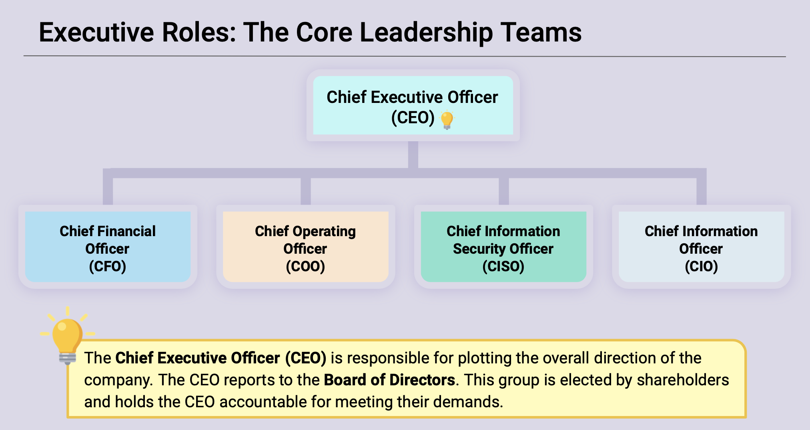
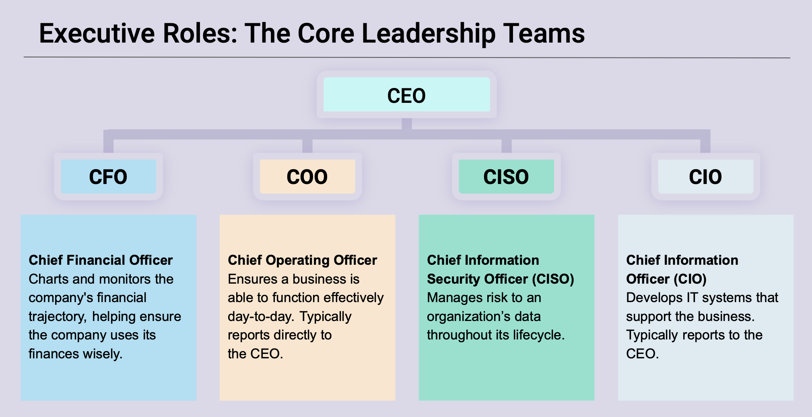
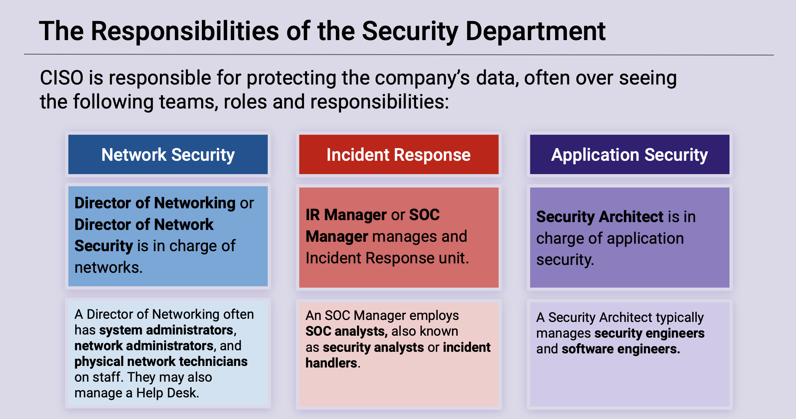

## 2.1 Student Guide: Introduction to Security Within the Organization

### Overview

Today's class will introduce organizational security. You will get a holistic view of how the different security topics and fields that you will study connect to one another as well as to the larger business organization. 

### Class Objectives

By the end of this lesson, you will be able to:

- Identify at least three benefits of a healthy security culture.
- Articulate the responsibilities of common C-Suite officers, including the CISO.
- Explain the responsibilities of the security department.
- Identify appropriate security controls for a given resource and situation.

#### Slideshow

The lesson slides are available on Google Drive here: [2.1 Slides](https://docs.google.com/presentation/d/1un2bhoJCRwDEO-nYcOjLd7_0OxutWcyS5zr4UNHJLz8/edit#slide=id.g480f0dd0a7_0_1803)

---

### 01. How Security Aligns within an Organization

Welcome to the second week of class. This week will explore how security teams integrate with their broader organizations. Today's class will introduce the foundational principles of governance, risk management, and compliance (GRC).

- This course will focus on equipping you with the tools you need to perform common technical roles. The GRC unit will explain how teams that carry out these responsibilities interact with one another and the organization at large.

- We'll begin our discussion with an overview of a typical governance, risk, and complaince or **GRC** framework.

#### GRC Framework

Note that one of the goals of GRC is to provide a framework for answering the questions: _What assets are most important?_ and _What is adequate protection?_ In particular:

  - **Governance** provides management frameworks for implementing these security practices in the organization. It helps a business decide how to enforce its security practices by developing _policies_, _standards_, _processes_, and _procedures_.

  - **Risk Management** helps an organization identify which assets are most important and determine how they are most likely to be compromised. The business then uses this information to decide how to protect its most important and at-risk assets. This decision then informs the business's security practices.

  - **Compliance** focuses on ensuring internal security policies are being followed, and verifying that the business is following relevant security laws.

Note the following example of an insecure feature that may drive considerable profit:

  - An organization may perform a **risk assessment** and conclude that a new feature could lead to a 25% increase in quarterly profits, but will also expose an isolated data server that contains customer names, usernames, and email addresses, but no other PII.

  - The Security team might object to the feature because it is insecure, however, the business might decide that dealing with a breach of an isolated server that contains no confidential information would cost less than the amount of profit they would make by building the feature.

  - In this case, the business objective of meeting profit targets overrides the risks in the strategy.

  - However, if the feature exposed a core data server that contained customer social security numbers and credit card numbers, the business might decide that the feature isn't worth the risk to its customers' privacy or the penalties for violating federal laws and regulations that mandate the careful protection of this data.

After making a decision, the business should update its security practices to manage the risks they've chosen to undertake and periodically verify that everyone is following the rules. This is where **governance** and **compliance** kick in.

Note the GRC is meaningless with enforcement. Those most directly responsible for overseeing the enforcement and adherence to specific laws and regulations that apply to their business practices are the executive management team or C-Suite corporate officers. 

We'll discuss the specific roles and responsibilites of the executive team next.

#### Roles & Responsibilities

- We'll start our discussion with the roles and responsibilites of the executive leadership team often referred to as C-Suite corporate officers.

#### Roles of Exectutive Management (C-Suite)

- Note that all companies have a core leadership team that delegates the responsibility of separate business functions. This team usually consists of C-Suite officers, such as the **Chief Executive Officer (CEO)**, **Chief Information Security Officer (CISO)**, and **Chief Operating Officer (COO)**.

- We'll break down each role as follows:

  

  - **Chief Executive Officer (CEO)**

    - The CEO is responsible for plotting the overall direction of the company and conceiving and communicating a corporate mission or ultimate goal, determining what the business should focus on in order to meet those goals, assessing risks, and setting standards of social responsibility for the organization.

  

- As part of the core leadership team, the CEO is not activley engaged in managing the day to day operations of each individual department within the organization. This is where the departmental executive leadership team comes into play.

- The departmental executive team is **actively** engaged in managing the day to day operations within their departments and report directly to the CEO.

  - **Chief Operating Officer (COO)**
    -  The COO is responsible for ensuring business functions operate effectively day-to-day, monitor day-to-day operations, keeps the CEO aware of significant achievements and setbacks, and oversees people management (hiring, promotion, firing).

  - **Chief Financial Officer (CFO)**
    - The CFO is responsible for charting and monitoring the company's financial trajectory, in other words, they are ultimately responsible for budgeting, which helps ensure that the company uses its funds wisely.

  - **Chief Information Officer (CIO)**

    - The CIO is responsible for developing IT systems that support the business including setting up corporate networks, provisioning services like VPN, setting up and recycling employee devices, and ceasing servers for data storage and internal application development.

  - **Chief Information Security Officer (CISO):**

    - The CISO is responsible for managing risk to an organization's data throughout its lifecycle. This means they are responsible for ensuring that the company's data is safe from the time it's collected to the time it's stored and retrieved.

      - Other responsibilities include: overseeing a security operations organization, which identifies, contains, and responds to threats, developing and disseminating information security policies, developing and disseminating training to personnel, working with the CIO to coordinate implementation of security policies by IT teams.

    - Traditionally, the CISO reports to the CIO, however, it's increasingly common for the CISO to report directly to the CEO, as data security is becoming increasingly important for most organizations.

  - Some organizations only have a CISO and not a CIO. In this case, the CISO serves both roles, CISO and CIO combined.

- It's important to understand the basic role and responsibilities of each department within the typical business architecture. The following are examples of essential departments that exists within almost every organization:

  - **Human Resources**: Responsible for internal communications, scheduling trainings, and tracking attendance.

  - **Finance**: Responsible for maintaining the businesses financials.

  - **Security**: Security must develop training exercises and collaborate with HR to determine details of scheduling and delivery.

#### The Responsibilities of the Security Department

- Remember that the CISO is responsible for protecting the company's data. There are many ways to meet this broad goal, but organizations often have the following functions in-house:

  

  - **Network Security** 

    - Roles: **Director of Networking** or **Director of Network Security** 
    
    - Responsibilities: Securing networks and implementing network security policies. This group also manages services like the corporate VPN. They are responsible for purchasing or leasing, configuring, maintaining, and troubleshooting the organization's network infrastructure. 

  - **Incident Response** 

     - Roles: **Incident Response (IR) Manager** or a  **Security Operation Center (SOC) Manager** 

     - Responsibilities: Identifying and responding to security breaches. IR is responsible for security operations centers (SOCs), which monitor the organization's devices for incidents. IR is also responsible for escalating serious breaches to the executive team for handling.
  
  - **Application Security** 
  
    - Role:  **Security Architect** 

    - Responsibilies: Ensuring that internally developed applications meet security standards. This means minimizing the number of breaches due to the application, ensuring these applications pass security audits, and teaching developers to follow best practices of secure development.

#### Security Teams and the Aligning Organization

We'll continue our discussion in regards to how the roles and responsibilities of various teams within a security department interact, as well as how the behavior of an organization's employees, known as its **security culture**, influences the security decisions of the business.

Note the following examples:

- Security teams do not work in isolation.

  - For example: An organization's Incident Response team will need to work closely with its IT and Networking department in order to alert those teams of breaches and provide recommendations as to how to better secure their systems.

- These teams also do not work in isolation from the business they are a part of.

  - For example: An organization's Marketing and Communications teams use the networks and accounts that IT and Networking manage.

- Everything that the Security team does is always related to the broader needs of the business.

  - For example: An organization's engineering team may propose an innovative but insecure new feature for their flagship product. The Security team would probably advise against developing the feature due to its poor security. However, the business might decide to develop it, deciding that the feature's profit potential is worth the insecurity.

  - In this example, the Security team must adapt its operations to accommodate a product they know is insecure.

  - The Security team's response might include: implementing more aggressive monitoring on data servers that are likely to be exposed by the new feature, and advising IT and Networking to implement more sophisticated access controls on important servers and proxies.

- A Security team's main goal is to protect the business's data, while the business's main goal is to make a profit.

  - The most profitable decision is not always the most secure.

  - Therefore, the Security team often finds itself in tension with the rest of the organization, because its goals are not always aligned with those of the business as a whole.

- In addition, it costs money to run a Security department.

  - Therefore, "perfect" security is never the realistic goal for any organization.

  - Instead, businesses seek to provide _adequate_ protection for their _most important_ resources.

  - This way, they can focus their budget and security resources where they matter most.

- So, security professionals must determine which assets are "most important" and then determine what will be an "adequate" protection.

### 02. Activity: Weighing Security and Business Objectives 

- [Activity File: Weighing Security and Business Objectives](Activities/02_Weighing_Security/Unsolved/Readme.md)

### 03. Activity Review: Weighing Security and Business Objectives 

- [Solution Guide: Weighing Security and Business Objectives](Activities/02_Weighing_Security/SOLVED/Readme.md)

### 04. Security Culture Framework 

Some of the business plans that you analyzed in the previous activity implied major vulnerabilities.

For example: Giving all developers access to all data and exposing administration servers to the internet.

  - The first suggestions was made by the organization's Director of Engineering and the latter by the Director of IT.

  - However, both requests show extreme disregard for data security.

  - These directors would not have made these requests if they understood how insecure they were and if they considered security an important goal for their teams.

Ensuring a strong organizational security posture begins by ensuring employees both _consider security important_ and _understand the security implications of their decisions_.

 - These two factors ensure that employees do not make decisions that compromise the business's security due to disinterest or lack of understanding.

When employees are invested in the organization's security and understand how to "behave securely," the company is said to have a healthy **security culture**. Developing a healthy security is an important goal for security departments in all organizations.

Security culture is the way members of an organization think about and approach security issues. The health of an organization's security culture is determined by the following:

  - How important its employees consider security.
  - How aware employees are of common security risks.
  - Whether its employees know how to avoid insecure behavior.

The organization from the previous activity likely has an unhealthy security culture, because neither the Director of Engineering nor the Director of IT were aware of the security risks implied in their requests. Or if they were aware, they didn't care.

- The effectiveness of an organization's security guidelines and controls ultimately depends on whether or not employees follow those guidelines and controls. Therefore, employees must believe that security is important and follow an organization's established security rules.

Next, we'll discuss how to develop a healthy security culture that motivates employees to value security and trains them to avoid insecure behavior.

#### The Security Culture Framework

Simply put, a security culture framework is a process for identifying problems in an organization's security culture and making plans to solve them. This is another way cybersecurity professionals assess threats and mitigate risks. Bad security culture can lead to a breach. 
  - For example: Target was alerted of a potential security issue, but because the Security teams received many alerts, they missed the identification of this critical security alert. 
  
    A good security culture guarantees all staff pays close attention to all critical alerts.

The following steps for developing a security culture framework:

 **Step One: Measure and Set Goals**: First, we need to understand the current state of the organization's security culture.          

  - Start by identifying a particular security concern, such as employees downloading untrusted files from emails.

  - Then, define what people *should* do. In this case, only download emails from trusted domains.

  - Next, define a goal for how well you want the organization to perform. For example: Fewer than 5% of employees download untrusted files every month.

  - Finally, measure how often employees currently perform this behavior properly. In this case, you could run a survey, or even have penetration testers send phishing emails to your organization and determine how many people they can infect. This data will serve as a baseline you can use to measure progress.

  **Step Two: Involve the Right People**: After defining a goal, inform the relevant employees of the new target.

  - Meeting this particular goal requires input from the security department, but also from personnel in charge of training and internal communications.

  **Step Three: Create an Action Plan**: After the relevant stakeholders have been informed, develop an action plan. A plan typically involves developing a training exercise that addresses the security issue at hand. Training might cover the following topics:

  - The dangers of malware.
  - How malware spreads through phishing.
  - How malware spreads through vishing.
  - How to avoid phishing and vishing attacks.

**Step Four: Execute the Plan**: After developing the plan, run the training.

**Step Five: Measure Changes**: Collect data on how well people are adhering to the guidelines taught in the training and compare this to the baseline you established before training. Determine if your exercise was effective.

#### Applying the Security Culture Framework

Consider the following social engineering problem:

  - Employees are receiving emails to their company email addresses from external sources. The employees are then clicking on links and downloading attachments in these emails. The Security team at the organization has determined that the links/downloads in many of these emails contain malware.

The following process is an example of how to address this email problem and improve security culture:

  - **1. Measure and Set Goals**:

    - Hire a penetration testing firm to begin a phishing campaign that will send out phishing emails to users in the company. They will then keep track of how many users would fall for a potential phish.

    - Use this data to determine two things: what percentage of employees fall for the phishing attempt and exactly who downloads them.

    - Suppose that 9% of employees engage with the phishing attempt. Based on these findings, set a goal that only 5% of employees will engage by the start of the next fiscal year.

    - In addition to this end goal, aim to train 25% of employees every quarter, until you've trained everyone by the end of the year.

  - **2. Involve the Right People**:

    - Since this training will affect all members of the organization, you decide to inform the executive team about the problem and your decision to implement training.

    - We'll cover specific roles in detail later. For now, inform at least the CEO and/or CIO, the director of HR, and the person in charge of internal communications and training.

    - In addition, you might draft a contract with the pentesting team that implemented the original phishing campaign to ensure that they can apply the same test next year to provide reliable measurements of training effectiveness.

  - **3. Create an Action Plan**: After getting approval to implement the training, plan to deliver an annual cybersecurity awareness training event that teaches employees about:

    - The dangers of malware.
    - How malware spreads through phishing.
    - How malware spreads through vishing.
    - How to avoid phishing and vishing attacks.

  - **4. Execute the Plan**: After developing the training, implement it and aim to train 25% of employees every quarter in accordance with your original goal.

  - **5. Measure Changes**: After training the entire company, have the pentesters implement the original phishing campaign. You might find that only 6% of employees fall for the phish. In this case, you observed approximately 30% reduction in malicious file downloads, but didn't quite meet your initial goal. 
    - At this point, you would either revise that target, or implement the training again until you get below 5%.

The details of this plan will vary for every situation. However, the high-level steps remain the same, regardless of context.

### 05. Activity: Security Culture Framework - Part 1  

- [Activity File: Security Culture Framework - Part 1](Activities/05_Sec_Culture_Part_1/Readme.md)

### 06. Activity Review: Security Culture Framework - Part 1  

- [Solution Guide: Security Culture Framework - Part 1](Activities/05_Sec_Culture_Part_1/SOLVED/Readme.md)

### 07. Break

### 08.1 Revisiting the Security Culture Framework  

Now that we have a better understanding of the organizational layout of business, we'll continue discussing the security culture framework.

Remember the following hypothetical social engineering example involving email phishing:

-  Employees are receiving emails to their company email address from external sources. The employees are clicking on links and downloading attachments from these emails. The Security team at the organization has determined that the links/downloads in many of these emails contain malware.

Let's walk through the following steps again, with the added context and additional information of coordinating with other team members.

Consult the following file, which contains the steps and information: [Security Culture Framework](Stu_SecCultureFramework.md).

- **Step 1**: The Security Culture Framework (SCF) team meets privately to assess the impact of the phishing incident and understand the risk future phishing campaigns pose to the organization. This discussion includes:

  - An assessment of the damages incurred by the previous phishing incident.

  - A measurement of how many employees download malicious files, obtained by having a pentesting firm launch a phishing attack against the company. This assessment might find a 10% click-through rate, meaning that 10% of employees download malicious email attachments.

  - Setting a target click-through rate. The team might decide that a 5% click-through rate is acceptable.

- **Step 2**: The SCF Team Manager (in this case, the IR manager) meets with the CISO to explain that the previous phishing attack was successful because 10% of employees often download arbitrary files from arbitrary email addresses. They request a budget to execute a plan to bring this number down to 5% and explain how this would be profitable for the business.

- **Step 3**: The SCF Team develops a training plan to educate employees.

  - In addition, the SCF Team develops a Supplemental Security Awareness training plan. This plan will be delivered only to employees who continue to click malicious links after training.

- **Step 4**: After developing the training, the SCF Team decides on incentives and disincentives. These incentives/disincentives will be awarded based on how employees behave during penetration tests and security audits. Since employees won't know exactly when these assessments are being conducted, the team expects greater adherence to the new download guidelines.

  - **Incentives**: Incentives for for not clicking through during the assessment include $40 gift card, free or discounted security conference attendance, and additional vacation time.

  - **Disincentives**: Disincentives for for clicking through during the assessment include supplemental security awareness training and additional random device audits for one quarter.

- **Step 5**: The SCF Team collaborates with HR to determine the best dates to run trainings. During these meetings, the HR Team explains that the most reliable way to ensure 100% attendance over the next fiscal year is to have quarterly training sessions, training 25% of employees each time. SCF and HR coordinate the specific dates and location of the training.

- **Step 6**: The SCF Team collaborates with Communications to develop and distribute information about the training.

- **Step 7**: The SCF Team sets up and runs the training as scheduled.

- **Step 8**: Every quarter, the SCF Team contracts the same pentesting firm to run the phishing campaign against all employees who have already been trained.

- **Step 9**: After every test, the SCF Team identifies employees who still clicked malicious links, and requires them to go through Supplemental Security Awareness training. In addition, they verify whether the click-through rate drops closer to 5%.

- **Step 10**: After training the entire company, the SCF Team runs a final phishing campaign to evaluate the overall effectiveness of the training. If they find that the click-through rate is 5% or lower, it can be considered a success. Otherwise, they may decide to run the training for an additional year, or take a different approach to solving the problem.

Let's review:

  - **When will the plan be executed?** 
    - The SCF and HR Teams agree to run the training once every quarter and train 25% of employees each time. They do this to ensure that they can train 100% of employees over the course of the year, and move people between sessions if necessary.

  - **When will you measure progress?** 
    - The SCF Team decides to run a phishing campaign every quarter. Each time, they'll run the campaign only against the most recently trained cohort. After all cohorts have been trained, they will run a final assessment to evaluate how well everyone adheres to the new guidelines over time.

  - **How will you quantify progress?** 
    - The SCF Team decided to quantify the click-through rate, which is the percentage of employees who download malicious links from emails. Their ultimate goal is to bring this number from 10% down to 5% after training.

The company can take different approaches if the SCF Team doesn't reach their target. If the click-through rate _increases_, for example, they might choose a different strategy altogether. If it lowered to 6%, but not 5%, they might simply run the training again.

### 09. Activity: Security Culture Framework - Part 2
- [Activity File: Security Culture Framework - Part 2](Activities/09_Sec_Culture_Part_2/Unsolved/Readme.md)

### 10. Activity Review: Security Culture Framework - Part 2
- [Solution Guide: Security Culture Framework - Part 2](Activities/09_Sec_Culture_Part_2/SOLVED/Readme.md)

### 11. Security Controls

The goal of the activity was to develop a way to improve the organization's security culture.

* However, training won't address the problem in the short term: It will take at least a quarter to train just 25% of the company. Improving the organization's security culture is a valuable long-term outcome, but the issue also needs to be mitigated immediately.

- In addition to training, the organization can implement security controls that prevent the problem before training is complete.

  - For example, the firm might implement a content filter that prevents employees from downloading files from non-company emails.

- Security controls address the problem in two ways:

  - Addresses employee behavior and security culture by educating the organization in best practices.

  - Addresses the issue directly by "patching" the vulnerability.

- Layering security controls is fundamental to a security design framework known as **defense in depth**.

We'll proceed by discussing different types of access control and using them to further explore the concept of defense in depth.

A **security control** is any system, process, or technology that protects the confidentiality, integrity, and accessibility of a resource.

Controls can be administrative, technical, or physical in nature. Below are examples of each type of control:

  - **Administrative**: Requiring employees to adhere to training guidelines.

  - **Technical**: Forcing developers to authenticate using SSH keys rather than passwords.

  - **Physical**: Protecting a building by requiring keycard access.

Each type of control can have different goals:

  - **Preventive** controls _prevent_ access with physical or logical/technical barriers. Keycard access is a preventive control.

  - **Deterrent** controls discourage attackers from attempting to access a resource.

  - **Detective** controls do not protect access to a confidential resource. Rather, they identify and record attempts at access.

  - **Corrective** controls attempt to fix an incident and possibly prevent reoccurrence.

  - **Compensating** controls do not prevent attacks, but restore the function of compromised systems.
  
These categories are important to know for the Security+ exam.

Regardless of type, all controls seek to restrain or respond to _access_ to a given resource. **Access control** is the practice of controlling who can access which resources. This topic will be covered in detail in future units. 

For now, here are some high-level examples of controls for specific domains:

  - Linux: File permissions act as access controls by preventing users from modifying files they don't own.
  - Networks: Firewalls control access to networks.
  - Incident response: Monitoring systems act as detective controls.

Controlling access often also implies tracking identity, as seen with keycards. Together, these make up the field of **Identity and Access Management (IAM)**.

#### Defense in Depth

- **Defense in depth** is a concept in which multiple defenses are used to secure a resource. For example, a secure network might protect an SSH server in three ways:

  - Hiding it behind a firewall that only forwards connections from the corporate VPN.
  - Forcing users to authenticate with SSH keys _and_ passwords.
  - Requiring them to generate new keys, with new strong passwords, every quarter.

- The controls above are:

  - Technical: Protect the server with a firewall. Require password-protected key authentication.

  - Procedural: Invalidate keys every quarter and require users to generate new ones.

- Since security is ensured by implementing three layers of protection, the SSH server has **control diversity**.

- These securities are probably excessive protection for an SSH server, but they illustrate the principle of defense in depth: Defending the system in multiple ways ensures that it remains protected _even if one of them fails_.

  This concept is known as **redundancy**. Redundancy is achieved because:

  - Protecting the SSH server with a firewall prevents unwanted connections from unintentional attackers.

  - If an attacker bypasses the VPN, they still can't easily compromise the server. Since it forces users to authenticate with SSH keys _and_ passwords, they can't easily brute-force the login. 
  
    In addition, they would be unable to use even a valid, stolen SSH key without also uncovering its password. Thus, just requiring password-protected SSH keys offers two layers of protection.

  - If an attacker does steal both a valid SSH key _and_ its password, they would only be able to compromise the server for a limited amount of time, since the stolen key would be invalidated in at most three months.

- Ensuring redundancy eliminates the inherent risk of **single points of failure**. If the system above only had a single control, that control would be its single point of failure. An attacker could compromise the system by breaking just a _single_ control.

- In addition to technical and procedural controls, defense in depth strategies can be built with:

  - Personnel security: Issuing ID cards to all employees.
  - Physical security: Requiring ID cards for access to physical buildings.

- The training plan you developed in the previous activities addresses _personnel security_. However, defense in depth suggests that the action plan should include additional measures to address the tailgating problem.

### 12. Activity: Implementing Security Controls 

- [Activity File: Implementing Security Controls](Activities/12_Sec_Controls/Unsolved/Readme.md)

### 13. Activity Review: Implementing Security Controls 

- [Solution Guide: Implementing Security Controls](Activities/12_Sec_Controls/SOLVED/Readme.md)

### 14. Wrap-Up and Summary

Many organizations settle on a set of "good behaviors" that they want employees to engage in. These inform standards, polices, and procedures.

- These behavior rules, as well as controls like encryption and keycard access, are only good if they're followed.

- These considerations relate to the study of **governance**,  the field of enforcing these standards, policies, and procedures so they are always followed.

Now that we have a good understanding of how organizations begin to develop best practices, we can study how an organization codifies these practices into standards and applies ideas of governance to keep them enforced.

---

© 2020 Trilogy Education Services, a 2U, Inc. brand. All Rights Reserved.
