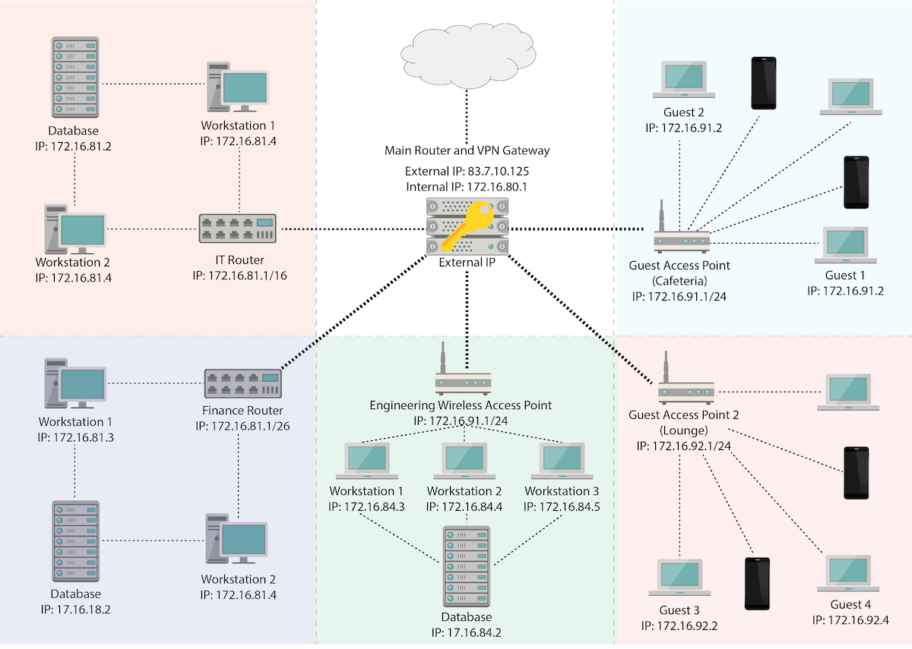
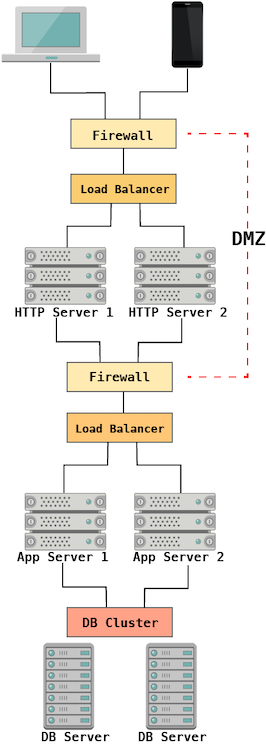

## Activity File: Threat Modeling: Steps 1 - 4

Today, you’ll play the role of a security consultant contracted to advise a financial technology firm called GeldCorp.

- Their finance department recently experienced a major breach and have already developed a training plan to address the problem. However, they would also like to make absolutely sure they don’t get hit with another unexpected breach in the future.

- Your assignment is to help GeldCorp better understand where its core networks are most vulnerable to attack and advise them of what is most important to protect. 

- You’ll do this by analyzing the business and its assets, then applying the OWASP threat modeling process in a series of exercises throughout the day.

In this activity, you’ll read about the business and its assets, then apply Steps 1 - 4 of the OWASP threat modeling process:

1. Determine Assessment Scope

2. Identify Threat Agents

3. Identify Possible Attacks

4. Identify Exploitable Vulnerabilities

You will begin by reading about the business and its assets. The instructions for the threat modeling activity follow.

### Instructions

#### Step 1: Determine Assessment Scope

Read the following overview and Geldcorp Network infrastructure to familiarize yourself with the assessment scope then answer the review questions below.

#### GeldCorp Overview**

- GeldCorp is a financial technology firm that helps clients manage and optimize their stock portfolios. They offer two main services:

  - Custom Trading Platform: A web application that clients use to transfer money between their bank and trading accounts, buy and sell stock, and enable automated trading features.

  - Financial Advising: GeldCorp also allows clients to purchase advisory services. This service gives them one in-person meeting with a financial advisor every quarter. It also grants them access to the live chat feature, which they can use from the web application to request advice 24/7.

- GeldCorp offers these services separately, and therefore runs them as separate businesses. For this activity, you’ll focus specifically on assessing the network assets that these businesses rely on. Then, you’ll identify the threat agents, possible attacks, and exploitable vulnerabilities relevant to its most critical assets. 

#### GeldCorp Network Infrastructure

Network infrastructure includes all the devices that make up a network and aid in transporting data across it. These include routers, firewalls, and switches, which we’ll cover in-depth during a later unit. For now, we’ve provided brief descriptions of the relevant devices in this activity.

- **Corporate Intranet**: Refer to the topology below for a simplified diagram of the corporate intranet.

  - A corporate intranet is a private computer network that allows access only to authorized employees. It’s used to securely share company information and resources, among other purposes.

  - A network topology shows how the nodes, or devices, are arranged and connected to one another in a network. We’ll dive into topologies in a later unit, but for now, note that they are often depicted in maps like the one in this activity.

  

- **Router** (receives Internet, receives VPN, provides DHCP)

    - A router is a networking device that forwards (or "routes") resources to other networks. In this case, the router is the hub that sets up the corporate intranet and manages all of the devices on it.  It receives internet, is a VPN gateway, and provides DHCP. 

    - Routers can forward resources to other routers, computers, and access points. An access point is a device, such as a router, that allows other devices to connect to a network. It allows in part for more devices to be on the network.

- **Domain Controller** (Windows Active Directory Command Center)

    - A domain controller is a Windows server that manages network security and is responsible for user authentication and authorization. It’s a primary way for authenticating users on the network.

- **Department Routers** (receive forwarded internet, VPN)
    - Each department has an associated domain name.

- **Department Databases**

    - Each department has a private database in their own subnet. We’ll discuss subnets in depth during a later unit, but for now note that subnetting allows large networks to be divided into smaller networks, and each of these subnets has its own set of IP addresses.

    - All employees in a department have full access to all databases.

- The entire network is managed with Windows Active Directory. We’ll learn more about Active Directory during a later unit, but for now know that AD is a directory service for Windows domain networks. Among other tasks, it is used for managing devices on a network.

- The network and system administration team keep all systems fully patched at all times. GeldCorp does not enforce content filters, meaning that employees can visit any sites they want.

Note the following additional information:

- Each department has its own subnet.

- Employees who connect to the intranet from home must use the VPN.

- All employees in a given department have access to all of that department’s data servers.

#### Steps 2 - 4: Identifying Threat Agents, Possible Attacks, and Exploitable Vulnerabilities

After reading the above overview, answer the following questions:

2. Identify Threat Agents: List three threat agents relevant to the intranet: 

3. Identify Possible Attacks: List three attacks relevant to the intranet, and which threat agent is most likely to use each one.

4. Identify Exploitable Vulnerabilities: Identify three possible vulnerabilities in the intranet, and rank them in order of severity. Explain how each one could be exploited.

### Bonus

#### Web Application Infrastructure

Read the following about Geldcorp's trading platform’s network infrastructure and then answer the following questions. 

- Refer to the topology below for a simplified diagram of the trading platform’s network infrastructure.

    

- A DMZ is a portion of the network that is intentionally exposed to larger external networks. Oftentimes, this will include the internet. It acts as a buffer between the public internet and the network itself. This means that a firewall screens all network data coming from the internet. 

  - There is also a firewall that screens the data that passes from the DMZ to the larger network. 

  - Load balancers are then responsible for efficiently distributing the incoming network traffic to various servers in the network.

GeldCorp has a lot of clients, so it has several HTTP servers. This ensures the app doesn’t crash due to too many incoming HTTP requests.

The App Servers run the core web app, which lets users transfer funds to their trading accounts, buy and sell stock, and enables automated trading. This last feature requires the App Servers to also run GeldCorp’s top-secret trading algorithms.

The Database stores the following PII about each user:

  - Name, address, and phone number, and SSN. Used to automate bank transfers.

  - Account balance, which records how much cash the user has to buy stocks. 

  - Portfolio data, including which stocks each user owns, and how much each is worth.

  - Trading history. This is a record of every trade the user has made. Account advisors and automated trading algorithms use this to make trades for their clients.

Note the following additional details:

- These applications are built entirely in-house, including code used to process user input. In other words: GeldCorp does not use frameworks. They only build from scratch.

- All of the servers run on Linux. They are all fully patched and hardened.

- These applications have never been pentested, but no breaches have been identified yet.

#### Review Questions:

After reading the above overview, answer the following questions:

1. Identify Threat Agents: List three threat agents relevant to the web application.

2. Identify Possible Attacks: List five attacks relevant to the web application and which threat agent is most likely to use each one. 

    - Be creative. We'll cover web attacks later in this course, but for now you can use Google to help you with identifying these attacks.

3. Identify Exploitable Vulnerabilities: Identify three possible vulnerabilities in the web application infrastructure, and rank them in order of severity. 
  
    - Explain how each one could be exploited. 
    
    - Similarly, use Google to help you identify potential exploitable vulnerabilities. 

--- 
© 2020 Trilogy Education Services, a 2U, Inc. brand. All Rights Reserved.
