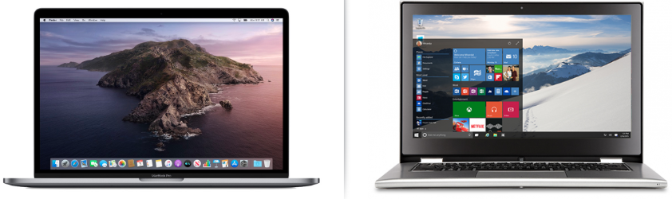
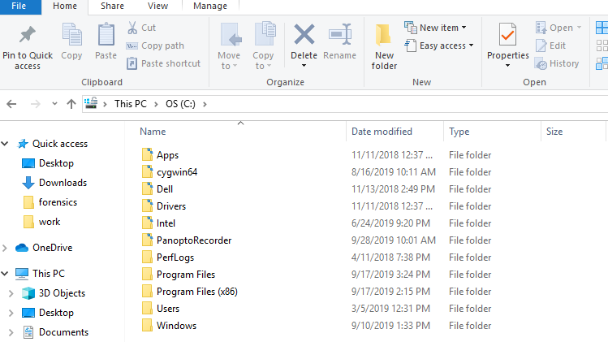

# Student Guide

## Terminal 101 Day 1: How Sweet is the Terminal?

### Overview

In today's lesson, we will introduce terminal and bash commands. Throughout the lesson, you will complete activities using the command line for basic file navigation and retrieval tasks.

### Lesson Objectives

By the end of this lesson, you will be able to:

  * Discuss the prominence and utility of the command line in IT and security professions.

  * Use commands like `ls`, `cd`, `mkdir`, `touch`, `cp`, `mv`, `rm`, `rmdir`, and `cat` for basic file navigation and manipulation.

  * Navigate deeply nested folder structures using relative and absolute file paths. 

  * Use commands like `head`, `tail`, `more`, and `less` to preview files in the command line. 

  * Combine the above commands in sequence to accomplish relevant IT tasks. 
  

### Slideshow

The lesson slides are available on Google Drive here: [3.1 Slides](https://docs.google.com/presentation/d/1cbm83Z25PoMz2MM5Vh_ieJntJoFIAnJYOU4wkEOkKAk/edit).

- **Note:** Editing access is not available for this document. If you wish to modify the slides, please create a copy by navigating to File > "Make a copy...".

-------

### 01. Why Terminal Matters

Welcome to the third week of class. Today, you will be learning the basics of the command line. 

Most of you are likely familiar with a Microsoft Windows or a Mac interface that looks like the following:

   
  
- These interfaces are called **Graphical User Interfaces** or **GUI** (pronounced "gooey").

- They are called GUIs because they contain graphical elements, such as  icons, windows and buttons.

Within these Mac and Windows GUIs, you can accomplish many tasks by directly clicking your mouse on the screen, such as: 

  - Creating files.
  - Viewing files.
  - Moving files.
  - Searching through directories.    

This week we will be learning how to use a different interface to complete these tasks called the **command line**.

Have you ever worked on the command line before? 

- If not, that's okay: the command line is easy enough to learn with a bit of practice. 

- If you have, you will be building on your existing knowledge throughout the week.

#### What is the Command Line?

  - Unlike the Windows and Mac interfaces, command line users do not directly interact with icons and buttons on the screen. 

  - Rather, users complete tasks on their machine by issuing commands with a line or lines of text. 
  
    For example: rather than clicking on a file to open it, we type a command that opens the file. 

  -  The command line is a critical core competency for IT and security professionals.
  
#### Why the Command Line?

While the command line may seem challenging at first, learning and using it provides important benefits for IT and security professionals. The command line can be:

- **The only way to achieve a desired outcome.**
  - In many cybersecurity and IT jobs, you will find yourself working with systems and tools that have no GUI interface. This is typical of many servers. 
  
  - For example: As a security professional, you may need to configure a system that does not have a GUI, and the command line will be your only mode for configuration.
      
- **The fastest way to achieve a desired outcome.**

  - The command line has many tools and scripts that are not available on a GUI. These tools can often speed up a task.
  
  - For example: You can develop a script on the command line that can automate and repeat a task.
  
- **The most flexible way to achieve a desired outcome.**

  - While working with a GUI may be the most familiar, working directly with the command line provides greater control. 
    
  - For example: You can output logs directly where you want, combine files in unique ways, and string together commands with more flexibility.

**Note**: The best way to learn the command line is to use it. Therefore, this week is built around hands-on exercises. 

In today's exercises, you will be playing the role of security analysts at a candy manufacturing company, Wonka Corp. 

- You will be using the command line to  investigate a potential rogue employee, who may be selling secret Wonka Corp recipes to a rival organization, Slugworth Corp.  

- You will be tasked with using the command line to identify evidence on the system of suspicious activity from this employee.
   

### 2. Basic Terminal Commands 

We will begin by talking about the common GUI equivalent of a directory:

Each one of the folders in the image can contain other sub-folders and files.

Within this Windows GUI, we can complete the following common tasks:

- View your current location by viewing the current directory path at the top of the page.

- Navigate through the directories and files by clicking directly onto the folder to access its sub-folders or files.

- Create folders by right-clicking and selecting "New" >> "Folder."
    
We will complete these same tasks on the command line using the following text commands:
- `pwd` to display the current working directory.
- `ls` to list the directories and files in the current directory.
- `cd` to navigate into a directory.
- `mkdir` to make a directory.
- `rmdir` to remove a directory.
- `touch` to create an empty file.
- `rm` to remove a file.
- `clear` to clear the terminal history on the page.
  
#### Demonstration Scenario

The upcoming demonstration will introduce many of the most common text commands used by IT and security professionals.

We'll use the following scenario:

  - You are a security analyst at ACME Corp and your manager has assigned you several security investigations.

  - They've provided you access to a computer in the evidence room and need you to do the following:

     1. Create several directories to organize your investigations: `Case1` and `Case2`.

     2. Put your directories in the already existing folder `security_evidence`.

     3. Put an empty file in the `Case1` folder titled `case1_evidence`. You will use this file to store evidence at a later time.

This computer doesn't have a GUI, so we will complete all these tasks on the command line.  

#### Basic Terminal Demonstration

1. Open an instance of a terminal on your Ubuntu VM.

   - For our scenario, this is the new computer provided by your manager.
  

2. First, we need to know our current location in the file directory. 
  
   - To find our current location, run the `pwd` command to show the path.

   - `pwd` stands for *print working directory* and this command displays your current location.

   - Our current location should display as `/03-instructor/day1/terminal_demonstration`.
   
3. Now that we know where we are, we need to know which other folders we can access and navigate into.
  
   - Run the `ls` command to see all the files and folders in your current directory.

     - `ls` provides a list of files and folders in the current folder. 

   - The results only show a directory called `security_evidence`.
   
4. Next, we will navigate into  the  `security_evidence` folder, as your manager requested.
 
   - Run the command `cd security_evidence` to navigate into that folder.

     - `cd` stands for _change directory_ and the syntax is  `cd  <folder name>`.

   - Run the `pwd` command. It shows we are now located in the `/03-instructor/day1/terminal_demonstration/security_evidence` folder.
   
5. In the `evidence_folder`, we can create several directories to place our evidence.

   - Run the command `mkdir Case1`.

     - `mkdir` stands for _make directory_ and the syntax is `mkdir  <folder name>`.

   - Run the `ls` command to show that the directory of `Case1` has been created.

   - Run the command `mkdir Case2`.

   - Run the `ls` command again and show that the directories for `Case1` and `Case2` have been created.

6. Security analysts often make mistakes when creating directories.  Fortunately there is a command to undo these mistakes.
   
    -  Run the command `mkdir Case3`.

       Whoops. You accidentally created a directory that wasn't requested by the manager.

    -  We can use `rmdir` (remove directory) to remove a directory as long it has no contents.

       The syntax is  `rmdir  <folder name>`

    -  Run the `rmdir` command and then run `ls`. 
    
       `Case3` should no longer exist.   

7. Your manager's last request was to put an empty file called  `case1_evidence` in the `Case1` directory.
 
    - First, we'll run `cd Case1` to navigate into that folder.

    - Run the following command: `touch case1_evidence`.

      -  `touch` creates an empty file. The syntax is   `touch <filename>`.
        
    - Run `ls` to show that `case1_evidence` has been created.

    - If you accidentally create the wrong file, similar to `rmdir`, you can use `rm  <filename>` to remove a file.
 
8. You have now completed your manager's requests and can use the `clear` command to clear the terminal history on your page.
  
   - `clear` removes the text from the page and starts from a fresh command line.

#### Summary

In this demonstration, we covered the following commands:

   - `pwd`: Displays the current working directory.
   - `ls`: Lists the directories and files in that current directory.
   - `cd`: Navigates into a directory.
   - `mkdir`: Makes a directory.
   - `rmdir`: Removes a directory.
   - `touch`: Creates an empty file.
   - `rm`: Removes a file.
   - `clear`: Clears the terminal history on the page.
  

In the first command line activity of the day, you will use these commands to prepare for an investigation into the malicious employee who may or may not be selling secrets to your rival organization Slugworth Corp.

### 03. Activity: Take Five and Practice the Command Line  

* [Activity File: Take Five and Practice the Command Line](Activities/04_takefive/unsolved/readme.md)

### 04. Activity Review: Take Five and Practice the Command Line 
* [Solution Guide: Take Five and Practice the Command Line](Activities/04_takefive/solved/readme.md)
 
### 05. Relative Vs. Absolute Paths and the `cp` and `mv` Commands 

We just covered several commands that assist with file navigation and creation.

The unique location in the directory where the file is created is called a **file path**.

- As with a physical path, to find a file in a directory, you have to follow a specific route.

Note the following example: `/home/Sally/Desktop/my_images/cat.jpg`

  - The file is an image called: `cat.jpg`.

  - The directory path is `/home/Sally/Desktop/my_images/`.

- The `cat.jpg` image file is located in the `my_images` directory, which is in the `Desktop` directory, which is in the `Sally` directory, in the `home` directory.

 File paths are used by IT and security professionals to describe where files or other directories are located.

  - For example, if you are a security administrator and need to access a network log for an investigation, you may need to ask the network team for the location or path of the log file. They would give you a path like `/var/log/logfile1.txt`.
  
    - This path says the `logfile1.txt` log file is in the `log` directory, which is in the `var` directory.
    
There are two methods for providing paths to a file or directory on the command line: **absolute paths** and **relative paths**.  

An absolute path indicates the location of a file regardless of your current location in the file directory.

- So, if we are in the `Applications` directory and need to access a file in the `Desktop` directory, we can use an absolute path to get the file without first navigating to the `Desktop` directory. 

When writing an absolute path, we need to include the top of the directory structure.

- For example, we want to access a file located at `/home/Sally/Desktop/Sallysfiles/textfiles/Sallyfile.txt`.

  - If we are located in another directory, such as `/home/bob/file_logs/`, we can use an absolute path of `/home/Sally/Desktop/Sallysfiles/textfiles/Sallyfile.txt` to access `Sallyfile.txt`.

 A relative path, on the other hand, starts at your current location in the file directory. It doesn't require writing out the top of the directory.

- So, if you need to access a file in the `Desktop` directory and you are already in the `Desktop` directory, you can create a path starting from your current location. 

- For example, to access `Sallyfile.text`, we can use `Sallysfiles/textfiles/Sallyfile.txt`.

  - We are already in the `Desktop` directory, therefore `home/Sally/Desktop/` is assumed, and we don't have to write it. 

- For relative paths, you can also use `./`, known as the `dotslash`, to indicate a relative path from your current directory.

  - The `.` indicates the current directory, and the `/` is the start of the relative path.
  
- For example: To access `Sallyfile.txt`, we can use  `./Sallysfiles/textfiles/Sallyfile.txt`.  

#### File Paths on the Command Line 

Relative and absolute paths are very helpful shortcuts when working on the command line. 

  - For example: Let's say you want to access the `Sallysfiles` directory from the previous example, starting at the home/Sally directory.
  
    - Instead of running the following three commands from the `home/Sally` directory:
      - `cd Desktop`
      - `cd textfiles`
      - `cd Sallysfiles`
   
       You can use the relative path from the home/Sally directory as a single command:

      `cd Desktop/textfiles/Sallysfiles/`
  
#### File Path Scenario

We will practice relative and absolute paths in the following demonstration by using this scenario:

  - In your role as a security analyst at ACME Corp, your manager asks you to create several additional evidence files to prepare for your investigation.

  - They provide you with the following instructions, which require relative and absolute paths:

     1. Navigate into the directory `/03-instructor/day1/pathnav_demonstration/security_evidence/Case2/` and create an empty file called `case2_evidence`.

     2. Navigate into the directory `/Case1/`  and create an empty file called `Web_logs`. 

     3. Navigate back to the home folder.
  
### Path Navigation Demonstration  

1.  Similar to the last demonstration, you need to know your current location in the file directory.

    - To find your current location, run the `pwd` command to show the path.

    - Your current location should display as `/03-instructor/day1/pathnav_demonstration/`. 
   
   
2.  Next, your manager requested you to navigate to the `security_evidence/Case2/` directory.

     - To navigate to that directory using a relative path, you would run:

        `cd security_evidence/Case2/`

        * You have to be in the `pathnav_demonstration` directory to use this relative path.

     - Run `pwd`. You should be in the `/03-instructor/day1/pathnav_demonstration/security_evidence/Case2/` directory.

     - Create an empty file called `case2_evidence` by running `touch case2_evidence`.

     - Run `ls` to confirm the file has been created.
  
3.  Next, your manager asked you to navigate into the directory `/Case1/`.   

      - To navigate into that directory using an absolute path, run:
        `cd /03-instructor/day1/pathnav_demonstration/security_evidence/Case1/`.

        - Wherever you are in the file system, this absolute path will take you to the `Case1` directory.

      - Run `pwd` again. You should be in the `/03-instructor/day1/pathnav_demonstration/security_evidence/Case2/` directory.
      
      - Create an empty file called `Web_logs` by running `touch Web_logs`.

      - Run `ls` to confirm the file has been created.
  
4. Lastly, you have been asked to return back to the home directory.

    - Explain that in order to go backwards out of a directory, we use the `cd ../` command.

    - To go out of multiple directories, you simply add a `../` for each directory.

      - For example, to go backwards out of four directories, you would enter the command `cd ../../../../`.

    - Explain that to go back to the `03-instructor` from our current location, we need to go back home directories.

      - Run the command `cd ../../../../`.

    - Run `pwd` again to demonstrate that you should now be back in the `/03-instructor/` directory.

### Copying and Moving Files

Several other important basic commands can also be used with absolute and relative paths.

Security and IT professionals are often asked to _copy_ files from one location to another:
  
  - For example, a security analyst may be asked to make a copy of a log file and place it in a separate evidence folder. This way, if notes need to be added to the copied file, the original will remain untouched.
  
- The command `cp`, which stands for _copy_, creates a copy of the file and places it in a specified location.
    
  - The original file will remain and a copy of the original will be moved to the new location.
   
Security professionals are also often asked to _move_ files from one location to another.

   - For example, an image file may have been accidentally placed in the email directory. An IT professional may be asked to move the file out of the email directory and into the correct image directory.

- The command `mv`, which stands for _move_, moves the file from the current location into a new,  specified location.
  - Unlike copy, the original file will not remain, and the file will be moved into the new location.  
  
  - Note: `move` is similar to the _cut and paste_ Windows commands.
    
  
The syntax for both `cp` and `mv` is:

  `<command> <file> <location to copy or move>`
      
  * For example:  `mv cat.jpg  /dirA`.

    This command will move the file `cat.jpg` into the directory `dirA`. 

The `<file>` or `<location>` can be indicated with an absolute or relative path if the file is not in your current location.

  - For example:  `mv  dirA/dirB/dirC/cat.jpg  /dirA/dirB`

     This command will move the file `cat.jpg` from the `dirC` directory to the `dirB` directory.
 
#### Copy and Move Demonstration Scenario

 We will demonstrate how to use `cp` and `mv` by continuing with the same scenario.

  - Your manager realized they made a mistake. The web activity they want you to gather is only for Case 2. Therefore, you need to move the `Web_logs` file from the `Case1` directory to the `Case2` directory.

  - After you move the file into the `Case2` directory, make a copy of the file `Web_logs` and place it in the `security_evidence` folder, so you can add notes to the file later.

### Copying and Moving Files Demonstration
  
1. Similar to the previous demonstrations, you need to know your current location in the file directory to get started.
  
    - Run the `pwd` command to retrieve the path of your current location. 

      - Your current location should display as `/03-instructor/day1/pathnav_demonstration/`.

        Change back to `/03-instructor/day1/pathnav_demonstration/` if you are not currently there.
     
2.  Your manager has asked you to move the file called `Web_logs` from `Case1` to `Case2`.  

    - We will use the move command. Run the following: 
    
      `mv /03-instructor/day1/pathnav_demonstration/security_evidence/Case1/Web_logs   /03-instructor/day1/pathnav_demonstration/security_evidence/Case2/`

      - This command will move the `weblogs` file  from the `Case1` directory into the `Case2` directory. 
    
    - Note: we are using absolute paths for the file and the new destination.
    
 3. Next, your manager asked you to make a copy of the file `Web_logs` from `Case 2` and place it in the `security_evidence` folder.
 
    - We will use the copy command. Run the following:  
    
      `cp /03-instructor/day1/pathnav_demonstration/security_evidence/Case2/Web_logs   /03-instructor/day1/pathnav_demonstration/security_evidence/`

      - This will make a copy of the the `Web_logs` file from the `Case2` directory and place it in the `security_evidence` directory. 
    
    - Note, we are using absolute paths for the file and the new destination.
    
4.  Lastly, we should check to confirm our copy and move commands worked.
  
    - First, we will `cd` into the `/security_evidence` directory.

    - Run `ls` and confirm that the copy of the `Web_logs` file is in this directory.

    - Next, run  `cd Case1` in the `Case1` directory and confirm the `Web_logs` has been moved out of this directory.

    - Using an absolute path, change into the `Case2` directory by running:
    
       `cd /03-instructor/day1/pathnav_demonstration/security_evidence/Case2/`.

    - Confirm the `Web_logs` file has been copied to this directory by running `ls`.
    
In the previous two demonstrations, we practiced the following:

   -  `file path`: Identifies a unique location in a file system. 

   - `absolute paths`: A path that includes the top directory of the file system.

   - `relative paths`: A path that begins from the current directory.

   - `cp`: Copies files.

   - `mv`: Moves files.
  

In the next activity, we'll use these same concepts to continue preparing for an investigation into the malicious employee that may be selling secret recipes to Wonka Corp's rival, Slugworth Corp. 
      

### 06. Activity: Finding your Milky Way 

- [Activity File: Finding your Milky Way](Activities/07_milkway/unsolved/readme.md)

### 07. Activity Review: Finding your Milky Way
* [Solution Guide: Finding your Milky Way](Activities/07_milkway/solved/readme.md)

### 08. Break  

### 09. Preview Commands  

Occasionally, IT and security professionals will need to preview the contents of a file. For example:

  - A security administrator wants to preview the top 10 lines of an email file to figure out whom the email was sent to.

  - A network administrator wants to preview the bottom of a log file to see the last timestamp captured in a file.
  
Multiple preview commands can assist with these tasks.
    
  - To preview and scroll through a whole file, we can use the `more` or `less` commands.

    - `more`: Used to view a file one page at a time. To move to the next page, press space bar.

    - `less`: This command is similar to `more`. It allows you to scroll up and down a file.

  - To preview a file by a certain number of lines, use the `head` or `tail` commands.

    - `head`: Displays the top 10 lines of a file.

    - `tail`: Displays the bottom 10 lines of a file.

  - 10 is the default number of lines, but this number can easily be modified.

    - The syntax for `head` is:   `head -number  file`.

    - For example: `head -50 logfile.txt`  will show the top 50 lines in the logfile.txt file.

    - The `tail` command uses the same syntax.
    
#### Preview Demonstration Scenario

We will practice using the preview commands with the following scenario:

  - In your role as security analyst at ACME Corp, you are asked to examine several potential evidence files.

  - Your manager provides a directory called `evidence_directory` that contains four files: `File1`, `File2`, `File3`, `File4`.

  - Your manager explains that these files are log files pulled from a secret computer at ACME Corp. They should be access logs that show who logged into this secret computer.

  - We will use the preview commands to determine which of these files are actually access logs.

  - Once you determine that a file is an access log, document the last timestamp in the file.
  

#### Preview Commands Demonstration

1. First, navigate into the `evidence_directory`. 
- Note: This is located in the `/03-instructor/day1/preview_demonstration/` folder.
    
    - Run `cd evidence_directory`.  
     
2.  Your manager told you there are four evidence files in this directory. 

     - Confirm this is correct by running `ls`.

     - Output should confirm there are four files: `File1`, `File2`, `File3`, `File4`.
 
3. Next, we need to preview the first file  with the `more` command to determine if it's an access log file.

     - First, use the `more` command by running `more File1`.

       - This file does not look like an access log file.

       -  Use the space bar to scroll down through the file.

  
4. We will preview the next file using the `less` command.

     - Use the less command by running `less File2`.

       - This file also does not look like an access log file.

       - Use the up and down arrow keys to preview the file.

     - To exit this preview, press the `q` button on your keyboard.
  
5. We will use the `head` command to view the top 10 lines of `File3`.

     - Run the command `head File3`.

       - This also does not appear to be an access log file, but it only shows the top 10 lines.

      - View a larger set of lines (30) by running `head -30 File3`.

        - Now it shows the top 30 lines, but none of the records look like access logs.
  
6.  Next, we will open up the last file with the `head` command again.

     - Run the command `head File4`.

        - This looks like an access log file, as it has times, usernames, and login times.
  
7.  Lastly, since we have found the access log file, we now need to preview the bottom of the file to see the last timestamp.

     - Run the command `tail File4`.
     
        - The last timestamp on the file shows Sally logging out at 12/23/19 04:33 PM.      
  

In this demonstration  we covered the following preview commands:

   - `more`: View a file one page at a time, and press space bar to go to the next page.

   - `less`: Similar to `more`, but allows you to scroll up and down on the page.

   - `head`: Previews the top 10 lines of a file.

   - `tail`: Previews the bottom 10 lines of a file.

   - Adding `-number` after `head` or `tail` will change the number of lines previewed.
  

In the next activity, we will use these preview commands to begin investigating the malicious employees that may be selling secret recipes to Wonka Corp's rival, Slugworth Corp.      

### 10. Activity: Oh Henry, What Did You Do?  
- [Activity File: Oh Henry, What Did You Do?](Activities/11_oh_henry/unsolved/readme.md)
- [Directories/Files: Oh Henry, What Did You Do?](resources/oh_henry.zip)

### 11. Activity Review: Review Oh Henry, What Did You Do?
* [Solution Guide: Oh, Henry, What Did You Do?](Activities/11_oh_henry/solved/readme.md)

### 12. Data Streams and the `Cat` Command

 IT and security professionals often have to combine files.

  -  For example: A security professional may need to combine several of the same type of log file into a single log file.

  -  Combining files lets you do one single analysis of data, rather than analyzing multiple files.
  
We can use the `cat` command to complete this task.

  - `cat` is short for _concatenate_, a word meaning to link together.

  - `cat` combines the designated files and displays the results back to you, but does not save the result beyond the command line. 

    -  For example, to combine two separate files, `1.txt` and `2.txt`, you would run:
      `cat 1.txt 2.txt`.

    - This will display back to the you the combined results of `1.txt` and `2.txt`, but will not save the results beyond the command line.    
    
  - In order to save the results of the `cat` command, you have to redirect the **data stream**.

Note the following about data streams:

  -  A data stream is a way to describe channels of data as they are processed and moved through a system. 

  - Data streams are used to move data from one process or program to another.

  - The two most used data streams are called _stdin_ and _stdout_, pronounced "standard in" and "standard out."

  - In the context of a command, input data is usually the _argument_ given to the program. The output data is the information returned by the program when the command is successful.

  - Input data is streamed using the data stream _stdin_.

  - Output data is streamed using the data stream _stdout_. 

This idea will start to become clear as we use redirection with _stdin_ and _stdout_ when using the `cat` command. 

How to use redirection with `cat`:

- In order to save the results of `cat`, the user would have to use either:

     - `>` to write or overwrite a file.

  -  `>>` to write or append to a file.

  For example: You want to combine two separate files, `1.txt` and `2.txt`, into a single file called `combined_1_and_2.txt`.

  - You would run the following command:

    `cat 1.txt 2.txt > combined_1_and_2.txt`

  - This command will create a new file called `combined_1_and_2.txt`. If the file name already exists, it will overwrite it with the combined data from `1.txt` and `2.txt`.
    
  Another example: You want to combine two separate files, `3.txt` and `4.txt`, into a single file called `combined_3_and_4.txt`.
  
  - You would run the following command:

    `cat 3.txt 4.txt >> combined_3_and_4.txt` 

  - This command will create a new file called `combined_3_and_4.txt`. If the file name already exists, it will add to the bottom of the file with the combined data from `3.txt` and `4.txt`.

The following example shows how `cat` works with _stdin_ and _stdout_:

   `cat 1.txt 2.txt > combined_1_and_2.txt`

- `cat` takes data directly from _stdin_ and directs it to _stdout_.

  - `1.txt` and `2.txt` are being sent to _stdin_.

- `cat` takes _stdin_, concatenates the data, and sends it to _stdout_. 

  - The results of combining `1.txt` and `2.txt` is _stdout_.

- _stdout_ is then redirected and written to a file called `combined_1_and_2.txt`.
  
#### `Cat` Demo Scenario 

We will walk through the `cat` command using the following scenario:

  - You are a security analyst at ACME Corp and asked to combine several evidence log files from a potential rogue employee.

  - Your manager provides you a directory called `Logfile_evidence_directory` that contains four files: `LogFile1`, `LogFile2`, `LogFile3`, `LogFile4`.  Each file has logs from a different day.

  - Your manager explains that your forensic team will be doing an analysis of these logs, but the team's job will be easier if you combine the log files into a single file.

  - You must use the `cat` command to combine them into a single file called `rogue_employee_log_evidence`.
    

#### `Cat` Walkthrough
  
1. Start by navigating into the `Logfile_evidence` directory.
   - Note: This is located in the `/03-instructor/day1/cat_demonstration` folder. 
    
    - Run `cd Logfile_evidence`.  
     
2.  Confirm there are four log evidence files in this directory. 

     - Run `ls`.

       - There are four files in this directory: `LogFile1`, `LogFile2`, `LogFile3`, `LogFile4`.

     - Use the `more` command to preview the files and show that each log file is a log for a different day.
     
       - For example, run `more LogFile1`.
 
3. Next, we will use the `cat` command to combine these four log files together. First, we will do it without saving.

     - Type the following command: `cat LogFile1 LogFile2 LogFile3 LogFile4`.

       - The syntax is simply `cat` followed by the file names we want to combine, separated out by spaces.

     - Run the command and note the results of combining the four files displayed on the screen.

     - Also, note that the files `LogFile1` `LogFile2` `LogFile3` `LogFile4` are sent to _stdin_ and the combined four files displayed is the _stdout_.      
  
4. Your manager asked you to combine all four files into a file called `rogue_employee_log_evidence`.

     - Type the following command `cat LogFile1 LogFile2 LogFile3 LogFile4 > rogue_employee_log_evidence `.

       - The syntax is the same as the previous command, except we are using the `>` command to redirect the results into a file called `rogue_employee_log_evidence`.

     - Run the command and then run `ls` to show a file called `rogue_employee_log_evidence` has been created.
     
5. Finally, preview the file called  `rogue_employee_log_evidence`  to show that the four files were successfully combined.

     - Run `more rogue_employee_log_evidence` and push the space bar to scroll through the file and confirm the combination of the four log files.

   
Demonstration Summary: 

   - `cat` is used to concatenate and combine multiple files together.

   - Use redirection commands such as `>` or `>>` to combine files.

     - `>` will write to a file, but overwrite the file if the file name already exists.

     - `>>` will write to a file, but append to the file if the file name already exists.
  
In the final command line activity of the day, you will use all the commands you've learned today to help Wonka Corp identify the insider selling secret recipes to Slugworth Corp.

### 13. Activity: Internal Investigation: Finding the Kit `Cat` Burglar 
- [Activity File: Internal Investigation: Finding the Kit Cat Burglar](Activities/14_kitcat/unsolved/readme.md) 

- [Directories/Files: Internal Investigation: Finding the Kit Cat Burglar](Resources/find_kit_cat_burglar.zip)

### 14.  Activity Review: Internal Investigation: Finding the Kit `Cat` Burglar 

- [Solution Guide: Internal Investigation: Finding the Kit Cat Burglar](Activities/14_kitcat/solved/readme.md)

-------

### Copyright

Trilogy Education Services © 2018. All Rights Reserved.
