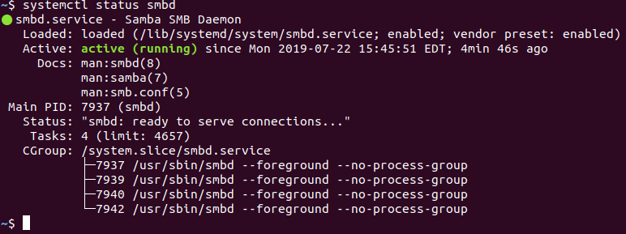
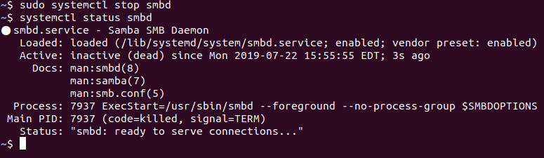

## 4.3 Student Guide: Managing Permissions and Services

### Overview

Today's class will continue our introduction of Linux by covering more topics related to auditing a malfunctioning system, ranging from file permissions to service users, managing services, and securing the root account.

### Class Objectives

By the end of class, you should be able to to:

- Inspect and set file permissions for sensitive files on the system.

- Manage and monitor services on the system, including removing unused services.

- Create and assign users for services.


### Lab Environment

- You will use your local Vagrant virtual machine for today's activities. 
    
  - Student access:
    - Username:`sysadmin`
    - Password: `cybersecurity`

- Before completing today's activities, the setup script for Day 3 should be executed.
  - Before going to break, run:
  
    `/home/sysadmin/Documents/setup_scripts/sysadmin/day3_stu_setup.sh` 

### Slideshow 

The slides for today can be viewed on Google Drive here: [4.3 Slides](https://docs.google.com/presentation/d/1cnU4gJSWqZTK_o7H6CTnjS-JW9UaqWLYd23SD-wmcN4/edit)

---

### 01. Welcome and Review 

Let's review what we learned in the last class:

- Auditing passwords using `john`.

- Elevating privileges with `sudo` and `su`.

- Creating and managing users and groups.

- Inspecting and setting file permissions for sensitive files on the system.

Today we will cover permissions on the system before moving on to services and service users, and some physical security topics.

- While no system is completely safe, there are many steps we can take to make a system harder for an attacker to exploit.

- Our strategies revolve around reducing attack surfaces and continuing to practice the principle of least privilege.

- We will continue our junior Linux administrator narrative, learning a few more techniques to protect the system.  

- Tthis week's homework will use all of the new techniques you have learned.

### 02. Access Controls and Permissions

- Google Docs is a fantastic resource because we can choose who we share files with and what permission they have when they receive the file, such as whether they can read, comment, or make edits to the file.

This function is an **access control**. 

- These controls determine which actions users are able to take on a file (edit, view, etc.).  

- **Permission** regulates who can take which actions. For example, Jane can read and write, but Ivan can only read.

We have been discussing why it's important to limit access on the system. Access controls and permissions also help us follow the principle of least privilege.

Linux has a very granular way of setting these permissions:

- Linux categorizes files, programs, and directories as items.

- Each item has permissions allowing or preventing access to **read**, **write**, and **execute**. We'll look into these actions more in a moment.

- For each item, we specify the access that the **owner**, the **group**, and **others** have.

  - The owner is typically the user that created the item. However, this can be changed.

  - The group is typically the primary group of the owner. However, this can also be changed.  

  - Others includes everyone who is not the owner, and not in the group.


#### Read, Write and Execute

For each of the three mentioned categories—owner, group, and other—we have three options we can manipulate: read, write and execute.

- Read determines if the item can be read, or viewed.
- Write determines if the item can be written to, or modified.
- Execute determines if the item can be executed.

While execute can be applied to a file, it really only has effect for items that can be executed, like a program or a directory.

For any given item, we can specify if the owner can read, write, or execute, if the group can read, write, or execute, and if other can read, write, or execute

- This is called **Discretionary Access Control**, or **DAC**. It is called discretionary because these permissions can be passed from one item to another. For instance, a directory may pass on its permissions to items inside it.

- We saw an example of an item passing its permissions to another item in our previous activity, when the program `less` passed on its root permissions to the bash shell that ran inside it.

This gives us nine options for any given item, and each option can either be allowed or not allowed in any combination.

- To keep things as concise as possible, when we view each of these options on the command line, they are abbreviated to one letter: `r` for read, `w` for write and `x` for execute.

#### Permissions Demonstration Setup

In this demo we will create a file and a directory and look at the default permissions. Then, we will change these permissions to deny particular users and groups access.

In order to read and manipulate these file permissions, we need the following commands:

- `ls -l` to show the permissions info.

- `chmod` to change the permissions info.

- `chown` to change the owner and group of a file.

The goal will not be how to use the commands, but rather learning the syntax of the permissions themselves and how to combine them with users and groups to create custom access controls.

#### Inspecting Permissions

We'll start by creating a file and inspecting its permissions.

Move into your `Documents` folder.

- Run `touch my_file` to create a file.

- Run `mkdir my_dir` to create a directory.

- Run `ls -l` to show these files and their permissions info. Your output should be similar to the following:

  ```
    drwxrwxr-x 2 sysadmin sysadmin 4096 Aug 24 13:03 my_dir
    -rw-rw-r-- 1 sysadmin sysadmin    0 Aug 24 13:03 my_file
  ```

This list includes more information than just the file name. Use `my_file` as an example:

- File or directory permissions: `-rw-r--r--`

- Number of links to this file: `1`

- Username of file or directory owner: `sysadmin`

- Group assigned to the file or directory: `sysadmin`

- Size (in bytes): `0`

- Date and time of last modification: This will be the date and time when the items were created.

- File or directory name: `my_file`

For this demo, we will focus only on the permissions.

- Permissions are always listed in the order of read, write, and execute for the user, then group, then other.

Directories will always be labeled `d`. Items that are files will always be labeled with a hyphen (`-`).

The next three characters will show the owner permissions:

- For the directory, the owner permissions is `rwx`, meaning the owner can read, write, and execute for the directory.

- The execute permission allows a user to enter that directory with `cd` as opposed to just create files inside the directory (`w`) or list the files in the directory (`r`).

- For the file, permission is `rw-`, meaning the owner can read and write to the file. The `-` indicates the absence of permission for execute on the `my_file` file. The owner does not have permission to execute on the file.

- This makes sense, because the file isn't something that can be executed. If we wrote code into this file, and we wanted the computer to run it as a program, we could then enable the execute permission so it could be executed.

The middle three characters show the group permissions.

- For the directory, the group permission is `r-x`. The hyphen `-` indicates an absence of write permission.

- The group does not have permission to create files inside the `my_dir` directory, but anyone from the group can enter the directory and view the files inside it.

- For the file, the group permissions are `r--` . The group can read the file, but it does not have permission to write to or execute the file.

The last three characters show the permissions for all other users:

- For the directory, other permission is `r-x`. All other users can read and execute for the directory. They can only move inside the directory and list the files inside. They cannot create files or otherwise change the contents of the directory.

- For the file, the other permission is `r--`. Everyone on the system who is not the owner and not in the group can only read the `my_file` file. They do not have permission to change the file or execute it.

Summary: 

- `my_file` has read and write enabled for the owner and only read enabled for the group and others.

- `my_dir` has read, write, and execute enabled for the owner but only read and execute for the group and others.

#### Changing the Owner and Group

Now we will change the owner and the group by using `chown`.

The command `sudo chown owner:group <item>` can change the owner or the group of a file or directory.  

- `sudo`: Only `root` can make ownership and group changes to an item, which is why we’re using `sudo`.
- `chown`: Stands for "change owner." This command can be used to change groups and owners of items.
- `owner`: The owner we are specifying for the item.
- `:`: Separates owner and group.
- `group`: The group we are specifying for the item.
- `<item>`: The item we want to change. It can be a file or a directory.

`chown` can also be used to change only the user or group as follows:

-  `sudo chown <username> <item>` and `sudo chown :<groupname> <item>`

Next, we will change the owner and the group of `my_file` so that we are no longer the owner and we are no longer in the group.

- Run `sudo chown root:root my_file`

What effect will this change have on our permissions for the file?

- We are not the owner, and we are not in the group, so we now fall into the _other_ category.

  - Run `ls -l my_file` to verify the new permissions.

    - Now we only have read permissions for `my_file`. We cannot write or make changes to it.

- Run `nano my_file`. Nano shows a message stating we cannot make changes to the file.

- Run `rm my_file` to see that we can still delete this file after confirming that we are deleting a write protected file.

- Answer `n` to cancel deleting `my_file`. (Run `touch my_file` if you accidentally delete it.)

We can still delete this file because it lives inside our `Documents` directory and we have full ownership and permissions for this directory.

Because we have `sudo` access we can still take any action we want _if_ we invoke those privileges. But without `sudo` access, we cannot edit this file.

#### Changing Permissions

Remember, we have the nine options of read, write, and execute for each of the owner, group, and other categories.

These options can be changed using one of two notations:

- **Symbolic notation**: uses the letters `r`, `w`, and `x` to set read, write, and execute permissions.

- **Octal notation**: uses base-8 numbers to set file permissions. For example, `rwx` is `7` in octal. Octal notation will be covered in more depth in a moment.

You can always use the symbolic notation when setting permissions yourselves, but octal notation will come up in your real-world jobs, so you should be familiar with it.

- Run `ls -l my_file`.

  - This file was created with the default permissions: `-rw-r--r--`.

We change permissions with the command `chmod`, which stands for "change mode."

- Run `sudo chmod u=rw,g=rw,o=rw my_file`.
  - Remember that unless the user is the owner of the file, only `root` can make permissions changes, which is why we are using `sudo`.

  - The command reads: "Change permissions such that the user has read and write permissions; the group has read and write permissions; and 'others' have read and write permissions."

    - Confirm updated permissions by running `ls -l`

- Run `nano my_file`. We can now edit the file again because we have given write access to the other category, which we are currently part of.

We can remove permissions by leaving out the `r`, `w`, or `x`, and can also remove them or add them for all three categories with a `-` or a `+`.

- Run `sudo chmod +x my_file`

- Run `ls -l my_file`

The `x` option has been set for the owner, group, and other.

- Finally, run: `sudo chmod -x my_file`

  - Run: `ls -l`

  - We have removed the `x` permission from all three categories.

#### Octal Notation

Now, we will use octal notation to set permissions.

Permissions in octal notation are denoted by numbers. Just as `-`,`r`, `w`, and `x` represent specific permissions in symbolic; `0`,`1`,`2`, and `4` represent the same permissions in octal.

- `0` indicates that you have no permissions.

- `1` indicates that you can _execute_ the file.

- `2` indicates that you can _write_ to the file.

- `4` indicates that you can _read_ the file.

Unlike symbolic, in octal we can add numbers. The sum of these numbers results in specific permission sets.

  - `4` indicates that you can only _read_ the file.

  - `6` indicates that you can _read_ and _write_. (Read + write = `4 + 2` = `6`)

  - `7` indicates that can _read_, _write_, and _execute_. (Read + write + execute = `4 + 2 + 1` = `7`)

Run `sudo chmod 766 my_file`

- The numbers in `766` represent permissions for the owner, group, and world, respectively. In other words, owner = `7`, group = `6`, other = `6`.

  - The owner can read, write, and execute (`7`). The group can read and write (`6`). All others can read and write (`6`).

- Run `ls -l`

  - The permissions now read: `-rwxrw-rw-`.  While this notation tells us the same information as `766`, it is much less compact.

Another example:

  - Run `sudo chmod 444 my_file`.  This will give everyone only read permissions.

To give everyone read and write permissions.

- To add `2` to each `4`, run the following command:

  `sudo chmod 666 my_file`

What should we run to give the user read, write, and execute permissions; the group read and execute permissions; and other read permissions? 
  - Run `chmod 754 my_file`


#### Summary

In this demo, we created a file and a directory and looked at all the permissions they had by default. Then, we changed the permissions to deny particular users and groups access to this directory and file.

You can use the more intuitive symbolic notation, but should become familiar with octal notation, as it is very commonly used by system administrators.

We needed the following commands:

- `ls -l` to show the permissions info.

- `chown user:group` to change the owner and group of a file.

- `chmod` to change the permissions info.

### 03. Activity: Access Controls and Permissions
- [Activity File: Permissions](Activities/03_Permissions/Unsolved/README.md)


### 04. Activity Review: Access Controls and Permissions


- [Solution Guide: Permissions](Activities/03_Permissions/Solved/README.md)

### 05. Break

### 06.  Managing Services

- After reviewing permissions, we are moving on to service and service users.

- The next lecture, demo, and activity will focus on managing services, a common activity for sysadmins.

#### A Brief Introduction to Services and the SMB Exploit

What is a service? 

- **Servers** are just computers that offer services to other computers.

- A **service** is a function/capability that one machine makes available to another. For example, file sharing services allow computers to send and receive data.

- Some services are only run locally on the server and not provided to other computers. Tripwire is an example of a local security service.

- These services are packages that you can install and remove, just like other programs.

Manipulating services to do things they are not designed to do is a common form of attack.

- Administrators are responsible for securing services that are running and removing services that are not in use.

- It's crucial for system administrators to be able to start, stop, and inspect services, to ensure they're running when they should be.

In this following demo, you will find, stop, and uninstall an unnecessary Samba file sharing service.

Samba (also known as SMB) is a protocol that allows users to view, download, and store files remotely.

- It is commonly used for file sharing among Windows computers, but Linux can use it as well.

- SMB is extremely useful for legitimate users, but has obvious security risks.

- If a malicious user is able to gain access to a shared folder, they can exfiltrate, alter, or delete sensitive files.

- SMB can be secured, but often isn't. Attackers frequently target SMB and similar services for just this reason.

#### Finding and Stopping SMB Demo

Since this server has already been compromised, you will proceed by stopping the SMB service, and then uninstalling it from the system. This will require the following steps:

1. Listing all running services.

2. Identifying the Samba service in the list to verify that it's running, then stopping it.

3. Ensuring that Samba doesn't start when the machine is started up.

4. Ensuring that Samba is no longer running.

5. Uninstalling the Samba service completely.

`systemctl` has a lot of options, but, to complete these actions, we only need to know the following:

- `systemctl -t service --all` to list all the running services.

- `sudo systemctl stop <service-name>` to stop the service.

- `sudo systemctl disable <service-name>` to stop a service from starting automatically when the machine starts.

- `systemctl status <service-name>` to determine if a single service is running.

- `sudo apt remove <service-package-name>` to remove the service from the system.

- Note:  We need root access in order to change the status of a service, but not to view the status.  Hence we use `sudo` for `start`, `stop`, `enable`, and `disable`, but not `status`.

Run `systemctl -t service --all` 

- `-t` stands for type.
- `--all` ensures that we see all the available services on the system, even if they aren't running.

Output should be similar to:

```bash
 UNIT                                  LOAD      ACTIVE   SUB    DESCRIPTION                           
  apparmor.service                     loaded    inactive dead    AppArmor initialization                                          
  apt-daily-upgrade.service            loaded    inactive dead    Daily apt upgrade and clean activities                           
  apt-daily.service                    loaded    inactive dead    Daily apt download activities                                    
  auditd.service                       not-found inactive dead    auditd.service                                                   
  avahi-daemon.service                 loaded    inactive dead    Avahi mDNS/DNS-SD Stack                                          
```

- `UNIT` has the name of the service.

- `LOAD` shows if the service module is found on the system or not.

- `ACTIVE` shows the high-level, general state of the service.

- `SUB` shows the low-level, detailed service state (this changes depending on the service).

- `DESCRIPTION` describes the service.

We can easily see services that the system has searched for and are not found on the system. Those are marked in red under the `LOAD` column and have a yellow dot to the left of the service name.

We will look at how to identify the `smbd` process and then stop and disable it.

We are enabling and disabling a service to configure whether or not it starts automatically on system boot.

- Run `systemctl -t service --all`. Note the `smbd` service.

- Run `systemctl status smbd` to get the status of the `smbd` service.

- Your output should be similar to:

  

  - The service is marked as `Active: active (running)`.

- Run `sudo systemctl stop smbd` to stop the service.

- Run `systemctl status smbd` to get the status of the `smbd` service again.

- Your output should be similar to:

  

  - The service is marked as `Active: inactive (dead)`.

- Run  `sudo systemctl disable smbd`

Services are just packages. You can remove a package by running `sudo apt remove <service name>`.

- Run `sudo apt remove samba`

If you accidentally `stop` or `disable` the wrong service, you can use `start` and `enable` to reverse the action.

We have removed Samba from the system, so the following commands won't work. But if we wanted to start and enable that service, we would do the following:

- `sudo systemctl enable smbd` is an example of enabling a service.

- `sudo systemctl start smbd` as an example of starting a service.

### 07. Activity: Managing Services

- [Activity File: Managing Services](Activities/07_Managing_Services/Unsolved/Readme.md)


### 08. Activity Review: Managing Services 

- [Solution Guide: Managing Services](Activities/07_Managing_Services/Solved/Readme.md)


### 09. Service Users

So far, we have reviewed permissions on our server, and found and removed some old, unused, and insecure services.

Next, we are going to look at managing service users and then end the day with a section on securing the root account.

- Services should be run by a user dedicated to running that service.

- Running services by their dedicated users offers a number of security benefits. In particular, it makes it easier to start, stop, and manage the service, and control which files the user's permissions need to access.

- A service user usually has a system UID under 1000 and is not able to log in to use a shell.

  - Assigning service users a UID under 1000 is a convention of Linux. It makes it easier to determine at a glance who is a "normal" user and who is a service user.

  - Since service users are not humans who need to log in and interact with the machine, it's best practice to ensure that service usernames cannot log into interactive shells.

    - For example, it should be impossible to log into a bash session as the `ftp` user.

    - This reduces the number of ways attackers can gain shell access.

  - All users are assigned a shell for logging in by default. Linux has a shell called `nologin` that is assigned to service users, and does not allow a login.

- Typically when you install a service with the package manager, a service user is automatically created and configured.

- It is a best practice to run a service only with the privileges that it needs. Sometimes, a service needs to start as `root` but can then run other processes under the service user.

#### Set Up Removing and Adding Service Users Demo

Your senior administrator has asked you to follow up on uninstalling unused services by ensuring the services' corresponding users have also been removed from the system. Previously, you disabled `vsftpd`, but its service user, `ftp`, still exists.

Processes, such as the `vsftpd` FTP server, require an existing user and group to run under and also to access files. In Debian and Debian-based (Ubuntu) Linux distributions, the service user `ftp` exists to serve this purpose.

- Additionally, your senior administrator plans to install a security service called Splunk, a tool for collecting and analyzing logs for suspicious activity. Along with tools like Tripwire, Splunk makes it much easier for administrators and security personnel to detect and stop malicious behavior.

- They've told you that they'll handle the installation and configuration themselves, but have requested that you start by creating a service user that they can use to do so.

In this demonstration, you'll see how to:

- Delete an old, unused service user with `deluser`.

- Create and validate a new service user with `adduser`.

These commands will use some flags that the you haven't seen yet.

- **When deleting a user:** `--remove-all-files` will remove any file for which the user is the owner, including the home folder and all its contents.

- **When creating a user:** `--system` creates a user with a UID under 1000, sets the login shell to `/sbin/nologin`, locks the user from logging in, and does not assign it a password.

  - Assigning the user `/sbin/nologin` gives that user a shell that does not allow a login.

  - If the shell assignment were changed, the user would still be locked and unable to log in.

- `--no-create-home` will create a user without a home folder.

  - Because the user isn't a human user, it does not need any dedicated space to save files.

#### Adding and Removing Service Users Demo

Begin by identifying the `ftp` user.

- Run `grep ftp /etc/passwd`. The `ftp` user is in the list.

We want to remove that user along with any files it created. We also want to remove the group by the same name.

- Run `grep ftp /etc/group`. The group also still exists.

- Run `sudo deluser --remove-all-files ftp`

  - The `--remove-all-files` flag will remove every file created by that user, including the home folder for that user and the system group by the same name.

- Run `grep ftp /etc/passwd`. The user for `ftp` entry has been removed.

- Run `grep ftp /etc/group`. The group is gone.

We will now create a user for the Splunk service that the administrator would like to install.

- Run `sudo adduser --system --no-create-home splunk`

The `--system` flag creates a user with a UID under 1000, sets the login shell to `/usr/sbin/nologin` and locks the user without a password.

Remember, the `--no-create-home` flag creates a user without a home folder.

- Run `tail /etc/passwd`. The user has been created.

  - The `shell` has been set to `/usr/sbin/nologin`.

  - The UID is less than 1000.

  - **Note:** `tail` is better than `grep` here, because we know that the user we just created will be last on the list. 

Remember, we could also use the `id` command to verify the UID is under 1000.

- Run `id splunk` to verify that the UID is under 1000.

- Run `ls /home` to show that no home folder was created the `splunk` user.

- Run `tail /etc/group` to verify that a `splunk` group was created.

Remember, we you can see password entries in the `/etc/shadow` file.

- Run `sudo tail /etc/shadow` to verify this user doesn't have a password.

Note the `*` in the password field for the `splunk` user. This means the user is `locked` without a password.

After we set up a service user, we would schedule the user to run the service as needed.

Scheduling programs to run at certain times is a topic for next week's class. For now, we just want to be able to manage creating and removing the user itself.

### 10. Activity: Service Users

- [Activity File: Service Users](Activities/10_Service_Users/Unsolved/Readme.md)

### 11. Activity Review: Service Users


- [Solution Guide: Service Users](Activities/10_Service_Users/Solved/Readme.md)

### 12. Homework Instructions

This week, you will practice all of the hardening steps you have learned this week, but on a new system. You will also be running a few new tools: `chkrootkit` and `lynis`.

  - [Week 4 Homework: Linux SysAdmin Fundamentals](../../../2-Homework/04-Linux-SysAdmin-Fundamentals/Readme.md)


---

© 2020 Trilogy Education Services, a 2U, Inc. brand. All Rights Reserved.
