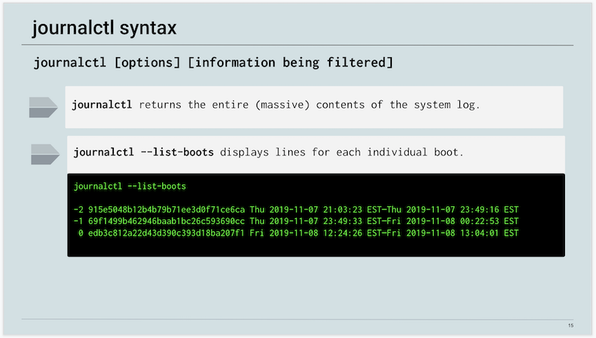
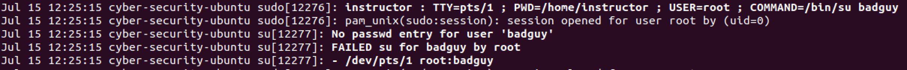

## 5.3 Student Guide: Sysadmin Essentials: Monitoring Log Files

### Overview

Today’s lesson introduces students to Linux log management. Students will reprise their role as a junior administrator tasked with ensuring network integrity with proper log management.

Students will perform log file management tasks and trace a series of historical events to establish whether or not a breach has occurred. Students will audit logs that provide critical insight into an attacker’s tactics, techniques, and procedures.

To investigate suspicious network activity, students will learn how to manage log size, and enable, troubleshoot, monitor, and audit logs using `journalctl`, `logrotate`, and `auditd`.


### Learning Objectives

By the end of class, students will be able to:

-  Filter `cron` and `boot` log messages using `journalctl`.

-  Perform log size management using `logrotate`.

-  Install and configure audit rules using `auditd`, and write audit logs to disk.


### Lab Environment

You will use your local Vagrant virtual machine for today's activities. 

  - Username:`sysadmin`
  - Password: `cybersecurity`

### Slideshow 

The slides for today can be viewed on Google Drive here: [5.3 Slides](https://docs.google.com/presentation/d/1C2b5IOjY6vo30h-MN6pSC2EV4xpj8ExlAyY8ccCnQHc)

---

### 01. Instructor Do: Overview of Log Filtering (0:20)


In today's lesson, we will continue our overview of logging and dive deeper into the security implications of log management.

- In the last class we covered how to write basic scripts that use `cron` to automate and schedule tasks like backups, updates, and cleanups.

- Today we will learn how to manage log size, and enable, troubleshoot, monitor, and audit logs using `journalctl`, `logrotate`, and `auditd`.

By now, we should be aware of the value that logs provide to an organization's technical and security teams:

- They offer an enormous amount of detail on a network, including security, server performance, system errors, and any underlying system issues.

- Logs contain valuable data, such as PII, that must be protected.

The importance of these resources means they require **proper log management practices**. These include:  

- Ensuring that changes in logs are documented.

- Storing logs for a sufficient amount of time for archival purposes.

- Omitting the right amount of data from logs, to avoid irrelevant or gratuitous data.

Note the direct security implication of log management:

- When we properly managed our logs, we are able to analyze and review them quickly, in order to rapidly pinpoint security threats, regulatory violations, and fraudulent activity. We can identify:

So, what does a log management workflow look like?

Throughout the class, we will cover the following steps and tools used by system administrators to manage logs:

1. **Investigate an issue.** For example, applying log filters during log reviews to scope out past or current events. A log filter is a tool used to extract specific information from a log file.  

2. **Size management.** Creating a log size management system that rotates logs to preserve log entries and keep log file sizes manageable. Log rotation is the process of closing, dating, and moving logs to another location, and replacing them with new, empty files that are ready to receive new data.

3. **Audit.** Installing and configuring a log system that audits system file changes and records those changes to disk as audit records.

#### Overview of Logs

Linux stores all log files in a centralized repository located in the `/var/log` directory.  

Depending on the situation, logs generally contain information about a specific situation or activity. For example:

- Information related to authentication events is logged in `/var/log/auth.log`.
  - Use to detect failed login attempts.
  - Use to detect other vulnerabilities related to user authorization mechanism and brute force attacks.

- Information related to cron jobs is recorded in `/var/log/cron.log`.
  - When a cron jobs runs, information is recorded about successful execution of applications, and application errors or failures.
  - Most useful for checking error messages when a cron job fails.

Log directories can typically be grouped into four categories:

- **Application logs:** Store alerts generated by software as it's being used by the user. This includes when it's launched, how long it's in use, when it's closed, etc.

- **Event logs:** Contain information regarding security related events. For instance, when a user successfully or unsuccessfully logs onto a host, or when a user tries to install unauthorized software.

- **Service logs:** Contain information related to system services such as cron jobs and print jobs.

- **System logs:** Contain information regarding system events such as boot messages, kernel errors, or anything related to the system hardware.

All of this information can grow to unmanageable sizes. Wasting time sifting through massive logs can slow down incident and recovery efforts.

- For example, a security administrator might have to scan through massive logs to find out why a particular host on the network experienced an unscheduled reboot.

There is a tool called `journalctl` designed to filter through enormous system logs to return results of very specific search criteria.

- Before we look at `journalctl`, lets take a quick look at the daemons and journals responsible for keeping track of all this system information:

`systemd` is a daemon responsible for logging system-wide events, as well as providing to other tools the information they need to help with common system administrative tasks.

- A `daemon` is a computer application that operates as a background process and is not directly controlled by a user.

Since `systemd` does not provide a reader-friendly display of log information, `journald` collects and stores this log information in a structured, indexed format.

- Since `journald` works in tandem with `systemd`, `journald` is often referred to as `systemd-journald`.

- `journalctl` allows us to access the `systemd-journald` journal and filter out desired information.

#### journalctl

In this section, we will cover the syntax for filtering through log files.

Launch an instance of Ubuntu in your VM environment.

- Run `journalctl`

  - This command will return the entire contents of the system log.

  - Using the space bar to page through the file, display the results and emphasize how massive this log is.

  - Without using log filters, it could take all day to extract the required information needed.



`journalctl` uses the following format:

- `journalctl [options] [information being filtered]`

Let's look at the first option: `journalctl --list-boots`

  - `--list-boots` is used to display lines for each individual boot.

  - Sample output (also depicted in the slides):

    ```bash
    -2 915e5048b12b4b79b71ee3d0f71ce6ca Thu 2019-11-07 21:03:23 EST—Thu 2019-11-07 23:49:16 EST
    -1 69f1499b462946baab1bc26c593690cc Thu 2019-11-07 23:49:33 EST—Fri 2019-11-08 00:22:53 EST
    0 edb3c812a22d43d390c393d18ba207f1 Fri 2019-11-08 12:24:26 EST—Fri 2019-11-08 13:04:01 EST
    ```

    - The time and date information are revealed at the end of each record.

    - This information can establish a timeline of events to assist with an incident response and investigation.

    - All boot-related information is stored in a log file called `boot.log`, which is located in the `/var/log/` directory.

    - `/var/log/boot.log` is a repository where all boot-related messages are logged during the system boot process.

  - This filter is commonly used to:

    - Investigate boot failures or unplanned shutdowns.

    - Determine the amount of time a system has been down due to unsuspected shutdown.

`journalctl -ef`
  - `-e`: Displays the **end** of the journal 
  - `-f`: **Follow mode** keeps the journal screen open, displaying real-time messages in order of occurrence.
 
`journalctl _UID`
 
- You can view **systemd-journald** logs for a user by using `_UID=`. This command option will display journal data for the mapped user.
 
- You can see a list of user IDs by running `cat /etc/passwd`.
 
`journalctl` provides a vast array of command options. Students can download this PDF to learn some of the most popular commands:
 
- [How to Use journalctl to Read Linux System Logs](../resources/How_to_Use_journalctl.pdf)

#### `journalctl` Demo Setup
 
We'll demonstrate how to use the `journalctl` command with the following scenario:
 
- The IT administrator recommended that you enable **log persistence** due to a huge loss of log data that resulted from this unplanned system reboot and improper shutdown.
 
 - Log persistence is the process of saving system logs across reboots to ensure they are not lost.
 
- In this demonstration, we'll also show how to use `journalctl` to identify suspicious activity, such as malicious user account creation and unauthorized login attempts.
 
#### `journalctl` Demonstration
 
1. The first thing we should do is enable log persistence, which ensures that system logs are saved across reboots.
 
   - In order to persist logs, the `Storage` line in the `/etc/systemd/journald.conf` file will need to be uncommented and its value will need to be set to `Storage=auto`.
 
   - These settings are defined in `/etc/systemd/journald.conf`.
 
   - Run: `sudo nano /etc/systemd/journald.conf`
 
      ```bash
      #  This file is part of systemd.
      #
      #  systemd is free software; you can redistribute it and/or modify it
      #  under the terms of the GNU Lesser General Public License as published by
      #  the Free Software Foundation; either version 2.1 of the License, or
      #  (at your option) any later version.
      #
      # Entries in this file show the compile time defaults.
      # You can change settings by editing this file.
      # Defaults can be restored by simply deleting this file.
      #
      # See journald.conf(5) for details.
  
      [Journal]
      #Storage=auto
      #Compress=yes
      ```
 
      - `Storage=` is the persistence setting.
 
       - `auto` indicates logging persistence if space is available.
 
      - Uncomment the `Storage=auto` and save the file.
 
   - Whenever the `journal.conf` file is modified, `systemd-journald` needs to be restarted before the changes take effect.
 
   - Run: `sudo systemctl restart systemd-journald`
 
   -  Log persistence is now enabled.
 
2. Next, we'll observe and interpret real-time journal messages. We'll assume the role of an attacker that breached a user account with admin privileges and then attempted lateral movement through the system.
 
   - For this part of the demo, you will need to open two terminal windows: 
     - **Terminal #1** for our real-time journal monitoring.
     - **Terminal #2** to perform malicious activity.
 
  - **Terminal #1**

    - Run: `journalctl -ef`

 
  - **Terminal #2**

    - Now open the 2nd terminal and attempt to switch to a non-existent user.

    - Run: `sudo su badguy`
 
    - Enter any random password. It will fail, as expected since this user doesn't exist.
 
  - **Terminal #1**
 
    - Observe the results of the journal messages.
 
    - We should be able to see the failed login attempt. This journal message is an example of the kinds of suspicious activities we would look for. In this case, the failed login attempt sticks out like a sore thumb and is cause for further investigation.
 
      
 
    - Malicious hackers will try and leverage breached administrator accounts to create new user accounts.
 
    - This provides the malicious hackers with persistence because they will have the capability to log into the system at any point in the future using the fake user account that they created.
 
3. We can also display `journalctl` messages based on a user `ID`. This is useful when researching any suspicious users IDs on the system.
  
   - **Terminal #2**
    
     - First, let's see which users IDs exist on the system:

     - Run: `cat /etc/passwd`
 
       - For this example, we'll used the **asgard** user.
 
     - Then, let's look at journal data for the user as follows:
 
       - Run: `journalctl _UID=1010`
 
     - Note that we can see journal data related to the **asgard** user. Specifically we see basic logon and logoff information, nothing special, in this case.
 
     - Examples of malicious activity we want to be aware of are the creation of malicious user’s accounts and unauthorized login attempts.


#### Demo Summary
 
Summarize this demonstration by reviewing the following concepts:
 
- `journalctl` queries the `systemd` journal.
 
- Edit `/etc/systemd/journald.conf` to establish persistent storage.
 
- `-ef` displays jump to the **end** of the journal `-e` and uses **follow mode** `-f` which keeps the journal screen open, which displays real-time messages in order of occurrence.
 
- `_UID=` display journal data for specific users.
 
Knowing how to manage logs using `journalctl` is a crucial skill for security administrators.
 
- While this was a basic introduction to `journaltcl` and `systemd`, these skills are very useful when administering Linux systems.
 
### 02. Log Filtering Activity

- [Activity File: Log Filtering](./Activities/03_Log_Filtering/Unsolved/README.md)

### 03. Review Log Filtering 

- [Solution Guide: Log Filtering](./Activities/03_Log_Filtering/Solved/README.md)
 

### 04. Log Size Management 

Next, we'll continue covering tools of proper log management by learning how to manage log file size.

The purpose of log files is to preserve information regarding system events for a fixed period of time. Unfortunately, logging daemons do not provide a way to control the size of log files.

- If left unchecked, log file sizes can grow to unmanageable sizes that potentially consume all available space on a disk.

- As an example, imagine that your senior security administrator asked to you check the system logs for any possible sign of a breach. Now, imagine that the server has been logging data non-stop since the system started running two and a half years ago.

- Querying a log file with that much data would be daunting, because the server would need to read through massive log directories. This not only wastes large amounts of system resources, but also time.

For this reason, security professionals use a method called **log rotation**. In this lesson, we'll use a software tool called **logrotate**.

- Logrotate is an application that administratively manages the size of log files to keep them small and manageable.

Some of the benefits to using log rotation:

- Scheduling the creation of new log files.
- Compressing log files in order to save hard drive space.
- Executing commands prior to or after a log is rotated.
- Time stamping old logs and renaming them during rotation.
- Log file archive pruning maintains only a certain number of backlogs.
- Smaller archives mean faster transfer times.

Logs are rotated based on a schedule. With logrotate, when a specific threshold is reached, the current log is closed, saved, dated, and rotated out. At this point, a brand new, empty log file is opened and it starts recording new journal messages, known as log data.

#### Logrotate Configuration file

`logrotate` works through a series of configuration files that indicates the log files to rotate and the specific parameters to apply to those files.

- The main configuration file `/etc/logrotate.conf` contains default options and parameter that logrotate will use. It also indicates the specific files that these default parameters apply to.  

- Some applications will require unique configurations that do not fit the default parameters found within `/etc/logrotate.conf`. Those files are handled in other configuration files, which we will look at in the upcoming demo. 

Display the following contents of a typical `/etc/logrotate.conf` file. Output may vary slightly from the Vagrant machine. 

```bash
# see "man logrotate" for details

# rotate log files weekly
weekly

# keep 4 weeks worth of backlogs
rotate 4

# create new (empty) log files after rotating old ones
create

# use date as a suffix of the rotated file
#dateext

# uncomment this if you want your log files compressed
#compress

# packages drop log rotation information for this directory
include /etc/logrotate.d

# system-specific logs may also be configured here. 
```

  - `weekly`: Rotate out existing logs every week

  - `rotate 4`: The number of rotations before a log is removed or emailed.

  - `create`: Create new (empty) log files after rotating old ones

  - `#datext`: Will add date to end of rotated log

  - `#compress`: Uncomment this to compress rotated log. 

We'll take a look at `# packages drop log rotation information for this directory` and the `/etc/logrotate.d` directory in the upcoming demo. 


#### `logrotate` Demo Setup

We'll use the following scenario to demonstrate logrotate. 

- The IT administrator informed us that it took over six hours to transfer mail log files to a remote server.

- This transfer occurs every four years. Over this time, the logs grow to unmanageable sizes.

- The IT administrator asked that we implement a log size management process for `mail.log` that will:

     - Keep eight weeks of backlogs.
     - Rotate logs daily.
     - Create new empty logs after rotating out the old ones.
     - Not rotate empty logs.

To complete this task, we need to carry out the following steps: 

- List the directories in `logrotate.d` to display the configuration files for installed applications. 

	- If the config file exists, we can edit it.

  - If the config file doesn't exist, we need to add a configuration file to `/etc/logrotate.d`.

- Use nano to create a file called `mail` that sets up the following logrotate configurations: 

	- Use the `rotate` setting to keep the most recent eight weeks of backlogs.
	- Use the `create` setting to create a new log every time the old log is rotated.
	- Use the `notifempty` setting to not rotate empty logs.

- Test the configuration changes by performing a manual test rotation.

#### Logrotate Demo

For this demo, launch an instance of Ubuntu using your VM environment and run the following commands:

1. First, let's verify that we have the most up to date version of Logrotate installed.

    - Run `sudo apt install logrotate`

      ```bash
      [sudo] password for sysadmin:
      Reading package lists... Done
      Building dependency tree
      Reading state information... Done
      logrotate is already the newest version (3.11.0-0.1ubuntu).
      ...
      ...
      ```
- **Note:** Your version may slightly differ. 

2. Take a look at the main configuration file `/etc/logrotate.conf`. 

    - Run `cat /etc/logrotate.conf`

     Explain that this file is the main configuration file that applies default parameters and options to the logs that are rotated. 

    - Display the logrotate.conf to class and then draw focus to the following line: 

      ```bash
      # packages drop log rotation information into this directory
      include /etc/logrotate.d
      ```  
    - Explain that this section introduces a directory of other logrotate configuration files for specific applications. 

3.  `/etc/logrotate.d` is a directory that contains application specific configuration files. These configurations will vary from the default configurations found in `/etc/logrotate.conf`.  

    - Run the following command to display an example output of the `/etc/logrotate.d` directory.

      - `ls -l /etc/logrotate.d`

      Output will resemble: 

      ```bash
      total 60
      -rw-r--r-- 1 root root 120 Nov  2  2017 alternatives
      -rw-r--r-- 1 root root 442 Jul 16  2019 apache2
      -rw-r--r-- 1 root root 126 Nov 20  2017 apport
      -rw-r--r-- 1 root root 173 Apr 20  2018 apt
      -rw-r--r-- 1 root root  79 Jan 16  2018 aptitude
      -rw-r--r-- 1 root root 181 Mar 27  2018 cups-daemon
      -rw-r--r-- 1 root root 112 Nov  2  2017 dpkg
      -rw-r--r-- 1 root root 329 Apr  6  2018 nginx
      -rw-r--r-- 1 root root  94 Feb 26  2018 ppp
      -rw-r--r-- 1 root root 501 Jan 14  2018 rsyslog
      -rw-r--r-- 1 root root 819 Mar 29  2019 samba
      -rw-r--r-- 1 root root 533 Dec 15  2017 speech-dispatcher
      -rw-r--r-- 1 root root 178 Aug 15  2017 ufw
      -rw-r--r-- 1 root root 235 Apr 29  2019 unattended-upgrades
      -rw-r--r-- 1 root root 126 May  7  2014 vsftpd
      ```

    - In this output, we can a list of the applications that logrotate has specific configurations for. 
    

4. After browsing the contents of the `/etc/logrotate.d`, note that a configuration file for mail does not exist. Therefore, we will need to create a configuration file and add the specific parameters requested by the IT administration. 

   - Within `/etc/logrotate.d`, run `nano mail` to create a new configuration file. 

   - Within `mail`, add the following:

      ```bash
      /var/log/mail.log {
          rotate 56
          daily
          notifempty
          endscript
      }
      ```

    - Configuration breakdown:

      - `/var/log/mail.log` creates the log and directory where the log file will be located.
      - `rotate 56` keep eight weeks of backlogs.
      - `daily`rotate logs daily.
      - `notifempty` indicates not to rotate empty logs.

   - Exit out and save the file. 

   -  `/etc/logrotate.conf` includes a line stating: 

      `# system-specific logs may also be configured here. `

      - Technically, we could have added the contents of the mail configuration file directly in the `logrotate.conf` file. 

      - However, it is best practice to create separate logrotate files for each configuration and place them all within the `logrotate.d` directory.

5. Rather than waiting a day or week to find out if our configurations work, we can force a rotation by running the following command:

   - `sudo logrotate -vf /etc/logrotate.conf`

     Syntax breakdown:

      - `logrotate` is the application that will be executed.
      - `-v` will display a verbose output.
      - `-f` will "force" the action to occur outside of its regularly scheduled cron job.
      - `/etc/logrotate.conf` is the configuration file containing the specifications of the logs to be rotated./

   - We can check `logrotate.conf` and not `logrotate.d` because we have the following line uncommented in `logrotate.conf`:

      ```bash
      # packages drop log rotation information into this directory
      include /etc/logrotate.d
      ```
      - This means that when we run `logrotate.conf`, it will also run all the files within `logrotate.d`.

     The output will resemble the following, indicating that the configuration was a success:

      ```bash
      reading config file /etc/logrotate.conf
      including /etc/logrotate.d
      reading config file alternatives
      reading config file apport
      reading config file apt
      reading config file cups-daemon
      .
      .
      Reading state from file: /var/lib/logrotate/status
      Allocating hash table for state file, size 64 entries
      Creating new state
      .
      .
      Handling 16 logs

      rotating pattern: /var/log/alternatives.log  forced from command line (12 rotations)
      empty log files are not rotated, old logs are removed
      switching euid to 0 and egid to 106
      error: error switching euid to 0 and egid to 106: Operation not permitted

      rotating pattern: /var/log/apport.log  forced from command line (7 rotations)
      empty log files are not rotated, old logs are removed
      switching euid to 0 and egid to 106
      error: error switching euid to 0 and egid to 106: Operation not permitted
      .
      .
      rotating pattern: /var/log/mail.info
      /var/log/mail.warn
      /var/log/mail.err
      /var/log/mail.log
      /var/log/daemon.log
      /var/log/kern.log
      /var/log/auth.log
      /var/log/user.log
      /var/log/lpr.log
      /var/log/cron.log
      /var/log/debug
      /var/log/messages
        forced from command line (4 rotations)
      empty log files are not rotated, old logs are removed
      switching euid to 0 and egid to 106
      error: error switching euid to 0 and egid to 106: Operation not permitted
      ```

#### Demo Summary

Log rotation is a process by which logs are rotated on a regular basis. It is executed with the application logrotate. During this process, files can be renamed, deleted, or compressed to save space on the hard drive’s partition.

The steps that we needed to complete were:

- Use `ls -l /etc/logrotate.d` to perform a directory listing.

- Create a configuration file within `/etc/logrotate.d`.

- Use `sudo logrotate -vf /etc/logrotate.conf` to force an unscheduled log rotation and confirm our configurations were successful.

### 05. Log Size Management Activity 


- [Activity File: Log Size Management](./Activities/05_Log_Size_Management.md/Unsolved/README.md)


### 06. Log Size Management Review


- [Solution Guide: Log Size Management](./Activities/05_Log_Size_Management.md/Solved/README.md)


### 07. Log Auditing

So far, we've covered the following log management tools:

- `journalctl`: Filters through massive logs by narrowing search results to specific search criteria.

- `logrotate`: Manages log file sizes to make log management easier by saving disk space and decreasing file transfer times.

While these tools are incredibly useful, they lack an important feature vital to a sufficient log management ecosystem. 

In this section, we will perform **log audits** to track violations on a system and create log rules for nearly every action taking place on a server or host.

Suppose the following scenario:

- An organization experienced a breach. Although the organization knows it's been breached, it doesn't have a way of knowing what changes the attackers made to the system.

- This information would be beneficial to not only discovering the tactics, techniques, and procedures used by the attackers, but also to providing crucial details for incident and recovery efforts.

- `auditd` provides limited capability to view modifications made to a system. It will not show every single detail of changes made to a system, but it does provide very useful information to aid incident and recovery efforts.

Q Linux auditing system is an excellent way for sysadmins to create log rules for nearly every action on a data center server or user host. Using this system allows you to track and record events, and detect abuse or unauthorized activity, through log files.

#### `auditd` Overview

`auditd` is a subsystem, in that it works at the **kernel** level. This means that `auditd` has the capability to watch every **system call** an application makes to the core of the operating system.

- A **kernel** is the core component of any operating system that’s responsible for managing system memory, processes, task, and disk management. Essentially, the **kernel** links all system hardware to the application software. It can be thought of as the glue that binds software to hardware.

- A **system call** is when any software or application installed within an operating system makes a request for system resources.

Since `auditd` has such tight integration with the system kernel, it has the capability to look at any system operation and monitor all activity, such as all network traffic and file system access.

The `auditd` daemon allows you to choose which actions on the server to monitor (as opposed to monitoring everything) and does not interfere with standard logging tools, such as `syslog`.

One caveat to `auditd` is that it does not actually add any additional security to your system. Instead, it provides the ability to keep track of violations that have already occurred on a system, allowing you to take action.

Once an event is written to disk, reporting tools such as `ausearch`, `aureport`, and `aulast` are used to generate reports.

- `ausearch` is a tool designed to query `auditd` daemon logs based on different search criteria for event-driven log records.

- `aureport` is a program that summarizes various types of events.

- `auditctl` is responsible for configuring the `auditd` system. It has the capability to enable or disable `auditd` systems, load and list rules, and generate status reports.

#### `auditd` Demo setup

We'll use the following scenario to demonstrate `auditd`.

- The IT security manager informed you that there was a breach and the system has alerted that several logs have been deleted. They believe the attackers are attempting to clear their tracks.

- The security manager believes that the attackers may have created new user accounts that would provide them with persistent access to the network.

- You’ve been asked to find details on any new user account creations to gather insight into the attacker's end goals.

Uncovering details on any new user accounts requires completing the following tasks:

- Edit `/etc/audit/auditd.conf` and specify the following:
	- Log file Location for `auditd.log`.
	- Retain no more than 50 logs.
	- Maximum log file size of 100.
- Use `auditctl -l` to see if any rules exist.
- Edit ` /etc/audit/rules.d/audit.rules` and specify files to monitor.
- Use ` auditctl –l` to verify the new rules exist.
- Use ` systemctl restart auditd` to restart the `auditd` daemon for changes to take effect.
- Use ` auditctl –w` as an alternative way to add a new rule.
- Use `auditctl –l` to verify the new rule was added.
- Use ` aureport –au` to perform log search for user authentications.
- Use ` aureport –m` to search for account modifications.

#### `auditd` Demo

Launch an instance of Ubuntu using your VM environment.

1. We need to install `auditd`. We'll use the `apt` package manager.

    - Run `sudo apt install auditd -y`

    - This command will install the package without any prompts.

2. After the installation completes, we will need to verify that the `auditd` service is active using the `systemctl`. 

    - Run `systemctl status auditd`

      - `systemctl` is the command used to query the system.
      - `status` specifies which query type will be made to the system.
      - `auditd ` is the service type that will be queried.

   - The output will look similar to below:

      ```bash
      ● auditd.service - Security Auditing Service
        Loaded: loaded (/lib/systemd/system/auditd.service; enabled; vendor preset: enabled)
        Active: active (running) since Sun 2019-10-27 15:01:58 PDT; 2min 27s ago
          Docs: man:auditd(8)
                https://github.com/linux-audit/audit-documentation
        Main PID: 5150 (auditd)
        Tasks: 2 (limit: 2290)
        Group: /system.slice/auditd.service
                └─5150 /sbin/auditd
      ```

   - In this output, we can see that `auditd` is active and running. We can also see how long the service has been up and running (2 minutes, 27 seconds).

3. Now, we will need to edit the configuration file to add our settings.

   - `root` user privileges are required to configure the `/etc/audit/audit.conf` file.

   - Run `sudo nano /etc/audit/auditd.conf`

   - The output should resemble:

     ```bash
     #
     # This file controls the configuration of the audit daemon
     #

     local_events = yes
     write_logs = yes
     log_file = /var/log/audit/audit.log
     log_group = adm
     log_format = RAW
     flush = INCREMENTAL_ASYNC
     freq = 50
     max_log_file = 8
     num_logs = 5
     priority_boost = 4
     ```

     - `log_file` specifies the full path name to the log file where audit records will be stored. It must be a regular file.

     - `max_log_file` specifies the maximum file size in megabytes. When this limit is reached, it will trigger a configurable action. The value given must be numeric.

     - `num_logs` specifies the number of log files to keep if `rotate` is given as the `max_log_file_action`. If the number is less than two, logs are not rotated. This number must be 99 or less. The default is zero, which means no rotation.

4. It's best practice to verify if there are any rules that currently exist before making changes or additions to the system.

   - Run: `sudo auditctl -l` to list any exsisting rules. 

   - Output should display no existing rules:

      ```bash
      No rules
      ```

   - We can see that we are starting with a clean slate. Let's add some configurations.

5. We'll create a rule that will monitor both `/etc/passwd` and `/etc/shadow` for any modifications or deletions.

   - We need to edit the `/etc/audit/rules.d/audit.rules` configuration file.

   - Run: `sudo nano /etc/audit/rules.d/audit.rules`

   - Now we need to scroll to the bottom of the configuration and add the following two lines:

      ```bash
      -w /etc/shadow -p wa -k shadow
      -w /etc/passwd -p wa -k passwd
      ```

        - `-w` specifies that the object at the following path will be watched.
        - `/etc/shadow` and `/etc/passwd` are the directories to act upon.
        - `-p` precedes the permissions to monitor.
        - `w` is the write permission.
        - `a` specifies a change in the file's attribute, either ownership or permissions.
        - `-k` is the keyname for the rule.
        - `shadow` and `passwd` are the files acted upon, i.e. those to be monitored.

6. The `auditd` daemon must be restarted prior to any changes taking effect.

   - We need to edit the `/etc/audit/rules.d/audit.rules` configuration file.

   - Run: `sudo systemctl restart auditd`

7. Since we've restarted the `auditd` daemon, we can now run `auditctl` to verify that our rules have taken effect.

   - We need to edit the `/etc/audit/rules.d/audit.rules` configuration file.

   - Run: `sudo auditctl -l`

   - The configuration should resemble the following: 

      ```bash
      -w /etc/shadow -p wa -k shadow
      -w /etc/passwd -p wa -k passwd
      ```

   - We can see that our rules have indeed taken affect. Now, whenever `/etc/shadow` or `/etc/passwd` are modified or deleted, the action will be recorded and logged.

8. PThere are alternative ways to add rules to `auditd` by using the `auditctl` command without editing `/etc/audit/rules.d/audit.rules` directly.

   - We don’t need to edit the `/etc/audit/rules.d/audit.rules` configuration file.

   - Run: `sudo auditctl -w /home/sysadmin/Music/`
      - `sudo` is the command used to change into `root` user privilege level.
      - `auditctl` is the `auditd` daemon service control request.
      - `-w ` specifies that the object at the following path will be watched.
      - `/home/sysadmin/Music/` the specified path to watch (monitor).

    - **Note:** Notice how we didn't specify permission levels. 
      
    - **Note:** This method will not persist rules across service restart. If auditd is restarted, any rules added this way will be lost.

9. Let's verify that the new rule took effect.

   - Run `sudo auditctl -l`

   - Notice the new entry at the bottom as seen in the output below:

      ```bash
      -w /etc/shadow -p wa -k shadow
      -w /etc/passwd -p wa -k passwd
      -w /home/sysadmin/Music/ -p rwxa
      ```
        - `-w`: specifies that the object at the following path will be watched.
        - `/home/student/Music/`: is the directory to act upon.
        - `-p`: precedes the permissions to monitor.
        - `r`: the permission to read.
        - `w`: the permission to write.
        - `x`: the permission to execute.
        - `a`: specifies a change in the file's attribute (either ownership or permissions).

   - **Note:** The permissions of `-p rwxa` are the default unless otherwise specified.

10. We can generate a report on successful and failed authentication attempts using the `-au` option.

    - Run the following to generate logs for the report:

        - `su sysadmin` (password: `cybersecurity`)  
        - `sudo useradd criminal`  
        - `exit`  

    - We will intentionally enter the wrong password to generate a log in our authentication report.

      - `su sysadmin` (password: `password`)

    - Then, run: `sudo aureport -au`
        - ` aureport`: the tool that produces summary reports from the `auditd1` daemon.
        - `-au`: the report on authentication attempts.

    - The report should resemble the following:

       ```bash
        Authentication Report
        ============================================
        # date time acct host term exe success event
        ============================================
        1. 12/06/2019 11:23:29 instructor ? /dev/pts/0 /usr/bin/sudo yes 136
        2. 12/06/2019 11:25:16 sysadmin ? /dev/pts/0 /bin/su yes 148
        3. 12/06/2019 11:25:27 sysadmin ? /dev/pts/0 /bin/su yes 161
        4. 12/06/2019 11:25:36 sysadmin ? /dev/pts/0 /bin/su no 172
       ```
        - `acct`: The user account used during authentication.
        - `host`: The hostname that originated the login.
        - `term`: Can be one of the following:
          - `pts`: Login device used when connecting through the network or a console (e.g., SSH).
          - `tty`: Serial or console connections (text mode).
          - `:0` (`local:display #0`): X11 server, used for graphical login (e.g., GDM).

11. We can also produce `auditd` reports using the `-m` option, which searches for modifications only.

   - Run: `sudo aureport -m`
      - ` aureport`: produces summary reports from the `auditd1` daemon.
      - `-m`: option that creates a report on only account modifications.

   - Output will look similar to below:

      ```bash
      Account Modifications Report
      =================================================
      # date time auid addr term exe acct success event
      =================================================
      1. 12/06/2019 11:30:59 1001 ubuntu-vm pts/0 /usr/sbin/useradd criminal yes 203
      2. 12/06/2019 11:30:59 1001 ubuntu-vm pts/0 /usr/sbin/useradd ? yes 204
      ```

   - The modification report reflects that the `useradd` command was used to create a user called `criminal`.

   - Here we have proof that an attacker created an unauthorized account in an attempt to establish a backdoor.

#### Demo Summary

`auditd` is a great way for IT security administrators to create a log rule for nearly every action on a data center server or user host. With `auditd`, you can track and record events and even detect abuse or unauthorized activity, in addition to creating custom reports.

Completing this demo required the following steps: 

- Edit `/etc/audit/auditd/auditd.conf` and specify the following:
	- Log file location for `auditd.log`.
	- Retain no more than 50 logs.
	- Maximum log file size of 100.
- Use `auditctl -l` to see if any rules existed.
- Edit ` /etc/audit/rules.d/audit.rules` and add files to be monitored.
- Use ` auditctl –l` to verify the new rules existed.
- Use ` systemctl restart auditd` to restart the `auditd` daemon for changes to take effect.
- Use ` auditctl –w` as an alternative way to add a new rule.
- Use `auditctl –l` to verify the new rule was added.
- Use ` aureport –au` to perform log search for user authentications.
- Use ` aureport –m` to search for account modifications.


### 08. Event Monitor Log Activity 

- [Activity File: Event Monitor Logging](./Activities/09_Event_Monitor_Logging/Unsolved/README.md)

### 09. Review Event Monitor Log 

- [Solution Guide: Event Monitor Logging](./Activities/09_Event_Monitor_Logging/Solved/README.md)


-------

© 2020 Trilogy Education Services, a 2U, Inc. brand. All Rights Reserved.
