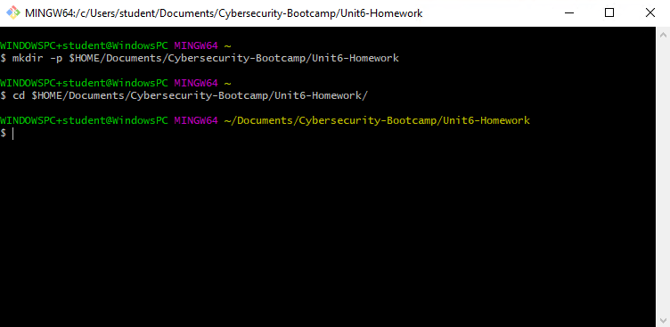
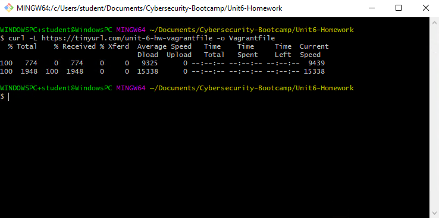
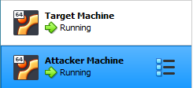
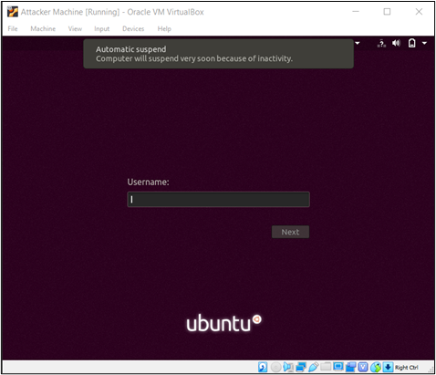

## Week 6 Homework: Advanced Bash - Owning the System
### Overview
Congratulations! You've made it to the end of the Linux module.

Over the past few weeks, you've played the role of a systems administrator responsible for diagnosing, securing, and automating the hardening of a compromised Linux host. In doing so, you've explored all of the following, and more:

- The structure of the Linux file system.
- Processes and how to inspect them.
- Creating users and groups and editing their permissions.
- Scheduling regular jobs with `cron`.
- Logging, monitoring, and log analysis.
- Automating common tasks with bash scripts, compound commands, and other advanced features of the shell.

Getting this far is a real accomplishment. This is a huge amount of information, all of which is used by professional systems administrators almost every day.

### Scenario

In this week's homework you will play the role of a hacker. You will remotely access a victim's target machine, maintain access using a backdoor, and crack sensitive passwords in the `/etc` directory.

You will be learning a lot of new concepts in this homework, and you may need to do a bit of research. This homework should be a fun, engaging hands-on introduction to maintaining access to a compromised system. You will learn about this in more depth during the pentesting units. For now, read the section below on Privilege Escalation to better understand the setup and goal of this assignment.

- **Note:** This activity is based on the "offense informs defense" philosophy. You will practice taking the role of a criminal hacker in order to better understand how exploits are carried out. Remember: to protect from attacks, you'll need to practice thinking like an attacker. 

#### Privilege Escalation

When an attacker gains access to a machine, their first objective is always to escalate privileges to `root` (which you accomplished during your scavenger hunt activity). When they achieve `root` privileges, they can do anything they want to the system. Cybersecurity professionals describe the process of gaining access to a host and escalating to `root` privileges as **owning the system**.

While owning a system is a crucial piece of the process, it is only the first item on an experienced attacker's agenda. Two goals remain on the checklist: **maintaining access** and **exfiltrating data**.

After exploiting a machine, attackers must ensure they will be able to reconnect later with the same escalated privileges they gained during the first assault. This is typically achieved by installing a **backdoor**. A backdoor is any mechanism that allows an attacker to secretly reconnect to a machine they've exploited.

### Lab Environment

You will use the Attacker Machine to carry out your activities on the Target Machine. If you are using the Vagrant local machine, follow the steps below. The machine which will simulate a remote machine (the attacker) on the internet that an attacker would use to hack into an organization's servers (the target).

Complete the following steps to set up your Vagrant local machine:

1. Ensure that you have VirtualBox and Vagrant installed on your local machine.

2. If your computer has limited resources, make sure you shut down other virtual machines, such as the Linux VM and linux-scavenger VM, as you'll be launching two new ones soon.

3. Move the [Vagrantfile](./Vagrantfile) located in this homework directory to your local machine. 

4. Open your terminal/Git Bash and run the following `mkdir` and `cd` commands to create a `Unit6-Homework` directory and navigate to it: 

    - `mkdir -p $HOME/Documents/Cybersecurity-Bootcamp/Unit6-Homework`

    - `cd $HOME/Documents/Cybersecurity-Bootcamp/Unit6-Homework`

        

   - Then use Windows File Explorer or MacOS Finder to move the Vagrantfile to the new directory OR use the following `curl` command within the newly created homework directory to download the Vagrantfile:
    
    - `curl -L https://tinyurl.com/unit-6-hw-vagrantfile -o Vagrantfile`

        

5. With your terminal/Git Bash still working out of the newly created homework directory, launch the lab by running `vagrant up`. Leave this terminal window open.

    - Note that after the machines are set up, you can shut them both down by running the command `vagrant halt`.
    
    - If you have any issues at this or any installation step, please reach out to your instructor or TA. This is most likely due to a `root` ownership error.

- Depending on your internet connection and your local machine, it may take a few minutes for Vagrant and VirtualBox to set up your machines.

- During this process, Vagrant is setting up two VirtualBox VMs and giving them static IP addresses for you to use during this homework.

6. After Vagrant is done setting up the machines, you should have a Target Machine and an Attacker Machine in your VirtualBox Manager window. Both should now be launched.

    

- You'll be using the Attacker Machine to remotely access the Target machine. The Attacker Machine window should automatically pop up once it's ready:

    

#### Access Setup 

Get started by logging into the target machine as `root`:

1. Load up your attacker machine and log in with the following credentials:

    - Username: `sysadmin`
    - Password: `cybersecurity`

2. Begin an SSH session into the target machine by doing the following:

   - Open a terminal on the attacker machine and run: `ssh sysadmin@192.168.6.105 -p 22`.

    This command will attempt to start an SSH session on your target machine.

    - Enter the password `passw0rd` when prompted.

3. After you've successfully logged into the `sysadmin` account on the target machine, you'll notice your prompt changes to `sysadmin:~\ $`.

    - Swap to the `root` user by entering `sudo -s` and reentering the password `passw0rd`.

You should now have the `root` prompt `root:~\ $` that you acquired during your scavenger hunt activity.

---

### Instructions

- **Important:** Please fill out the [Submission File](Submission.md) as you complete your homework. This will be your homework deliverable for the week.

Your goal for this assignment is to maintain access to the target machine by installing a backdoor. You will then use the backdoor to crack sensitive passwords.

To complete this assignment, you must complete the steps below. Again, some of these steps will require you to research new tools and concepts. Any information you might need can be found using man pages and online searches. Remember: learning new tools on the job is a key skill for IT and security roles.

#### Step 1: Shadow People

In this step, you'll create a "secret" user named `sysd`. Anyone examining `/etc/passwd` will assume this is a service account, but in fact, you'll be using it to reconnect to the target machine for further exploitation.  

1. Create a `sysd` user.

2. Give your user a password (make sure you remember it).

3. Give your user a system UID (any UID below 1000)
4. Give your user a GID equal to this UID
5. Give your user full `sudo` access without a password 
  
Minimize exposure by ensuring that your secret user does not have a home folder.

6. Test that your `sysd` user can execute commands with `sudo` access without a password before moving on.

    - Try running `sudo -l` to test. If the terminal does not prompt you for a password, it was a success. Attempt any other commands that require elevated privileges and mark them in your Submission File.

**Note**: If a hacker can rapidly execute commands on a machine with elevated privileges, they can more quickly exfiltrate important data from the target machine.

#### Step 2: Smooth Sailing

In this step, you'll allow SSH access via port `2222`. SSH usually runs on port `22`, but opening port `2222` will allow you to log in as your secret `sysd` user without connecting to the standard (and well-guarded) port `22`.

1. Use Nano to update the `/etc/ssh/sshd_config` configuration file to allow SSH access via port `2222`:

    - When you open the configuration file, add a secondary SSH port line under port `22`.

    - This will require some research. Start by examining `/etc/ssh/sshd_config` and using online searches or man pages to learn more about the available configuration options.

#### Step 3: Testing Your Configuration Update

When you think you've configured things properly, test your solution by testing the new backdoor SSH port. Do the following steps on the target machine:

1. First, note that the IP address of the target machine is `192.168.6.105`. You'll need this for when you attempt to log back into the target machine.

  - Make sure to restart the SSH service.

2. Exit the `root` account, and log off of the target machine (you'll know you're back in your attacker machine when the prompt turns green).

3. Use your attacking machine to test the new backdoor SSH port:

    - SSH back into the target machine as your `sysd` user, but this time change the port from `22` to `2222` using: `ssh sysd@192.168.6.105 -p 2222`.

4.  Once you are connected to the target machine over SSH, use `sudo su` to switch back to the `root` user.

- **Note**: This is an important step. You were able to log out of your `root` account, and then reestablish a remote session with escalated privileges through a different, un-guarded port.

  - Company servers that house sensitive information will often use monitoring and hardening tools to closely watch key ports, such as `22` for SSH.

  - It is also quite difficult for hackers, on their first breached connection, to know the locations of the most sensitive files in a system.

    - For this reason, hackers need to both attempt to mask their activity (as you are doing with your `sysd` user), and also ensure they can discreetly revisit a system. This allows them to maximize the amount they can take from the target machine.

#### Step 4: Crack All the Passwords

Next, to strengthen our control of this system, we will attempt to crack as many passwords as we can.

Having access to all the accounts will also allow us to access the system if our other backdoors are closed.

1. Make sure that you have SSH-ed into the target machine using your `sysd` account.

2. Escalate your privileges to the `root` user. Use John to crack the entire `/etc/shadow` file.

    - You will not need to transfer the file as John is already installed on the scavenger hunt VM.

**Note:** Cracking passwords is a process that takes time. Now might be a good opportunity to take a break and let the computer do the work for you.

### Submission Guidelines

- Please finish filling out the [Submission File](Submission.md) and submit it for homework when complete.

### Lab Clean Up

**Warning:** Only do the following once you have submitted your homework and do not have additional changes to the assignment. 

These steps are optional. Complete them if you want to remove the homework-specific Vagrant lab VMs to free up space on your personal computer.

1. Open the terminal window that you ran `vagrant up` in, or re-open a terminal window at the directory you saved your `Vagrantfile`.

2. Run `vagrant halt` to shut down the Target Machine and Attacker Machine virtual machines.

    - `vagrant` will attempt to gracefully shut down the machines.

3. After that has completed, run the command `vagrant destroy` and confirm removal of both virtual machines by typing `y`/`yes` and pressing Enter.

---
© 2020 Trilogy Education Services, a 2U, Inc. brand. All Rights Reserved.
