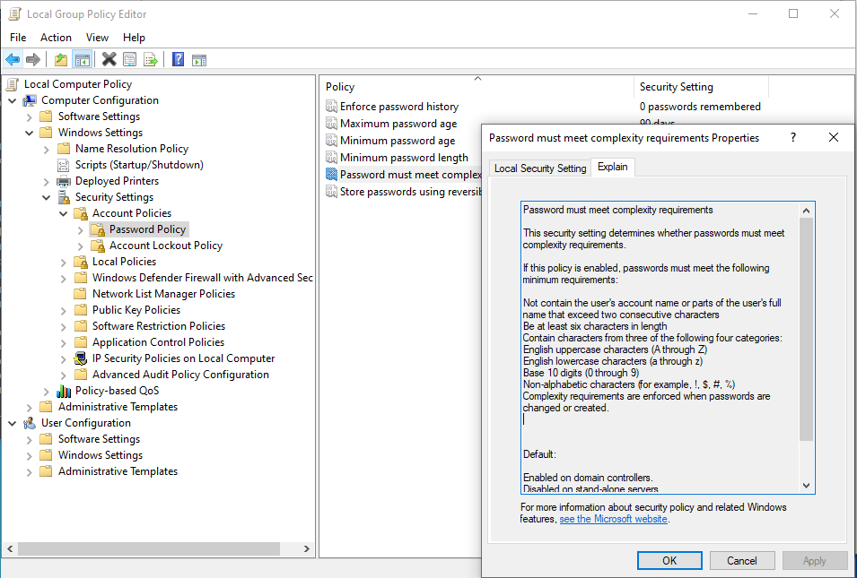
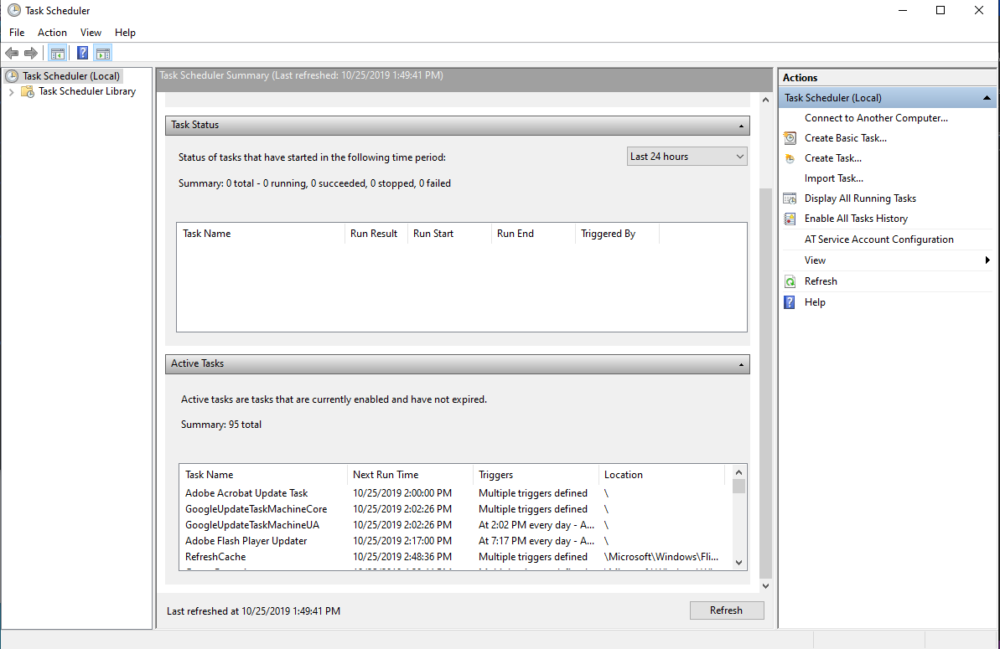
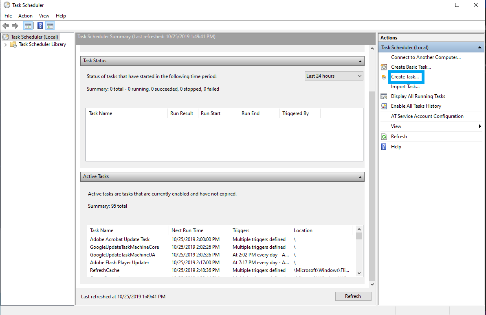

## 7.1 Student Guide: Introduction to Windows and CMD

### Class Overview

Today's class begins our unit on Windows administration and hardening. You will be introduced to the Windows operating system and command line by performing basic system administration tasks today. 

### Class Objectives

By the end of class, you will be able to:

- Leverage the Windows Command Prompt (CMD) to execute various sysadmin responsibilities. 
- Use `wmic` and Task Manager to manage applications and services.  
- Create, manage, and view user information using the command-line tool `net`.
- Manage password policies using `gpedit`.
- Optionally, schedule tasks using Task Scheduler.

### Lab Environment

<details><summary>Lab Details</summary>
<br>

In this unit, you will be using a new Windows lab environment located in Windows Azure Lab Services. RDP into the Windows RDP Host machine using the following credentials: 

  - Username: `azadmin`
  - Password: `p4ssw0rd*`

Open the Hyper-V Manager in the Windows RDP Host machine to access the nested virtual machines:

- Windows 10 machine
  - Username: `sysadmin`
  - Password: `cybersecurity`

- Windows Server machine
  - Username: `sysadmin`
  - Password: `p4ssw0rd*`

The instructor lectures, demonstrations, student activities and reviews will all be completed using the Windows RDP Host Machine. 

We won't need the nested Hyper-V virtual machines until the third day of this unit. 

#### Windows Lab Environment Guide

The following document contains a list of common Windows issues that may occur during this unit.  

- [Windows Lab Environment Guide](https://docs.google.com/document/d/18Mz12q82nhxkypVRdIVgIqsLeNG1oCQj_TPsFJ3RgGk/edit)

</details>

### Slideshow

- The slides for today can be viewed on Google Drive here: [7.1 Slides](https://docs.google.com/presentation/d/1vIHx3ooUnDLjX7_Ol_DOd-VSvm8aQZF8pKiB7CGWPE4/edit)


---

### 01. Introduction to Windows

Today's lesson will cover fundamental system administration of Windows.

- Do you use Windows machines at home? At work?

  - Note that while many IT professionals prefer Mac OS and Linux for their operating systems, Windows is still the market leader for desktop operating systems.

The widespread use of Windows for personal computers and workstations makes them the most common target for today's attackers. 

- Much of the malware that exists today specifically targets vulnerabilities in unpatched and unsecured Windows personal computers and servers.

- Therefore, as a cybersecurity professional, you will likely interact with Windows—whether it's the operating system you use daily, or as part of your company or client's infrastructure.

Understanding Windows is essential for the following IT and cybersecurity specializations:

- **SOC Analysis**: As an SOC (Security Operations Center) analyst, your familiarity with Windows will be tested almost every day. As part of your daily work, you may observe anywhere from one to several thousand security-related incidents and alerts dealing with Windows endpoints.

- **System Administration**: The large majority of system administrators work with one or more Microsoft products and/or services, including Windows PCs, Windows Servers, Office 365, and Exchange to name a few.

- **Penetration Testing**: Due to Windows workstations and servers being widely used in organizations and businesses, it is vital that penetration testers know how to exploit Windows and Microsoft-related products.

- **Endpoint Forensics**: Because the most commonly supported endpoint device in an organization is likely to be Windows, it is critical that forensics investigators have a detailed understanding of how Windows works. 

Today's activities and demonstrations will cover common system administration tasks using command-line and GUI tools to troubleshoot a problematic Windows PC. During this process, we will create a report with our findings.

We will complete the following tasks throughout the day:

- Audit processes with Task Manager.

- Use the command line to gather information and create files.

- Enforce password policies.

- Manage users.

- Automate tasks.

Today's Windows activities move quickly. You will be learning the "Windows way" of performing basic system administration tasks that you've already learned to do on Linux.

This gives you a substantial learning advantage. What is new today are the operating system and the syntax, not the concepts.

### 02. Launching Your Windows Lab

Use RDP to log into your Azure lab if you have not yet. 

  - Credentials for the Azure labs Windows RDP Host machine:
    - Username: `azadmin`
    - Password: `p4ssw0rd*`

### 03. Introduction to Task Manager

Did you notice the various processes that started up when you logged into the Windows RDP Host machine?

This Windows RDP Host machine has some applications installed on it (which will be dealt with in a few moments). To get started, we will need to close the startup application windows.

This is what a Windows workstation can look like if it's not maintained by an organization's system administrators.

- For any application or installer window that launches after booting the machine:

  - Select the application window in the bottom toolbar

  - click the top-right **X** in each window to close it.

  - Do not log into any of these applications

- The following is a list of the applications you should expect to see when booting up the lab:

  - The `Skype` launcher
  - The `Spotify` browser signup page
  - The `Spotify` login screen

We'll look at uninstalling these applications with a script on our second day of the unit.

Remember that during the Linux system administration lessons you learned how to enumerate and inspect running processes using `top`.

#### Introducing Task Manager

Today's first demonstration focuses on cleaning up these unnecessary processes with a Windows process management tool: **Task Manager**.

- Windows, like Linux, has the concept of errant/runaway processes.

- We need a way to inspect and troubleshoot process resource utilization in Windows.

- On Windows, we can use the Task Manager GUI to inspect and manage processes, instead of `top`'s CLI.

- Because of this, using Task Manager to manage processes is easier than using `top`.

- Task Manager also allows us to manage other important system components, such as startup processes.

Processes in Windows are much like the processes and PIDs that you worked with in the Linux units.

Some use cases for Task Manager include:

- Some programs, when left running while not in use, can take up excessive resources or even allow for unwanted remote connections. Some examples are:

  - Google Chrome, which is well-known for its high memory usage.

  - Teamviewer, the remote desktop application, has had critical issues that have left systems extremely vulnerable, and accessible from public connections.

- Some processes can cause memory leaks that result in system instability and abrupt system crashes. These crashes are commonly associated with the "blue screen of death."

  - The following URL can be used to learn more about Task Manager and its usage: [https://www.howtogeek.com/405806/windows-task-manager-the-complete-guide/](https://www.howtogeek.com/405806/windows-task-manager-the-complete-guide/)

Security professionals can also use Task Manager to audit processes to identify incorrect or malicious processes:

- For example, many cryptojacking processes, or cryptominers, use excessive CPU and/or network resources even while a system is idle.

#### Task Manager Overview

For this upcoming demo, we'll use Task Manager to identify resource bottlenecks and startup processes that are potential issues within our Windows RDP Host machine.

First, we'll walk through how to audit processes based on resource utilization. 

- Right-click on the taskbar at the bottom of the Windows desktop and choose **Task Manager**. Expand this window as needed.

- With Task Manager launched, make sure you're on the Processes tab. 

All running processes on the computer can be seen in this Processes tab. 

- Each column header shows the resource utilization of each process: CPU, Memory, Disk, and Network. These can be sorted in ascending or descending order.

- Clicking on the **Memory** resource column header to test the sorting function.

Click the **Performance** tab.

- This tab shows resource utilization visualized in charts. This is useful information for system administrators when there are abnormal amounts oe extended periods of high resource usage.

One of the key functions of Task Manager is ending unwanted processes.

For example, suppose that we notice spikes in CPU usage. We would need to identify the errant process creating these spikes, and end it.

In our case, we have a process that may be considered a security risk.

#### Task Manager Demo: Ending Processes

This Windows RDP Host machine has a process we have identified to be a potential security risk: **TeamViewer**.

TeamViewer is a remote desktop application that is used similarly to RDP to connect to remote computers.

Look through the following URL to learn more: [https://threatpost.com/teamviewer-fhigh-severity-flaw-windows-app/158204/](https://threatpost.com/teamviewer-fhigh-severity-flaw-windows-app/158204/) and explain that the process, TeamViewer, has had recent and past vulnerabilities that were deemed critical.

- With Task Manager still open, do the following on the Processes tab:

  - Click the **Process** column header to show all the running processes.

  - Click the **Name** column header to sort all processes alphabetically.

  - Finally click on **TeamViewer**.

Reiterate that due to the security risk of having TeamViewer running, we'll want to end its process.

  - With TeamViewer process highlighted, click **End task**.

#### Disabling Startup Processes

Now that we've seen how to stop a process, we'll take a look at how to disable processes from automatically starting up when our machine boots up.

- With Task Manager still open, go to the **Startup** tab:

  - Each listing under the Startup tab is a process that boots up when the machine does.

- Select the **Spotify** startup process.

This is not a process we want starting up anymore.

- Click **Disable**. This will prevent the process from starting up with the Windows machine.

Next time this machine is booted, this process will no longer start up with the machine.

While troubleshooting with Task Manager seems like a simple process, being able to manage running and startup processes is an important skill to have across all platforms. It is also a vital first step to solving many security-related problems, such as incident response, digital forensics, and threat hunting.

Managing startup applications is important for system and security administrators for multiple reasons:	

- Startup applications can slow boot time due to their execution priority.	

- These applications may use excessive resources while in the background, causing random system slowdowns.	

- Applications might use the network in the background. They can, for example, initiate their own automatic updates, hogging network bandwidth but also become a security risk by opening ports to listen to.	

- Startup applications may require special permissions for their functionality. These can pose security risks if, for example, they are compromised through malware. Malware can then potentially run theses rogue processes as administrators.

### 04. Introduction to Command Prompt (CMD)

Now that we have looked at ending startup processes, we can move on to learning about the Windows command line.

#### Directory and File Structure

- Directories are indicated with a backslash (`\`), as opposed to Unix's forward slash (`/`).

- Below is the default Windows directory structure:

  ```console
  C:\
  ├── PerfLogs\
  ├── Program Files\
  ├── Program Files (x86)\
  ├── ProgramData\ [hidden folder]
  ├── Users\
  │     └── [username]\
  │           └── Desktop\
  │           └── Documents\
  └── Windows\
        └── System32\
              └── Config\
              └── Drivers\
                      └── etc\
                            └──hosts
                            └──networks
        └── Spool
        └── Temp
  ```

- The Windows directory structure does not follow the conventional naming scheme or structure of common Unix systems. For example, instead of directories named `/etc` and `/var`, there are directory names such as `Program Files` and `PerfLogs`.

#### Common Directories 

Now let's look at some common and important Windows directories, and compare them to Linux counterparts, where applicable. (In these examples, our root drive is `C:\`.):

- `C:\` (or whichever root drive Windows is installed on) is the root drive.

- `C:\Program Files\` is where 64-bit applications are installed.

- `C:\Program Files (x86)\` is where 32-bit applications are installed.

  - Note the differences between 32 and 64-bit applications and operating systems:

    - Modern processors are 64-bit while older ones are 32-bit. 
    - The bits represent the instruction sets that the processors can handle. 64-bit processes can handle more complex instruction sets than 32-bit ones.
    - 32-bit processors can also only handle a maximum of 4 GB of memory, which in these days, is considered to be a low amount of memory. 32-bit operating systems and applications designed for 32-bit processors share this memory limitation.
    - The 32-bit Windows applications folder, or "Program Files (x86)" contains these 32-bit applications that were either originally created as 32-bit applications or require 32-bit compatibility.

  - Use the following URL if you wish to know more about the differences between 32-bit and 64-bit operating systems: 

    - [Digital Trends: 32-bit vs 64-bit](https://www.digitaltrends.com/computing/32-bit-vs-64-bit-operating-systems/)
  
- `C:\ProgramData\`  is a hidden directory containing application-specific settings.

- `C:\Users\` is the directory for all users, including our `sysadmin` user. This is similar to Linux's `/home` directory.

- `C:\Users\[username]\` is each specific user's home folder. Their settings and files are saved here and in subdirectories.

  - `C:\Users\sysadmin\Documents\` is the `Documents` folder for our `sysadmin` user.

  - `C:\Users\sysadmin\Desktop\` is the `Desktop` folder for the `sysadmin` user.

- `C:\Windows\` is where Windows-specific programs and libraries are located.

  - `C\Windows\System32\` is where main component Windows system applications configuration settings are located.

Familiarity with these directories will develop over time, as we complete activities and learn more about Windows. 

#### CMD and Environment (ENV) Variables

The Windows Command Prompt, also referred to as CMD or `cmd.exe`, is the command-line interface for Windows, comparable to a Unix shell, such as Bash for Linux.

Launch CMD by going to the bottom-left Windows icon and typing "CMD". Right-click **Command Prompt** and select **Run as administrator**.

**Environment variables** from the bash programming unit work the same way on Windows.

Environment variables, also called envvars, are special values that contain information about the system, such as the user's home directory, or the system's program files directory.

Envvars in Windows can be used for the following:

- Replacing long directory paths with shorter ones.
- Grabbing the current time.
- Finding the location of your system files.

Environment variables differ from Linux's in that they are surrounded by percent signs (`%`) instead of starting with a `$` sign. For example: 

- In Windows, the environment variable `VAR` would be: `%VAR%`

- In Linux, the environment variable `VAR` would be: `$VAR`  

We can combine environment variables with regular directory names. 

- Run `cd %USERPROFILE%\Desktop` to navigate to the Desktop directory.

`%USERPROFILE%` is a variable assigned to the value of the current user's home directory, or in this case: `C:\Users\sysadmin`. This is the same as `$HOME` in Linux.

Like in Linux, Windows has many default environment variables:


| Environment Variable | Default Value          |
| :------------------- | :--------------------- |
| `%CD%`                 | Current directory      |
| `%DATE%`               | Current date       |
| `%OS%`                 | Windows                |
|` %ProgramFiles%`     | `C:\Program Files`       |
| `%ProgramFiles(x86)%`  | `C:\Program Files (x86)` |
| `%TIME`                | Current time       |
| `%USERPROFILE%`        | `C:\Users\{username}`    |
|` %SYSTEMDRIVE%`        | `C:\`                    |
| `%SYSTEMROOT%`         | `C:\Windows`             |

You won't need to know all of these. A list of common envvars will be provided as reference whenever needed.

#### CMD Commands

Some commands are similar to Linux, while some are completely different.

  - `cd` or `chdir` changes directories. This works like Linux's `cd`, however

    - `cd` by itself will function like `pwd` (print working directory) in Linux.

  - `dir` lists the contents of a directory. This works like Linux's `ls`.

Let's try these navigation commands with an environment variable.

- While still in `cd %USERPROFILE%\Desktop`, run the following:

  - `cd` to see the current directory.
  - `cd ..` to move up to the parent directory.
  - `dir` to list the contents of the directory. This should list the contents of `C:\Users\sysadmin`.

Below are command prompt operations:

  - `md` or `mkdir` creates directories.

  - `copy` copies a file. This works like Linux's `cp`.

  - `move` cuts and pastes files. This works like Linux's `mv`.

  - `del` or `erase` deletes files and directories. Directories will prompt a user to confirm.

    - Note that files deleted with these commands do not go to the Recycle Bin, as they do when we delete files with a GUI. Deleted files cannot be restored. 

    - Note that `find` is case sensitive while most command prompt commands are not case sensitive.

  - `rd` or `rmdir` removes a directory if it's empty. Non-empty directories must be removed with the `/s` parameter: `rmdir /S` or `rd /S`.

  - `find` functions like `grep` in that it searches a file for specific criteria. For example, `find "hello" greeting.txt` will search the `greeting.txt` file for the string `hello`.

    - In this example, the first argument or parameter `"hello"` is the string to search for and the second argument/parameter is the path and filename.
  
  - `echo` prints output to the screen like in Linux.

  - `type` followed by a file name shows the contents of a file. This is similar to `cat` in Linux.

  - `cls` clears the screen of the CMD prompt.

  - `exit` closes CMD, like in most terminals.

#### CMD Parameters and Help

Note that CMD uses what are known as "parameters" which can be considered to be the equivalent of "arguments" from our Bash lessons. The terminology "options" or "switches" may also be used to specify parameters with specific functionality. 

Know that the terminology you use isn't as important as understanding the function of a parameter. To find out more about a command, you can use `help <command>`.

- With CMD open, run `help del` and note the entries.

```
Deletes one or more files.

DEL [/P] [/F] [/S] [/Q] [/A[[:]attributes]] names
ERASE [/P] [/F] [/S] [/Q] [/A[[:]attributes]] names

  names         Specifies a list of one or more files or directories.
                Wildcards may be used to delete multiple files. If a
                directory is specified, all files within the directory
                will be deleted.

  /P            Prompts for confirmation before deleting each file.
  /F            Force deleting of read-only files.
  /S            Delete specified files from all subdirectories.
  /Q            Quiet mode, do not ask if ok to delete on global wildcard
  /A            Selects files to delete based on attributes
  attributes    R  Read-only files            S  System files
                H  Hidden files               A  Files ready for archiving
                I  Not content indexed Files  L  Reparse Points
                O  Offline files              -  Prefix meaning not

If Command Extensions are enabled DEL and ERASE change as follows:

The display semantics of the /S switch are reversed in that it shows
you only the files that are deleted, not the ones it could not find.
```

We can see here that the `/f` parameter "force" will cause `del` to delete a read-only file when used.

You can also search for documentation online by entering "cmd <command name>" into your search engine. For example, the first returned URL for "cmd del" returns Microsoft's official online documentation for `del`:

- [https://docs.microsoft.com/en-us/windows-server/administration/windows-commands/del](https://docs.microsoft.com/en-us/windows-server/administration/windows-commands/del)

#### Use CMD to Create Todo List Demo

Let's try a few of these commands by using CMD to create a todo list. We'll do this by outputting and appending printed console output to a text file. To start, run the following:

  - `cd Desktop` to return to the `C:\Users\azadmin\Desktop` directory.

  - `mkdir Audit` to create an `Audit` subdirectory.

  - `cd Audit` or `chdir Audit` to enter that subdirectory.

We can use `echo` with `>` in Windows to output console text to a file. Run:

  - `echo hello > todo.txt` to create a new file called `todo.txt`.

  - `dir` to display the directory's contents, to confirm that the file exists.

  - `type todo.txt` to show the contents of `todo.txt`, which is `hello`. 
    - `type` works like `cat` in Linux.
If we use `echo` with `>` again, it will overwrite the file's contents.

  - Run `echo Review Task > todo.txt` to overwrite the contents of `todo.txt`.

  - Run `type todo.txt` again to show that the contents of `todo.txt` are now `Review Task`.

We can use `>>` instead of `>` to append contents to a file without overwriting anything.

  - Run `echo 1. Check for CPU-Intensive Processes >> todo.txt` to append a todo task to our `todo.txt` list. 

  - Run `echo 2. Disable Unnecessary Startup Processes >> todo.txt` to append a second todo task to our todo list.

  - `type todo.txt` to show the new contents of the `todo.txt` file:

      ```
      1. Check for CPU-Intensive Processes
      2. Disable Unnecessary Startup Processes
      ```

We can use `del` to delete files.

  - Run `del todo.txt` to delete the `todo.txt` file. 

  - Confirm by running `dir` to show `todo.txt` has been deleted. 

  - Lastly, run `cls` to clear the terminal screen.

As you get more proficient with the command line, you will be more prepared to execute and automate tasks in future systems and security-related roles.

### 05. Activity: Intro to Task Manager and CMD

- [Activity File: Task Manager and CMD ](Activities/05_Intro_CMD/Unsolved/readme.md)

### 06. Activity Review: Intro to Task Manager and CMD

- [Solution Guide: Task Manager and CMD](Activities/05_Intro_CMD/Solved/readme.md)


### 07. Creating a Report with wmic Output

We will be further developing Windows command line proficiency with the command-line tool `wmic`, which stands for Windows Management Instrumentation Command.

- `wmic` is a very powerful tool for managing Windows computers, allowing users to query a large range of system information and diagnostics, including information about the operating system and hard disks.

- System administrators can also use `wmic` to do things such as launch, terminate, install, and uninstall processes.

#### Wmic Structure and Conventions

 `wmic` has the following query structure:

- `wmic [global switches] [alias] [verbs] [properties]`

Below are the parts of a `wmic` query:

- `[global switches]`, not to be confused with normal switches, are `wmic`-specific global commands that alter its behavior. They can do things like specify a file to append output to. Today, we will use the command `/APPEND`.

  - For example: `wmic /APPEND:report.txt os get caption` will append the Windows build number to the `report.txt` file. 
  
    - This will add the output content to the end of the file much like `>>` does in Bash. It does **not** overwrite the file.

- `[alias]` is the Windows component that we want `wmic` to query. Common aliases include:

  - `os` (operating system), containing properties specific to the operating system, such as the Windows edition name and build number.

  - `logicaldisk`, containing properties specific to the disk drives, such as drive name, file system, free space, size, and volume serial number.

    - **Note** that a hard drive's volume serial number is an eight digit serial number that is assigned a hard disk and uniquely identifies it.

- `[verbs]` are actions we want to complete with the `wmic` command. 

  - For example, if we are using `wmic os` to find operating system information, we will then use the `get` verb, followed by the various `[properties]` we want to find.

- Common properties retrieved using `get` include:

  - `caption` (i.e., `get caption`): Returns a one-line description of the given alias.

  - `/value` (i.e., `get /value`): Returns all of the properties and values of an alias and lists each on a separate line. 

#### Wmic Demo

Follow along with this demo and, optionally, save the queries in a text file for easy reference.

Now that we've covered the parts of a `wmic` query, let's look at how to retrieve information about the current operating system, which we will later add to our report.

Please use the nested Windows RDP Host machine for this demonstration. 

First we're going to use the `get /value` verb on the `os` alias:

- Run `wmic os get /value` to return:

  ```console
  BootDevice=\Device\HarddiskVolume6
  BuildNumber=18362
  BuildType=Multiprocessor Free
  Caption=Microsoft Windows 10 Pro
  ... [results truncated]
  ```

Now we want to retrieve brief information about the operating system (`caption`) and its build number. We will call those properties with `get`:

- Run `wmic os get caption, buildnumber`  

  This should return:

  ```console
  BuildNumber  Caption
  18362        Microsoft Windows 10 Pro
  ```

- The output shows that we retrieved the `caption` and `buildnumber` properties of the operating system alias using the verb `get`.

Remember the `caption` is the primary descriptive line of the alias we're retrieving information for.

The `buildnumber` that we're retrieving is the OS build number of Windows that we're running.

You can find the corresponding version of each build at Microsoft's site:

- Use the following URL: [https://docs.microsoft.com/en-us/windows/release-information/](https://docs.microsoft.com/en-us/windows/release-information/)

  - In the table on this page, we can see that the version for this build, `18362`, the version is `1903`. 

  - On the left side of the page, we can navigate to that version's "Known issues..." and "Resolved issues". 

  - Knowing the version information allows us to find further information about the operating system, for example, what vulnerabilities might exist for this version of the operating system or what issues currently exist that we might need to find solutions for.

Once we've verified the results are what we want, we can append them to a file:

- Run `wmic /APPEND:report.txt os get caption, buildnumber`

Verify the output using the `type` command:

- Run `type report.txt` to return:

  ```console
  BuildNumber  Caption
  18362        Microsoft Windows 10 Pro
  ```

- If the file's contents do not match what we want, we can simply use `del` to delete the file and start again.

Now we're going to look for the following properties for each disk drive on the system with the the `logicaldisk` alias:

- Each disk drive's name (or `caption`)
- Installed file system
- Amount of free space capacity
- Total drive capacity
- Volume serial number

Run `wmic logicaldisk get caption, filesystem, freespace, size, volumeserialnumber`

- The output is:

  ```
  Caption  FileSystem  FreeSpace    Size          VolumeSerialNumber
  A:
  C:       NTFS        55366582272  135838822400  D6DAFA63
  D:       NTFS        63518740480  68718358528   767473C4
  ```

After we verify that the output looks good, we can add the `/APPEND` global switch:

- Run `wmic /APPEND:report.txt logicaldisk get caption, filesystem, freespace, size, volumeserialnumber`

- Run `type report.txt`

Now we have both of the previous outputs in our report:

```console
  Baselining Report
  Created by [your name here]
  Windows_NT system report created on Tue 11/19/2019 with logged in user, azadmin
  BuildNumber  Caption
  18362        Microsoft Windows 10 Pro

  Caption  FileSystem  FreeSpace    Size          VolumeSerialNumber
  A:
  C:       NTFS        55366582272  135838822400  D6DAFA63
  D:       NTFS        63518740480  68718358528   767473C4
```
Knowing how to query system information using the command line is a vital first step to learning Windows system administration. 

While these are simple queries, `wmic` has many more powerful features that can manage and retrieve information on local and remote Windows personal computers and servers.

Additionally, if you need more information about `wmic` usage, you can use the command `wmic /?` in CMD and/or check out the following URL:

- [https://docs.microsoft.com/en-us/windows/win32/wmisdk/wmic](https://docs.microsoft.com/en-us/windows/win32/wmisdk/wmic)


### 08. Activity: Creating a Report with wmic Output
- [Activity File: Creating a Report with `wmic` Output](Activities/08_WMIC_OS/Unsolved/readme.md)


### 09. Activity Review: Creating a Report with wmic Output 


- [Solution Guide: Creating a Report w ith `wmic` Output](Activities/08_WMIC_OS/Solved/readme.md)

#### Windows Management Instrumentation Command Summary

- Before our activity, we retrieved information about the operating system and disk information.

- We used the `wmic` command-line tool to add system information to our report. 

- We found information about the users' login activities. 

- It is important that system administrators can quickly run `wmic` commands to retrieve system information on local and remote machines.

---
### Break
---

### 10. Users and Password Policies

Now we will use the command line to find user password policy and logon information.

#### Introducing net

We will be using the command-line utility known as `net`.

- `net` allows an administrator to query and set various settings relating to user accounts, groups, and password policies. 

  - For example, a system administrator might pull information about an employee who has left the company in order to see when they last logged in. They can then use `net` to delete their account.

We will be using the following `net` utilities:

- `net user`: For adding, removing, and managing users. In the following activity, we will use it to enumerate a list of all the users on the system, and then enumerate information about the `sysadmin` account.

- `net localgroup`: For adding, removing, and managing local groups.

    - While we are working with local groups now, we will be looking at domain groups in the future. Domain groups are groups created in Windows Server to manage entire sets of users with identical user permissions and policies.

- `net accounts`: Allows you to see password and logon requirements for users to enforce password security policy.

  - `net accounts` can be used to set the following password policies:

    - The time before a password expires.

    - The minimum number of characters required for a password.

    - The amount of time before passwords expire.

    - The minimum number of days before a password can be changed.

    - Number of times a password must be unique before it can be reused again. In other words, if this is set to two, a user needs to change their password to two new ones before an old one can be used again.

Managing these passwords is similar to editing `/etc/pam.d/common-password` settings in Ubuntu Linux.

#### Net Demonstration Setup

Next, we'll demonstrate `net` using the following scenario: 

- Your CIO was curious about the groups and password policies on the Windows workstation. You are to retrieve more information from this Windows workstation using the `net user` command-line utility.

We will be using the `net` tool to find information about user groups and password policies by doing the following tasks:

  - Enumerating users to see `net` output.

  - Enumerating `azadmin`'s groups and password policies.

  - Enumerating local groups with `net localgroup`.

  - Enumerating the Windows workstation's current password policies with `net accounts`.

#### Enumerate Users with net

First, we will use the `net user` account to enumerate all the users on the system.

- Run `net user` and note the output:

  ```console
  User accounts for \\ML-RefVm-447521

  -------------------------------------------------------------------------------
  Alex                     azadmin                  DefaultAccount
  Guest                    WDAGUtilityAccount
  The command completed successfully.
  ```

#### Find azadmin's Password Status

Next, we will look at specific password settings for the `azadmin` user.

- Run `net user azadmin`. Note the following in the output:

  - `Password last set`: When the password was last set. For the user `azadmin`, it was last set on `3/‎20/‎2020 10:10:41 PM`. 
    - **Note**: Your output will be different.

  - `Password expires`: The date that the current password for user will expire. For `azadmin`, there is no expiration.

  - `Password changeable`: The earliest date that the user can change their password again. For `azadmin`, the date is `3/‎20/‎2020 10:10:41 PM`. 
    - **Note**: Your output will be different.

  - `Password required`: The password policy that specifies whether or not the user needs a password. For this user, they _do_ need a password. 
    - **Note**: This is a given because `azadmin` is the primary local administrator account on this machine.

  ```console
  User name                    azadmin
  Full Name
  Comment                      Built-in account for administering the computer/domain
  User's comment
  Country/region code          000 (System Default)
  Account active               Yes
  Account expires              Never

  Password last set            ‎3/‎2/‎2020 10:10:41 PM
  Password expires             Never
  Password changeable          ‎3/‎2/‎2020 10:10:41 PM
  Password required            Yes
  User may change password     Yes

  Workstations allowed         All‎‎‎‎
  Logon script
  User profile
  Home directory
  Last logon                   ‎8/‎24/‎2020 3:55:08 PM

  Logon hours allowed          All

  Local Group Memberships      *Administrators
  Global Group memberships     *None
  The command completed successfully.
  ```

  - **Note**: Your output will look slightly different based on when your class started. 

#### Find Groups on the Machine

Now we will enumerate a list of groups on the Windows workstation. It's important to know how to enumerate groups on a system since groups are created, removed, and updated as often as users are. 

Groups of users can include administrators, non-privileged users, users sorted by departments, users from third-party contractors, etc.

- Run `net localgroup` and note the output (your hostname will be different):

  ```console
  Aliases for \\ML-RefVm-447521

  -------------------------------------------------------------------------------
  *Access Control Assistance Operators
  *Administrators
  *Backup Operators
  *Cryptographic Operators
  *Device Owners
  *Distributed COM Users
  *Event Log Readers
  *Guests
  *Hyper-V Administrators
  *IIS_IUSRS
  *Network Configuration Operators
  *Performance Log Users
  *Performance Monitor Users
  *Power Users
  *Remote Desktop Users
  *Remote Management Users
  *Replicator
  *System Managed Accounts Group
  *Users
  The command completed successfully.
  ```
  - **Note**: Your output will look slightly different. 

#### Current Password Policy

Next, we'll pull the password policies that are currently set for the Windows workstation:

- Run `net accounts` and note the output:

  ```console
  Force user logoff how long after time expires?:       Never
  Minimum password age (days):                          0
  Maximum password age (days):                          42
  Minimum password length:                              0
  Length of password history maintained:                None
  Lockout threshold:                                    Never
  Lockout duration (minutes):                           30
  Lockout observation window (minutes):                 30
  Computer role:                                        WORKSTATION
  The command completed successfully.
  ```
  **Note**: Your output will look slightly different.

Enumerating information about users, groups, and password policies is important. This information helps our organization understand the current security policy posture on Windows workstations. 

Additionally, if you need m,kore information about `net` usage, you can use the command `net help` or `net help <user/accounts/localgroup>` in CMD and/or check out the following URLs:

- [net user](https://docs.microsoft.com/en-us/previous-versions/windows/it-pro/windows-server-2012-r2-and-2012/cc771865(v=ws.11))

- [net localgroup](https://docs.microsoft.com/en-us/previous-versions/windows/it-pro/windows-server-2012-r2-and-2012/cc725622(v=ws.11))

- [net accounts](https://support.microsoft.com/en-us/help/556003#:~:text=The%20%E2%80%9CNet%20Accounts%E2%80%9D%20command%20is,only%20used%20on%20local%20computer.)

It is important for system administrators to be able to quickly and reliably pull this type of information from workstations to ensure they adhere to company policies.

### 11. Activity: Users, Groups and Password Policies

- [Activity File: Users, Groups, and Password Policies](Activities/11_Users/Unsolved/readme.md)

### 12. Activity Review: Users, Groups, and Password Policies

- [Solution Guide: Users, Groups, and Password Policies](Activities/11_Users/Solved/readme.md)

### 13. Creating Users and Setting Password Policy

In this section, we will be covering another common sysadmin responsibility: setting user password policies. 

This section builds off of the utilities `net user` and `net localgroup`.

We covered the importance of password policies in the previous Linux units. Now we'll demonstrate applying similar concepts in Windows.

- We will be creating a new administrator and regular user on this machine. 

- We will then set a password policy to ensure these users' passwords follow company-wide password policies.

  - As we saw at the end of the previous activity, there wasn't a minimum password length set. Every organization should have a minimum password length policy. We'll look at how to do that with the `gpedit` tool.

We'll use the `net user` utility to create Windows user accounts for the next two new users: senior developer Andrea, and sales representative Barbara.

We are going to learn how to do the following:

- Create a regular user, `Barbara`.

- Create an administrator user, `Andrea`.

- Change user groups with `net localgroup`.

- Set workstation password policies with `gpedit`.

#### Creating a Regular User

For this demo please use the Windows RDP Host machine. 

In the last activity we used the command `net user` to show a list of all users on the system and then appended the results to our report.

Now we will use the `net user` utility again, adding a username after `net user`, and forward-slash-add (`/add`), so that our new command looks like: `net user [username] /add`.

- We can also specify a password for the user by typing a password after the username, with the following syntax: `net user [username] [password] /add`.

To combine those steps and add a user named `Barbara` with the password `Coldcalls123!`, we use: `net user Barbara Coldcalls123! /add`.

- Run `net user Barbara Coldcalls123! /add`. If successful, we'll get the following output:

  ```console
  The command completed successfully.
  ```
  Now a regular user, `Barbara`, exists.

#### Creating an Administrative User with Elevated Privileges

Now we'll be creating a new user account for the new Windows senior developer, Andrea, and adding it to the `Administrators` group.

Start by running the same command for creating a new user. You will use the name Andrea instead of Barbara:

- Run `net user Andrea JavaMaster123! /add` and note the output:

  ```console
  The command completed successfully.
  ```

- Note that you may see a message about Windows versions prior to Windows 2000 could not support passwords longer than 14 characters. Press `Y`.

  ```console
    The password entered is longer than 14 characters.  Computers
    with Windows prior to Windows 2000 will not be able to use
    this account. Do you want to continue this operation? (Y/N) [Y]: y
  ```

After creating the user `Andrea` we can use the `net localgroup` command-line utility to add `Andrea` to the `Administrators` local group. This will allow `Andrea` to manage the Windows workstation as a super user.

- Run `net localgroup Administrators Andrea /add` and then note the output:

  ```console
  The command completed successfully.
  ```

We can use the `net user` command, as in the previous activity, to check the user's account parameters:

- Run `net user Andrea`. Note the `*Administrators` group at bottom of the output:

  ```console
  ...[results truncated]
  Local Group Memberships      *Administrators       *Users
  Global Group memberships     *None
  The command completed successfully.
  ```

We've now successfully created a new user and added them to the `Administrators` local group.

#### Setting the Windows Workstation's Password Policy

Now that we have our users, we want to define and enforce a strong password policy for this Windows computer.

We will be using the GUI tool `gpedit` to set password policies with the following parameters:

- Maximum password age to 60 days.

- Minimum password length to 8 characters.

- Password complexity requirements to be enabled.

To open `gpedit`, type "gpedit" in the Windows search bar and press Enter.

Under **Computer, Configuration**, navigate to **Windows Settings** > **Security Settings** > **Account Policies** > **Password Policy** and set the following:

- Set maximum password age to 60 days. 
  - While **Maximum password age** is highlighted, right-click it and click **Properties** to see the tabs for enabling and disabling the option. You can also go to the **Explain** tab to see best practices for password expiration policies.

  

- Set the minimum password length to eight characters.

- And lastly, double-click **Password must meet complexity requirements**, and set to **Enabled**. Select **Apply**, then click the **Explain** tab and read the following:

  ```console
  Password must meet complexity requirements

  This security setting determines whether passwords must meet complexity requirements.

  If this policy is enabled, passwords must meet the following minimum requirements:

  Not contain the user's account name or parts of the user's full name that exceed two consecutive characters
  Be at least six characters in length
  Contain characters from three of the following four categories:
  English uppercase characters (A through Z)
  English lowercase characters (a through z)
  Base 10 digits (0 through 9)
  Non-alphabetic characters (for example, !, $, #, %)
  Complexity requirements are enforced when passwords are changed or created.
  ```

They will follow these same steps to create users and set password policies on the Windows workstation.

### 14. Activity: Create User and Set Password Policy

- [Activity File: Creating Users and Setting Password Policies](Activities/14_Create_User_Password_Policy/Unsolved/readme.md)

### 15. Activity Review: Creating Users and Setting Password Policy

- [Solution Guide: Creating Users and Setting Password Policies](Activities/14_Create_User_Password_Policy/Solved/readme.md)

### 16. Instructor/Student Do: Task Scheduling  

Task Scheduler is a GUI tool that allows system administrators to automate the execution of scripts and applications on a Windows system. 

- These are similar to cron jobs in Linux. They can be set to execute at specific times or a certain amount of time after a user logs in. 

- It is  important to properly manage systems with scheduled tasks to automate security and system administration actions such as checking for updates for endpoint security software, sending important logs to systems such as SIEM (Security Information and Event Management), and scheduling system maintenance scripts.

#### Task Scheduling Demo

Continue using the Windows RDP Host machine. 

- Your CIO wants to schedule reports to be created on a daily basis.  This system isn't remotely managed at the moment, and with a new developer coming in, huge changes might be made to the machine's configuration. 

- This will help reduce workstation development drift for any new users for the Windows environment, and for this specific developer position and project.

- Your CIO has asked you to use the GUI tool Task Scheduler to create a task that will run each day.

- [Activity File: Task Scheduling ](Activities/16_Scheduling_Tasks/Unsolved/readme.md)
- [Solution Guide: Task Scheduling](Activities/16_Scheduling_Tasks/Solved/readme.md)


Use the user, `azadmin`, to create a newly scheduled task.

- Click on the Windows search in the taskbar and search for "Task".

- Choose **Task Scheduler** from the list.

  

- Create a new task by selecting **Create Task...** on the **Actions** pane.

  - **Note:** If you don't see the Actions pane on the right, go to **View** > **Customize** and make sure Action Pane is enabled.

  

#### Setting the Task Trigger

- In the Create Task GUI window, navigate to the **Triggers** tab, and click **New...**.

- Set **Begin the task** to **On a schedule**.

- Make sure our task is set to repeat daily with **Recur every:[x] day** set to **1**, and the start date set to today. (It should already be set, but you may have to input it manually).

- Finally, set the time to be a minute or two after the current time.

- Select **OK** to save your changes and return to the Create Task window.

**Note:** Remember to shut down their Hyper-V virtual machines and Windows RDP Host Machine.

----

© 2020 Trilogy Education Services, a 2U, Inc. brand. All Rights Reserved.
