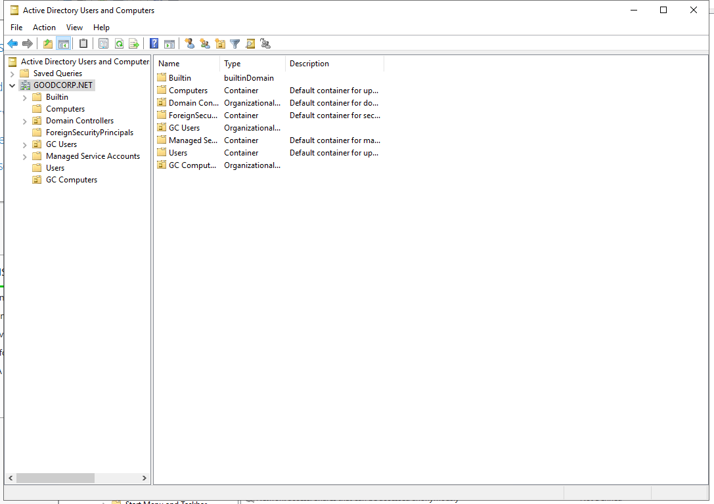

## Solution Guide: Creating Domain OUs, Users, Groups

In this activity, you were tasked with creating the user accounts for the sales representative Bob and the developer Andrew, and creating the proper organizational units and groups to put them in.

Make sure you're connected to the **Windows Server machine**.

- With the `Server Manager` open, click on `Tools` at the top-right.

- Select the `Active Directory Users and Computers` (`ADUC`) tool.

### Solutions

1. Create a top-level `GC Users` organizational unit for each department's users.

  - With `ADUC` open, do the following:

    - Right-click `GOODCORP.NET`, go to `New`, then `Organizational Unit`.

    - Name this OU `GC Users`.

    - The sub-OUs in this top-level OU will hold the users for each department.

   - Right-click `GC Users`, and create a new `Organizational Unit` under it, called `Sales`.

   - Right-click `GC Users`, and create a new `Organizational Unit` under it, called `Development`.

  - We now have an `Organizational Unit` tree for our users, separated by department.

2. Create a user, `Bob`, in the `Sales` OU. 

  - Expand the `GC Users` `Organizational Unit` and right-click the `Sales` OU, then `New`, then click on `User`. A new `New Object - User` window will appear.

    - On the `New Object - User` window, type in `Bob` for the first name and the `User logon name:`.

    - Click `Next >`

  - The next screen will have fields for setting Bob's password and a few password settings for sysadmins to set.

    - Set the password to `Ilovesales!`.

    - Uncheck `User must change password at first logon`.

    - **Note:** In a real world scenario, we would have Bob reset his password on his first login.

  - Click `Next >`

    - The next screen shows you the settings you selected. It should have the following settings:

    - Full name: `Bob`

    - User logon name: `Bob@GOODCORP.NET`

  - Click `Finish`

  - If we double-click to the `GC Users > Sales` OU (the folder icon), we can find our newly created user, `Bob`.

  - Now we have a domain user account for our sales rep, Bob.

3. Create a group, `Sales`, within the `Sales` OU.

  - With `ADUC` still open, right-click the `GC Users > Sales` OU, then click `New`, then `Group`.

    - Set the `Group name:` to `Sales`. Leave `Group scope` as `Global` and `Group type` as `Security`.

    - Click `OK`.

  - A new group, `Sales`, will appear in the `GC Users > Sales` OU.

  - Now we need to add `Bob` to `Sales`.  

    - Right-click `Bob` and go to `Add to a group...`.

    - In `Select Groups` type `Sales` in the `Enter the object names to select:` field.

    - Click `Check Names`.

  - `Sales` becomes underlined, meaning the system found the group.

    - Click `OK`. A new screen will appear saying `The Add to Group operation was successfully completed.`

    - Click `OK`.

  - `Bob` is now part of the `Sales` group in our domain.

4. Create a user, `Andrew`, in the `Development` OU.

  - To create the `Development` user and group, use the the same process used for `Sales`. 

  - Repeat the steps as Step 2 with user `Andrew`. Set the password to `Ilovedev!`.

5. Create a group, `Development`, within the `Development` OU. 

    - Repeat the same steps as Step 3 for used for creating the group `Development`.

6. Move the Windows 10 machine in the existing default `Computers` directory to a new `GC Computers` OU.

  - Right-click `GOODCORP.NET`, go to `New`, then `Organizational Unit`.

  - Name this OU `GC Computers`.

  - Drag the Windows 10 VM in the existing default `Computers` directory to the new `GC Computers` OU.

  - It should be on the same level as `GC Users`, as shown in the following screenshot:

  - 

---
 © 2020 Trilogy Education Services, a 2U, Inc. brand. All Rights Reserved.
