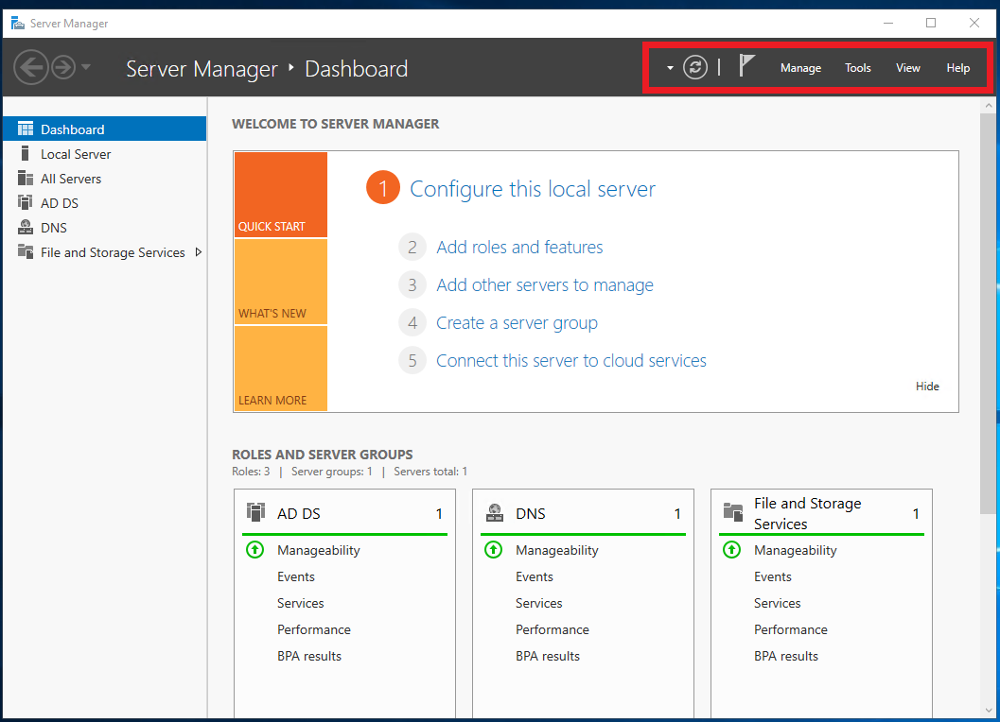

# Windows Unit Cheat Sheet

## Day 1

### Launching Applications

Applications such as `CMD`, `Task Manager`, and `services.msc` can be launched by going to the bottom-left of the Windows PC, clicking on the Windows button, and typing in the name of the application you want to run. You can also type them into the search bar in the bottom task bar that has the picture of the magnifying glass.

You can reach Windows settings by going to the bottom-left, clicking the Windows button, and then clicking on the cogwheel button right above it.

### Windows Directory Paths

> **NOTE** Windows directories use the backslash, `\`, to delimit paths as opposed to Unix's forward slash, `/`!!

- `C:\` (or whichever root drive Windows is installed on) : is a root drive.

- `C:\Program Files\` is where 64-bit applications are installed.

- `C:\Program Files (x86)\` is where 32-bit applications are installed.

- `C:\ProgramData\` [hidden] is a hidden directory where application-specific settings reside.

- `C:\Users\` is the directory for all users, including the `Default` user. Similar to Linux's `/home` directory.

- `C:\Users\[username]\` is each specific user's home folder. Their settings and files are saved here and in subdirectories.

  - `C:\Users\[username]\Documents\` is the `Documents` folder for the current user.
  - `C:\Users\[username]\Desktop\` is the `Desktop` folder for the current user.

- `C:\Windows\` is where Windows-specific programs and libraries are located.

  - `C\Windows\System32\` is where (counterintuitively) 64-bit main component Windows system applications configuration settings are located.

### Windows Directory Command-Line Interaction and Navigation

- `cd` or `chdir` is to change directories, just like with Linux's `cd`.

- `dir` lists the contents of a directory, similarly to Linux's `ls`


- `md` or `mkdir` creates directories.

- `copy` copies a file. This is the equivalent to Linux's `cp`.

- `move` works like cutting and pasting files, equivalent to Linux's `mv`.

- `del` or `erase` deletes files and directories. Directories will prompt a user to confirm.

  - Note that files deleted with this command do not go to the `Recycle Bin`, unlike when they are deleted with the GUI.

- `rd` or `rmdir` removes a directory if it's empty. Non-empty directories must be removed with `rmdir /S` or `rd /S`.

- `find` will search a file for whatever is defined. For example, `find "hello" greeting.txt` will search the `greeting.txt` file for the string `hello`.

- `exit` will close `cmd`.

- `type` followed by a file name will show the contents of a file. Similar to `cat` in Linux.

- `| more` or "pipe more" shows contents of the command-line in a per-screen format.

- `>` will _output_ to a file. It will make a new file or rewrite it if it exists.

  > Example: `echo hello > greeting.txt` will create a new `greeting.txt` file every time it is run.

- `>>` will _append_ to a file. It will either start a new file or add lines to the existing one.

  > Example: `echo world >> greeting.txt` will keep adding the word `world` to a new line to this file.

### Common Environment Variables

| Environment Variable | Default Value          |
| -------------------- | ---------------------- |
| %CD%                 | Current directory      |
| %DATE%               | The current date       |
| %OS%                 | Windows                |
| %ProgramFiles%       | C:\Program FIles       |
| %ProgramFiles(x86)%  | C:\Program Files (x86) |
| %TIME                | The current time       |
| %USERPROFILE%        | C:\Users\{username}    |
| %SYSTEMDRIVE%        | C:\                    |
| %SYSTEMROOT%         | C:\Windows             |

> Example: `echo %CD%` will print the `current directory` path. Note: this variable is different from the **terminal command**, `cd`.

### `WMIC` Windows Management Instrumentation Command

`wmic` has the following query structure:

- `wmic [GLOBAL SWITCHES] [ALIAS] [VERBS] [PROPERTIES]`

> Example: `wmic os get /value` will return all properties of `wmic os` for you to choose properties from:

    ```console
    BootDevice=\Device\HarddiskVolume6
    BuildNumber=18362
    BuildType=Multiprocessor Free
    Caption=Microsoft Windows 10 Pro
    ... [results truncated]
    ```

> Example 2: `wmic /APPEND:report.txt os get caption` will retrieve the operating system's common name and _append_ that to a file `report.txt`. In this example, `/APPEND:report.txt` is a global switch, `os` is an alias, `get` is our verb and `caption` is our property we're retrieving.

You can modify `wmic` queries with the `where` clause.

> Example 3: `wmic service where (startmode="auto") get caption` finds services where the `startup` property equals `auto`.

### `net` CMD

The `net user` and `net localgroup` and `net accounts` command-line utilities allow you to manage and interact with different local user and group-related settings.

---

## Day 2

### Common PowerShell commands

| CMDlet          | Function                                         | Equivalent command     |
| --------------- | ------------------------------------------------ | ---------------------- |
| `Set-Location`  | Changes to specified directory                   | `cd`                   |
| `Get-ChildItem` | Returns current directories contents             | `ls`, `dir`            |
| `New-Item`      | Makes a new directory                            | `mkdir`                |
| `Remove-Item`   | Deletes a file or directory                      | `rm`, `rmdir`          |
| `Get-Location`  | Retrieves path to current directory              | `pwd`                  |
| `Get-Content`   | Returns file contents                            | `cat`, `type`          |
| `Copy-Item`     | Copies a file from one given location to another | `cp`                   |
| `Move-Item`     | Moves a file from one given location to another  | `mv`                   |
| `Write-Output`  | Prints output                                    | `echo`                 |
| `Get-Alias`     | Shows aliases for the current session.           | `alias`                |
| `Get-Help`      | Retrieves information about PowerShell commands  | `man`                  |
| `Get-Process`   | Gets processes running on local machine          | `ps`                   |
| `Stop-Process`  | Stops one or more defined process(es)            | `kill`                 |
| `Get-Service`   | Gets a list of services                          | `service --status-all` |

### How to use documentation and find commands

How to find documentation on a cmdlet:

> `Get-Help {cmdlet}`

To find documentation on `Set-Location`:

> `Get-Help Set-Location`

Finding specific examples:

> `Get-Help {cmdlet} -examples`

How to find cmdlets by noun:

> `Get-Command -Type Cmdlet | Sort-Object -Property Noun | Format-Table -GroupBy Noun`

How to find cmdlets by verb:

> `Get-Command -Type Cmdlet | Sort-Object -Property Verb | Format-Table -GroupBy Verb`

#### Wildcards

How to find by noun:

> `Get-Command -Noun {noun}`

How to find by verb:

> `Get-Command -Verb {verb}`

### An Example Remote Transfer Script

A Sample script that will create files and transfer them to a remote server.

- Note: You will need to run the script a directory above the files that you are transferring over.

> ##### Example Script

```PowerShell
mkdir ".\Files\" -Force

New-Item ".\Files\file1.txt" -Force
New-Item ".\Files\file2.txt" -Force
New-Item ".\Files\file3.txt" -Force

$Session = New-PSSession -ComputerName 192.168.1.5 -Credential "ExampleUser"

$files_list = ls ".\Files\*"

foreach ($file in $files_list) {
    Copy-Item $log -Destination "C:\Files\" -ToSession $Session
    echo "Copied $file to remote machine C:\Files directory!"
}
```

When this script is run it will do the following:

- Create a new directory `Files`. If the directory exists, the rest of the script will not error because the `-Force` parameter.
- Create three empty files in the `Files` directory. If the files exist, the rest of the script will not error because the `-Force` parameter.
- Establish a remote PowerShell session as a variable.
- Retrieve the contents of the `Files` directory and assign it to `$files_list`.
- A `foreach` loop that, for every file item that exists in the directory, will:
  - Transfer the file from the `Files` folder to the remote machine's `C:\Files\` directory.
  - Print to console, the name of the file item that was transferred.

---

## Day 3

### Key Terms

- **Active Directory**: all the services that work together to manage authentication and authorization within a Windows Server network.

- **Domain Controller**: a server that manages all of the users and access to all domain-joined resources. It has `Active Directory` installed on it and handles all of the `authentication`. The domain controller has a database that is used to check for authentication requests. Often, replica or secondary domain controller servers exist on a network to maintain authentication requests if one were to fail. Domainc controllers receive and handle authentication requests and permissions and access according to what is defined by your directory.

- **Domains**: a `Windows domain` as a digital grouping of all object types such as users, computers, network resources, and security principals in an enterprise that are managed by a server called a `Domain Controller`

- **Organizational Unit**: are also virtual collections of objects like containers, but _can_ have policies applied to them. They are organization-defined collections of objects (users, groups, computers, etc.) in AD. These typically mirror business functions. For example, user objects within the `accounting.GoodCorp.net` should be only users in the accounting department. OUs are not considered security principals.

- **Users**: a user object and security principal consists of all of the information stored about a user in `Active Directory`

- **Groups**: are a collection of object users, computers, and other resources. These are used to manage identical permissions and access controls to manage security. These are also used to manage email distribution groups. Groups considered security principals and use authentication to access resources.

- **LM hashes**: an insecure hashing method used by the older authentication protocol, `LAN Manager`.

- **NTLM**: is a challenge/reponse-based authentication protocol security suite that Microsoft developed as the successor to `LanMan`.

- **Kerberos**: - `Kerberos`, named after the three-headed guard dog of hell, Cerberus, is a ticket-based authentication protocol that is now the default authentication protocol for Windows Server domains since Windows Server 2000.

---

## Key Commands / Operations

### Server Manager

To find `tools` you'll need for activities such as `Add Users and Computers` and `Group Policy Management`, click `Tools` at the top right of `Server Manager`:

- 

### Finding SIDs & RIDs

- `Get-ADUser -Filter * | Format-List Name, SID`

- `Get-ADPrincipalGroupMembership -Identity Bob | Format-Table -Property Name, SID`

- `Get-ACL \\ad\dev | Format-List`

---

## Copyright

Trilogy Education Services © 2020. All Rights Reserved.
