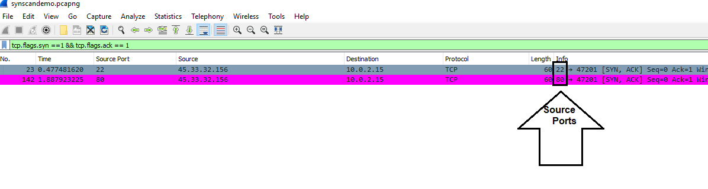

## 8.3 Student Guide: Following Data Through Layers 2, 3, and 4

### Overview

On the third day of our introduction to networking, you will learn how to gather data from specific networks using enumeration.

Then, we will move through three layers of the OSI model—Layer 2: the Data Link layer, Layer 3: the Network layer, and Layer 4: the Transport layer. You will learn the following tools and protocols related to each layer: Layer 2: ARP, Layer 3: ping and traceroute, and Layer 4: TCP and UDP. Class will finish by performing a SYN scan to search for open ports on a network.

### Class Objectives

By the end of class, you will be able to:

- Define enumeration as a set of methods used by security professionals and hackers to determine network vulnerabilities.

- Use Wireshark to visualize and analyze ARP activity, including ARP spoofing.

- Use `ping` and `fping`  to determine if hosts are up and accepting connections.

- Use `traceroute` to troubleshoot networking communication issues between two devices.

- Define and distinguish TCP and UDP.

- Analyze TCP traffic in Wireshark.

- Analyze SYN scans to determine the availability of ports on a network.

### Lab Environment

- You will use your local Vagrant virtual machine for today's activities. 

### Lesson Slideshow  

The slides for today can be viewed on Google Drive here: [8.3 Slides](https://docs.google.com/presentation/d/10JqZQyr3L192K5ef02NVdO-1BiU5wRhm1fDiUR_aZxI)


---

### 01. Welcome and Introduction

In the previous class, we covered:

 - Protocols are standardized rules that dictate how data is communicated.

 - Ports assist with where data is transmitted from and to, with respect to the server and client.  

 - The seven layers of the OSI model conceptualize how data is communicated across a network.

 - Wireshark is a powerful utility for in depth analysis of network packets.

In this lesson, we will cover the following concepts:

- The process of gathering data for a specific network, known as **enumeration**.

- The Layer 2: Data Link protocol **ARP**, used to transfer network traffic within a local network.

- The Layer 3: Network utilities **`ping`** and **`traceroute`**, used by network and security professionals to diagnose network issues.

- The Layer 4: Transport protocols **TCP** and **UDP**, and how **TCP** establishes a connection with a three-way handshake.

- **SYN scans**, and how both security professionals and attackers can use this method to determine the state of ports in a network.


### 02. Introduction to enumeration

As we've discussed, hackers will often try to gain unauthorized access into a network. It's the job of security professionals to secure networks by identifying network vulnerabilities.

- A hacker may discover that a server with payroll data accidentally has open port `22`, for SSH.

- This lets the hacker gain unauthorized access to the company's network, allowing them to steal or alter important data such as social security numbers or salary information.

- It is the security professional's job to determine which unauthorized ports are open, and then close them, thus protecting the integrity of the company.

The methods that hackers use to find and exploit vulnerabilities are often the same ones used by security professionals to find and patch vulnerabilities.

One prominent method used by both attackers and security professionals is **enumeration**.

- **enumeration** is the process of gathering data for a specific network, usually for the purpose of finding ways to gain access into that network.

- enumeration can provide the following information:
  - Physical addresses of devices within a network.
  - The IPs and ports that are being used or accessible.
  - Network devices and network security devices being used.

In today’s class, we will introduce how security professionals use protocols and tools that exist in Layers 2, 3, and 4 of the OSI model to enumerate a network.


### 03. Address Resolution Protocol (ARP) (Layer 2: Data Link)

The reason we are covering the OSI layer protocols and tools is because they contain vulnerabilities that can be exploited by hackers to gain unwanted access into networks.

- To harden networks, we need to know how these protocols work, and how attackers take advantage of them.  

- We'll begin with the Layer 2 protocol, **Address Resolution Protocol**, or **ARP**.

#### A Brief Introduction to the Address Resolution Protocol

Before looking closely at ARP, we'll recap the process used by networks to communicate with each other over the internet:

- When devices communicate from one network to another network, they often send communications across the internet.  
  - This type of network is known as a **Wide Area Network**, or **WAN**.
- The data then travels across the internet to its destination network.

   - We refer to this destination network as a **Local Area Network**, or **LAN**.

- Once the data reaches the LAN, it still has to be transmitted to its final destination on the LAN.


Once on a LAN, the data is routed through network devices called **switches** to a physical machine address.

- The physical address, also referred to as the **Media Access Control**, or **MAC**, address, is a sequence of numbers and letters such as `00:0c:29:0f:71:a3`, that identifies the destination computer's unique hardware number.

- Without a **MAC address**, the data may reach the LAN, but not know where to next transmit the data.  

In order to make sure data gets from the LAN to the machine, the **Address Resolution Protocol** (ARP), at Layer 2: Data Link, maps a physical machine (MAC) address to an IP address within a LAN. This mapping occurs through an ARP request and reply process.

ARP request and reply process by covering the following:

  - The network device that is transmitting the data broadcasts an **ARP request** to all devices within its network in order to find the physical address that matches the IP address.

  - The device that owns that IP address recognizes their IP in the ARP request. It sends an **ARP reply** with their **MAC address**, so the network knows where to route the data.

  - The mapping of the MAC address to the IP address is added into the **ARP cache**. An ARP cache is a table of entries containing ARP records.

  - The next time that data comes in looking for this specific destination device, it does not need to broadcast another ARP request. Because the network already has the record in its cache, it can automatically route the data.

 Entries added to the ARP cache are called **dynamic ARP entries**, meaning they can be changed with future ARP replies.

  - Dynamic ARP entries only stay in the ARP cache for a limited period of time, known as the **ARP cache timeout**.

  - When the ARP cache timeout expires, the record is removed from the ARP cache and any future requests for the host require a new ARP request.


Wireshark allows us to visualize ARP requests and responses.
  - First we'll filter for all ARP packets in a .pcap file.

  - This filter will show us the request from the source host, which will include a MAC address, associated with a specific IP address, that the data needs to be transmitted to.

  - If the request can be successfully answered, we’ll see a response from the owner of the IP address, which will contain the device’s MAC address.

#### ARP Wireshark Demo

In the upcoming demo, we’ll analyze a .pcap file to visualize ARP requests and responses.

 - Open Wireshark.

 - Navigate to `File` > `Open` and select the [arp.pcap](Resources/arp_class.pcap) file.

Once the file opens, we will filter for all the ARP packets, by entering `arp` in the filter.


In this packet capture, there are two different ARP requests and replies:

The first ARP broadcast request can be translated as "*Who has `10.10.10.1`? Tell `10.10.10.2`*."

  - The source host of `10.10.10.2` is making a broadcast message to everyone in the local network to see owns `10.10.10.1`.
  - The request is also stating, "*If you are the owner, please tell me your MAC address so I can add it to my ARP cache.*"
    - This way, `10.10.10.2` will know where to route the traffic for `10.10.10.1` and won’t need to ask again.

    

The ARP reply to this request can be translated as "_`10.10.10.1` is at `00:1d:09:f0:92:ab`._"

- The host of `10.10.10.1` is telling `10.10.10.2` that its MAC address is `00:1d:09:f0:92:ab`.

    

There is another ARP request and reply in the packet capture. While the request and reply are the same IPs but in reverse, it  is still an independent request and response, unrelated to the first one.
  - The source host of `10.10.10.1` is making a broadcast message to everyone in the local network to see who owns `10.10.10.2`.
  - `10.10.10.2` then tells `10.10.10.1` that its MAC address is `00:1a:6b:6c:0c:cc`.

    

We can also filter our file to show only ARP requests or ARP responses. Doing so can help security professionals isolate certain types of packets when there are many to analyze.

There is a field for each ARP packet called **`arp.opcode`** that indicates if it is an ARP request or response:

  - If `arp.opcode` is equal to `1`, it is a **request**.

  - If `arp.opcode` is equal to `2`, it is a **response**.

   Run the filter  `arp.opcode == 1` to show only the ARP requests.

   Run the filter `arp.opcode == 2` to show only the ARP responses.

  


#### ARP Security Implications

Now we know how ARP assists with routing data within a LAN, we will look at the **security vulnerabilities** associated with the protocol.

If a hacker has access to a LAN, they can intercept traffic on its way to the correct destination (known as _the good host_).

- The hacker can send a spoof ARP message to the LAN, directing all traffic intended for the good host to the hacker's MAC address instead.

- After the attacker sends the spoof ARP message, all traffic originally destined for the good host is intercepted by the hacker’s device with the malicious MAC address.

- This attack is known as **ARP cache poisoning** or **ARP spoofing**.

This vulnerability has significant consequences, since it can be used to intercept classified or sensitive data such as usernames and passwords.

The following images visualize an ARP poisoning attack:


- The good host is `192.168.47.2` and the good host's correct MAC address is `00:50:56:fd:2f:16`.

- The hacker's MAC address is `00:0c:29:1d:b3:b1`. They sent a spoof ARP message, meaning all future traffic intended for the good MAC address (`00:50:56:fd:2f:16`), will instead go to the hacker's MAC address.

- The spoof ARP message can be translated as: _`192.168.47.2` is at `00:0c:29:1d:b3:b1`._

Wireshark can detect that there are multiple MAC addresses being associated with a single IP address.

- Note the message from Wireshark in the screenshot: `Duplicate IP address detected for 192.168.47.2 (00:0c:29:1d:b3:b1) - also in use by 00:50:56:fd:2f:16 (frame 301)`

- This message from Wireshark is only a warning. No action has been taken by any device.

There are mitigation methods to protect against an **ARP poisoning attack**.
  - A network administrator can create **static ARP entries**, rather then dynamic ARP entries.

    - Static ARP entries create permanent IP-address-to-MAC-address mappings in the local ARP cache.

    - Unlike the dynamic ARP entries, these cannot be changed.

    - However, it is time-consuming to manually enter and edit each IP-to-MAC mapping in the ARP cache as they are added and changed.

- Additionally, ARP spoofing detection software programs can be installed to identify and block ARP poisoning attempts.  These can be expensive and will often require time to install, maintain, and update.

### 04.Analyzing ARP Activity


- [Activity File: Analyzing ARP](Activities/04_Analyzing_ARP/unsolved/readme.md)
- [ARP Log Files](Resources/arp_packets.pcap)

### 05. Review Analyzing ARP Activity

- [Solution Guide: Analyzing ARP](Activities/04_Analyzing_ARP/solved/readme.md)

### 06. Instructor Do: `ping` (Layer 3: Network) (0:15)

The goal of enumeration is to gain access to a particular network.  

An important step of enumeration is checking if an external host is actually operating and accepting connections.

  - For example: Company X wants to make sure their new intranet is accessible from their offices in the United States and Japan. The intranet is used for daily employee tasks and to access employee contact information. Therefore, **availability** of the intranet is critical for all employees.

  - To test the accessibility to the intranet, Company X might have employees from the United States and Japan each send a **`ping`** request from their location to validate the intranet is **available** and **accessible** from each location.

`ping` (_Packet Inter-Network Groper_) is a utility for determining if a particular host is up and accepting requests. Cover the following:

  - `ping` can easily be run from the command line on a Linux or Windows machine.

  - As it uses IP addresses, it works on the Network layer of the OSI model (Layer 3).

When we ping a host, an **Internet Control Message Protocol (ICMP) echo request** is sent to a specific IP address and then waits on a reply.

  - **ICMP** is a protocol that network devices use to send error messages and operational information about whether a requested service or host can be reached.

  - ICMP differs from protocols like UDP and TCP, which we’ll cover later on in the lesson, in that it's not usually used to exchange data between systems or by end-user applications, unless that particular application has some diagnostic tools.
  
  - It is important to note that network devices can be online, but block ICMP requests to "hide" as a security precaution.  


#### `ping` Demo

We will now demonstrate how to use `ping` on the command line, using the below scenario:

- We are a restaurant looking to purchase commercial beverages online. We need to check if Pepsi.com is working and accepting requests.

**Note**: This is a live network request, so there is a possibility in variances in the response.

Begin by opening up your terminal.

- There are two ways to ping a host: we can ping the domain or ping the IP address.

First, we'll ping the domain:

- Type `ping pepsi.com`

- Run the command. A successful response should look like:

  ```bash
	    Pinging pepsi.com [45.60.135.51] with 32 bytes of data:
	    Reply from 45.60.135.51: bytes=32 time=56ms TTL=57
            Reply from 45.60.135.51: bytes=32 time=403ms TTL=57
            Reply from 45.60.135.51: bytes=32 time=52ms TTL=57
            Reply from 45.60.135.51: bytes=32 time=36ms TTL=57

            Ping statistics for 45.60.135.51:
            Packets: Sent = 4, Received = 4, Lost = 0 (0% loss),
	    Approximate round trip times in milli-seconds:
            Minimum = 36ms, Maximum = 403ms, Average = 136ms
  ```
We can end the ping by hitting `ctrl c`.
- Press `ctrl` then `c`.

We can tell the terminal to ping the website four times by using `-c 4` in the command.
- Type `ping -c 4 pepsi.com`

Next, we'll ping the IP address.  

- Type `ping -c 4 45.60.135.51`

- The response is the same, except for the top line which should look like below:

   ```bash
   Pinging 45.60.135.31 with 32 bytes of data:
   ```

Each line of the response response:

- `Pinging pepsi.com [45.60.135.51] with 32 bytes of data:`
  - This specifies the domain and the associated IP the request is being sent to, as well as the size of the packet it's sending.

-  `Reply from 45.60.135.51: bytes=32 time=56ms TTL=571`
    -  This line is a successful response from Pepsi.com confirming it is working and accepting connections. The response includes:

        - **`bytes`**: Size, in bytes, of the packet.
        - **`time`**: Time it took the domain to respond, expressed in milliseconds.
        - **`TTL`** (_Time to Live_): This concept will be explained in the next lesson.

- `Ping statistics for 45.60.135.51: Packets: Sent = 4, Received = 4, Lost = 0 (0% loss)`
  - Specifies the statistics of the response. For this response, four packets were sent and four were received.

  - The "probe" packets sent from the source device are UDP datagrams. Datagrams are basic transfer units used in connectionless communications, as opposed to TCP packets, which are used for connection-oriented communications.

  - Emphasize again that we’ll cover UDP and TCP in depth later on in this lesson.

-  `Approximate round trip times in milliseconds: Minimum = 36ms, Maximum = 403ms, Average = 136ms`
    - This specifies the statistics of the response times.

We will now demonstrate a failed response. We will use redbull.com as an example:      

- Run `ping -c 4 redbull.com`

-  The failed response should look like:

  ``` bash
  Pinging redbull.com [80.120.169.230] with 32 bytes of data:
  Request timed out.
  Request timed out.
  Request timed out.
  Request timed out.

  Ping statistics for 80.120.169.230:
  Packets: Sent = 4, Received = 0, Lost = 4 (100% loss),  
  ```

Syntax:

  - `Request timed out` indicates that there were no reply messages from redbull.com within the default wait time (typically one second).
  - We can see that four packets were sent, but none were received, meaning there was `100% loss`.

A failed response doesn't necessarily indicate that the host is down.  It may simply mean that the host is not allowing requests from ICMP.

  - Businesses may restrict ICMP requests for security reasons, such as preventing external parties from enumeration.  

  - A high volume of ICMP requests, called a **ping flood**, also presents a security risk that can potentially affect the server's resources and impact performance.

Security analysts are often tasked with validating hundreds or thousands of IP addresses.  

For those cases, it would not be efficient to ping each IP address one at a time.
  - For example: A security professional works at a large e-commerce organization that uses 100 load balancers to handle the large volume of requests coming into their website.

  - All the load balancers are required to be up and accepting connections. Otherwise, during peak shopping times their website might have limited availability, leading to poor customer experience.

  - Making individual requests to each load balancer would be too time consuming.

For multiple ping requests, we can use **fping**, a utility that can run ping requests against multiple IPs, or a range of IPs, with a single request.

 - You can install `fping` with the command `sudo apt install fping`.
   - Run `sudo apt install fping`


To run `fping` against multiple IPs, simply list the IPs in the command: `fping <IP1> <IP2> <IP3>`.

- Run  `fping -c 4  101.0.43.10 197.191.96.26 67.19.56.23`

We can also add additional options to `fping`. For example, if we add the `-g` argument while running `fping`, we can ping against a range of IPs by adding the first and last IPs in a range to the command:  `fping -g [starting IP of range] [ending IP of range]`

- Run `fping -c 4 -g 101.0.43.10 101.0.43.14`

- This `fping` will send four ping requests to `101.0.43.10`, `101.0.43.11`, `101.0.43.12`, `101.0.43.13`, and `101.0.43.14`.

- The output will depict fping sending four ping requests to `101.0.43.10`, `101.0.43.11`, `101.0.43.12`, `101.0.43.13`, and `101.0.43.14`.

  - **Note:** Results may vary.

  ```bash
  ICMP Time Exceeded from 103.58.98.26 for ICMP Echo sent to 101.0.43.11
  101.0.43.10 : [0], 84 bytes, 343 ms (343 avg, 0% loss)
  ICMP Time Exceeded from 103.58.98.26 for ICMP Echo sent to 101.0.43.12
  ICMP Time Exceeded from 103.58.98.26 for ICMP Echo sent to 101.0.43.13
  ICMP Time Exceeded from 103.58.98.26 for ICMP Echo sent to 101.0.43.14
  101.0.43.10 : [1], 84 bytes, 366 ms (355 avg, 0% loss)
  ICMP Time Exceeded from 103.58.98.26 for ICMP Echo sent to 101.0.43.11
  ICMP Time Exceeded from 103.58.98.26 for ICMP Echo sent to 101.0.43.12
  ICMP Time Exceeded from 103.58.98.26 for ICMP Echo sent to 101.0.43.13
  ICMP Time Exceeded from 103.58.98.26 for ICMP Echo sent to 101.0.43.14
  101.0.43.10 : [2], 84 bytes, 389 ms (366 avg, 0% loss)
  ICMP Time Exceeded from 103.58.98.26 for ICMP Echo sent to 101.0.43.11
  ICMP Time Exceeded from 103.58.98.26 for ICMP Echo sent to 101.0.43.12
  ICMP Time Exceeded from 103.58.98.26 for ICMP Echo sent to 101.0.43.13
  ICMP Time Exceeded from 103.58.98.26 for ICMP Echo sent to 101.0.43.14
  101.0.43.10 : [3], 84 bytes, 310 ms (352 avg, 0% loss)
  ICMP Time Exceeded from 103.58.98.26 for ICMP Echo sent to 101.0.43.11
  ICMP Time Exceeded from 103.58.98.26 for ICMP Echo sent to 101.0.43.12
  ICMP Time Exceeded from 103.58.98.26 for ICMP Echo sent to 101.0.43.13
  ICMP Time Exceeded from 103.58.98.26 for ICMP Echo sent to 101.0.43.14

  101.0.43.10 : xmt/rcv/%loss = 4/4/0%, min/avg/max = 310/352/389
  101.0.43.11 : xmt/rcv/%loss = 4/0/100%
  101.0.43.12 : xmt/rcv/%loss = 4/0/100%
  101.0.43.13 : xmt/rcv/%loss = 4/0/100%
  101.0.43.14 : xmt/rcv/%loss = 4/0/100%
  ```

### 07. enumeration with `ping`

- [Activity File: enumeration with `ping`](Activities/07_Enumerating_with_ping/unsolved/readme.md)


### 08. Review enumeration with `ping`

- [Solution Guide: enumeration with `ping`](Activities/07_Enumerating_with_ping/solved/readme.md)


### 09. Introduction to `traceroute`

In the previous section  we determined if external hosts were up and accepting requests.

- In our demonstration, we saw that redbull.com did not respond to our ping. In this section, we'll try to find out why.

`ping` only indicates if a host is up or down. Security professionals will often need to obtain more information to figure out why a host is not returning a successful response.

- For example:

  - Company X's employees were able to successfully ping their intranet from the United States office, but unable to ping the exact same address from the Japan office.

  - More information is needed to understand why the intranet is not accessible from Japan.

  - Company X can better understand the issue by finding out where in the request the failure occurred.

When data travels from a source to a destination, it typically does not follow a straight path.

  - Data is often redirected by many routers across various networks. Routers connect different networks so their hosts can communicate.

  - Redirection of data transmissions are called **hops**.

  - Optimal routing paths are determined based on the "shortest path," which is influenced by network topology. This is why knowledge of topology and segmentation is essential to networking.

  - Despite using the "shortest path," communication between two devices can still fail, leaving network administrators unsure where the communication problem is located.

  - Poor connectivity and latency issues are often due to packets being dropped along their routing paths.

Network administrators can use a command-line tool like `traceroute` to troubleshoot networking communication issues between two devices and determine where the issues are in the hops.

  - `traceroute` shows the route taken between two systems across a network, listing all routers (hops) the connection must pass through to get to the destination.

  - Network administrators can use `traceroute` to identify precisely where connectivity problems occur. They can see if a problem is close to the source device, destination device, or on the path it takes between devices.

  - In addition to troubleshooting connectivity issues, `traceroute` can be used to:

    - Display how systems are connected, or map the network.

    - Generate baseline profiles of the network.

    - Diagnose poor network performance issues.

How `traceroute` works :

  - Like `ping`, `traceroute` uses ICMP. However, `traceroute` also shows the time taken to travel across each hop, from the source to the destination.

  - Each hop is queried three times to validate the accuracy of the data transmission.

  - While using ICMP, the ICMP header contains a field called **Time to Live**, or **TTL**.

    - TTL is an indicator of how long a data packet can exist in a network.

    - TTL is a decrementing hop counter. Every router that forwards the packet decrements (reduces) the TTL value by one.

       - For example: If the starting TTL value of a data packet is five, after the data travels across two routers, the TTL will drop to three.

    - When the TTL count reaches zero, it sends a "time exceeded" error message back to the source address.

    - This prevents data from being stuck in an infinite loop if it's unable to be delivered to the destination.

The source device sends out a sequence of User Datagram Protocol (UDP) datagrams to the destination device, covering the following:

  - Initially, three datagrams are sent from the source device, each with a TTL field value set to one.

  - With a TTL value set to one, the datagram will timeout as soon as it hits the first router in the path. The router responds with an ICMP Time Exceeded Message (TEM) indicating that the datagram has expired.

  - From there, another three UDP messages are sent, each with a TTL value set to two, which causes the second router to return TEMs.

  - This process continues until the destination device is reached.

  - This visualization demonstrates the sequence of Host A performing a `traceroute` to Host D:

  

#### `traceroute` Demo

Now we’ll use `traceroute` on the command line to further investigate why redbull.com isn’t responding.

Note the command syntax for running `traceroute`:

  - `traceroute [domain name or IP address]`

Open a terminal in your lab environment:

- Run  `traceroute redbull.com` and show the following output:

  ```
  $ traceroute redbull.com
  traceroute to redbull.com (213.227.189.20), 30 hops max, 60 byte packets
   1  _gateway (10.0.2.2)  0.365 ms  0.331 ms  0.312 ms
   2  * * *
   3  * * *
   4  * * *
   5  * * *
  ...
  ```

Explain that `traceroute` on Linux, by default uses UDP, which may not pass successfully from our virtual machine. 

In this case, we need to run `traceroute` with ICMP, by using the following command:

- Run `sudo traceroute -I redbull.com`

- `traceroute` results should look like the following:

  **Note:** Since this is a live network ping, you may see a different result.

  ```bash
  traceroute to redbull.com (213.227.189.20), 30 hops max, 60 byte packets
   1  _gateway (10.0.2.2)  0.177 ms  0.150 ms  0.143 ms
   2  192.168.1.1 (192.168.1.1)  1.852 ms  1.788 ms  1.713 ms
   3  * * *
   4  012-034-056-789.res.spectrum.com (12.34.56.789)  15.567 ms  16.471 ms  16.438 ms
   5  cts03sghlga-tge-3-0-0.sghl.ga.charter.com (12.34.78.231)  16.431 ms  16.893 ms  16.840 ms
   6  bbr02atlnga-bue-3.atln.ga.charter.com (12.34.2.72)  22.357 ms  21.325 ms  23.787 ms
   7  bbr01atlnga-tge-0-1-0-8.atln.ga.charter.com (12.34.0.132)  17.801 ms  20.431 ms  21.595 ms
   8  cha-b1-link.telia.net (213.248.98.25)  21.666 ms  21.686 ms  21.678 ms
   9  ash-bb2-link.telia.net (62.115.121.144)  27.860 ms  28.968 ms  28.977 ms
  10  prs-bb3-link.telia.net (62.115.112.243)  120.140 ms  120.979 ms  120.976 ms
  11  ffm-bb1-link.telia.net (62.115.123.12)  122.492 ms  123.387 ms  123.214 ms
  12  ffm-b5-link.telia.net (62.115.114.89)  123.319 ms  123.315 ms  119.016 ms
  13  ae9-1337.bbr01.anx25.fra.de.anexia-it.net (62.115.14.117)  123.272 ms  128.067 ms  128.956 ms
  14  ae1-0.bbr01.anx82.fra.de.anexia-it.net (144.208.208.145)  143.023 ms  130.376 ms  134.712 ms
  15  ae2-0.bbr01.anx04.vie.at.anexia-it.net (144.208.208.151)  136.112 ms  131.183 ms  131.704 ms
  ```


Output breakdown:

- `traceroute to redbull.com (213.227.189.20), 30 hops max, 60 byte packets`

  -  This line indicates the website and IP address that `traceroute` is being run against, as well as the maximum number of hops allowed.

Break down the results at the 4th hop, which is the first hop to our ISP's gateway after our VM NAT and local NAT hops:

- `4  012-034-056-789.res.spectrum.com (12.34.56.789)  15.567 ms  16.471 ms  16.438 ms`

    - `4` is the first hop.
    - `15.567 ms  16.471 ms  16.438 ms`: The three ICMP requests received a response in 15.567 milliseconds, 16.471 milliseconds, and 16.438 milliseconds.
    - `12.34.56.789`: The first router hop is located at `12.34.56.789`.

- `ae2-0.bbr01.anx04.vie.at.anexia-it.net (144.208.208.151)  136.112 ms  131.183 ms  131.704 ms`
  - This line is the fifteenth and last successful hop. Any additional connections didn't receive a response.

- `***` means `Request timed out.` and indicates that hop three timed out. No additional connections could be established.

From these `traceroute` results, a security or network professional knows they need to narrow their investigation to the router on hop number eight.  

As a comparison, here is the `traceroute` for the successful request to pepsi.com.

  ```bash
  traceroute to pepsi.com (45.60.75.51), 30 hops max, 60 byte packets
   1  _gateway (10.0.2.2)  0.092 ms  0.064 ms  0.147 ms
   2  192.168.1.1 (192.168.1.1)  1.680 ms  1.677 ms  1.604 ms
   3  * * *
   4  012-034-056-789.res.spectrum.com (12.34.56.789)  15.729 ms  16.083 ms  16.032 ms
   5  cts03sghlga-tge-3-0-0.sghl.ga.charter.com (12.34.78.231)  17.002 ms  17.000 ms  17.098 ms
   6  bbr02atlnga-bue-3.atln.ga.charter.com (12.34.2.72)  18.547 ms  22.744 ms  29.947 ms
   7  bbr01atlnga-tge-0-1-0-8.atln.ga.charter.com (12.34.0.132)  33.561 ms  25.719 ms  26.837 ms
   8  bbr01gnvlsc-bue-800.gnvl.sc.charter.com (12.34.0.134)  23.300 ms  24.212 ms  24.269 ms
   9  bbr01aldlmi-tge-0-0-0-13.aldl.mi.charter.com (12.34.0.161)  38.945 ms  39.506 ms  41.347 ms
  10  prr01ashbva-bue-3.ashb.va.charter.com (12.34.3.51)  32.045 ms  32.060 ms *
  11  eqix-dc2.imperva.com (206.126.237.203)  31.894 ms  31.840 ms  31.655 ms
  12  45.60.75.51 (45.60.75.51)  29.500 ms  30.472 ms  26.195 ms
  ```

Results:

  - `traceroute to pepsi.com (45.60.75.51), 30 hops max, 60 byte packets`
    - This line indicates that the website and IP address that the `traceroute` is being run against, as well as the maximum number of hops allowed.

  - `4  012-034-056-789.res.spectrum.com (12.34.56.789)  *  16.083 ms  16.032 ms`

    - `4` indicates the first hop.

    - `*  16.083 ms  16.032 ms` are the three ICMP request response times. The first did not get a timely response, the second and third did, in `16.083 ms` and `16.032 ms` respectively.

    - `10.0.2.2`  is typically the IP address of a local gateway (in this case a virtual machine network gateway), the first hop.

  -  `12  45.60.75.51 (45.60.75.51)  29.500 ms  30.472 ms  26.195 ms`

      - This is the final hop (the destination). The destination IP of pepsi.com is `45.60.75.51`.


### 10. Enumeration with `traceroute`


- [Activity File: Enumeration with `traceroute`](Activities/11_Enumeration_with_traceroute/unsolved/readme.md)


### 11. Review Enumeration with `traceroute` Activity


- [Solution Guide: Enumeration with `traceroute`](Activities/11_Enumeration_with_traceroute/solved/readme.md)

### 12. TCP is as Easy as One-Two-Three

So far we’ve looked at the ARP from Layer 2 and the `ping` and `traceroute` utilities from Layer 3.

Now we'll move onto Layer 4: Transport.

- The Transport layer is responsible for end-to-end communication over a network.

 - The Transport layer takes the data from the layers above, breaks it up into smaller packets, and *transports* the packets to the destination.

 - The recipient will reassemble these packets into a complete message.


We’ll look at two Layer 4 protocols that assist with these communications: **TCP** and **UDP**.

#### Transmission Control Protocol (TCP)

**Transmission Control Protocol**, or **TCP**, is one of the most widely used protocols for data transmission.

  - TCP is considered a connection-oriented protocol, meaning that the recipient, the server, must acknowledge when it receives a request from the client.

  - If the recipient doesn't acknowledge receiving the request, the sender assumes the request has not been received and will attempt to resend.

  - TCP will always set up and confirm a connection before making a request.

  - Connection-oriented protocols such as TCP are also considered reliable protocols because they assure that all data is transmitted without error, and in the correct order.

  - For this reason, TCP is used when all transmitted data must be received, and is used with familiar protocols such as HTTP, HTTPS, FTP, SSH, and SMTP.


    - For example: We want to check our transaction history on an online banking website.

      - We would use HTTPS, a protocol that runs over TCP. It ensures that all the requested data from our banking transaction history has been transmitted from the bank's web server.

    - Banking customers need to trust the integrity of the data they are viewing, so it is critical that banking transaction data is complete and error free.

Since TCP requires assurances that complete data will be transmitted between a client and a server, the process must notify both sides that data has been completely transmitted.

This connection occurs through a **TCP three-way-handshake**.

The three-way-handshake process is broken down into three steps:
  1. **SYN**: (_Synchronize_) From client to server.
  2. **SYN/ACK**: (_Synchronize/Acknowledge_) From server to client.
  3. **ACK**: (_Acknowledge_) From client to server.

In the first SYN step, the client sends a SYN data packet to the server to determine if it is ready to open a connection.

In the second SYN/ACK step, the server acknowledges or confirms receipt of the SYN packet.

In the the third ACK step, the client confirms receipt of the SYN/ACK packet.

Once the handshake is successfully completed, the data transmission can begin.

  

After the data has been transmitted, TCP uses a **four-way termination** process to terminate the connection.

- The four-way termination process is broken up into four steps
  1. **FIN**: (_Finish_) From client to server.      
  2. **ACK**: (_Acknowledge_) From server to client.     
  3. **FIN**: (_Finish_) From server to client.
  4. **ACK**: (_Acknowledge_) From client to server.

- In the first FIN step, the client sends a FIN data packet to the server to close the connection.

- In the second ACK step, the server acknowledges receipt of the FIN packet.

- In the third FIN step, after the server terminates the connection, it sends a FIN packet.

- In the fourth ACK step, the client acknowledges it has received the server's FIN packet. The TCP termination process is complete.


While TCP can assure that all data has been transmitted in the correct order, there are some disadvantages to this protocol. Cover the following:

 - In some cases, retransmissions (when the server resends packets because the client does not acknowledge receipt) and the ordering of packets cause delays during data transmissions.

- In cases when every single packet of data does not need to be transmitted, TCP is not used.
  - For example, while streaming a live concert on YouTube, the quality may waver because some packets are not delivered.

  - However, the video does not buffer or pause. It's better  that the stream loses video quality for a moment, rather than the video pausing until all the data is received at the highest quality.

  For such situations, when it's not necessary that all data reaches its destination, there is the **User Datagram Protocol (UDP)**.

#### User Datagram Protocol (UDP)

In situations for which complete data transmission is not the priority, we can use another protocol called **User Datagram Protocol** (**UDP**).  


  - UDP is better for reducing latency versus transmitting all data.

  - UDP is considered a **connectionless protocol**, as it does not require a handshake to transmit data.

  - UDP simply sends off the packets. The attitude of UDP is: "If all the packets are received, great. If not, that's okay too."


We used UDP datagrams when sending `ping` and `traceroute` requests, because if we didn’t get the response we wanted, we were able to ask for it again.

  - Another example of where we might use UDP is with VoIP (_Voice over Internet Protocol_), used for making voice calls, because we can deal with some amount of loss in these cases.

#### TCP Demo

Now we will demonstrate how the **TCP three-way handshake** works in Wireshark:

  - Log into Wireshark and open [3wayhs.pcapng file](Resources/3wayhs.pcapng).

This .pcap is a depiction of the three-way TCP handshake that takes place when a website is accessed.

  - Each packet represents a different step of the handshake: the packet for the SYN, the packet for the SYN/ACK, and the packet for the ACK.

  

Select the SYN packet from the Packet List and expand the TCP details from the Packet Details.

  - The step of the handshake is indicated in a **flag**, which is a field in the **TCP header**.

  - The fields are used to tell the receiver of the packet which flag is used.

  - The value of the flags can either be **`1` for on**, or **`0` for off**.

    - For example: In the SYN request (displayed below), we can see the SYN's flag field is set to `1` ( or, **on**), indicating that it is in use. All the other fields are `0`, meaning only SYN is being used.

    

Select the SYN/ACK Packet from the Packet List and expand the TCP details from the Packet Details.

- In the SYN/ACK response (illustrated below), the flag fields for SYN and ACK are set to `1`.

   

With Wireshark filters, you can easily isolate certain steps of the three-way handshake.  

- The filters are based on the flag field set in the TCP header. For example:

  - To view only SYN requests with the SYN flag set to `1` and the ACK flag set to `0`, run:

    `tcp.flags.syn ==1 && tcp.flags.ack == 0`.

  - To view only SYN /ACK responses with the SYN flag set to `1`, and the ACK flag also set to `1`,  run:  

    `tcp.flags.syn ==1 && tcp.flags.ack == 1`


  - To view only ACK responses with the ACK flag set to `1`, and the SYN flag set to `0`, run:

    `tcp.flags.syn == 0 && tcp.flags.ack == 1`.

       

     - To view TCP termination packets with the FIN flag set to 1,  run:

        `tcp.flags.fin == 1`

Wireshark can also easily distinguish between the client and the server in these TCP handshakes:

  - Remove all filters. The client IP is `10.0.2.15` and the server IP is `93.184.216.34`.

    - In the SYN request, the client IP is the source and the server IP is the destination.

    - In the SYN  / ACK response, the client IP is the destination and the server IP is the source.
    - In the ACK response, the client IP is the source and the server IP is the destination.

   - I order to see the domain of the web server being accessed, you can select:

     `View` > `Name Resolution` > `Resolve Network Address`

   - After this has been selected, the website being accessed is clearly shown as `example.com`

     


### 13. Analyzing TCP Traffic

- [Activity File: Analyzing TCP Traffic](Activities/14_Analyzing_TCP_Traffic/unsolved/readme.md)
- [New Employee TCP Packet Capture](Resources/packetcapTCPclass.pcapng)


### 14. Review Analyzing TCP Traffic Activity (0:08)


- [Solution Guide: Analyzing TCP Traffic](Activities/14_Analyzing_TCP_Traffic/solved/readme.md)

### 15. Instructor Do: SYN Scan (0:15)

In the previous class, we discussed that ports are like the "doors" to a network. It is critical for security professionals to be sure that these doors are not open to unauthorized users. Use the following as an example:

  - Company X recently set up a new network in its London office. A security administrator needs to ensure that the only ports open on the machines are `80` (HTTP) and `443`(HTTPS), since incoming and outgoing web traffic is allowed for their employees.

  - If ports other than HTTP and HTTPS are open, there is a risk that a hacker could access the network and view confidential user and password info, or impact the availability of the network by taking down a machine.

We can check for open ports on a network by sending a SYN request to every port on that network. If we receive a SYN/ACK response, the port is open.

This enumeration process of sending SYN requests to many ports on a network is called a **SYN Scan**.

  - A SYN Scan is typically run by a software program that automates the sending of the SYN requests.

  - If a server responds with a SYN/ACK response, the client will not complete the three-way handshake with an ACK response.

  - The sole purpose of the SYN Scan is to determine the current **state** of the ports on a network.

There are three main port states: **open, closed**, or **filtered**.
  - **Open** means the port is accepting connections.
  - **Closed** means the port is not accepting connections.
  - **Filtered** means the port may be open, but a firewall or another network device is likely blocking it.

In order to figure out the states of the ports, we can use Wireshark to view the behavior of a **conversation** with the port.

 - A **conversation** is the traffic (requests and responses) between a specific IP and port combination.

 - The behavior of the conversation we would analyze is the **count of packets** sent in requests and responses for the specific port state.

 - If we determine the behavior of these three different port states, we can quickly determine the states of all the ports when we view the summary of all conversations.

SYN Scan results for different machines need to be analyzed separately, as there often are small differences in the conversation behaviors.

  - The differences depend on either the program running the SYN Scan or the type of server responding to the SYN requests. For example, some machines may respond with three packet replies for an open port and some may reply with one.

  - The differences can also depend on the operating system of the machine being scanned or the a firewall of the machine.

#### SYN Scan Demo

In the upcoming demonstration:

  - We will be security analysts at Company X tasked with analyzing the ports from the machine recently set up in London.

  - Company X is concerned that the networking team that set up the new machine left ports open, putting the company at risk of unauthorized access.

  - Company X's security manager ran a SYN Scan against the machine. We will analyze the results to determine which  open ports can put Company X at risk.

We will use Wireshark to analyze the results of the SYN Scan run against Company X.

- Log into wireshark and pull up [synscandemo.pcapng](Resources/synscandemo.pcapng).

We will first filter for only TCP packets by entering `TCP` in the filter.

There are many SYN requests, all from the same source IP, which belongs to the security manager that ran the SYN Scan. In each request, they are checking a different port.


#### Viewing Behavior of an Open Port

Since an open port will respond with SYN / ACK, we will use the filter from the previous exercise to look for SYN / ACK responses.

- Enter the following filter:

  `tcp.flags.syn ==1 && tcp.flags.ack == 1`

You can see the two open ports responding with a SYN / ACK are port `22` (SSH) , and port `80` (HTTP). We did expect port `80` (HTTP) to be open for web traffic, but we *did not* expect port `22` (SSH) to be open.  

We will recommend mitigating this issue after all the ports are reviewed.

  

Next, we will follow the whole TCP conversation of one port in order to see the behavior of an open port.

- To view the conversation:

  - Right-click the port `80` packet.
  - Select `Follow` > `TCP Stream`.

    

In the Packet Capture pane, you can see the whole conversation for that specific port. Cover the following:

- You can see the SYN for the request to check if the port is open.

- The server responds with a SYN / ACK that the port is open.

- The client sent over a **reset**, or **RST**, message to the server. This message tells the server to terminate the connection if not already terminated.

- The important takeaway is that in this SYN Scan, the behavior of an open port is three packets in a conversation.


   


#### Viewing Behavior of a Filtered Port

Servers typically will not respond with any message for filtered ports. We'll follow port `113`'s TCP conversation as an example.

- Select `Follow` > `TCP Stream`.

  

This is an example of a filtered port, where there is only a SYN request, and no response of any kind from the server.

   

- The important takeaway is that in this SYN scan, the behavior of a closed port is one packet in a conversation.

 #### Viewing Behavior of a Closed Port

For a closed port, the server's firewall will often respond with a RST flag to indicate that they're not accepting connections. This response is configurable on the firewall's settings. We'll follow port `199`'s TCP conversation as an example.

   - Select `Follow` > `TCP Stream`.

  

This is an example of a closed port, where there was only a SYN request, and a response of RST / ACK from the server that they are not accepting connections.

  

- The important takeaway is that in this SYN Scan, the behavior of a closed port is two packets in a conversation.

Summarize by explaining that the SYN Scan in Wireshark depicted the following behaviors for Company X's London machine's ports:

  - Open ports have three packets.

  - Filtered ports have one packets.
  
  - Closed ports have two packet.


Now we need to get the states of all the ports in the scan by viewing all the conversations:
- Select `Statistics > Conversations`.

- When the conversations window opens, select `TCP`.
- Sort by `Packets Descending`.

We can see the ports that have three packets (open) and the ports that have two packets (closed).

- Scroll down to see the filtered ports with one packet.


We can conclude that:
  - Ports `80` and `22` are open.
  - The other ports are either closed or filtered, which means they are likely protected by a firewall.

Since Company X's London machine is only supposed to allow web traffic on port `80` and `443`, we must recommend that the network administrator needs to close port `22` immediately.

#### Demo Summary

  - All of the SYN requests going from port to port was expected. We knew a SYN Scan was run by the security manager.

  - However, if a SYN SCAN had not been planned, this would be unusual network activity that would need to be looked into.

 - If a security professional saw this activity, they would want to consider using a firewall to block the source IP from scanning their network, as a hacker could use the exact same SYN Scan process for malicious reasons.


### 16. Analyzing a SYN Scan (0:12)


- [Activity File: Analyzing a SYN Scan ](Activities/17_Analyzing_SYN_Scan/unsolved/readme.md)
- [SYN Scan Packet Capture](Resources/synscan.pcapng)


### 17. Review Analyzing a SYN Scan Activity

- [Solution Guide: Analyzing a SYN Scan ](Activities/17_Analyzing_SYN_Scan/solved/readme.md)

-------

### Copyright

© 2020 Trilogy Education Services, a 2U, Inc. brand. All Rights Reserved.
