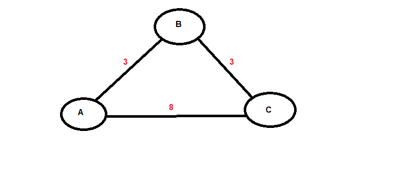

## 9.1 Student Guide: IPs and Routing
 
### Overview

Today's class will build on the first week of networking by diving deeper into how data travels across networks. Specifically, we will study how private and public IP addresses are assigned with Dynamic Host Configuration Protocol (DHCP) and Network Address Translation (NAT), and the security risks associated with both types of IPs. 

We'll also examine the various routing schemes and protocols data can use to travel to a destination. 

Lastly, we'll cover wireless networks, wireless security protocols, and wireless attacks. 

### Class Objectives

By the end of class, you will be able to:

- Explain how DHCP and NAT assist with the transmission of data from private to public networks and from public to private networks. 

- Analyze packet captures to diagnose potential DHCP issues on a network.  

- Optimize routing schemes by determining the shortest or quickest paths between multiple servers.

- Use Wireshark to visualize wireless beacon signals, capture BSSIDs and SSIDs, and determine the type of wireless security being used by WAPs. 

- Use Aircrack-ng to obtain a wireless key and decrypt wireless traffic to determine security risks.


### Slideshow

- The lesson slides are available on Google Drive here: [9.1 Slides](https://docs.google.com/presentation/d/11Wvsz4RKJtdG3l8MKEwSdQoNS9btc6pVIM_U9Zc9zyY/edit#slide=id.g4789b2c72f_0_6).

---


### 01. DHCP and NAT 

To understand the first concept of the day, we'll need to quickly review private and public IP Addresses:

  - Private IP addresses are used for devices within a Local Area Network (LAN).

  - Public IP addresses are used for devices that are publicly accessible on a Wide Area Network (WAN).

#### Dynamic Host Configuration Protocol (DHCP)

When you turn on your laptop and connect to the internet, several processes are taking place.

- If you're on a LAN and want to connect to the internet and visit a webpage, your computer needs to be assigned a private IP address. 
 
  - However, most computers do not have pre-assigned private IP addresses, so you'll need to obtain one before you can connect.

  - A networking device known as a **DHCP server** is responsible for managing and providing these private IP addresses.

**Dynamic Host Configuration Protocol (DHCP)** is a client-server based protocol on your local network that is responsible for managing and assigning IP addresses.

  - It is **dynamic**, because most devices don't have fixed IP addresses.

  - The **DHCP client** is any device that needs a dynamic IP address, e.g., your computer. 

  - The **DHCP server** is the provider of the IP addresses on your local network.

  - On a small or home network, the DHCP server is typically located on your router, but at an enterprise level could be on its own server.
  
  - DHCP is a Layer 7: Application layer protocol, that uses two **UDP** ports:
    - Port `67` is used by the server
    - Port `68` is used by the client.
  
There is a **four-step process** for requesting and receiving an IP from a DHCP Server:

  1. **DHCP Discover**: In the first step, the DHCP client needs to find the DHCP server.  It sends out a message to everyone on the local network: _"I need a DHCP server!"_
  
  2. **DHCP Offer**: In the next step, the DHCP server checks which IP addresses are available to give out. Then, the DHCP server selects an available IP address and sends it  out to the network. The DHCP server is saying: _"Here is your IP address, DHCP client."_
  
  3. **DHCP Request**: Next, the DHCP client sends a message back to the DHCP server: _"Thanks for the IP address, I will take it."_
  
  4. **DHCP ACK**: In the final step, the DHCP server is saying to the DHCP client, _"Great, glad you have the IP address, but I will need it back after a certain period of time."_ 
      - This period of time is called the **DHCP lease**. Once it expires, the DHCP server can give that IP to another device.

     - In this last step, the DHCP server issues the DHCP lease and any other configuration information the client might have requested.

#### Four-Step Walkthrough

Now we will walk through these four steps using Wireshark.

- Start Wireshark and open the [dhcp.pcap file](Resources/dhcp.pcap).

- This Wireshark capture only contains the **Four-Step DHCP process** points. 

  

First, note the following IP addresses and what each represents:
  - `0.0.0.0` is the new device trying to get an IP address from the DHCP server.

  - `255.255.255.255` is a special broadcast address used to send a message to everyone in the LAN. With this IP, you can send a broadcast packet to everyone in the network you're connected to.

  - `192.168.0.1` is the IP address of the DHCP server.
  - `192.168.0.10` is the IP address that the DHCP server provides to the device. Once the device receives it, it takes on this IP address.


  
  
   1. **DHCP Discover**: In this first step, the DHCP client needs an IP. It is temporarily using the source IP `0.0.0.0`. The DHCP client broadcasts a message to the whole LAN, represented by the destination IP  `255.255.255.255`.
  
   2. **DHCP Offer**: The DHCP server with the IP `192.168.0.1` responds to the first DHCP discover request by offering the IP `192.168.0.10`.
  
   3. **DHCP Request**: The DHCP client, still represented as `0.0.0.0`, sends a message back across the whole LAN, represented by `255.255.255.255`, saying, _"Thanks for the IP address, I will take it."_
  
   4. **DHCP ACK**: In response, the DHCP server `192.168.0.1` says to the DHCP client `192.168.0.10`, _"Great, glad you have the IP address. I will need it back after a certain period of time."_  
    - In this last step, The DHCP server issues a **DHCP lease** and any other configuration information the client may have requested.
    
- In the packet, the DHCP server is telling the client that the lease for this IP address is for one hour. 
    
  
  
We can use filters to look for DHCP packets, and more specifically, DHCP steps.     
  
Enter in the following filters:

- To view all DHCP packets:

  - Enter `dhcp` in the filter and press Enter. 


- To view specific DHCP steps:
  
  - **DHCP Discover** filter: `dhcp.option.dhcp == 1`
  
  - **DHCP Offer** filter: `dhcp.option.dhcp == 2`
  
  - **DHCP Request** filter: `dhcp.option.dhcp == 3`
  
  - **DHCP ACK** filter : `dhcp.option.dhcp == 5`
    
  - Clarify that `dhcp.option.dhcp == 4` is used for **DHCP Decline**. This is why DHCP ACK is `dhcp.option.dhcp == 5`.


#### Network Address Translation (NAT)

Now we know how **DHCP** issues a private IP address to your device. But this devices still needs to connect across a WAN, like the internet, to access public data, such as webpages.

- To connect across the internet, you need a **public IP address**. This allows messages to be sent to your device.

Public IP addresses are provided through **Network Address Translation (NAT)**. 

**NAT** is a method of mapping a private IP address to a public IP address and vice versa.

  - This mapping gets stored in a **Network Address Translation table**, typically managed by the router.

  - The router is considered the **gateway** between private and public networks. 
  
  - Traffic needing to go from private to public networks and public to private networks (or even private to private networks), needs to go through the gateway.
  
  - While NAT touches several OSI layers, it's main task is IP address translation, so it primarily works on Layer 3: Network. 
  
NExt, we'll cover the steps of the NAT process by with following example:

 - Your computer, with the private IP `10.0.0.5`, is trying to access the webpage `google.com` with the public IP of `74.0.0.1`.  
 
 - Your network's public IP address is `32.0.0.1`.
 
#### Step One

- First, your computer creates a packet with the following info: 
  - Destination IP and port: `74.0.0.1:80`.
  - Source IP and port: `10.0.0.5:49200`.


- The destination IP of the google.com webpage used to access `74.0.0.1`, and the destination port `80`—the port used for HTTP.

- The source IP is `10.0.0.5`—the private IP of your computer.

- A source port was randomly chosen from the **private port** range (`49152` to `65535`). This private port helps the router determine which device to send the response packet to. In this case, multiple devices exist on the LAN.

  - For this example, we randomly selected port `49200` from the private port range.

      
#### Step Two      

The packet is sent to the internal router, which creates a record in the NAT table. 
   
  - The record in the NAT table will look like the following:
      ```bash
                NAT TRANSLATION TABLE
        LAN ADDRESS              WAN ADDRESS
        10.0.0.5:49200           32.0.0.1:49200
      ```
    


#### Step Three
 
Your router modifies the packet and replaces the source IP with the **Network's public IP address**.
  - The new packet will have the following:
    
    - Destination IP and port: `74.0.0.1:80`
    - Source IP and port: `32.0.0.1:49200`
    
     
           	
#### Step Four

When google.com receives the packet, it creates a response packet with the following:
  
  - Destination IP and port: `32.0.0.1:49200`
  - Source IP and port: `74.0.0.1:80`
	
	
#### Step Five

Once your router receives that packet, it checks the NAT table to see exactly which device is expecting that packet.

- It will update the packet and **translate** the IP with the following new packet details:
    - Destination IP and port: `10.0.0.5:49200`
    - Source IP and port: `74.0.0.1:80`
    
     
    
#### Step Six

Your device, with the private IP `10.0.0.5`, receives the packet. You can now view `google.com`.  

   


### 03. Instructor Do: DHCP Attacks (0:10)

While there are many benefits provided by DHCP, there are also many risks that a malicious actor can exploit.

#### DHCP Starvation

E**DHCP servers** only have a limited number of IP addresses they can distribute to the devices on their local network. These available IP addresses are typically enough to cover the number of devices on their network.
  - If an attacker is able to access the LAN, they can send a large number of fraudulent DHCP messages over the network, requesting IP addresses from the DHCP server.

  - If this number is large enough, the DHCP server may run out of IP addresses to distribute.

  - If the DHCP server runs out of IPs, new, legitimate users are won't be able to receive a private address. 
  
  - This attack is known as a **DHCP starvation attack**.

You should be aware of denial of service (DoS) attacks. A DHCP starvation attack is a type of denial of service attack that impacts the **availability** aspect of the CIA (confidentiality, integrity, and availability) triad.

  - For example: If a hospital experiences this type of attack, doctors needing to connect to the internet to access critical patient information wouldn't be able to do so.
  
Now, we'll visualize a DHCP starvation attack by opening up the [DHCPAttack.pcap](Resources/DHCPAttack.pcap) file in Wireshark.

 

  - This is a capture of DHCP traffic for one network.

  - There are only milliseconds between each packet.

  - If we scan through the traffic, we notice many DHCP requests, indicating that an attacker is attempting to starve the DHCP server's IP addresses.

  - This capture is just a small sample. In a real DHCP starvation attack, there may be more than 50,000 DHCP packets.
  

One way to protect against this attack is to set a **maximum threshold**. This threshold is the number of DHCP requests per second that can be accepted by the DHCP server.  When the threshold is reached, the DHCP server ignores requests until a certain period of time.
  
#### DHCP Spoofing 

After a DHCP starvation attack occurs, an attacker can set up a fraudulent DHCP server.
  
  - This fraudulent DHCP server can falsely send out spoof messages to the DHCP clients, identifying a malicious router that clients should direct traffic to.
  
  - Once the DHCP clients make this change, they will start sending out their traffic to the malicious router.
  
  - The attacker can then use the router to capture sensitive data.
  
  - This attack is known as a **DHCP spoofing attack**.
  
  
  
  

  
  


  
We can protect against DHCP spoofing through a process known as DHCP snooping.
  - **DHCP snooping** is a process implemented on a network switch that inspects packets to confirm they're legitimate DHCP offers, and block those it determines to be unauthorized.
  

### 04. DHCP Attacks Activity 


- [Activity File: DHCP Attacks](Activities/04_DHCP_Attacks/unsolved/readme.md) 
- [DHCP Attacks Packet Capture](Resources/DHCPactivity.pcapng)
   
  
### 05. Review DHCP Attacks Activity 

- [Solution Guide: DHCP Attacks](Activities/04_DHCP_Attacks/solved/readme.md) 


### 06. Routing Schemes and Protocols 

We have covered many of the devices, protocols, and processes that move data from sources to destinations. We'll reference these devices as we cover routing schemes in the following section. 

#### Routing Schemes

Data takes a **route** from the source to the destination. **Routing** is the act of choosing the path that traffic takes in or across networks.

When network devices route their traffic, they have several **routing schemes** they can choose from. These schemes include: 

- **Unicast**: A single device delivers a message to another single specific device.
  
    - For example: A phone call between two people.

- **Broadcast**: A single device broadcasts a message to all devices on that same network.

   -  For example: A DHCP offer message is broadcast across a whole LAN.

- **Multicast**: A device sends a message to devices that have expressed interest in receiving the message.
  
    - For example: A subscription-based service sends network traffic to its subscribers. 
 
Devices choose their routing scheme based on the protocol used, as well as the intended recipients of the traffic. 
  
  - For example, if a router wants to send an ARP (Address Resolution Protocol) message to find out the owner of an IP address, it would use the **broadcast** routing scheme to send this message to all devices on its local network.

  - The router uses the broadcast routing scheme because it doesn't know which specific device to send the message to, so it broadcasts the message to all devices.

Each scheme has disadvantages:
  
  - Unicast: If the message has to reach multiple destinations, many unicast messages must be sent.
  
  - Broadcast: Since broadcast messages are sent to everyone on a network, they can cause unnecessary traffic.
  
  - Multicast: Intended recipients will need to be updated and maintained to make sure they're accurate.

#### Routing Techniques

Now that we know the various methods that devices can use to send traffic, we'll cover how to make sure routing is done *efficiently*. 

  - Just like deciding the route to drive when planning a road trip, networks need to select an optimal route to make sure network traffic is delivered efficiently.
  
  - When traffic moves from a source to a destination, data can travel across many routes, which can include devices such as other WANs, routers, or switches.
  
Networks use two primary routing techniques to determine the path for transmitting their network traffic: **static** and **dynamic** routing. 

- **Static routing** is the manual configuration of a network route, typically done by a network administrator.
    - Usually used on smaller networks or networks without many changes.

    - Advantages: lower CPU on the router, network administrator has full control of their network's routing behavior.

    - Disadvantages: fault tolerance, meaning if a device on a manually created path fails, the route can't be adjusted.
 
- **Dynamic routing** solves the fault tolerance issue by allowing the network to act on its own to avoid network blockages.

    - With dynamic routing, the network is adaptive and data gets forwarded on a different route depending on the network conditions.

    - The primary routing technique used over the internet.

    - Uses **routing protocols** to determine the best route to direct the traffic.
    
#### Routing Protocols 
    
There are several types of dynamic routing protocols that help determine the path traffic takes to reach its final destination.

Dynamic routing protocols look at two primary criteria to determine the optimal path:

1. __Distance__: The amount of devices or hops used to get the data from the source to the destination.
    
    - For example, if one route has 10 hops, and another has seven hops,  the protocol will choose the route with seven hops.

    - Dynamic routing protocols that use distance as criteria are called **distance-vector routing protocols**.  

  - Distance-vector routing protocols include:
    - **Routing Information Protocol (RIP)**: One of the oldest dynamic protocols. It uses the hops count as its main criteria for choosing the route.

    - **Enhanced Interior Gateway Routing Protocol (EIGRP)**: A more efficient distance-vector routing protocol than RIP.
  
2. **Speed**: The route is determined by the time it takes to move from source to destination. 

    - Just because a route has more hops, doesn't mean it's always slower. For example, the path with more hops might be faster if there's network congestion on the path with fewer hops.

    - Dynamic routing protocols that use speed as criteria are called **link-state routing protocols**.   

    - One link-state routing protocols is **Open Shortest Path First (OSPF)**.

    - Describe the following image to illustrate how **OSPF** works:
	
	
	  
In the above example, Device A needs to send data to Device C.
- If both are using a **distance-vector routing protocol**, such as RIP, the path would be:
  - **A** > **C** = one hop, the minimum number of hops. 

- If using a  **link-state routing protocol** such as **OSPF**, speed would be the key factor.
  - The numbers between the devices indicate the time to get from one device to the next.
    - **A** > **B** > **C** = 6
    - **A** > **C** = 8
    
  - **OSPF** would choose the path of **A** > **B** > **C**.
	    	    
    
### 07. Routing Schemes and Protocols Activity


- [Activity File: Routing Schemes and Protocols](Activities/07_Routing_Schemes_and_Protocols/unsolved/readme.md) 
- [Acme Office Network Diagrams](Resources/AcmeOffice.docx)
   


### 08. Review Routing Schemes and Protocols Activity 


- [Solution Guide: Routing Schemes and Protocols](Activities/07_Routing_Schemes_and_Protocols/solved/readme.md) 


### 09. Wireless Networking

Users were originally only able to connect to their networks through wires, but as technologies improved, they were able to connect to their networks with a remote technology called **wireless**.

  - Wireless technologies are those that communicate data without wires through air and space.

  - Wireless tech includes satellite television, cellular phones, and even garage door openers.

  - WiFi is the type of wireless technology that uses radio waves to provide wireless internet and network connections. 

  - Devices using WiFi have a standard, **802.11**, developed by the Institute of Electrical and Electronics Engineers (IEEE) used by WiFi devices to talk to each other in an agreed-upon format.

  - 802.11 has different versions, such as 802.11a, 802.11b, 802.11c, and 802.11d. These versions allow different speeds, functionalities, and security protections. 

How computers connect to WiFi networks:

  - A **wireless access point (WAP)** is a networking hardware device that connects a wireless network to a wired network.
  
  - WAPs broadcast a wireless signal called a **beacon** that computers can detect and tune into.

     - When you select "View Available Wireless Networks," on your computer or your mobile device, these devices are detecting the beacon signals.
  
  - When a WAP needs to broadcast its signal, it must identify itself.
  
    - A WAP uses a **Basic Service Set Identifier (BSSID)** to identify its MAC address in a beacon signal.
  
  - When you're looking for the wireless signal to connect to your computer, MAC addresses are not easy to recognize.
    
    - MAC addresses use six hexadecimal octets, such as `00-A4-22-01-F3-45`.
  
    - For this reason, WAPs also broadcast a **Service Set Identifier (SSID)** using a more recognizable format. The administrator of the WAP can configure this SSID. 
    
    - When you select "View Available Wireless Networks" on your device, the SSIDs are the names listed, such as "Airport Wi-fi," "Cafe_Public," etc. 
    
#### Wireless Security   
    
WiFi provides great advantages by allowing users to connect their devices to the internet wirelessly. However, it's possible for attackers to capture and view private wireless network traffic.


  - The first kind of WiFi security was **Wired Equivalent Privacy (WEP)**, created in 1999 as a security protocol using encryption to provide protection and privacy to wireless traffic.

    - WEP provided encryption between the wireless devices and WAPs.

    - Unfortunately, over time major security vulnerabilities were discovered in the WEP protocol, making network traffic using the protocol vulnerable to sniffing attacks.

    - For example, an attacker could see text data for devices connected to a WAP, giving them access to private messages, usernames, and passwords.

  - Due to the vulnerabilities discovered in WEP, a more secure and sophisticated wireless security protocol called **WiFi Protected Access (WPA)** was created in 2003.

  - In 2006, an even more secure wireless protocol was created called **WPA2**. WPA2  is the most commonly used security protocol in most WAPs today.
  
 #### Visualizing Wireless in Wireshark
 
Now, we will now use Wireshark to visualize wireless beacon signals, capture BSSIDs and SSIDs, and determine which wireless security is being used by the wireless access points.

- Open the wireless packet capture:  [Beacon.pcapng](Resources/Beacon.pcapng).

- Note that there are two beacon signals in this wireless packet capture.
  
  - The `Info` column identifies the beacon signal.
  
  - All protocols found in this capture are identified in the `Protocol` column as `802.11`, indicating they are wireless packets.
  
   

- Note that the two beacon signals have a destination address of `ff:ff:ff:ff:ff:ff`.

- `ff:ff:ff:ff:ff:ff` is a broadcast address used by devices to broadcast the packet to everyone on a network.

    

  
Wireshark has an tool for analyzing the details of wireless traffic.
  
  - Click `Wireless` in the toolbar, then `WLAN Traffic`.
  
    
  
- A `Wireless LAN Statistics` page should appear:

    
   
- On this page the SSIDs, BSSID, and wireless security protection are clearly identified.
  
    
  
- The two WAPs have the following details:

   1. **SSID** = `Ment0rNet`, **BSSID** =  `00:23:69:61:00:d0`, **Security Protection** = `WEP`.

   2. **SSID** = `Coherer`, **BSSID** = `00:0c:41:82:b2:55`, **Security Protection** = `Unknown`.
  
- Wireshark is able to detect that Ment0rNet was using WEP, but unable to detect the security being used by Coherer.

Luckily, there is a way to manually analyze the packet to determine the security being used by Coherer.

- The first step is to create a column to easily see the SSIDs of the different WAPs.

  - To do this, select one beacon packet and expand the following trees in the Packet Details frame:
    -  `IEEE 802.11 wireless LAN`  > `Tagged parameters` > `Tag: SSID parameter set`

    - Right-click `SSID: Ment0rNet` and select `Apply as Column`.
 
  
  
Now, you should easily be able to see the different SSIDs:

  

In order to view whether or not they are using WPA and find out the WPA version, expand the following trees in packet details frame:

  - `IEEE 802.11 wireless LAN` > `Tagged parameters`  > `Tag: Vendor Specific: Microsoft Corp.: WPA Information Element`
  - Right-click on `WPA Version: 1` then select `Apply as Column`.
  
- You should now be able to see WPA Version:


  

### 10. Analyzing Wireless Security Activity


- [Activity File: Analyzing Wireless Security](Activities/11_Analyzing_Wireless_Security/unsolved/readme.md) 
- [Kansas City Packet Captures](Resources/wireless2.pcapng)
   


### 11. Review Analyzing Wireless Security Activity 


- [Solution Guide: Analyzing Wireless Security](Activities/11_Analyzing_Wireless_Security/solved/readme.md) 


### 12. Instructor Do: Decrypting with Aircrack-NG (0:05)

In the previous sections, we covered multiple versions of wireless security protocols, including the weaker wireless security protocols, such as WEP.

In the following walkthrough, we will demonstrate decrypting WEP-encrypted wireless traffic using a tool called **Aircrack-NG**.

- Aircrack-NG is a free wireless decryption tool provided in Kali Linux. It is already installed it on the Ubuntu machine you are already using.

Open the packet capture [WEP.pcap](Resources/WEP.pcap)

- This is the wireless traffic from the SSID `Ment0rNet`, from the previous lesson.

  - Remember: `Ment0rNet` was using **WEP**.

Open a command line  and navigate to the location where the file is saved.

- Run `Aircrack-ng WEP.pcap`
  
  - The syntax is: `Aircrack-ng  [.pcap file name]`

Review the following while the decryption is running:
  - Aircrack-ng needs a certain number of wireless packets in order to figure out the secret key to decrypt, typically a minimum of 10,000.

    - The secret key is _not_ the same thing as the password for authenticating a wireless network.

    - The secret key is used to encrypt the wireless traffic from the device, and decrypt the wireless traffic from the WAP.
  
- Once it completes, Aircrack-ng has figure out the secret key: `D0:E5:9E:B9:04`.


We will use this key to decrypt the wireless traffic captured in Wireshark.

- Open up the same packet capture in Wireshark.

- Note that only the encrypted `802.11` packets are in this capture.

- Next, the Wireless Toolbar should be enabled. Navigate to `View` and check  `Wireless Toolbar`.


- In the Wireless Toolbar, select `802.11` preferences. A page will appear with `IEEE 802.11` pre-selected.

- On this page, confirm that `Enable Decryption` is checked and select `Edit` next to `Decryption keys`.


 - On this page, click on the `+` icon to add the key.

 - Select `WEP` and copy and paste the key, `D0:E5:9E:B9:04`.
   - **Note:** The key may not be accepted if you _type_ it into Wireshark. 
 - Select `OK` on both pages to save your changes.
 


- Return to the Wireshark capture page, and scroll through the packets.

- There are now more than just the `802.11` protocol packets.  

- Wireshark was able to decrypt the encrypted wireless traffic and it found ARP and TCP packets.


This walkthrough demonstrates how to decrypt wireless traffic that uses the weak WEP wireless protocol. 

- While WPA and WPA aren't completely protected from similar attacks, they are much more difficult to decrypt and provide better protections.

Cybercriminals have several methods of finding these weak wireless security routers:

  - **Wardriving** is the act of physically driving around an area with a computer and a wireless antenna to find wireless LANs that may be vulnerable.
  
  - Once a cybercriminal determines potential vulnerable targets, they mark the locations on the street with symbols in chalk so they can attempt to exploit these access points at a later time. This is called **warchalking**. 
  
  - Some cybercriminals have evolved to use drones to find vulnerable access points, a process known as **warflying**.
  
While all the above methods are attacks that use a legitimate wireless access point, cybercriminals can also create a fake wireless access point, called an **evil twin**.

  - With an evil twin, an attacker can make a fake SSID to trick unsuspecting users into connect to the attacker's wireless access point.
    
    - For example, an attacker can set up a fake a WAP with the SSID `Starbucks_FreeWifi` in a Starbucks coffee shop. Once the user is connected, the attacker can capture and view their traffic.
  
  
### 13. Wireless Attacks Activity 

- [Activity File: Wireless Attacks](Activities/14_Wireless_Attacks/unsolved/readme.md) 

- [Kansas City WEP Packet Capture](Resources/kansascityWEP.pcap)
   

### 14. Review Wireless Attacks Activity 


- [Solution Guide: Wireless Attacks](Activities/14_Wireless_Attacks/solved/readme.md) 

-------

© 2020 Trilogy Education Services, a 2U, Inc. brand. All Rights Reserved. 
