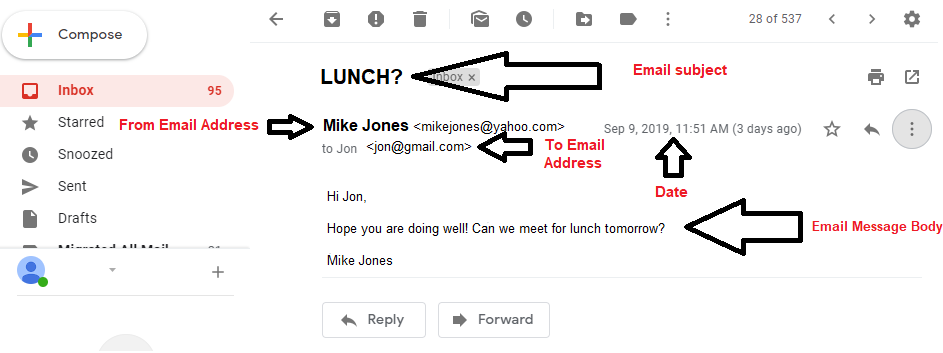

##  9.2 Student Guide: Email Networks and Security
 
### Overview

Today's class builds on previous networking concepts, with a focus on sending, receiving, and securing emails. We will also take time to review the various topics covered in the previous two weeks of classes.
	

### Class Objectives

By the end of class, you will be able to:

- Validate DNS records using `nslookup`.

- Describe the process, protocols, and headers associated with email communication.

- Analyze email headers to identify suspicious content. 


### Lab Environment

You will use your local Vagrant virtual machine for today's activities. 

- Student access:
  - Username:`sysadmin`
  - Password: `cybersecurity`
 

### Slideshow

- The lesson slides are available on Google Drive here: [9.2 Slides](https://docs.google.com/presentation/d/1la0bC0QtxxfJKgU7T8nSSX9xSxOX0gmRN8vUdcufrV4/edit#slide=id.g4789b2c72f_0_6)


---

### 01. Welcome and Introduction 

In the previous class, we covered:    

- Networking concepts including DHCP, NAT, routing protocols, and wireless.

- How each of these networking concepts assists with transmitting data across networks to reach its destination.

This lesson will build upon the previous class with networking concepts related to sending, receiving, and securing emails. 
	
We will cover the following concepts in the first half of class:

- The various DNS record types and how they assist with sending and securing emails.

- Email protocols and the structure of an email.

- Email security issues and how to identify them.

The second half of the class will review all the networking concepts covered up to this point.

### 02. DNS Record Types 

The **Domain Name System (DNS)**  is the "phone book of the internet." We've covered how DNS is used to translate a domain name into a numerical IP address.
  
  - For example, DNS translates the domain `www.google.com` into the IP address `64.233.177.139`.

  - The domain name needs to be translated because computers connect to each other with IP addresses, not domain names.

  - This translation of a domain to an IP address is a type of **DNS record**.

Occasionally, DNS needs to provide other details about a domain.
  
  - For example: When you send an email, your email server needs to find the mail server name for the domain receiving the email.
  
  - These details are provided by the many other **DNS record types**. 

**DNS zone file** is an actual file containing all the DNS records for a particular domain.

  - A DNS zone file lives in a DNS server.
  
  - A DNS zone file contains a **Time to Live (TTL)** indicating how long a **DNS cache** will remember the information in the file before having to request an updated copy from the DNS server.

  - A DNS zone file also contains the DNS records with information about the domain.
  
#### DNS Record Types  
  
While there are many available DNS records types, a handful of common DNS records types are important to know:

- **A record**: Translates a domain to an IP address.
  - For example: An A record for widgets.com points to `23.43.54.234`.

- **PTR record**: The opposite of an A Record, the PTR record translates an IP address into a domain.
  - For example: The PTR record  of `23.43.54.234` points to widgets.com.

- **CNAME record** (_canonical name_): An alias record used to point one domain to another domain.

  - For example: A CNAME record pointing widgets2.com to widgets.com so a second DNS record doesn't need to be created for widgets2.com.

- **SOA record** (_start of authority_): Contains administrative details about a domain, such as:
  - Email address of the administrator.
  - TTL value.
  - When the domain was last updated.

- **NS record** (_name server_): Indicates which server contains actual DNS records for a domain. Also known as **authoritative name server**.

    - For example: A device wants to know the IP address for widgets.com, and makes a DNS request asking which are the authoritative name server for widgets.com. Once the **NS record** is confirmed, the device can trust this record for obtaining the IP address (or any other DNS record type) from the domain widgets.com.
  
 A domain can have multiple NS records for redundancy (if one fails, another is available).
  - For example: widgets.com has two name servers containing its DNS records:
    - `ns1.dnscompany.com`
    - `ns2.dnscompany.com`

  - NS records can also be used to point **subdomains** to name servers. For example, we can point the subdomain marketing.widgets.com to a DNS server of ns3.dnscompany.com.
  
#### DNS Records and Email Communication

There are DNS record types that assist with email communications. 

- **MX record** (_mail exchange_): Directs emails to a specific mail server for a domain. 

  - For example: widgets.com has a mail server called mailhost.widgets.com.
    
    - If an email is sent to bob@widgets.com, the sender will validate that the MX record for widgets.com is `mailhost.widgets.com`.
    
    - The sender then directs the email to the mail server mailhost.widgets.com.
  
  - Just like NS records, domains can have multiple MX records for redundancy, in case one goes down or can't handle a large amount of traffic.  

- MX records have **preferences** for setting the primary and secondary mail servers. 

  - These preferences are set with numerical **preference numbers** in front of the mail server name. The lower the preference number, the higher the priority.

  - For example: gadgets.com has the following MX records:
      - `10  mailhost_Atlanta.gadgets.com`
      - `5  mailhost_NewYork.gadgets.com`
      - `20  mailhost_LA.gadgets.com`

  - If an email comes into gadgets.com, it is first received by the New York mail server, because it has the lowest preference number. If the New York server is down, it will try Atlanta. If Atlanta is down, it will try the LA mail server. 


**TXT record** (_text_): Originally created to include human-readable notes, such as associated company name. These also include computer-readable data. 

  - An example of computer-readable TXT data is the **SPF record** (_sender policy framework_), which determines if an email is from a trusted server.

    - Not all organizations send emails from mail servers within their domain.

    - Their mail servers may exist in another domain, or another organization may send marketing emails on behalf of an organization.

  - An SPF record indicates which mail servers are allowed to send emails on behalf of a domain.

  -  An SPF record's main purpose is to prevent spam, phishing, and email spoofing, by detecting emails that may have a forged sender email. 

An example of an SPF record is: `v=spf1 ip4:192.41.100.193`.

- Syntax:

  - `v=`: The version of SPF used.
  - `ip4:`: Indicates that an IPv4 host is allowed to send emails.
  - `192.41.100.193`: IP of the mail server allowed to send emails on behalf of the domain. 
  
SPF records Example:  

  - widgets.com's DNS SPF record indicates that `23.43.54.235` and `23.43.54.236` are the IP addresses of mail servers allowed to send emails on its behalf. 

  - gadgets.com received a suspicious email from a widgets.com email.
  
  - When the receiving email server at gadgets.com receives the email, it completes the following steps:
    
    1. Check the sending mail server's IP address, `12.54.54.23`.
    
    2. Validate the DNS record of widget.com's SPF record to confirm the sending mail server's IP address is either `23.43.54.235` or `23.43.54.236`.

    3. Since the sender's IP is `12.54.54.23` (not `23.43.54.235` or `23.43.54.236`), gadgets.com's mail server can identify the email as spam and potentially reject it or send it to the recipient's spam folder.
      

#### `nslookup`

Networking and security professionals often need to look up a domain's DNS records.

  - For example: If emails aren't reaching their final destination, we would check the MX DNS record for that particular domain to make sure it's accurate.

There is a command-line tool called `nslookup` (_name server lookup_) that allows us to easily look up the DNS records of any domain.

- `nslookup` is typically available on most operating systems without having to be installed.

#### `nslookup` Walkthrough

- Open the command line in your terminal and enter the following command:

   `nslookup gadget.com`
      
  - The syntax for the request: `nslookup`  `[domain]`.

- Press Enter and your results should return in the following format:

    ```
    Server:	   127.0.0.53
    Address:   127.0.0.53#53

    Non-authoritative answer:
    Name:	    gadget.com
    Address:    162.243.110.34

    ```

- Output breakdown:
    ```
    Server:    127.0.0.53
    Address:   127.0.0.53#53
    ```
  - Your default DNS server and its associated IP address.
  
  - *Note: Results will vary, based on your default DNS server.*
    
        
  ```
  Non-authoritative answer:
  ```

   - Indicates that this information is cached and not from the domain's primary (authoritative) name server.
   
    ```
    Name:    gadget.com
    Address: 162.243.110.34
    ```       
   - The result from the A record, indicating the IP address of gadget.com is  `162.243.110.34`. 
   
`nslookup` can look up specific DNS record types:

- Enter the following command:

    `nslookup -type=NS gadget.com`
   
- Syntax:

  `nslookup`   `-type=[NS record type]`   `[domain]`
    
- Press Enter. Your new results should include the two name server records and their associated IP addresses:

    ```
    Server:		    127.0.0.53
    Address:            127.0.0.53#53

    Non-authoritative answer:
    gadget.com	    nameserver = ns1.dnsnameservers.net.
    gadget.com	    nameserver = ns2.dnsnameservers.net.

    ```

- You can look up other DNS record types by changing the value `NS` to another DNS record type. 
 
   For example: 

   - To look up the MX record:

       `nslookup -type=MX gadget.com`
    
   - To look up the A record:
    
       `nslookup -type=A gadget.com`
    
   - To look up the SOA record:

       `nslookup -type=SOA gadget.com`
  

### 03. DNS Record Types Activity  

- [Activity File: DNS Record Types](activities/03_DNS_Record_Types/unsolved/readme.md) 


### 04. Instructor Do: Review DNS Record Types Activity (0:10)

- [Solution Guide: DNS Record Types](activities/03_DNS_Record_Types/solved/readme.md) 


### 05. Introduction to Email Networking 

While it seems simple to send an email from one address to another, there are many processes and technologies working in the background to make this magic happen.

- Understanding how this detailed process works can assist network and security professionals in identifying email issues or attacks.

The following scenario is used to illustrate the steps involved in sending and receiving an email.

**Step 1: Bob uses Microsoft Outlook to type and send an email to Alice.** 

- Bob, whose email is Bob@bob.com, composes an email to send to Alice, whose email is Alice@alice.com.

- Once Bob clicks **Send**, the email is forwarded to Bob's company's email server.

- The email server is also referred to as the **MTA** (mail transfer agent).

**Step 2: Bob's mail server finds Alice's mail server.**

- Bob's mail server does a DNS lookup against alice.com to determine its mail server. 

- Bob's mail server gets this information from alice.com's MX record.

**Step 3: Bob's mail server forwards the email to Alice's mail server.**

- Using a protocol called **SMTP** (Simple Mail Transfer Protocol), Bob's mail server sends the email to Alice's mail server.

- SMTP uses port `25` and is part of Layer 7: Application of the OSI model.

**Step 4: Alice pulls Bob's email onto her local computer to read it.**

- Bob's email is currently sitting on Alice's email server, and Alice needs to pull it from this server in order to read it.

- Two protocols can be used to transfer the email to Alice's local computer:

    1. **POP3**
        - With POP3 (Post Office Protocol), when Alice logs in and checks her email from Bob, the POP3 mailbox doesn't keep a copy of the email.

        - Alice would not be able to log into another computer to view Bob's email, as it already has been downloaded from the mail server.

        - POP3 has a security benefit, as the email will not exist on a server the recipient doesn't control.

        - POP3 uses port `110` and is part of Layer 7: Application of the OSI model.
    
    2. **IMAP**

        - With IMAP (Internet Message Access Protocol), a copy of the email is kept on the server.

        - Even after Alice logs in and check her email from Bob, she can check it again from another computer.

        - IMAP has the benefit of preventing data from being lost, as it backs up emails on a server.

        - IMAP uses port `143` and is part of Layer 7: Application of the OSI model.
    
Understanding these steps is important for diagnosing and troubleshooting email issues.
  - For example: If employees at your organization are able to send emails but not receive them, it's possible there is a DNS issue, or your DNS MX record may possibly be misconfigured.
    
#### Email Headers

To complete the steps in the process described above, emails have specific **headers**, which contain fields that assist with the process.

There are many header fields that can be used for emails, some required and some optional.

- You will be familiar with some fields, as they are displayed in standard email clients: 

    - **From email address:**  (Required) The email of the sender. 
    - **To email address:** (Required) The required email of the recipient. 
    - **Email subject:** (Optional) The field for describing the subject of the email.

    - **Email message body:** (Optional) The field containing the message.
    - **Date/Time**: Date and time the email was sent. This is added by the email client.
      
           
      
- Some less familiar fields are available by viewing the complete, raw email in your email client.
    
- To view the raw email in Gmail, click on the three vertical dots on the right side of the email.
  
    
  
- Select "Show Original" from the dropdown to view the raw email.
  
   
  
- Scroll down on this page, and you will see the raw email.
  
  
  
- Some of the most important fields in this raw email are:
  
  - **Return-Path**: Specifies the sender's return email.

  - **Delivered-To**: Specifies the recipients email. 

  - **Received**: Shows a list of mail servers, illustrating the path taken by the email from its source to destination.

    - This is an important field because it contains the IP address of the originator of the email.

  - The image only shows one mail server, but occasionally the Received header will show an email passing through multiple mail servers.

   
    
  - **Message-ID**: A unique string created by the sending mail server as an identifier of the email.

  - **Received SPF**: The SPF verification field, which we will cover in more detail in the next activity.
    
   
   
You may notice email headers that begin with an "x", such as: **x-mailer**, **x-Google-Smtp-Source**.

  - The "x" signifies an e**x**tension of the standard headers. 

  - These header records are optional and are typically used for custom applications.  
  - They can also provide additional services for tracking, reporting, and authentication.  
   


### 06. Email Networking Activity 

- [Activity File: Email Networking](Activities/06_Email_Networking/unsolved/readme.md) 
- [Suspicious Emails](Resources/emails.pdf)

### 07. Review Email Networking Activity 

- [Solution Guide: Email Networking](Activities/06_Email_Networking/solved/readme.md) 


### 08. Instructor Do: Email Security Issues (0:15)

While email provides many benefits, email also comes with many security concerns.

One of the top email concerns for most users and businesses is **spam**. Introduce spam by covering the following:

  - Spam is not an acronym. It is defined as "the sending of unsolicited emails."

  - Over 60% of all emails can be identified as spam.

  - While spam isn't inherently dangerous, a large number of spam emails can be very inconvenient for organizations.

  - Many email systems have developed advanced methods for detecting and stopping spam emails.

    - These methods involve using SPF records, matching lists of known spam senders, and keyword identification.
 

A second top email issue is the sending of confidential emails across **unencrypted channels**.  

  - Emails are almost always **not** encrypted.

  - Emails are typically routed across multiple mail servers before reaching their destinations, opening up the risk of email interception and views by unauthorized users.
  
  - Several technologies can be used to encrypt confidential emails such as: 

    - **PGP** (Pretty Good Privacy)
    - **S/MIME** (Secure/Multipurpose Internet Mail Extensions)
 
  - The challenge of PGP and S/MIME is that they involve coordination and setup between the email sender and the email receiver.
  
A third email security issue is  **email spoofing**.

  - Email spoofing is when an email is designed to trick the receiver into believing it is coming from a trusted source.
 
 - Email spoofing works with **phishing**:

    - Phishing—the attempt to gain sensitive information from an email recipient—is often accomplished through email spoofing.
     
      - For example: A scammer sends you an email pretending to be from your bank, asking you to update your username and password.
      
      - At first glance, the spoofed email looks like it legitimately came from your bank.
    
      - The email may contain a **phishing URL** that has a fake bank login page, which maliciously captures your banking username and password. 

   - According to a recent report from Microsoft, phishing attacks are by far the most common cybersecurity threat— increasing a massive 250% since the previous report was published. [(Source: CPO Magazine)](https://www.cpomagazine.com/cyber-security/phishing-attacks-now-more-common-than-malware/)
 
Fortunately email spoofing can be detected with several methods, which analyze the raw email headers in sent emails.
 
#### Method One: the *From* Email Header
 
The simplest way to check for phishing is to look at the From email header. 

 - Spammers and phishers often disguise their true source email, changing the displayed email source to a name the recipient will trust or recognize. For example:

   - You check your inbox and see an email from "Citibank."

   - When you view the raw email header in either the "From" field, or the "Return-Path," the true email address of the sender is displayed.

   - The email address is sdfs2344dsf@yahoo.com—it doesn't have a @citibank domain. This is an indicator of a malicious email.

- Another method used by phishers is to make a slight change to the name of the sending domain.

   - Look closely at the email for any small misspellings.

    - For example, a phisher could use the from email domain of @cittibank.com, with an additional "t" in the domain.
     
    
     
 #### Method Two: the *Received-SPF* Email Header
 
 As we mentioned earlier, the SPF Record is used identify which mail servers are authorized to send emails on behalf of a domain.

 - Received-SPF is an email header that displays the results of validating the SPF record.

 - Received-SPF uses the IP address from the Received field and determines if it's an IP of an authorized sender.
  
    - If the IP is accepted it will display as a "pass."
      
      For example: 
      
      `Received-SPF: pass (google.com: domain of michael@acme.com designates 76.87.4.15 as permitted sender)` 
    
    - If the IP is not accepted it will display as a "fail."
      
      For example: 
      
      `Received-SPF: fail (google.com: domain of michael@acmers.com does not designate 174.81.74.11 as permitted sender)`
     
#### Method Three: the *Received* Email Header  
     
The Received header includes the source IP of the mail server that sent the email.

 - There are many web tools available to look up IP address information. 
 
   - For example, the [ARIN Whois/RDAP tool](https://search.arin.net/rdap/).
 
 - While this isn't always the simplest way to validate a legitimate email sender, it is used by security professionals to provide additional information about the sender.
 
Provide the following example of a case in which this method would be useful: 

   - You receive an email from a US-based government organization, such as the IRS.

   - The IP address from the Received header record is `41.32.23.52`.

   - Looking up this IP on arin.net shows the location of the IP is Egypt.

   - This indicates that the email is probably not legitimate, as it's unlikely that a US-based government organization would have a mail server based in Africa.
   

Many email systems have built-in technologies that automate the above methods to identify and detect spoofed and phishing emails.  
  
  - However, these automated systems aren't perfect, and can miss spoofed and phishing emails.

  - Therefore, it's important for security professionals to understand how to use these methods themselves.
   
### 09. Email Security Activity 


- [Activity File: Email Security](Activities/09_Email_Security/unsolved/readme.md) 


### 10.  Review Email Security Activity 


- [Solution Guide: Email Security](Activities/09_Email_Security/solved/readme.md) 


### 11. Networking Concepts Review Activity 


- [Activity File: Networking Review](Activities/13_Networking_Review/unsolved/readme.md)


### 12. Review Networking Review Activity 

- [Solution Guide: Networking Review](Activities/13_Networking_Review/solved/readme.md)

### 13. Networking Attacks Activity


- [Activity File: Networking Attacks Review](Activities/16_Networking_Attacks_Review/unsolved/readme.md)

### 17. Review Networking Attacks Activity

- [Solution Guide: Networking Attacks Review](Activities/16_Networking_Attacks_Review/solved/readme.md)

-------

© 2020 Trilogy Education Services, a 2U, Inc. brand. All Rights Reserved. 