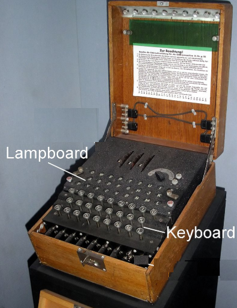
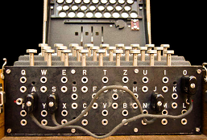
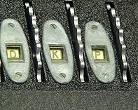
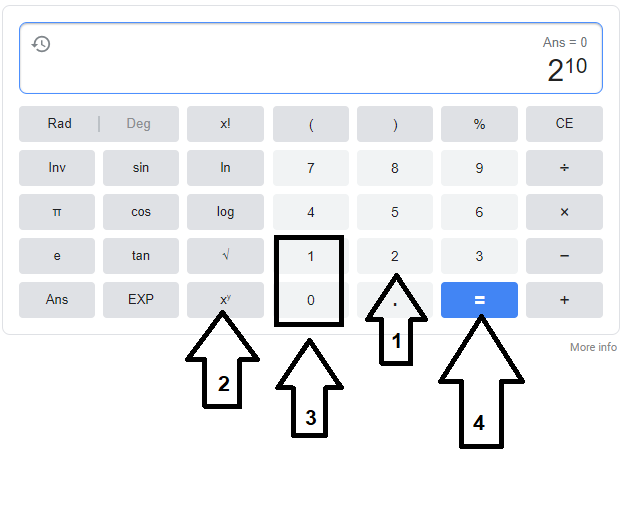
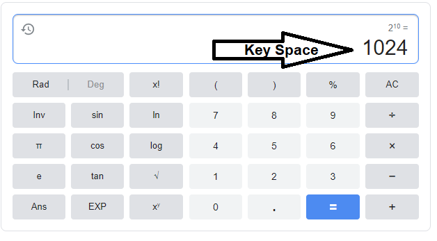

## 10.1 Student Guide: Introduction to Cryptography 

### Overview

In today's class, you will be introduced to the fundamental concepts of cryptography.

### Class Objectives

By the end of class, you will be able to:

  - Use basic transcription and substitution ciphers and keys to encrypt simple messages. 
  - Understand how encryption supports secure communication through the PAIN framework. 
  - Differentiate between encoding and encrypting. 
  - Calculate the strength and efficiency of various encryption levels.
  - Use symmetric encryption tool Open SSL to confidentially transmit secure messages.

### Slideshow

The lesson slides are available on Google Drive here: [10.1 Slides](https://docs.google.com/presentation/d/1PcMjxAML8qDOAQL1vmaVjHss4RgMjv-S4LMsxOxOwg8/edit#slide=id.g4f80a3047b_0_990)


### Student Guide

Distribute a student-facing version of the lesson plan: [10.2 Student Guide](StudentGuide.md)


-------
 
### 01.  Introduction to Cryptography 

This unit will cover the exciting world of cryptography!

One of the core concepts of cybersecurity is confidentiality, which is focused on keeping information and communications secure from unauthorized parties. 

It is critical for organizations to keep private information secure. Information getting into the wrong hands can cause significant financial and reputational impact.

  - For example:

     - A doctor loses a laptop containing patients' private medical records.

     - An unauthorized person finds the laptop, opens it, and is able to view the private data.

     - This can impact the reputation of the doctor _and_ the hospital responsible for maintaining the data.

     - This can also have financial impact, as a leak can result in significant legal fines for disclosure of sensitive data. 
     
A primary method for keeping information secure is  **cryptography**.  

  - Cryptography is the art and science of keeping information secure through the use of  mathematical concepts and techniques.
  
This week we will be learning the various methods and techniques of cryptography, and how they are applied with current technologies and devices we use every day.
  
### 02. The History of Cryptography

While cryptography seems like a modern concept, cryptographic techniques were actually in use in early human civilizations.

As these early human civilizations engaged in battles, politics, and fights for supremacy, individuals needed to find methods to communicate securely with each other and keep their communications hidden from enemies.

#### Caesar Cipher

One of the earliest methods of applied cryptography is the **Caesar cipher**.

  - Julius Caesar, a Roman general, needed a method for communicating securely with his military.
  
  - Caesar needed a method that would make his communications illegible to his enemies. For example:

     - Suppose Caesar needed to tell his military: "Launch an attack at sunrise."

     - He needed to be sure this communication, if intercepted, would not be understood by anyone outside his military.

  - Caesar developed a method for hiding his communications, which later came to be known as the Caesar cipher.
  
  -  A **cipher** is a method of designing secret or hidden messages.

The Caesar cipher is a method of **encryption**—a process of modifying a message or information to prevent unauthorized parties from accessing it. 

   - Encryption takes a **plaintext** (readable text) message and converts it to an unreadable message, known as the **ciphertext**.
   
   - For example:
     - Caesar's plaintext message would be "Launch an attack at sunrise."
     - Once encrypted, the ciphertext message could be "Odxqfk dq dwwdfn dw vxqulvh."
     - Even if Caesar's enemies intercept the ciphertext, they would not understand the message.
     
The goal of the Caesar cipher is not only to prevent unauthorized parties from reading the communication, but to also allow authorized parties, such as Caesar's military, to receive and understand the hidden message.

  - This is accomplished through **decryption**.

  - Decryption takes the ciphertext and converts the message back to the readable plaintext.

    - In the previous example, the military would receive the ciphertext message "Odxqfk dq dwwdfn dw vxqulvh."

    - Once decrypted by Caesar's military, it would be converted back to the plaintext message of "Launch an attack at sunrise," and Caesar's military would understand the message.
 
The Caesar cipher is a simple method in which each letter in the message is replaced by a letter located a fixed number of positions further down the alphabet.

  - The first step is to select this fixed number, known as a key, to determine how many letters to shift in the alphabet.

  - The **key**, or cryptographic key, specifies how plaintext is converted to ciphertext and vice versa.
  
  - The shift moves to the right. For example, with the letter **A**:
    - A shift (or key) of one would result in a **B**.
    - A shift (or key) of two would result in a **C**.
    - A shift (or key) of three would result in a **D**.
    - If the shift passes the letter **Z** it would start back at **A** and continue.
      
This method is used to encrypt a plaintext message:

   - To encrypt "hello" with a shift or key of two:
      
      
      - H > J
      - E > G
      - L > N
      - L > N
      - O > Q
      

  - This results in a ciphertext message of "jgnnq."

  - To decrypt "jgnnq," we would apply the same rule in reverse, shifting the letters back two characters in the alphabet.
   

    - J > H
    - G > E
    - N > L
    - N > L
    - Q > O


  - This decryption takes the ciphertext of "jgnnq" and returns it to the plaintext of "hello."
  
While the Caesar cipher provided confidentiality to Caesar many years ago, it's only used today for educational purposes, due to how easily it can be decrypted. 

Over time, individuals and countries adopted new techniques and technologies for more advanced encryption methods.
    
#### The Enigma Machine

As technology advanced, applied cryptography became more complex and harder to crack.

After the end of the World War I, a German engineer named Arthur Scherbius developed an advanced encryption machine called the **Enigma machine**. 

- The Enigma machine became a popular method used by the Germans during World War II to transmit encrypted messages.

  - The Enigma machine is designed to scramble the 26 letters of the alphabet.

  - It allows for billions of ways to encrypt a message, which made it extremely difficult for other nations to decrypt German messages during the war.

  - The machine is an electromechanical device containing a keyboard and a lampboard.

    - The keyboard is similar to the keyboard on your computer, used to type (press) each letter of a message.

    - The lampboard looks similar to a keyboard, but the letters aren't pressed. Lampboard letters are simply lit or not lit after each key on the keyboard is pressed.
    
         
    
    
Let's look at how an Enigma machine was used to create keys and encrypt and decrypt messages. 
   
- **Configuration**

  Settings for the Enigma machine were configured by the user.

  - These settings included: 

    - Plugging wires into specific slots. 
      
      
      
    - Arranging rotor settings.
      
      
      
  - While the details of these settings aren't important, it's important to understand that how the user configured them determined how the data was encrypted.

  - The settings selected by the user were the key.

  - These exact settings needed to be used by the recipient for decryption.

- **Encryption**
    
  - Next, an individual typed the plaintext using the machine's keyboard, one letter at a time.

  - After each letter was pressed on the keyboard, another letter lit up on the machine's lampboard.

  - The illuminated letters were documented, creating the ciphertext.

  - The ciphertext was transmitted to the recipient.

  
- **Decryption**
 
  - The recipient received the secret key (the configuration) in advance.

  - The recipient used the key to configure their machine with the exact settings used for encryption.

  - Ciphertext letters were entered one at a time on the keyboard, showing the original plaintext in the lampboard.

  - The illuminated letters were documented one at a time, converting the ciphertext back to plaintext. 
  
  
#### Cracking the Enigma Cipher
   
During the height of World War II,  Alan Turing, an English mathematician and computer scientist, developed a method to exploit the weaknesses of the Enigma machine's design.  

  - Turing developed a machine known as the Bombe, which helped decrypt the most complex versions of the Enigma cipher.

  - This was considered one of the most important victories of the Allied forces during the war, as Turing's Bombe machine was able to prevent many attacks by decrypting secret messages sent by the Germans.
  
This is a brief introduction to the Enigma cipher. If you're interested in researching more about this topic:
   
   - Refer them to the Wikipedia page on [Cryptanalysis of the Enigma](https://en.wikipedia.org/wiki/Cryptanalysis_of_the_Enigma).
   
   - Refer them to the film _The Imitation Game_, about Alan Turing and how he cracked the Enigma cipher.

  
 #### Summary

   - **Plaintext**: Information in human-readable form. 

   - **Ciphertext**: Plaintext message that has been encrypted into an unreadable form.

   - **Encryption**: The process of converting plaintext to ciphertext.

   - **Decryption**: The process of converting ciphertext to plaintext.

   - **Cipher**: A method of performing encryption or decryption.

   - **Key**: A parameter specifying how plaintext is converted to ciphertext and vice versa.

   - **Caesar cipher**: A type of cipher that shifts the letters in the alphabet by a fixed number.

   - **Enigma cipher**: A type of cipher used by Germany in World War II to encrypt messages.
   

### 03. Caesar Cipher Code Names Activity 


- [Activity File: Caesar Cipher Code Names](activities/03_Caesar_Cipher_Code_Names/unsolved/readme.md)


### 04. Review Caesar Cipher Code Names Activity 

- [Solution Guide: Caesar Cipher Code Names](activities/03_Caesar_Cipher_Code_Names/solved/readme.md)


### 05. Introduction to Character Encoding

We've just covered several methods that were historically used to hide a sender's communication.

  - Each of these methods uses a letter cipher to scramble a plaintext message and create a ciphertext.

  - While letter ciphers were useful in the past, these methods wouldn't work today, since most communications are transmitted with digital data.

  - Remind the class that, as previously covered, computers transmit digital data with **binary**.  

  - Therefore, encrypting data on computers requires a method of alphanumeric representation known as **character encoding**. 

#### Encoding

**Encoding** may look similar to **encryption**, but it has a very different goal:

  - The goal of encoding is not to keep information secret, but to transform data so it can be properly used by a different type of system.
    
    - For example, transforming text to binary so data can be digitally transmitted.

  - Data is encoded with a publicly-available scheme that can be decoded by anyone.  

  - Encoding does not use a key. 

#### Encryption

  - The goal of encryption is to keep information from being accessed by unauthorized parties. Encryption

  - Encryption uses a key, which encrypts and decrypts the data.
  
There are many encoding schemes available. The primary types we will review are: binary, ASCII, hex, and octal. 
  
#### Binary Encoding

Binary is the basis of digital communications.

  - Most encryption of digital communication takes place at the level of binary data. Readable text is first converted to binary before applying encryption. 


Character encoding with :

  - Eight bits = one byte.

  - One byte is made up of `1`s and `0`s, and can range from `00000000` to `11111111`. 

  - Each byte can represent a number, which is called a **decimal**.

    - For example: 

      - The byte `00000000`  represents the decimal 0.

      - The byte `11100000`  represents the decimal 224.
    
      - The byte `11111111`  represents the decimal 255.

   - This conversion is called a **binary to decimal encoding**.
   
#### ASCII Encoding   
 
Since each byte can only represent a number from zero to 255, and since we read text with letters, we need a method to convert these numbers to letters.

This is accomplished with **ASCII encoding**:

  - Open the [ASCII Table website](http://www.asciitable.com/) for reference.

  - ASCII stands for _American Standard Code for Information Interchange_.

  - ASCII encoding is the representation of every upper and lowercase letter of the English alphabet, as well as common punctuation marks, and graphic and mathematical symbols, as a number between zero and 255.

    **Note**: Zero to 127 is considered the standard ASCII, and 127 to 255 is considered extended ASCII.

  - For example:

    - The decimal value **84** represents the character **T**.

    - The decimal value **118** represents the character **v**.

 - This conversion is called **decimal to ASCII encoding** or **decimal to text encoding**.   

- The ASCII Table website shows other conversions as well, such as hex and octal.

#### Hex and Octal Encoding

**Hex encoding**:

  - Binary representation has the disadvantage of resulting in very long numbers. 

    - For example, the binary representation of the word "hello" is `1101000 1100101 1101100 1101100 1101111`.

  - Hex, short for _hexadecimal_, is an efficient number system that exists partly to allow for more compact representations of binary data.  

  - Hex is a numeric system made up of 16 symbols, using the letters A through F and the numbers zero through nine.

    - For example:

      - The hex value **52** represents the character **R**.

      - The hex value **7A** represents the character **z**.

    - The hex representation of the word "hello" is **68 65 6c 6c 6f**.

 - This conversion is called **hex to ASCII encoding** or **hex to text encoding**. 
 
Finally, briefly introduce **octal** as a system that applies a principle similar to hex, but uses digits zero through seven. 

  - For example: The octal value **042** represents the decimal **34**.


You won't be expected to translate between the various character encodings themselves—that's a job best left to translation tools. However, the underlying purpose and theory of character encoding is an important concept. 
  
While it may seem difficult to encode and decode with these various schemes, there are many free online resources available that can help. 

#### Encoding and Decoding Tools

Here are two popular, free encoding decoding websites:

  - [Browserling](https://www.browserling.com/)
  - [Rapid Tables](https://www.rapidtables.com/)
  
We will complete a brief walkthrough of decoding a binary message using Browserling.

- First, access the [Binary to Text Converter](https://www.browserling.com/tools/binary-to-text) page.

  - This page is specific to converting binary data to text.

  - Scroll to the bottom of the page and illustrate that there are many other conversions available.

- We will decode the binary message: 

    `01001001 00100000 01101100 01101111 01110110 01100101 00100000 01100011 01110010 01111001 01110000 01110100 01101111 01100111 01110010 01100001 01110000 01101000 01111001 00100001`

   - Copy and paste this binary data into the box on the screen and select **Convert!**

- The message should show that the binary data represents the text data "I love cryptography!"

 #### Summary
 
   - The goal of encoding isn't to keep a message secret, but to transform data to be used by another system.

   - Encoding, unlike encryption, does not use a key.

   - Encoding is often used to transform digital text data into binary data, where encryption commonly takes place.

   - There are many types of encoding schemes available and each is relevant for different circumstances.

   - There are many free online resources for encoding and decoding messages, such as [Browserling](https://www.browserling.com/) and [Rapid Tables](https://www.rapidtables.com/).
 
### 06. Decoding Activity 

- [Activity File: Decoding](activities/06_Decoding/unsolved/readme.md)
- [Message Left at Mayor's House](resources/Message_left_at_Mayor's_House.txt)

### 07. Review Decoding Activity

- [Solution File: Decoding](activities/06_Decoding/solved/readme.md)


### 08. Goals of Cryptography 

So far we have covered and illustrated how cryptographic concepts can be used to keep messages private and confidential.

  - Modern cryptography can serve other goals, illustrated with the cryptographic concept known as the **PAIN model**.
  
  - The PAIN model is an acronym that stands for the core goals of cryptography:

    - **P**rivacy (confidentiality)
    - **A**uthentication
    - **I**ntegrity
    - **N**on-Repudiation
    

#### 1.  Privacy and Confidentiality
 
We have already discussed the cryptography goal of **privacy and confidentiality**, which refers to keeping data secure from unauthorized parties.

 - Confidentiality applies to two types of digital data:

   - **Data at rest**: Static data, such as that stored on a hard drive or database.

     - For example, data stored on your laptop.

     - To protect the confidentiality of this data at rest, we would encrypt the laptop's hard drive.

   - **Data in motion**: Data moving between devices on a network.
     
     - For example, Bob sends an encrypted email to Alice saying "The meeting is at noon."
     
     - To protect the confidentiality of this data in motion, the email data that moves across the internet between Bob and Alice would need to be encrypted.
 
 
#### 2. Authentication
 
An attacker can send an encrypted message claiming to be someone they are not. Therefore, another goal of cryptography is **authentication**.
 
Authentication confirms the identities of the sender and receiver of data.

For instance, in the previous example with Bob and Alice:
 
  - Bob sends an encrypted email to Alice, saying "The meeting is at noon."

  - Alice receives the email from Bob.

  - Later, Alice receives another email claiming to also be from Bob, but it was actually sent by a scammer named Tim.

  - The scam email says "Cancel the meeting until further notice."

  - Without any authentication methods to confirm the email actually came from Bob,  Alice could be tricked into thinking the meeting was cancelled.

 Without authentication, an attacker can send data that is encrypted, but claims to be from someone it's not.

 #### 3. Integrity
 
Even with encryption (privacy) and authentication, an attacker can alter the contents of a message. 

 - This brings us to the next cryptography goal, **integrity**.

 - Integrity ensures that a message isn't altered between when it's sent and when it's received. 

Using the same email example:

  - Bob sends an encrypted email.

  - Bob uses authentication so Alice can confirm the email came from Bob.

  - Unfortunately, Tim was able to intercept and decrypt the message, and change it to say "Meet me at 5 a.m." before encrypting and forwarding the message to Alice.

  - Alice could be tricked into meeting Bob at 5 a.m.

 #### 4. Non-Repudiation
  
Lastly, the goal of **non-repudiation** is to prevent the sender of a message to deny that they are the sender.

  - For example: An employee sends an inappropriate message to their entire office. Because of non-repudiation, that employee will be unable to deny they sent the email. 
    
There are technologies and techniques to ensure each of these four cryptography goals are met. They will be illustrated throughout this week.
  
### 09. Introduction to Cryptography Ciphers

We will continue to focus on the primary goal of of cryptography: privacy and confidentiality.
    
There are various ciphers that use different algorithms to encrypt the data.

- **Algorithms** are mathematical instructions that ciphers use for encryption. 

- Different types of ciphers include: **stream ciphers**, **block ciphers**, **substitution ciphers**, and **transposition ciphers**.

Let's take a look at these various ciphers. 

#### Stream Cipher

Stream ciphers apply their algorithm one bit or one character at a time. 

One prominent type of stream cipher is the substitution cipher.

#### Substitution Ciphers

Substitution ciphers encrypt by substituting new values for old values in the plaintext message.

- The Caesar and Enigma ciphers are substitution ciphers.

- They are substitution ciphers because each letter is substituted for a different one to create the ciphertext.

Modern ciphers use substitution along with other techniques to provide strong, fast encryption. 

- While substitution alone doesn't provide strong cryptography, it's a basic function underlying most of today's algorithms.  
  
#### Block Ciphers

Block ciphers apply their algorithms to chunks, or blocks, of characters.

- A majority of the modern ciphers used today are block ciphers.

A prominent type of block cipher is the transposition cipher.

#### Transposition Cipher  

Transposition ciphers rearrange a sequence of characters.

- Transposition ciphers break an input message into equal-sized blocks and rearrange the letters of each block according to a fixed rule.

We'll look at how the transposition cipher works by encrypting the message "Hello!":
  
- We will use the following key to encrypt the message:

  ```
        | 1 2 3 |
  Key = |       |
        | 3 1 2 |
  ```              
- This key indicates that we: 

  1. Break the message into blocks of three characters.

  2. Replace the first, second, and third characters of the block with the third, first, and second, respectively.

- First, break **Hello!** into two blocks: **Hel**  and  **lo!**

- Next, use the transposition rule to rearrange the letters. 
    - **Hel** to **lHe**
    - **lo!** to **!lo**

- Lastly, combine the rearranged text to create the ciphertext: **lHe!lo**

- To decrypt the cipher text, we would apply the same rule in reverse.

We can see how a more complex cipher would combine substitution and transposition: first obfuscating the original characters with substitution, then further obfuscating by rearranging them. 

There are many more cipher types. 

- If you are interested in researching more other ciphers types, refer them to the [American Cryptogram Association's list of cipher types](https://www.cryptogram.org/resource-area/cipher-types/).
  
#### Summary
 

- The goals of cryptography are illustrated with the **P.A.I.N. model**.

- P.A.I.N. is an acronym standing for Privacy, Authentication, Integrity, and Non-Repudiation.

- Ciphers use mathematical formulas, known as **algorithms**, to encrypt and decrypt data.

- The main cipher categories are **block** and **stream ciphers**.

- Stream ciphers apply their algorithms one character at a time, and block ciphers apply the algorithms to blocks of characters.

- One type of stream cipher is the substitution cipher. One type of block cipher is the transposition cipher.

- Substitution ciphers replace each character with a different character.

- Transposition ciphers rearrange the letters within a defined block size.
   
   
### 10. Cryptography Concepts and Ciphers Activity


- [Activity File: Cryptography Concepts and Ciphers](activities/10_Ciphers/unsolved/readme.md)
- [Alphabet Bandit's Message](activities/10_Ciphers/unsolved/message.txt)
- [Crumpled up note](activities/10_Ciphers/unsolved/crumpled_note.png)

### 11. Review Cryptography Concepts and Ciphers Activity 

Solution file is available here: [Ciphers Activity Solution Guide](activities/10_Ciphers/solved/readme.md)


### 12. Modern Cryptography and Cryptographic Keys 

As technology improved over time, so did the methods for cracking ciphers.

- Ciphers that were previously thought to be secure were eventually defeated and no longer considered safe to use.

  - Note that there is a role within cybersecurity called a **cryptanalyst**, whose primary job is to analyze and crack ciphers.

- To counter this issue, modern cryptography needed to use more complex algorithms with longer cryptographic keys.

Modern cryptographic keys :

  - Remember: Cryptographic algorithms use keys to maintain their security.

  - Each algorithm has a specific **key space**: a range of numbers that can be used for that specific algorithm.

    - In other words, the key space is the total number of possible permutations of a key . 

    - For example, if a password can only be a one digit number:
      - The possible values are 0, 1, 2, 3, 4, 5, 6, 7, 8, 9.
      - Thus, the key space is 10.


  - For modern cryptography, key space is defined by its **bit size**, which is the number of binary bits used in the key.

    - You may often hear these bit size encryptions referenced in security conversations.

      - For example, "This email has 64-bit encryption," or "This laptop contains 256-bit encryption."
  
A common question you may hear IT professionals ask is: "How much more secure is _x_ more bits of encryption?"
  
To answer this, we first need to understand the mathematical concepts behind how bit size affects the key space and the level of encryption.

  - Remind class that one bit is simply a `1` or a `0`.
    - For a one-bit key, the key space is two, or two possible values.
  - If we add an additional bit to the key, the possible values are now `00` , `01`, `10`, `11`.
    - For a two-bit key, the key space is four, or four possible values.
  - If we add another bit to the key, the possible values are now `000` , `001`, `010`, `011`, `100`, `101`, `110`, `111`. 
    - So for a three-bit key, the key space is eight, or eight possible values.
    
This progression illustrates that for each bit that is added to the key, the key space **doubles** in size.

 - In order to mathematically compute the key space, we can use the formula: 

    - Two to the power of the bit size, or  2 ^ [bit size].
    
Now, we will do larger key space calculations using a free online calculator.

- We will calculate the key spaces of a 10-bit key and a 30-bit key.    
   

#### Encryption Strength Walkthrough

Open up any web based calculator. Google: "calculator"

We will calculate the key space for a 10-bit key first.

   

The equation we will use is key space = 2^10.

1. First, type in the **2**.
2. Next, press the **x^y** button to create an exponential value for the bit size.
3. To get the 10-bit key space, enter **10** for the bit size.
4. Finally, press the **=** button to run the calculation.

This just calculated the key space for a 10-bit key as 1,024.
  - This means that for a 10-bit key, there are 1,024 possible values.
  
  

To get the key space for the 30-bit key, we repeat the same process.

- This equations calculates the key space for a 30-bit key as 1,073,741,824. Meaning for a 30-bit key, there are over one billion possible values!

This walkthrough illustrates that for each bit of encryption that is added, there is an exponentially significant greater number of possible values added to make the encryption stronger.


### 13. Encryption Strength Activity 

- [Activity File: Encryption Strength](activities/14_encryption_strength/unsolved/readme.md) 

### 14. Review Encryption Strength Activity 

- [Solution Guide: Encryption Strength](activities/14_encryption_strength/solved/readme.md) 
   

### 15. Symmetric Key Algorithms 

We just discussed how the larger the bit size is, the stronger the encryption is.

 - A common question is: Why don't we just have one million-bit key to ensure it's never cracked?

    - It takes time and computational resources to encrypt and decrypt larger keys.

 - Therefore, if the key is large and takes six hours to encrypt and decrypt, we must ask if the encryption strength is worth the time it takes to use the key. 

 - This concept is a **security tradeoff**, which asks the question:
  
    - Do we want an incredibly strong cipher that's hard to compute and difficult to decrypt, or do we want "average" security that's faster?
        
 - Over the last 50 years, cryptographers have been tasked with finding an algorithm to address this security tradeoff and provide strong encryption that is also fast.

This was accomplished with **modern symmetric key algorithms**.
 
  - Cryptographers developed symmetric key algorithms that can be used as an approved standard for secure communication.

  - Symmetric key algorithms use a single, shared key to encrypt and decrypt a message.
  
  - The shared key is also referred to as a **private key**. 
  
 - This key must be private to prevent messages from being decrypted by unauthorized individuals. 
   
The most widely known symmetric key algorithms developed in the last 50 years are **DES**, **3DES**, and **AES**.
   
#### Data Encryption Standard (DES)

  - DES was published in 1977 by the United States government to secure all government communications.

  - DES uses a 56-bit key.

  - Over time, it was determined that the DES algorithm had many flaws, leading the federal government to no longer considered it secure.

  - There were some versions of DES with added security, such as **Triple DES** and **3DES**.
  
Because **DES** was no longer considered secure, the security community had to develop a new, secure symmetric encryption algorithm.

#### Advanced Encryption Standard (AES)

The next symmetric encryption algorithm, Advanced Encryption Standard (**AES**), was developed.

  - In 1997, the National Institute of Standards and Technology (NIST) announced they were seeking a replacement for DES, the algorithm that was in common use but was no longer secure.

  - To select the next algorithm, NIST launched a contest asking cryptographers to submit their best new algorithms.

  - In the first round, NIST collected 15 submissions. The community attempted to break them, and the five most promising algorithms were selected.

  - NIST held a second round in which these five algorithms were subjected to extensive cryptanalysis by the community.

  - The community reached the conclusion that the Rijndael cipher was the strongest.

  - Rijndael was refined, standardized, and renamed the Advanced Encryption Standard (AES).

  - AES offers multiple encryption strengths: 128-bits, 192-bits, and 256-bits. 
  
AES is a symmetric encryption that is still used and considered secure today.  
 
### 16. Introduction to OpenSSL 

We just covered several types of symmetric algorithms. Some of these algorithms, such as AES, are commonly used today to encrypt secure data.
  
Unlike algorithms like the Caesar cipher, which we can use to encrypt a message by hand, the AES algorithm is complicated and cannot be used without advanced technologies.

Fortunately, there is a free command-line based program called OpenSSL which can simplify symmetric encryption and decryption.

We will now encrypt and decrypt a message with OpenSSL.

#### OpenSSL Demonstration

Begin by opening up your command line in your virtual machine.

  - OpenSSL is already preinstalled on your VM, as well as on your Ubuntu machine.
    
Next, create a file that will contain a message to be encrypted. Using an echo command, create a file called `plainmessage.txt`.
  
  - Run `echo "this is a secret message" > plainmessage.txt`

#### Creating the Key and Initialization Vector

The first step for encryption is to create the key and **initialization vector** (IV).

  - The key, which is the private key, will be used for encryption and decryption.
  
  - The initialization vector is an additional value that adds randomness to the key.
  
Enter the following command on the command line to create the key and IV:
  
  - Run `openssl enc -pbkdf2 -nosalt -aes-256-cbc -k mypassword -P > key_and_IV`
     
    - Note: we do not need to know the specificity of every key type and cipher used at this point: 
  
     - `openssl` initializes the OpenSSL program.
     - `enc` stands for _encryption_.
     - `-pbkdf2` specifies the encryption key type. 
     - `-nosalt` specifies that salting will not be applied.
        - (Salting, which will be covered in more depth later, adds a random value.)
     - `-aes-256-cbc` is the name of the cipher used. 
     - `-k PASSWORD` creates a key, with the password `mypassword`.
     - `-P > key_and_IV` prints out the key and IV to a file called `key_and_IV`.
  

- Run the command. This just created a file called `key_and_IV` containing the key and IV.
  
- Open up the file `key_and_IV`, and note the key and IV in the file. 
  
  - For example:

  ```
    key=89E01536AC207279409D4DE1E5253E01F4A1769E696DB0D6062CA9B8F56767C8
    iv =EE99333010B23C01E6364E035E97275C
  ```

#### Encrypting with OpenSSL
  
Next, we will use OpenSSL to encrypt the file `plainmessage.txt` with the key and IV we just created.

- Enter the following command on the command line:


  `openssl enc -pbkdf2 -nosalt -aes-256-cbc -in plainmessage.txt -out plainmessage.txt.enc -base64 -K 89E01536AC207279409D4DE1E5253E01F4A1769E696DB0D6062CA9B8F56767C8 -iv EE99333010B23C01E6364E035E97275C`
   
        
    - `openssl` initializes the OpenSSL program.
    - `enc` stands for _encryption_.
    - `-pbkdf2` specifies the encryption key type. 
    - `-nosalt` specifies that salting will not be applied.
    - `-aes-256-cbc` the type of cipher used.
    - `-in plainmessage.txt` is the input file that we will be encrypting.
    - `-out plainmessage.txt.enc` is the output file that is encrypted.
    - `-base64` specifies completing the encryption in a text format.
    - `-K 89E01536AC207279409D4DE1E5253E01F4A1769E696DB0D6062CA9B8F56767C8` specifies the key and the key value.
    - `-iv EE99333010B23C01E6364E035E97275C` specifies the IV and the IV value.
   
- Run the command. The file `plainmessage.txt.enc` has been created and contains the encrypted text.

- Open the file. The text looks encrypted as it is not readable:

   `zi9BCV1uAdGrOnzL26fGpspt91VY44MNrbtOLL/tih4=`
   
   
### Decrypting with OpenSSL

Now, we will decrypt the encrypted message.

- First, enter the following command on the command line:

   `openssl enc -pbkdf2 -nosalt -aes-256-cbc -in plainmessage.txt.enc -d -base64 -K 89E01536AC207279409D4DE1E5253E01F4A1769E696DB0D6062CA9B8F56767C8 -iv EE99333010B23C01E6364E035E97275C`
   
- The syntax is the same as the encryption, except for two small changes:
  
    - `-d` specifies decryption.

    - `-in plainmessage.txt.enc` specifies that the input message is now the encrypted message.
    
- Run the command and note that it displays the following plaintext message:
  
      this is a secret message
      
 #### Summary
 
   - OpenSSL is a free command-line tool used for symmetric encryption and decryption.

   - OpenSSL can generate a random key and initialization vector (IV).

   - With the key and IV, OpenSSL can encrypt and decrypt a message with simple terminal commands.


### 17. OpenSSL Activity 


- [Activity File: OpenSSL](activities/17_openSSL/unsolved/readme.md) 
- [Captain Strickland's Encrypted Message](resources/communication.txt.enc)
- Key: `key=346B3EFB4B899E8205C4B35E91F5A4605A54F89730AE65CA2C43AB464E76CA99`
- IV: `iv =759D1B9BF335985F55E3E9940E751B67`

  

### 18. Review Open SSL Activity

The solution file is provided here:

- [Solution Guide: Open SSL Activity Solution Guide](activities/17_openSSL/solved/readme.md)
   


-----

© 2020 Trilogy Education Services, a 2U, Inc. brand. All Rights Reserved.
