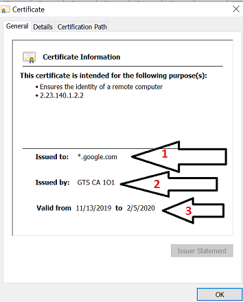

## 10.3 Student Guide: Applied Cryptography and Cryptographic Attacks

### Overview

In today's class, we will explore how cryptographic concepts are applied to modern technology and security challenges.  

### Class Objectives

By the end of class, you will be able to:

- Apply steganography in order to hide a message within non-secret data, such as an image.

- Use SSL certificates to help authenticate a website. 

- Use cryptographic attack methods to crack a password.

- Use Hashcat to uncover the plaintext value of a hash.
  

### Slideshow

The lesson slides are available on Google Drive here: [10.3 Slides](https://docs.google.com/presentation/d/1Y_Ar8rbile-7ENbOvUiGiISX8MmUwJeFfdpBscDuQXw/edit#slide=id.g4f80a3047b_0_990)

-------

### 01. Class Overview 

Before we introduce new cryptography concepts, let's review the concepts covered in the previous lesson:

**Asymmetric Encryption**

- While symmetric encryption has many advantages, its primary disadvantages are key exchange and key management.

- As an alternative, we can use **asymmetric key encryption**, also known as **public-key encryption**, in which each individual has a two-key pair.

- The two-key pair consists of:
  - A **public key**, which can be seen and shared with anyone.
  - A **private key**, which should be kept private and only seen by the owner of the key pair.

- For encryption, the sender of a message uses the receiver's public key to encrypt a message.

- For decryption, the receiver of the encrypted message uses their private key to decrypt the message.

- **RSA** is the most widely used asymmetric key algorithm used today.

- **GPG** is a command-line tool that can apply asymmetric encryption.

**Hashing**

- While encryption is used to protect confidentiality, hashing is a cryptographic method used to protect integrity.

- Hashing uses algorithms to convert a plaintext message into  a **message digest**, also known as a **hash**.

- Data that has been hashed cannot be reversed, therefore it is known as a **one-way function**.

- Common hashing algorithms are **MD5** and **SHA256**.

- Command-line tools that can be used to create hashes are **`md5sum`** and **`sha256sum`**.

**Digital Signatures**

- A **digital signature** is a mathematical scheme for verifying the authenticity of digital data.

- The primary purpose of digital signatures is authentication, but they can also be used for integrity and non-repudiation.

- Like encryption, digital signatures also use public key cryptography.
  - However, a user uses their own private key to sign a document, and the public key is used by other users to validate the signature.

- There are several types of digital signatures available: **detached**, **all at once**, and **clearsigned**.


### 02. Cryptography Refresher 

- [Activity File: Cryptography Refresher](activities/02_Cryptography_Refresher/unsolved/readme.md)

### 03. Cryptography Refresher Review

- [Solution Guide: Cryptography Refresher](activities/02_Cryptography_Refresher/solved/readme.md)

### 04. Introduction to Applied Cryptography 

So far, we have covered many cryptographic concepts, such as encryption, public key cryptography, digital signatures, and hashing.

- Until now, we have primarily covered the foundations of these cryptographic concepts. 

- Now, we will now focus on how these cryptographic concepts are applied to modern technology and security challenges.

First, we will look at how these cryptographic concepts are applied to portable devices, emails, web security, and digital forensics.

**Portable Devices**

Encryption can be applied to securing portable devices such as laptops and cell phones.

- For example: An attorney has a laptop that contains all of his private legal documents. The attorney will need to know that if the laptop is lost and later found by someone who is not authorized to view the documents, that this person wouldn't be able to view them.

Most current operating systems on laptops include disk encryption.

  - This disk encryption is a symmetric encryption, which often uses the AES algorithm.

  - Microsoft Windows uses a symmetric disk encryption program called **BitLocker** and Mac operating systems use **FileVault** encryption.

  - These disk encryptions prevent an unauthorized party from viewing the data on a laptop in case it is accessed by someone it shouldn't be.

**Email and Web Security**
 
Public key cryptography can be used to secure emails and web applications. 

- Emails are not natively encrypted and therefore can be sent and received in plaintext.

- Programs such as **S/MIME** and **PGP** are used to make emails confidential by applying public key cryptography.

  - For example: A sender of an email can use PGP to encrypt an email with the receiver's public key. The receiver of the email can decrypt the email with their private key.

-  PGP and S/MIME are also used to digitally sign emails to provide authenticity and integrity.

  - For example: A sender of an email can use PGP to sign an email with their private key. The receiver of the email can verify the authenticity by validating it with the sender's public key.
  
Public key cryptography works for securing websites:

- **SSL** (Secure Socket Layer) is a protocol designed to provide encryption for web traffic.

  - The protocol HTTPS stands for _HTTP over SSL_.

- Websites are issued **SSL certificates** as a "seal of approval," confirming the website can be trusted.

- These certificates use public key cryptography to establish a secure connection between the browser and the server before the web traffic is encrypted with symmetric encryption.
 
Websites also use hashing to store their passwords. 

- Storing passwords in plaintext comes with risks.

  - For example, if a web server storing passwords in plaintext was breached by a hacker, the hacker would have access to the accounts and passwords for all the users of that website.

- Websites defend against this by using a hashing algorithm to hash the passwords of all users.

- This same algorithm is applied when a user logs in, then it is validated against the user's hashed password to provide authorization into the user's account.

  - This concept isn't just limited to website logins. It is also applied to server logins.
     
     
**Digital Forensics and Steganography**

A forensic examiner is a cybersecurity professional who is tasked with capturing and investigating digital evidence from computers, cellular phones, and other devices that contain digital data.

- This evidence can be used for private industry or public legal and criminal investigations.

- Forensic examiners often apply hashing.

  - For example: If a forensic examiner collects a hard drive from a laptop for an investigation, the examiner will immediately create a hash of the laptop.
  
  - This hash can be used by the examiner in legal proceedings to later prove that the hard drive they collected hasn't been modified since its original collection, proving the integrity of the evidence. 
  
Forensic examiners might also be tasked with using the cryptographic technique of **steganography**.

  - Steganography is the cryptographic technique of placing hidden messages within a file, image, or video.

    - For example, a forensic investigator is conducting an investigation on an employee who is suspected to be selling insider trading information.

    - The suspicious employee has no files that contain any obvious evidence of wrongdoing. Their laptop only contains pictures of their family.
     
      
     
    - The forensic investigator can apply steganographic forensic tools to analyze these family photos and determine if they contain hidden data related to insider trading.
    
       
  
We will do a brief walkthrough demonstrating how to apply the steganographic command-line tool **`steghide`** to hide a secret message in an image.

#### `steghide` Walkthrough

Begin by opening up a command line in your virtual machine.

- Create a file with a secret message by running:

      `echo "this is my hidden steganography message" > hidden_message.txt`

- Save the image `family.jpg` in this same local directory. 

Next, type the following command:
  
  - `steghide embed -cf family.jpg -ef hidden_message.txt`
    
    - `steghide` is the command to run `steghide`.

    - `embed` is the additional command to specify that we are hiding the message.

    - `-cf family.jpg` uses `-cf`, which stands for _cover file_, to specify the file that the data is being hidden in. In this example, we are using the file `family.jpg`.

    - `-ef hidden_message.txt` uses `-ef`, which stands for _embed file_, to specify the file that is being hidden. In this example, we are hiding `hidden_message.txt`.
  
  - Run the command and enter a password when prompted.
 
  - While it may look like nothing happened, the secret message is now hidden inside of the family picture.

- Now delete the hidden message so it will be kept secret and only exist in `family.jpg`.
 
  - Run `rm hidden_message.txt`
 
Next, we will demonstrate how to extract the secret message from the image. Type the following command:

- `steghide extract -sf family.jpg`

    - `extract` is the additional command to indicate we are extracting the message.

    - `-sf family.jpg` uses `sf`, which stands for _stegofile_, to specify which file to run the steganography tool against.

- Run the command and enter  the password when prompted. 

- Run `ls`. The file, `hidden_message.txt`, has been extracted from the image. 

Summary: 

  - Cryptographic concepts such as encryption, public key cryptography, and hashing have many modern day applications. 

  - Operating systems often use symmetric encryption programs such as BitLocker and FileVault to encrypt their hard drives.

  - Emails can use tools such as PGP and S/MIME to apply encryption, authentication, and integrity to emails.

  - Websites use public key cryptography to establish a secure session between a user's browser and the web server.

  - Forensic examiners use hashing to prove the integrity of the digital data they collect.

  - Steganography is a cryptographic technique used to hide data within messages, files, images, or video.

  - `steghide` is a forensic command-line tool used to apply these steganography techniques.   

### 05. Steganography Activity

- [Activity File: Steganography](activities/04_Steganography/unsolved/readme.md)
- [Image of the Car](https://tinyurl.com/y4m3zftl)

### 06. Review Steganography Activity 

- [Solution Guide: Steganography ](activities/04_Steganography/solved/readme.md)

### 07. SSL Certificates

We just covered several ways to apply cryptography with technologies and devices we use every day.

We will now dive deeper into one of the commonly used applications of cryptography: securing website applications.

  - For example, if Widgets Corp. wants to start a new secure website, widgets.com, to accept customer transactions, they would need to take certain steps to add the appropriate security to their website application.

The security of website applications is often accomplished with **SSL certificates**.

  - SSL certificates are small files of data that use public key cryptography to secure connections between the browser and the web server.

  - SSL certificates work with the HTTPS protocol.

  - SSL certificates can assist websites by providing them authentication and confidentiality.

Before we cover how SSL certificates provide authentication and confidentiality, we will look through the process of acquiring an SSL certificate for widgets.com.

#### Obtaining an SSL Certificate

- First, Widgets Corp will reach out to an organization responsible for issuing SSL certificates, called a **certificate authority** (CA).    

- Examples of certificate authorities include:
  - GlobalSign
  - DigiCert
  - Comodo
  - Symantec
      
Widgets will request an SSL certificate called an **X.509 certificate**.
  
  - X.509 is the current standard for SSL certificates for securing online communications.
      
Next, the certificate authority will require the following information from Widgets Corp in their application.

  - Company documents
  
    - This will help the certificate authority validate that the application was submitted by a legitimate representative of Widgets Corp, preventing scammers from getting a real certificate added to a fraudulent website.

  - Unique IP address

  - Certificate signing request (CSR) 

    - A **CSR** is a block of encrypted data that is created on the web server where the SSL certificate will eventually be installed. 

    - The CSR contains information that will be added to the certificate, such as the company name and location.

    - When generating the CSR, a private and public key pair will be created, and only the public key will be sent to the certificate authority.

    - The private key remains hidden on the web server.
    
 - After the certificate authority validates and approves the information provided in the application, they will send the SSL certificate back to Widgets Corp.
 
 - Widgets Corp will then install the SSL certificate on the web server where they are hosting widgets.com.
 
 - After this, anyone who views widgets.com will be able to see the SSL certificate installed on the website.
 
     
 
#### SSL Certificates and Authenticity

We will now demonstrate how SSL certificates can be used to validate the authenticity of a website.

  - For example: A user receives an email from their bank to go to the following website www.Superbank!!.com to update their credentials.

  - The user is a customer of Superbank, but they have never seen this website and aren't sure it's legitimate.

  - The user can check the SSL certificate of this suspicious website to determine if the website is in fact authentic.
  
Validating authenticity with SSL certificates is accomplished with a **chain of trust**:

- Browsers (such as Chrome and Internet Explorer) predetermine which certificate authorities to trust.
  
  - Browsers have a pre-established list of trusted CA's, called a **root store**.
  
  - In Chrome, we can access the root store by doing the following:
    
    - Go to **Preferences** > **Settings**.
    
    - Go to **Privacy and security** > **Manage certificates**.
    
     
    
    - Select **Trusted Root Certification Authorities**. 
    
    
    
- This list contains a certain type of certificate authority called a **root certificate authority**, which your browser trusts.

    - Root certificate authorities are CAs at the top of the chain of trust and are typically not the organizations that issue SSL certificates.

- Next, select **Intermediate Certification Authorities**. 
  
     
     
    - Another type of CA is an **intermediate certificate authority**, which report up the chain of trust to the root certificate authorities. 
    
    - They typically issue SSL certificates on behalf of the root certificate authorities because it limits the risk exposure in the case where:

      - A root certificate authority was breached. In this case, every SSL certificate issued underneath it would be invalidated, including all certifications issued by intermediate certificates.

      - An intermediate certificate authority was breached. In this case, the impact would be limited to the certificates they issued.

  - If a website is issued a valid certificate from a CA that is not in the root store, your browser will warn you that the site isn't a trusted website.
  
**Valid Certificate Walkthrough** 
 
We will now walkthrough how to view and validate the SSL certificate for a website.
   
- We will view a valid SSL certificate for Google. 

- Begin by opening up a Chrome browser and going to [Google](https://www.google.com/).
   
   - Select the lock next to the URL of the website.
   
   - The following image confirms the SSL certificate is trusted.
    
      
      
- Next, select **Certificate (Valid)** to view the details of the certificate.

  - The following three important values from the details of the certificate:
    
    1. **Issued to** identifies the domain of the website that the certificate was issue to.
    2. **Issued by** identifies which certificate authority issued the certificate. This is typically the intermediate CA.
    3. **Valid from** identifies the date the certificate was issued and the expiration date.

    
      
      
- Next, select the **Certificate path**, which shows the the chain of trust for the certificate.
     
    
    
    1. **google.com** is the website that was issued the certificate.

    2. **GTS CA 101** is the intermediate certificate authority that issued a certificate to google.com.
    3. **Google Trust Services, Global Sign Root CA** is the root certificate authority that signed off on the intermediate certificate authority, GTS CA 101.
       
The chain of trust on the above certificate is:
- **google.com** is trusted by ...
  -  The intermediate CA of **GTS CA 101**, which is trusted by ...
     - The root CA of **Google Trust Services, Global Sign Root CA**, which is trusted by ...
        - The Chrome browser, as this root CA is in the root store. 
    

**Invalid Certificate Walkthrough**  
 
So far, we have only looked at a valid SSL certificate. Sometimes certificates aren't valid and your browser will warn you before you access the website.

Walkthrough the following steps to show an invalid certificate:

- Open the following website to display an invalid SSL Certificate: expired.badssl.com.

- The browser immediately displays several notifications on the URL and the main page.

  
  
- Next, we will click on **Not secure** next to the URL on the top left to view the certificate.  

- This page also clearly indicates that the website is not secure.

  
  
- Next, click on **Certificate (Invalid)** to display the details of the certificate.

  
  
- This shows that the certificate is invalid because it expired in 2015.

  - If you are interested in viewing additional invalid certificates, check out the website www.badssl.com. It has many invalid certificates that you can safely view.

 #### SSL Certificates and Privacy
 
We just covered how the browser and the user of a website use SSL certificates to validate the site's authenticity. We will now cover how a website uses SSL certificates to offer privacy by securing a user's web traffic.
   
- **Step 1**: When we access a website that is secure, the browser asks the web server to provide the details of the certificate.
  
  - These are the details we saw when we viewed the certificate details.
                
- **Step 2**: The server responds with the copy of its SSL certificate, and also provides the public key.
 
- **Step 3**: The browser validates the certificate by checking expiration date and the root CA.
 
- **Step 4**: Once the certificate is validated, the browser uses the server's public key to create, encrypt, and send a new key called a **session key**.

  - A session key is a key that is used to secure a communication session between two devices.

  - In this case, the two devices are the browser and the web server.

- **Step 5**: The server decrypts the session key with its private key and sends back an acknowledgement encrypted with the session key to begin the encrypted session.

- **Step 6**: Now that secure web traffic can begin, the server and browser encrypt and decrypt all data with the session key.

An important concept to understand from the above steps is that accessing an HTTPS site uses both asymmetric and symmetric encryption.

   - This is a common cybersecurity interview question.

   - More specifically, steps one through five use asymmetric methods and step six uses symmetric methods.
   
      
   - SSL certificates were originally used to work with the SSL cryptographic protocol, but SSL was later replaced with a more secure cryptographic protocol called **TLS (Transport Layer Security)**.
   
   - Even with this change, the certificates are still considered SSL certificates.
   
   - If you are interested in researching this topic further, consult the following article: 
    
      - [GlobalSign: SSL vs TLS - What's the Difference?](https://www.globalsign.com/en/blog/ssl-vs-tls-difference/)
 
 
Summary: 

  - One of the most common applications of cryptographic concepts is the securing of website traffic.

  - Website traffic is typically secured with an SSL certificate.
    - X.509 is the current standard for SSL certificates.

  - Certificate authorities, or CAs, are the organizations responsible for issuing SSL certificates.

  - Root certificate authorities, or root CAs, are at the top of the certificate chain, and don't usually issue SSL certificates directly.

  - Issuing SSL certificates is accomplished by intermediate certificate authorities, which report up to root CAs.

  - Validation of certificates is accomplished by the chain of trust.
    - For example: Your website has to be trusted by the intermediate CA, which must in turn be trusted by the root CA.

  - Even if a certificate has been issued, a website can be considered invalid if the certificate is:
     - Expired.
     - Assigned to the wrong host.
     - Issued by a CA that is not in the browser's root store. 

  - Websites use both asymmetric and symmetric encryption to accomplish secure communication with the HTTPS protocol.   
  

### 08. SSL Certificates Activity

- [Activity File: SSL Certificates](activities/07_SSL_Certificates/unsolved/readme.md)
- [Homepage of the Suspicious URL](https://view.genial.ly/5defb03224596c0fff13c3a2/interactive-image-interactive-image)

- If the website isn't accessible, share the offline version:
  - [Offline Hill Valley PD Website](resources/Hillvalley_offline_webpage.zip) (To view it, simply extract all the files in the folder and open `genially.html`.) 


### 09. Review SSL Certificates Activity 

- [Solution Guide: SSL Certificate](activities/07_SSL_Certificates/solved/readme.md)

### 10. Cryptographic Attacks

Now, we are going to change topics and discuss **cryptographic attacks**.

- We have so far covered multiple methods and technologies that provide individuals and organizations with privacy, authenticity, integrity, and non-repudiation (The P.A.I.N model).

- Unfortunately, determined adversaries often find ways to attack these methods through **cryptographic attacks**. 

  - As an example, a hacker might try to crack a bank's encrypted files containing credit card data to sell on the dark web.

- It is important for cybersecurity professionals to understand and be able to conduct these same cryptographic attacks to determine if a cryptographic method is secure.

  - For the example above: A security professional would want to attempt the same cryptographic attacks against the encrypted files that they anticipate might be used by a hacker. This would help them determine if the credit card data is in fact secure. 

Next, we will cover several types of cryptographic attacks and the mitigation strategies used to counter them. 

#### Statistical Attack 

- A **statistical attack** exploits weaknesses associated with statistics in a cryptographic algorithm.

  - There are many cryptographic algorithms that attempt to produce truly random values. 

  - A statistical attack attempts to determine if the values being created are in fact not random and are instead predictable.

    - For example: Some technology professionals use a token generation program that creates a random number that they use to securely log in to their computer.
    
       
       
    - If the number generated is in fact predictable and not random, a hacker could determine the number and access unauthorized data.
  
- **Mitigation**

  - A security professional needs to be sure that algorithms that use random values continue to produce values that are in fact random, so the data is not predictable.

#### Brute Force Attack 

- A brute force attack is when an attacker simply uses many passwords or user/password combinations until one of them works.

  - For example: If a hacker wants to log in with the user `root`, they would try the user `root` with many passwords until they guess correctly:
    - User: root, Password: abc123
    - User: root, Password: 123abc
    - User: root, Password: 123456
    - User: root, Password: 654321
    - User: root, Password: aaaaaa
    - User: root, Password: bbbbbb

- **Mitigation**
    - A security professional can apply the lockout functionality to all logins, which will limit the number of login attempts a user has before getting locked out.

    - Applications can also have firewalls that detect and stop large volumes of attempted logins from a single source IP address.

#### Birthday Attack

- A birthday attack exploits the probability (and weakness) that two separate plaintexts that use a hash algorithm will produce the same ciphertext. 

  - This same ciphertext is also known as a **collision** or a **hashing collision**. 
  
  - The birthday attack is named after a probability theory called the Birthday Paradox, which states that for a given number of people there will always be two that share a birthday.
    
    - If you are interested in reading more about the Birthday Paradox, send them the following resource: [Birthday problem (Wikipedia)](https://en.wikipedia.org/wiki/Birthday_problem).

- **Mitigation**

   - Use a strong hashing algorithm that limits the possibilities of a hashing collision.

#### Frequency Analysis

Frequency analysis involves an attacker looking at the ciphertext of a substitution algorithm and trying to determine which ciphertext letters appear most frequently.

  - Since the most common letters in the English language are e, t, o, and a, the attacker substitutes the frequently occurring letters with the common English language letters to determine the substitution algorithm key.

  - Once the key is figured out, the hacker can determine the plaintext from the ciphertext.

  - Additionally, if the common letters in the ciphertext are actually e, t, o, and a, the hacker can determine that the ciphertext is likely using a transposition cipher.

- **Mitigation**
    - This method typically targets standard ciphers. Using more advanced encryption algorithms will better protect against this attack.

#### Replay Attack

In a replay attack, an attacker intercepts an encrypted message and replays it to the receiving party to get access.

  - For example: An attacker can obtain an encrypted signal from a garage door opener. The attacker can replay the encrypted signal at a later time to open the garage.
  
- **Mitigation**
  - Add an expiration time for the encrypted data so it can't be replayed at a later time.

#### Known-Plaintext

In this method, the attacker has access to the ciphertext and the associated plaintext.

- The attacker does not have access to the encryption device or program.

- The attacker does an analysis to determine the encryption/decryption algorithm of the ciphertext and plaintext data to determine future encrypted messages.

- For example, suppose a hacker captured the following plaintext and ciphertext:
    
   - Plaintext: **hello**, ciphertext: **8 5 12 12 15**

   A hacker could analyze this data and determine that each alphabet letter corresponds to a number in alphabetical order, where:
    
  -  a = 1, b = 2, c= 3, etc. 

    If a future message comes through as: **7 15 15 4 2 14 5** the hacker can decrypt it as: **goodbye**. 

- **Mitigation** 
  - Use an advanced encryption algorithm and limit the access to ciphertext and associated plaintext.

#### Chosen-Plaintext

In a chosen-plaintext attack, an attacker has access to the encryption device and program and the ciphertext, but not the associated plaintext.

  - The attacker can encrypt several plaintext messages to see how the ciphertext is generated each time.
  
  - Based on the results of the different ciphertexts generated, an attacker can determine the algorithm and apply it in reverse to obtain the plaintext from the acquired ciphertext.

- For example: We obtain a ciphertext of **act** along with an encryption program that can create this ciphertext.
  
  We can then enter several plaintexts into the encryption program to analyze the results:
    - plaintext: **boy**, ciphertext: **oby**
    - plaintext: **red**, ciphertext: **erd**
    - plaintext: **hot**, ciphertext: **oht**
    
   Based on these results, we can conclude that this is a transposition cipher using the key: {1, 2, 3) = {2, 1, 3}
   
   - If we apply this key in reverse to **act**, we can determine the plaintext is **cat**.
   
- **Mitigation**: 
  - Limit access of the encryption device and use an advanced encryption algorithm.
    

Summary

  - Attackers use a variety of cryptographic attacks to compromise cryptographic methods and algorithms.

  - Cybersecurity professionals also use these same cryptographic attacks to determine the security strength of the cryptographic methods being used.

  - Cryptographic attack types include statistical, birthday, brute force, frequency, replay, known-plaintext, and chosen-plaintext attacks.

  - With each of these attacks, there are also measures that security professionals can use to protect from them.
  

### 11. Cryptographic Attacks Activity  


- [Activity File: Cryptographic Attacks](activities/11_Crypto_Attacks/unsolved/readme.md)
- [Detective Tannen's Password Encryption Script](resources/encrypter.py)
- [Detective Tannen's Computer Login](resources/password.py)


### 12. Review Cryptographic Attacks Activity 

- [Solution Guide: Cryptographic Attacks](activities/11_Crypto_Attacks/solved/readme.md)

### 13. Introduction to Rainbow Tables and Hashcat 

We just covered many techniques that can be used to attack cryptographic methods.
 
 - The last activity demonstrated that some of these attack methods can be applied with manual methods and deductive reasoning.
 
 - Cracking other types of cryptography can require more advanced methods and technologies.
 
One type of cryptography that requires an advanced cracking method is **hashing**.

  - Hashing is a cryptographic method that uses a mathematical algorithm to create a one-way ciphertext, which can not be reverted back to its original plaintext.

  - Since hashing creates a one-way ciphertext, it is almost impossible to decipher the algorithm and figure out the plaintext from the ciphertext.

A different approach can be used to crack hashes: a cryptographic method called rainbow tables.

#### Rainbow Tables
 
**Rainbow tables** are resources that contain precomputed hashes with the associated plaintext password.

- For example:
  
  
  
- Typically different hashing algorithms have different rainbow tables.
  
  - For example, there may be a a MD5 rainbow table, and a NTLM rainbow table.

- The advantage of using rainbow tables is that finding the correct password is as "simple" as looking up the password associated with a given hash.

- One disadvantage is that some rainbow tables are extremely large, and take a lot of storage space and computing power to work effectively.
   
A defense against rainbow tables is the cryptographic method known as salting.

- A **salt** is simply a random value.

- **Salting** is a cryptographic method that combines the salt with the plaintext into the hash function.

  - The output value of salting is called a **salted hash**.

  (**plaintext** + **salt**) run through (**hashing function**) = **salted hash**  

  - Therefore, a unique output is created for each plaintext/salt combination.

 
#### Hashcat
 
Although we've talked about John the Ripper in the past, to make you a more versatile candidate, we'll be looking at another hash cracking program called hashcat.  
 
**Hashcat** is a command-line tool that can automate the cracking of hashes.

   - Hashcat is available as a free download.

   - Hashcat uses dictionary wordlists, rainbow tables, and brute force methods to figure out plaintext passwords from hashes. 

   - Hashcat works with a variety of hashing algorithms.
   
We will demonstrate how to use Hashcat to crack a hash with the following scenario:

  - A cybersecurity professional is tasked with testing the security of a company's website by confirming if they can log into their website as the root user.

  - The security professional is able to conduct an attack on the website. With this attack, they capture an unsalted hash value of the root user's password: `ea847988ba59727dbf4e34ee75726dc3`.

  - From the length of the hash, they determine it is an MD5 hash.

  - The walkthrough will demonstrate the steps necessary to determine the root user's plaintext password with Hashcat.

**Hashcat Walkthrough**

- Begin by accessing the following directory in your virtual machine:
  
  - `/usr/share/wordlists/`

- Within this directory, there is a large wordlist file called `rockyou.txt` that contains a large list of common plaintext passwords.

  - If the file is zipped, it can be unzipped by running the following command: `gunzip rockyou.txt.gz`

- Preview the file by running the following command:

  - `more rockyou.txt`

- It should display a list of common plaintext passwords, such as:

  ```  
  123456
  12345
  123456789
  password
  iloveyou
  princess
  1234567
  rockyou
  ...
  ```

- This list is a dictionary list of common passwords. It does not contain hashes like a rainbow table, only the plaintext passwords.

  - Hashcat will use this plaintext list and, depending on which hash algorithm is selected,  compute hashes against each of these plaintext words.

- The next step is to place the hash we want to crack into a file. 

  - We will place this into a file called `hashes.txt`:
  
    - ` echo ea847988ba59727dbf4e34ee75726dc3 > hash.txt`
  
  - We can add multiple hashes to this file, as long as each hash is on a separate line.
      
- Next, we will type the following Hashcat command to crack this hash: 

  - `hashcat -m 0 -a 0 -o solved.txt hash.txt rockyou.txt --force`

    - `hashcat`: The command to execute Hashcat.

    - `-m 0`: The `0` indicates the script will use the MD5 hash, as this was the hash the security professional determined to be in use.

        - If a different hashing algorithm is in use, we would change the value of `0`.

        - For example: We would use `-m 100` for SHA-1, and `-m 1400` for SHA-256.
        
    
    - `-a 0`: The `0` tells the script to apply the attack method of "dictionary."
        - The above link provides additional attack types.

    - `-o solved.txt`: Creates an output file called `solved.txt`.

    - `hash.txt`: The input file of the hash.

    - `rockyou.txt`: The file containing the wordlist we will check against.

    - `--force`: Overrides any small errors that may occur.
    
- Run the command to place the results in the file called `solved.txt`.

- Open the `solved.txt` file and note that it displays the hash and the plaintext value of the hash separated by a colon: `ea847988ba59727dbf4e34ee75726dc3:topsecret`

- With this combination, the cybersecurity professional can determine the root user's password is `topsecret`.

- They are now able to log into the website with these credentials.
  
Summary: 

  - Some cryptographic attack methods require advanced methods and technologies to crack.

  - A popular advanced cryptographic method for cracking hashes are rainbow tables.

  - Rainbow tables contain precomputed hashes with the associated plaintext password. 

  - One defense against rainbow tables is salting, which adds a random value to the plaintext value during the hashing process.

  - Hashcat is a free command-line tool which can automate the process of using dictionary, brute force, and rainbow table attacks against hashes.


### 14. Hashcat Activity 

- [Activity File: Hashcat](activities/14_Hashcat/unsolved/readme.md) 
- [Encrypted File from Detective Tannen's Computer](resources/secret.zip)
  


### 15. Hashcat Activity 


- [Solution Guide: Hashcat](activities/14_Hashcat/unsolved/readme.md)


-------

© 2020 Trilogy Education Services, a 2U, Inc. brand. All Rights Reserved.
