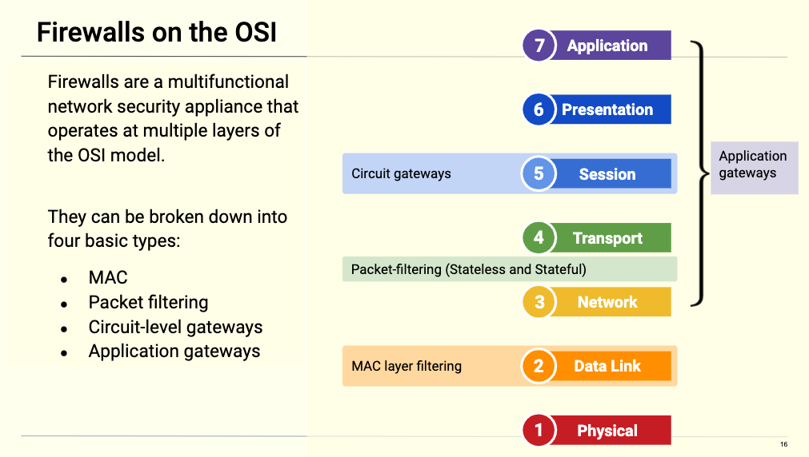

## 11.1 Student Guide: Introduction to Firewalls and Network Security
 
### Overview 

- This week introduces you to network security through the principles of network defense. By the end of the week, you will have the foundations upon which to build and execute a network defense strategy.

- Day 1 Introduces you to firewalls and defense in depth. Day 2 Introduces you to IDS systems and Network Security Monitoring. Day 3 starts by introducing you to the Cyber Kill chain then culminates with you exercising their threat hunting skills through the use of Enterprise Security Monitoring.

### Class Objectives

By the end of the lesson, you will be able to:

- Explain how open ports contribute to a computer's attack surface.

- Use firewalls to protect a computer's open ports.

- Decribe various types of firewalls and their use cases.

- Explain the role firewalls play within a layered defense.

- Gain hands-on experience with developing and implementing firewall policies using UFW and firewalld.

### Slideshow

- The lesson slides are available on Google Drive here: [11.1 Slides](https://docs.google.com/presentation/d/1GFGtD23BVJXFjpFwUO_MC0W5iPKk9eWTld5HoFOZxUM/edit) 

---

### 01. Welcome and Motivation

Last week, we learned how cryptographic tools are used to maintain the confidentiality, integrity, and availability of data while at rest and in transit.

- For example,  malicious actors could attempt to hack into a hospital's web server in order to perform a ransomware attack.

-  In an effort to keep the private health information of their patients secure, the hospital protects secured access to its website using a 256bit cryptographic RSA VPN connection that provides authorized medical staff with access to patient records when responding to emergencies while away from the hospital. Emergency room physicians also use secured VPNs to host virtual appointments with patients who are unable to visit the hospital.

While these tools are important, cryptography is only a part of a multifaceted network defense ecosystem used to protect private information and critical network infrastructure.
 
- While cryptographic applications help protect private data and critical network infrastructure from specific network attacks, other aspects of website security remain at risk.
 
- For example, suppose the same website is the target of a denial of service (DoS) attack.  Cryptography defenses aren't of much use. 

- Security practitioners need to implement network security protections like **firewalls** that provide an additional layer of defense. 

**Firewalls** are a technical security control that distinguish between trusted and untrusted network traffic and network connections.
 
Defending against a wide variety of threats requires the knowledge and use of **network security**. 

- According to SANS Institute:  
 
  - _"Network Security is the process of taking physical and software preventative measures to protect the underlying networking infrastructure from unauthorized access, misuse, malfunction, modification, destruction, or improper disclosure, thereby creating a secure platform for computers, users and programs to perform their permitted critical functions within a secure environment."_ - [SANS Network Security Resources](https://www.sans.org/network-security)

Firewalls are the first line of defense on the perimeter of the network's edge. However, they are merely the first layer upon which others preventive and protective layers are built.
 
- This concept of layered security protections is known as the **defense-in-depth** methodology, which we touched briefly on in our GRC unit.

In the GRC unit, we covered how defense-in-depth plays a critical role in securing organizations. Throughout this unit, we will apply a DiD mindset to layer security measures that aims to slow an attack's progression, thus providing network defenders with enough time to respond:

- Today, we will cover the benefits, limitations, for various types of firewalls. We will also explore defense-in-depth methodologies.
 
- On Day 2, we will introduce intrusion detection systems (IDS) and network security monitoring (NSM). NSM is particularly useful for tracking an adversary through the network after a breach.
 
- On Day 3, we will conduct advanced cyber threat hunting using Enterprise Security Management or (ESM). ESM expands upon the concept of NSM through the inclusion of endpoint telemetry. We'll discuss all these concepts in depth on day 3.
 
Today's lesson will explore:
 
- How open ports contribute to a machine's attack surface and how firewalls are used to protect a computer's open ports.

- Usage of different types of firewalls and their application.

- The role firewalls play within a layered defense.

- The development and implementation of firewall policies using UFW and firewalld.

#### Professional Application

Firewalls are the tools used to implement network access control. It is expected that professionals within the following roles are able to implement and execute firewall rules:

- **Help Desk/IT Specialist**: Entry-level IT roles focus more on troubleshooting user issues than implementing network controls. 

   - Being able to determine if and how firewalls affect user traffic can help troubleshoot issues like slow connections, an unexpected lack of a connection, and broken networked applications, such as Skype or Facebook Messenger.

- **System/Network Administrator**: System and network administrators often determine who is allowed to access which devices on a network. These roles must be able to develop firewall policies and implement them using tools like UFW or firewalld.

- **SOC Analyst**: perform threat hunting and alert triage. 

   - They must be able to understand how firewalls on the network filter incoming and outgoing packets. They also need to understand intrusion detection systems in order to accurately interpret the traffic logs they monitor for incidents. Without this knowledge, it will be harder for them to identify abnormal network traffic. 

   - It also enables them to direct IT personnel to modify their firewall policies in order to mitigate future attacks. 

- **Penetration Tester**: Penetration testers don't usually implement firewall rules themselves. However, launching a successful attack against a network requires them to determine whether a firewall sits between them and their target and, if so, identify which rules are enabled based on the results of their probe. 
   
   - This allows them to identify ways to bypass the firewall and continue their test.

Emphasize that familiarity with today's content is essential knowledge for performing any of these roles.
 
Take a moment to address questions before proceeding.


### 02. Firewall Architectures 

In Unit 8.2, we discussed how ports and services were the essential doorways into a network. Networks allow computers to communicate with one another by sending data to and from open ports on other machines. 

- Therefore, devices on networks must expose open ports in order to communicate with other machines on the network.

- If a machine exposes an open port to a network. Anyone with the capability to discover a machine on a network can attempt to connect to it through that port. This is not a problem if connections are only made from trusted parties. 
  
- However, in practice, it is unwise to assume the only people who will connect to a device are those you trust. Malicious actors can and will exploit this assumption in order to access sensitive information on the network.

- Restricting access to open ports is a fundamental skill for any technical security specialist. The most basic part of protecting a network is controlling who can access which services on which machines.

Let's see how we can secure network ports to allow only trusted traffic in.

**Firewalls** provide a layer of protection by analyzing data leaving and entering a network. 

- Firewalls are placed between application servers and routers to provide access control. 

- They protect trusted networks by isolating them from untrusted networks, such as the internet. 

- There are two types of firewalls: **host-based** firewalls and **network** firewalls.

#### Host-Based and Network Firewalls

Firewalls can be used to control access to either a single host (host-based firewall) or an entire network (network firewall).

   - A host-based firewall runs on the machine it is meant to protect and blocks traffic to and from that specific device.

   - A network firewall is often placed in front of a router in order to block malicious internet traffic from entering a private network.

These two firewalls work similarly by doing the following: 

   - Intercepting traffic before it reaches its target host or router.

   - Inspecting the source/destination address/ports, TCP flags, and other features of the incoming packets.

   - Allowing packets that come from trusted sources and denying packets that don't.

#### Firewall Types and Architectures

A firewall is a multifunctional network security appliance that operates on multiple layers of the OSI. These firewalls can be broken down into four basic types:

- MAC layer
- Packet filtering
- Circuit-level gateways 
- Application gateways 

 

#### MAC Layer Filtering Firewall
 
Each device on a network has a unique hardware identification called a Media Access Control (MAC) address. This unique hardware ID is what allows all devices to communicate.
 
As its name suggests, this firewall operates at Layer 2 of the OSI model and filters based on source and destination MAC addresses.
 
- MAC layer firewalls, also referred to as MAC filtering, are commonly found on Wi-Fi systems. 
 
- This firewall will first compare a device's MAC address against a statically approved list of MAC addresses. If there is a match, all traffic will be forwarded.
 
- One advantage of MAC layer firewalls is that they may help secure a network from novice attackers.
  
- One disadvantage is that this security control can easily be bypassed by MAC spoofing, the process of changing a MAC address to match that of another, typically one that is already allowed in the firewall.
 
#### Stateless Firewall
 
Stateless firewalls, also known as **packet-filtering** firewalls, operate at Layer 3 and 4 of the OSI model. These firewalls statically evaluate the contents of packets and do not keep track of the state of a network connection (aka Stateless).
 
Packet-filtering firewalls examine the network and transport headers closely for the following information:
 
- **Source and destination IP address:** Source IP address is from a device that initiates a communication. The destination IP address is the intended receiving device.
 
- **Source and destination port information:**  When combined with an IP address, ports enable applications that are running on TCP/IP network hosts to communicate.
 
- **IP (Internet Protocol):** Responsible for addressing devices on a network and ensuring the delivery of data from a source to a destination.
 
  - This delivery can be through connection-oriented TCP, meaning a successful three-way handshake must occur before the transmission of data.
 
  - This delivery can also be through connectionless UDP (User Datagram Protocol), which doesn't rely on a three-way handshake.
 
- **Ingress/egress interface:** Interface of data being received (ingress) and data being sent out (egress).
 
Packet-filtering firewalls are the oldest type of firewall architecture.
 
- It creates checkpoints within a router or switch and examines packet data as it is transported through a network interface.
 
- If the information contained within the packet does not pass this inspection process, it is dropped.
 
- This kind of filtering works by inspecting the contents of each individual packet. Stateless firewalls do not consider the state of the connection as a whole.
 
- One advantage is that stateless firewalls are not resource intensive, meaning they are low-cost and do not significantly impact system performance.

- One disadvantage is that they are easy to subvert compared to more robust firewalls. They are vulnerable to IP spoofing and do not support custom-based rule sets.
 
#### Stateful Firewall
 
Stateful firewalls operate at Layer 3 and 4 of the OSI model.
 
- It uses a combination of TCP handshake verification and packet inspection technology to create stronger protection than either of the two previously discussed firewalls.
 
Rather than looking at individual packets, stateful firewalls examine the connection as a whole, looking at whole streams of packets.
 
This allows stateful firewalls to detect more information than stateless firewalls can. For example, they can determine:

  - If a packet is trying to establish a new connection. This is called a **NEW** state.
 
  - If a packet is part of an existing connection. This is called an **ESTABLISHED** state.
 
  - If a packet is not opening a new connection or belongs to an existing one. This is considered a **Rogue** packet.
 
Since stateful firewalls understand the context of the entire data stream, they can determine which application layer protocols are in use. However, they cannot actually understand application layer protocols, so they can't determine what the underlying traffic is doing.
 
- For example: Stateful firewalls can identify that a connection is using HTTP, but cannot identify if the connection is being used to request an HTML file or a PNG image.
 
- One advantage of stateful firewalls is that they offer transparent mode, which allows direct connections between clients and servers.
 
   - They can also implement protocol specific algorithms and complex models to ensure more secure connections.
 
- One disadvantage is that they are resource-intensive systems that can slow the transmission of legitimate packets when compared to other solutions. If exploited, this can cause a DoS condition.
 
#### Circuit-Level Gateway Firewall
 
Circuit-level firewalls operate at Layer 5 of the OSI model.
 
- Circuit-level gateways determine the legitimacy of TCP connections by observing the handshake process between packets.
 
Once the circuit is allowed to establish an end-to-end connection, all data is tunneled between the parties.
 
- Circuit-level gateways work by verifying the three-way TCP handshake. TCP handshake checks are designed to ensure that session packets are from legitimate sources.
 
- Circuit-level gateways use the following information to determine the legitimacy of network connections before forwarding traffic:
 
  - Unique session identifier
  - State of the connection (Handshake established, closed)
  - Sequencing information
 
- One advantage of circuit-level gateways is that they quickly and easily approve or deny traffic without consuming a significant amount of computing resources. They are also relatively inexpensive and provide anonymity to the private network.
  
- One disadvantage is that they do not check the contents of the packet itself.
 
  - If a packet contains malware but has the correct TCP handshake information, the data is allowed to pass through.
 
  - This is why using circuit-level gateways are not capable of fully protecting a network on their own.
 
#### Application or Proxy Firewalls
 
Application or proxy firewalls, often referred to as "application-level gateways" , operate at Layers 3 through 7 of the OSI model.
 
  - This firewall actually inspects the contents of the packet, including authentication and encryption components.
 
Proxy firewalls use deep packet inspection and stateful inspection to determine if incoming traffic is safe or harmful.
 
- Proxy firewalls intercept all traffic on its way to its final destination, without the data source knowing. A connection is established to the proxy firewall, which inspects the traffic and forwards it if it's determined to be safe, or drops it if it's determined to be malicious.
 
Proxy firewalls create an extra layer of protection between the traffic source and its destination behind the network by obscuring the destination from the source creating an additional layer of anonymity and protection for the network.
 
- One advantage is that it's more secure than other implementations and provides simple log and file audit management for incoming traffic.
 
- One disadvantage is that it is resource intensive, requiring robust modern hardware and higher costs.

#### Summary

- Firewall are modes of protection provided to an organization or user, that analyze data leaving or entering a network.

- Packet filter firewalls operate between Layer 3 and Layer 4 of the OSI model.
   - These protect a network by examining source and destination IP address, port number, and packet type, without opening the packet to inspect its contents.

- Circuit-level firewalls operate at Layer 5 of the OSI model. 
   - These look at the header of a packet only. Once the circuit is allowed to establish an end to end connection, all data is tunneled between the parties.

- Stateful firewalls operate at Layer 7 of the OSI model.  
   - These use a combination of TCP handshake verification and packet inspection technology to create a greater level of protection.

- Application or proxy firewalls operate at layer 3 through layer 7 of the OSI model. 
   - These inspect the contents of the packet, which can involve authentication and encryption.

- Firewalls are not immune to attacks.
  
We'll now demonstrate how to configure rules with an uncomplicated firewall or UFW in the next lecture.

### 03. UFW Overview and Demonstration 

In this section, we'll introduce the standard Linux firewall: **Uncomplicated Firewall (UFW)**. 

- UFW is a multifunction firewall that provides both stateless and stateful packet-filtering. It works on all kinds of network address and port translation, for example NAT (Network Address Translation) and NAP (Network Address Protection).

UFW has the following features: 

- **Host-based**: UFW is most commonly used on hosts.

- **Logging**: UFW can generate multilevel logs based on specified rate limits. Rate limits tell the firewall how much bandwidth to allocate for logging functions. Logs are useful for providing insight into attacks.

- **Remote management**: Firewalls can be remotely administered, for example through SSH via port `22`. While this convenience can add risk, since port `22` is open, risk can be mitigated with a strong user password.

- **Rule sets for allow/deny**: UFW operates between Layer 3 and 4 of the OSI model. It protects a network by examining source and destination IP address, port number, and packet type, without opening the packet to inspect its contents. 

- **Additional security**: UFW also operates at layer 7 of the OSI mode and uses a combination of TCP handshake verification and packet inspection technology to create stronger protection.  

- **Rate-limiting**: UFW supports rate-limited connections to protect against brute force attacks. 
   - For example: UFW will deny a connection that attempts to initiate five or more connections within a time span of one minute.

UFW provides an easy-to-use interface for those who are unfamiliar with more complex firewall concepts.

#### UFW Demo Setup

Log into Azure then launch the Ubuntu UFW VM.

  - This demonstration will show how to use UFW in the following scenario:

    - The IT department is hosting a website that requires the use of both normal and encrypted web traffic.

    - Your CISO has released a security advisory authorizing the use of secured remote firewall administration.

    - Because of this, we need to open ports `22`, `80`, and `443`.

The tasks we need to complete are: 

   - Use `sudo ufw reset` to reset all UFW rules to factory defaults.
   - Use `sudo ufw status` to check the current status of the firewall.
   - Use `sudo ufw enable` to start the firewall and update rules.
   - Use `sudo ufw reload` to reload the UFW firewall.
   - Use `sudo ufw default deny incoming` to block all incoming connections.
   - Use `sudo ufw default allow outgoing` to allow all outgoing connections.
   - Use `sudo ufw allow` to open specific ports.
   - Use `sudo ufw deny` to close specific ports.
   - Use `sudo ufw delete` to delete rules.
   - Use `sudo ufw disable` to shut down the firewall.


#### Enabling UFW

1. Let's remove all settings on UFW by resetting all rules to their factory defaults. This will allow us to customize UFW with our own rule sets.

   Type the following command:

   - `sudo ufw reset`

       - The `reset` command option changes configuration back to the defaults.

   Output should look similar to below:

   ```bash
   Resetting all rules to installed defaults. Proceed with operation (y|n)? y
   Backing up 'user.rules' to '/etc/ufw/user.rules.20191210_144807'
   Backing up 'before.rules' to '/etc/ufw/before.rules.20191210_144807'
   Backing up 'after.rules' to '/etc/ufw/after.rules.20191210_144807'
   Backing up 'user6.rules' to '/etc/ufw/user6.rules.20191210_144807'
   Backing up 'before6.rules' to '/etc/ufw/before6.rules.20191210_144807'
   Backing up 'after6.rules' to '/etc/ufw/after6.rules.20191210_144807'
   ```


2. UFW isn't started by default, so administrators have to enable it themselves.

   Type the following command:

   - `sudo ufw status`

   The output should look similar to below:

   ```bash
   Status: inactive
   ```
   - UFW commands require `sudo` rights, because manipulating the firewall affects all users on the system.

3. Next, we need to enable UFW to start.

   Type the following command:

   - `sudo ufw enable`

   Output should look similar to below:

   ```bash
   Firewall is active and enabled on system startup
   ```

   - This tells us that the firewall has successfully started.

4. Next we need to check the status of the firewall again, now that it's enabled.

   Type the following command:

   - `sudo ufw status`

   Output should look similar to below:

   ```bash
   Status: active
   ```
#### Setting Default Rules

5. It's best practice to deny all incoming and outgoing traffic by default. This way, all we need to do is allow required ports.

   Type the following commands:

   - `sudo ufw default deny incoming`   
   `sudo ufw default deny outgoing`


      - `default`: Applies settings to all traffic.
      - `deny`: Blocks traffic.
      - `incoming`: Refers to traffic coming in (inbound) to the network interface.
      - `outgoing`: Refers to traffic going out (outbound) from the network interface.

   Output will look similar to below:

   ```bash
   Default incoming policy changed to 'deny'
   (be sure to update your rules accordingly)
   ```

#### Allow and Deny Rules

6. Denying traffic by default breaks networked applications, since it prevents them from sending or receiving data. Next, we'll need to explicitly allow traffic to and from ports `80`, `443`, and `22`. 
  
   Type the following commands:

   - `sudo ufw allow 80`  
    `sudo ufw allow 443`  
    `sudo ufw allow 22`  
    `sudo ufw allow 110`

   Output should look similar to below:

   ```bash
   Rule added
   Rule added (v6)
   ```


    - `allow`: Opens the port to allow inbound and outbound traffic.
    - `80, 443, 22, 110`: The ports to be opened.

   Now, let's check the status of the firewall again.

   Type the following command:

   - `sudo ufw status`

   This time, the output will appear as follows:

      ```bash
      Status: active

      To                         Action      From
      --                         ------      ----
      80                         ALLOW       Anywhere                  
      443                        ALLOW       Anywhere                  
      22                         ALLOW       Anywhere                  
      110                        ALLOW       Anywhere                  
      80 (v6)                    ALLOW       Anywhere (v6)             
      443 (v6)                   ALLOW       Anywhere (v6)             
      22 (v6)                    ALLOW       Anywhere (v6)             
      110 (v6)                   ALLOW       Anywhere (v6) 
      ```

   - Now we can see all the ports that we had just allowed.
        - Note: IPv6 traffic is identified with `(v6)`. All others are IPv4 traffic.

   - Port `110` was not one of the ports that we decided to use in our scenario. Let's `deny` port `110`.

   Type the following command:

   - `sudo ufw deny 110`


    - `deny`: Closes the port indicated in the command.
    - `110`: The port to be closed.

   Now we need to check the status of the firewall again to make sure our changes took effect.

   Type the following command:

   - `sudo ufw status`

   Output should now look like:

      ```bash
      Status: active

      To                         Action      From
      --                         ------      ----
      80                         ALLOW       Anywhere                  
      443                        ALLOW       Anywhere                  
      22                         ALLOW       Anywhere                  
      110                        DENY        Anywhere                  
      80 (v6)                    ALLOW       Anywhere (v6)             
      443 (v6)                   ALLOW       Anywhere (v6)             
      22 (v6)                    ALLOW       Anywhere (v6)             
      110 (v6)                   DENY        Anywhere (v6) 
      ```
   
   - We can see that port `110` is now blocked.

   - if we want to verify if these rules to take effect, we need to run: `sudo ufw status`

#### Deleting Rules

7. You can delete firewall rules when they are no longer needed.

   Type the following command:

   - `sudo ufw delete deny 110`

   Output should look similar to below:

   ```bash
   Rule deleted
   Rule deleted (v6)
   ```
   
   - `delete`: Removes rule. 
   - `deny 110`: The rule to be removed.

   We need to check the firewall status again to ensure our changes have taken effect.

   Type the following command:

   - `sudo ufw status`

   Output should now look like:

   ```bash
   Status: active

   To                         Action      From
   --                         ------      ----
   80                         ALLOW       Anywhere                  
   443                        ALLOW       Anywhere                  
   22                         ALLOW       Anywhere                  
   80 (v6)                    ALLOW       Anywhere (v6)             
   443 (v6)                   ALLOW       Anywhere (v6)             
   22 (v6)                    ALLOW       Anywhere (v6)  
   ```
   - The deny rule for port `110` is gone. 

8. There's another command we can use that displays more information about the status of the UFW firewall.

   Type the following command:

   - `sudo ufw status verbose`

        - `verbose`: Displays extra information.

   Output should look similar to:

   ```bash
   Status: active
   Logging: on (low)
   Default: deny (incoming), deny (outgoing), deny (routed)
   New profiles: skip
   
   To                         Action      From
   --                         ------      ----
   80                         ALLOW IN    Anywhere                  
   443                        ALLOW IN    Anywhere                  
   22                         ALLOW IN    Anywhere                  
   80 (v6)                    ALLOW IN    Anywhere (v6)             
   443 (v6)                   ALLOW IN    Anywhere (v6)             
   22 (v6)                    ALLOW IN    Anywhere (v6) 
   ```

   - In the example above we can see extra information such as:
        - The logging level is set to low.

        - Default deny is active on the following interfaces: incoming, outgoing, and routed.

        - New profile creation has been skipped.

9. To verify if the new changes are active we'll need to run `sudo ufw status`.

    Type the following commands:

     - `sudo ufw status`

       When troubleshooting firewall rules, sometimes it's helpful to completely stop it and restart it:

         ```bash
         Firewall stopped and disabled on system startup
         ```
       - `disable` shuts down or turns off the firewall.
    
     - `sudo ufw disable`

         Output should look similar to below:

         ```bash
         Firewall is active and enabled on system startup
         ```
        - Run: `sudo ufw enable`

        Output should look similar to below:

        ```bash
         Firewall is active and enabled on system startup
         ```
         
         - `reload` loads all the current rules without stopping the firewall.
         - `disable` shuts down or turns off the firewall.
         - `enable` starts and loads all the current rules.


#### UFW Demo Summary


- What command would I use to check on my firewall? 
  -  `sudo ufw status`

- What command would I use to enable my firewall? 
  -  `sudo ufw enable`

- What is the  default port for SSH? 
  -  port `22`

- What is the  default port for HTTP? 
  -  port `80`

- What is the default port for HTTPS? 
  -  port `443`


Knowing these concepts will help answer questions on the Security+ exam. 


### 04.  Configuring UFW Activity

- [Activity File: Configuring UFW](./Activities/07_Configuring_UFW/Unsolved/README.md)


### 05. Review Configuring UFW Activity 

- [Solution File: Configuring UFW](Activities/07_Configuring_UFW/Solved/README.md)


### 06. firewalld Introduction 

Every device that connects to the public network must have a unique hardware address (a MAC address) before it can send and receive data. Depending on the size of the network, there might be hundreds of devices, each requiring its own set of rules.

Firewalld is very similar to UFW, but it's important to understand how both firewalls work in order to be prepared for your future job enviroment. Firewalld is a bit more complicated than UFW, but provides greater flexibility and does not disrupt services when managing firewall updates. 

#### firewalld Overview 

firewalld is a dynamically managed firewall. It allows the user to set up and configure multiple firewall type options, which allows the user to block or allow incoming or outgoing traffic. 

It is a bit more complicated than UFW, but provides greater flexibility and does not disrupt services when managing firewall updates. 

- firewalld uses the concept of **zones** to divide network interfaces into groups of that share trust levels. The zones are assigned sets of rules depending on the needs and restrictions of each zone's interface.

- Zones are the organization of rules. Each zone can contain several rules. 

- Through this division of zones, firewalld can manage rule sets *dynamically* without breaking existing sessions, disrupting services and bringing down the entire network.

- firewalld supports network and firewall zones that define trust levels of networked connections or interfaces.

Rules and configurations can be tested and evaluated in runtime environments. 

- Runtime configurations are only valid until the next system reboot or service reload. This means we can create settings that are active for a limited amount of time. Runtime configurations can also be used to test new configurations. They can then be seamlessly saved to permanent environment if they work well. 

- Permanent configurations are loaded with each reboot. These become the active runtime environment until new runtime configurations are made. 

Different interfaces may requires different firewall rules due to the various services that may be in use.

- In addition to zones, firewalld uses **services** as shortcuts to configuring firewall rules for common services.

- firewalld enables you to designate which services to allow, and automatically opens the ports associated to those services. 

- For example, if you enable the SSH service in a zone, firewalld opens port `22` without requiring you to specify the port number explicitly.

- Services can be predefined, making it easy to configure the firewall rules most commonly required by most servers. Services can also be custom defined. 

#### firewalld Demo Setup

We'll demonstrate how to use firewalld with the following scenario:

- An IT administrator is bringing a new Microsoft Active Directory server online. It will serve several new hosts on the third floor at the main office, which is serviced by the `eth1` on the firewall. 

- The administrator requested that this new network not be able to transmit or receive data from the Fifth Street office location, which uses an IP address of `10.10.0.10`. 

- Lastly, the administrator asked you to block all ICMP pings on that same interface as an extra level of protection.

Note the following:

- `eth0` = first physical interface on a device
- `eth1` = second physical interface on a device 
- `wlan0` = first WiFi interface
- `wlan1` = second WiFi interface, etc.

The steps we need to take are:

- Use `sudo /etc/init.d/firewalld start` to start the firewall.
- Use `sudo firewall-cmd` to create, modify, and delete rules.
- Use `--list-all-zones` to list the currently configured zones.
- Use `--zone=work --change-interface=eth1` to bind zones to physical interfaces.
- Use `--list-all` to list all active rules in a zone.
- Use `--get-services` to list the currently configured services.
- Use `--add-rich-rule=` to configure rules with more detailed options.
- Use `--add-icmp-block=` to block ping requests.


#### firewalld Demo

**Starting firewalld**

1. Since firewalld is dynamic, we can start it and make changes without having to restart or reload it. We start firewalld using the following command:

   - `sudo /etc/init.d/firewalld start`

        - `/etc/init.d/firewalld`: File path to the firewalld program.
        - `start`: Starts the program.

   Output should look similar to below:

   ```bash
   [ ok ] Starting firewalld (via systemctl): firewalld.service.
   ```

   - Firewalld service is located in the `etc/init.d/firewalld` directory.

**firewalld Zone Views**

2. With firewalld, we can set a zone to an interface and configure each individual zone setting. We can use `firewall-cmd` to list zones and services, associate zones with interfaces, and configure new firewall rules.

   Run the following command

   - `sudo firewall-cmd --list-all-zones`


        - `firewall-cmd`: Option that tells firewalld to create, modify, and delete rules.
        - `--list-all-zones`: Command option that lists all currently configured zones.

   Your output should reflect the following default zones that come preconfigured:

   - `block`, `dmz`, `drop`, `external`, `home`, `internal`, `public`, `trusted`, and `work`.

**Binding Zones to Physical Interfaces**

3. Since we know that the zone will be work-related and the physical interface is located on the third floor is `eth1`,  we need to bind the `work` zone to the `eth1` interface.

   Type the following command:

   - `sudo firewall-cmd --zone=work --change-interface=eth1`

        - `--zone=work`: Displays information regarding the work zone.
        - `--change-interface=`: Command option used to bind an interface to a different zone.
        - `eth1`: The interface used to change to.

   Output should read:

   ````
   success
   ````

   - The process of binding `eth1` to the `work` zone causes the `eth1` interface to inherit all rules from the `work` zone.

**Zone and Service Verification**

4. Let's verify the binding of the `work` zone to the physical interface of `eth1`.

   Type the following command:

   - `sudo firewall-cmd --zone=work --list-all`
        
        - `--list-all`: Lists all settings for a specific zone.

   Output should look similar to: 

   ```bash
   work (active)
   target: default
   icmp-block-inversion: no
   interfaces: eth1
   sources: 
   services: ssh dhcpv6-client
   ports: 
   protocols: 
   masquerade: no
   forward-ports: 
   source-ports: 
   icmp-blocks: 
   rich rules: 
   ```


   - We can see which services are allowed. If the service isn't listed, it will be blocked.

   - Next we will list all currently running services inside firewalld.

   Type the following command:

    - `sudo firewall-cmd --get-services`
        - `--get-services`: Returns a list of all currently running services.

   Output should look similar to:

      ```
      RH-Satellite-6 amanda-client amanda-k5-client bacula bacula-client bgp bitcoin bitcoin-rpc bitcoin-testnet bitcoin-testnet-rpc ceph ceph-mon cfengine condor-collector ctdb dhcp dhcpv6 dhcpv6-client dns docker-registry docker-swarm dropbox-lansync elasticsearch freeipa-ldap freeipa-ldaps freeipa-replication freeipa-trust ftp ganglia-client ganglia-master git high-availability http https imap imaps ipp ipp-client ipsec irc ircs iscsi-target kadmin kerberos kibana klogin kpasswd kprop kshell ldap ldaps libvirt libvirt-tls managesieve mdns minidlna mosh mountd ms-wbt mssql murmur mysql nfs nfs3 nrpe ntp openvpn ovirt-imageio ovirt-storageconsole ovirt-vmconsole pmcd pmproxy pmwebapi pmwebapis pop3 pop3s postgresql privoxy proxy-dhcp ptp pulseaudio puppetmaster quassel radius redis rpc-bind rsh rsyncd samba samba-client sane sip sips smtp smtp-submission smtps snmp snmptrap spideroak-lansync squid ssh synergy syslog syslog-tls telnet tftp tftp-client tinc tor-socks transmission-client vdsm vnc-server wbem-https xmpp-bosh xmpp-client xmpp-local xmpp-server zabbix-agent zabbix-server
      ```

     Iit's important to know which serivces are running on your system. 
     
   -  The `--get-services` command option provides insight into which services are running. 
      
    - Based on your needs, disable the ones that are not critical to business operations. This is a form of system hardening.

5. Next, we will block all traffic coming from the Fifth Street location. The IP address associated with that location is `10.10.0.10`.

   Run the following command: 

   - `sudo firewall-cmd --zone=work --add-rich-rule='rule family="ipv4" source address="10.10.0.10" reject'`

        
        
        - `--add-rich-rule=`: The option to add a new rich rule.
        - `rule family="ipv4"`: Limits the rule to the IPV4 protocol.
        - `source address="10.10.0.10"`: The source IP address.
        - `reject`: The option to reject IPV4 addresses from the source address.


   Run: `sudo firewall-cmd --zone=work --list-all`

   Output should look similar to:

   ```bash
   work (active)
   target: default
   icmp-block-inversion: no
   interfaces: eth1
   sources: 
   services: ssh dhcpv6-client
   ports: 
   protocols: 
   masquerade: no
   forward-ports: 
   source-ports: 
   icmp-blocks: 
   rich rules: 
         rule family="ipv4" source address="10.10.0.10" reject
   ```

   - As seen in the output above, the new "rich rule" has been successfully added to our `work` zone and will be applied to the binded interface of `eth1`.

   - Note: The `reject` option in our rich rule will block all traffic from the `10.10.0.10` network.

   - Rules are erased when the firewall reboots. To save the configuration permanently to the database, add the `--permanent` option to the end of the rich rule.

6. We will also block ICMP pings from entering this network, in order to mitigate against DoS attacks. A ping request is also a technique that malicious actors use to acquire information about their targets.

    Run the following command:
   - `sudo firewall-cmd --zone=work --add-icmp-block=echo-reply --add-icmp-block=echo-request`


      - `--add-icmp-block`: Command option used to block ICMP protocols.

   Run `sudo firewall-cmd --zone=work --list-all`

   Output should look similar to:

    ```bash
    work (active)
    target: default
    icmp-block-inversion: no
    interfaces: eth1
    sources: 
    services: ssh dhcpv6-client
    ports: 
    protocols: 
    masquerade: no
    forward-ports: 
    source-ports: 
    icmp-blocks: echo-reply echo-request
    rich rules: 
            rule family="ipv4" source address="10.10.0.10" reject
    ```
    
- We can see that `icmp-blocks` will block `echo-reply` and `echo-request`.


### 07. firewalld Configuration 


- [Activity File: firewalld Configuration](Activities/10_Firewalld_Configuration/Unsolved/README.md)

### 08. firewalld Configuration Activity 

- [Solution Guide: firewalld Configuration](Activities/10_Firewalld_Configuration/Solved/README.md)


### 09.  Testing Firewall Rules with NMAP 

In the final section of this class, we will cover the security implications of an improperly configured firewall.

- Security professionals are faced with the never-ending task of defending networks against attacks. They are also expected to know, at all times, what is running on their networks, and any vulnerabilities that exist.

- While there are many monitoring utilities available for performing network scans and security audits, nothing beats the versatility and useability of **Nmap**, the industry standard in performing network scans.

Suppose the following scenario: 

   - You're a security analyst, and you just discovered that logs and files are missing from your system. You also notice that timestamps on logs and files have been manipulated. 

   - At the end of the incident response effort, it was discovered that an attacker had entered your network through port `3389`, or Remote Desktop Protocol (RDP).

   - A network scan with Nmap would have identified that the port was open. In fact, Nmap would have identified every port that was open. 

 - The following is a short list of what kind of information attackers can gather by performing network scans:

    - Name and version of operating system (OS fingerprinting).
    - All open and closed ports.
    - All filtered ports (ports behind a firewall).
    - Types of services running on a specific port (service and daemon names).

- **Firewalking** is a type of reconnaissance that uses network security analysis to determine which Layer 4 protocols a specific firewall will allow. 

#### Nmap Demo Setup

In this demo, we'll use our firewalld VM to perform scans against our UFW firewall.

We will use the following scenario:

- Your security manager has installed a brand new, fully configured firewall and would like you to test it using Nmap.

- You've decided to use various fingerprinting techniques to reveal the type of operating system, services, daemons, and protocols that are currently running. You will also test to see which ports are open, closed, and filtered.

We'll need to complete the following steps: 

- Use `nmap -O -p 1-500 --osscan-guess` to perform OS fingerprinting, and scan ports `1` through `500`. 
- Use `uname -a` to print the OS type and version.
- Use `nmap -sV` to enumerate service type.
- Use `nmap -A -T4 ` to perform OS fingerprinting using fast execution.
- Use `nmap -sO` to perform an IP protocol scan.
- Use `nmap -sU -F` to perform device and port enumeration.
- Use `nmap -sA ` to enumerate the type of firewall in use.


#### Basic Nmap Scans

1. First, we will set up our test environment. We'll establish a basic UFW configuration.

   Type the following commands:

   - `sudo ufw reset`
   - `sudo ufw enable`
   - `sudo ufw default deny incoming`
   - `sudo ufw default deny outgoing`
   - `sudo ufw allow 80`
   - `sudo ufw allow 22`
   - `sudo ufw allow 443`
   - `sudo ufw disable`

   We now have a fully functional firewall for our test environment. Next, we'll disable it so we can observe the differences when performing Nmap scans.

#### Operating System Fingerprinting

2. Now we'll simulate an OS scan, which will enumerate OS names and versions. With this information, attackers know which specific vulnerabilities exist then attack those.

   Type the following command from inside the firewalld VM:

   - `sudo nmap -O -p 1-500 --osscan-guess 172.17.18.72`

 

      - `nmap`: Program to perform network scan.
      - `-O`: Enables OS detection.
      - `-p 1-500`: Scans ports `1` through `500`.
      - `172.17.18.72`: IP address to perform network scan against.

   The output should resemble: 
   
   ```bash
   Starting Nmap 7.60 ( https://nmap.org ) at 2020-03-18 14:42 EDT
   Nmap scan report for 172.17.18.72
   Host is up (0.00071s latency).
   Not shown: 492 closed ports
   PORT    STATE SERVICE
   21/tcp  open  ftp
   22/tcp  open  ssh
   25/tcp  open  smtp
   80/tcp  open  http
   110/tcp open  pop3
   139/tcp open  netbios-ssn
   143/tcp open  imap
   445/tcp open  microsoft-ds
   MAC Address: 00:15:5D:00:04:00 (Microsoft)
   Device type: general purpose
   Running: Linux 3.X|4.X
   OS CPE: cpe:/o:linux:linux_kernel:3 cpe:/o:linux:linux_kernel:4
   OS details: Linux 3.2 - 4.8
   Network Distance: 1 hop
   OS detection performed. Please report any incorrect results at https://nmap.org/submit/ .
   Nmap done: 1 IP address (1 host up) scanned in 4.69 seconds
   ```

   -  In the above example, we can see that `nmap` returned several open ports along with the protocols they are running.

   - The `nmap` scan returned the MAC address of the machine.

   - It also returned the best guess of a version of OS (linux):
    
    ```bash
    Running: Linux 3.X|4.X
    OS CPE: cpe:/o:linux:linux_kernel:3 cpe:/o:linux:linux_kernel:4
    OS details: Linux 3.2 - 4.8 
    ```

   
   From within the UFW VM, type the following command:

   - `uname -a`


        - `uname`: Prints operating system information.
        - `a`: Returns all results.

   Output should look similar to below:

   ```bash
   Linux ubuntu 4.15.0-70-generic #40~18.04.1-Ubuntu SMP Thu Nov 14 12:06:39 UTC 2019 x86_64 x86_64 x86_64 GNU/Linux
   ```
   Our version of OS is `4.15.0-70-generic` which is a bit off from the scan.   
   - Note: Your results may be different, implying that the OS scan was not able to accurately guess the OS version. Regardless, it will properly guess that we are using a Linux distribution. 

   From within the UFW VM, `enable` the UFW firewall and run the test again.

   Return to the firewalld VM and try the command one more time. 

    Type the following command:

    - `sudo nmap -O -p 1-500 --osscan-guess 172.17.18.72`

      Output should look similar to: 

        ```bash
        Starting Nmap 7.60 ( https://nmap.org ) at 2020-03-18 14:52 EDT
         Nmap scan report for 172.17.18.72
         Host is up (0.00079s latency).
         Not shown: 497 filtered ports
         PORT    STATE  SERVICE
         22/tcp  open   ssh
         80/tcp  open   http
         443/tcp closed https
         MAC Address: 00:15:5D:00:04:00 (Microsoft)
         Aggressive OS guesses: Linux 3.10 - 4.8 (97%), Linux 3.2 - 4.8 (96%), Linux 2.6.32 - 3.13 (95%), Linux 3.16 - 4.6 (94%), Linux 2.6.22 - 2.6.36 (93%), Linux 2.6.39 (93%), Linux 3.10 (92%), Linux 2.6.32 (92%), Linux 2.6.32 - 3.10 (91%), Linux 4.4 (91%)
         No exact OS matches for host (test conditions non-ideal).
         Network Distance: 1 hop
         OS detection performed. Please report any incorrect results at https://nmap.org/submit/ .
         Nmap done: 1 IP address (1 host up) scanned in 16.84 seconds
        ```

   - With `ufw` enabled, even though `nmap` performed an "Aggressive OS guesses", the scan returned a lot more possible versions of Linux. 
 

   - We can see that `nmap` is also (96%) sure that the host's Linux version is 3.10 - 4.8. That's a bit further off from our version of OS which is `4.15.0-70-generic`.

#### Service and Daemon Name Scans

3. Next we'll perform an Nmap scan to enumerate specific services and daemons that are running on open ports.

   Type the following command from within the firewalld VM:

   - `nmap -sV 172.17.18.72`

   
       - `-sV`: Command option that enables version detection.

   Output should look similar to:

   ```bash
   Starting Nmap 7.60 ( https://nmap.org ) at 2020-03-18 14:59 EDT
   Nmap scan report for 172.17.18.72
   Host is up (0.00097s latency).
   Not shown: 997 filtered ports
   PORT    STATE  SERVICE VERSION
   22/tcp  open   ssh     OpenSSH 7.6p1 Ubuntu 4ubuntu0.3 (Ubuntu Linux; protocol 2.0)
   80/tcp  open   http    Apache httpd 2.4.29 ((Ubuntu))
   443/tcp closed https
   MAC Address: 00:15:5D:00:04:00 (Microsoft)
   Service Info: OS: Linux; CPE: cpe:/o:linux:linux_kernel
   Service detection performed. Please report any incorrect results at https://nmap.org/submit/ .
   Nmap done: 1 IP address (1 host up) scanned in 23.65 seconds
   ```

   - The scan returned the versions of active services on all open ports.
   
   - Attackers can use this information to look for vulnerabilities in the [Common Vulnerabilities and Exposure website](https://cve.mitre.org/), and develop strategies to exploit them. This is why having a comprehensive **patch management** process is a critical part of risk management. 

#### Service Type and OS Detection with Fast Execution

4. Next we will perform a scan that attempts to fingerprint the type of operating system running on a host by enumerating information gathered through open ports.

   Type the following command from within the firewalld VM

   - `nmap -A -T4 172.17.18.72`

     - `-A`: Enables OS detection, version detection, script scanning, and `traceroute`.
     - `-T4`: Command option that performs fast detection.

   Output should look similar to:

      ```bash
      Starting Nmap 7.60 ( https://nmap.org ) at 2020-03-18 15:03 EDT
      Nmap scan report for 172.17.18.72
      Host is up (0.00074s latency).
      Not shown: 997 filtered ports
      PORT    STATE  SERVICE VERSION
      22/tcp  open   ssh     OpenSSH 7.6p1 Ubuntu 4ubuntu0.3 (Ubuntu Linux; protocol 2.0)
      | ssh-hostkey:
      |   2048 42:a7:96:c1:11:0a:f9:14:14:78:3e:4f:75:a4:13:11 (RSA)
      |   256 fc:77:2e:b7:15:d4:d7:9d:5e:9a:9d:3b:9c:54:2e:4e (ECDSA)
      |_  256 e0:f0:3d:4f:5c:97:bd:0c:75:6e:59:19:4a:46:59:1d (EdDSA)
      80/tcp  open   http    Apache httpd 2.4.29 ((Ubuntu))
      |_http-server-header: Apache/2.4.29 (Ubuntu)
      |_http-title: Apache2 Ubuntu Default Page: It works
      443/tcp closed https
      
      Service Info: OS: Linux; CPE: cpe:/o:linux:linux_kernel
      Service detection performed. Please report any incorrect results at https://nmap.org/submit/ . 
      Nmap done: 1 IP address (1 host up) scanned in 24.71 seconds
      ```
   - We can see that the Nmap scan performed a deeper analysis to enumerate the type of operating system installed on the victim's host.

   Type the following command from inside the UFW VM:

   - `apache2 -v`


        - `apache2`: Command for the Apache program.
        - `-v`: Displays version.

   Output should look similar to below

   ```bash
   Server version: Apache/2.4.29 (Ubuntu)
   Server built:   2019-09-16T12:58:48
   ```
   - This Nmap scan returned accurate results.
   
   - The attacker was able to perform an accurate OS fingerprint as revealed in the output: 
   ```
     80/tcp open  http    Apache httpd 2.4.29 ((Ubuntu)) 
   ```
     The attacker was able to enumerate the OS type through port `80` of the HTTP web server, which returned the result: `(Ubuntu)`.

   - It's difficult to obfuscate this information, because the Apache web server is a public-facing web server designed primarily for public access. 
   
   In this case, security professionals must rely on other security controls to ensure that their networks remain protected.

#### Device and Port Enumeration

5. Attackers use different methods to determine the true state of a port, i.e., if a port is actually open or closed. Nmap has some tools for determining the true state of a port. With the UFW firewall enabled, perform the following actions:

   Type the following command from within the firewalld VM:


   - `sudo nmap -sU -F 172.17.18.72` 

        - `-sU`: Performs a UDP scan.
        - `-F` Performs a fast scan, scanning fewer ports than the default number.

   Output should look similar to:

   ```
   Starting Nmap 7.60 ( https://nmap.org ) at 2020-03-23 17:23 EDT
   Nmap scan report for 172.17.18.72
   Host is up (0.00063s latency).
   Not shown: 98 open|filtered ports
   PORT    STATE  SERVICE
   80/udp  closed http
   443/udp closed https
   MAC Address: 00:15:5D:08:05:00 (Microsoft)
   ```

   - There are 100 ports that are `open,filtered`. This occurs when the scanned port doesn't give a response. This is most typically an indication that the firewall dropped the probe by not responding to it. 

   
   Type the following command with the firewalld VM:

   - `sudo nmap -sA 172.17.18.72`

      - `-sA`: ACK scans probe packet that only has the ACK flag set.

   Output should look similar to below

   ```bash
   Starting Nmap 7.60 ( https://nmap.org ) at 2020-03-18 15:11 EDT
   Nmap scan report for 172.17.18.72
   Host is up (0.00083s latency).
   Not shown: 997 filtered ports
   PORT    STATE      SERVICE
   22/tcp  unfiltered ssh
   80/tcp  unfiltered http
   443/tcp unfiltered https
   MAC Address: 00:15:5D:00:04:00 (Microsoft)
   Nmap done: 1 IP address (1 host up) scanned in 18.19 seconds
   ```

  Now we can see that 997 ports are `filtered`. 
   - This typically indicates that either a hardware firewall, host-based firewall, or router is installed and configured on the host. 
   
      Filtered ports are a major obstacle for attackers, because scans provide little information about them.

  We can also see that ports `22`, `80`, and `443` are `unfiltered`. 
  
  - This means that the scan determined that the ports are in fact accessible, but is unable to determine wether the ports are open or closed. This indicates that a stateful firewall is being used.

  The ACK scan is used to determine if a firewall is stateful, meaning it will only accept connections to previously established connections. 
  
  - With this information, an attacker will know that they need to perform source routing in order to bypass the firewall's security controls. 

 - Source routing allows attackers to craft packets that specify the route the packet must take through a network. 


The goal of this exercise was to test how our firewall interacts with various scan types. Although we as security professionals cannot eliminate threats, we can mitigate risks by hardening our systems with properly configured firewalls.


### 10. Testing Firewall Rules with Nmap 

- [Activity File: Testing Firewall Rules with Nmap](Activities/13_Testing_Firewall_Rules_(NMAP)/Unsolved/README.md)


### 11. Testing Firewall Rules with Nmap Activity  

- [Solution Guide: Testing Firewall Rules with Nmap ](Activities/13_Testing_Firewall_Rules_(NMAP)/Solved/README.md)


### Class Summary


- Today we talked about the relationship between ports and services. 

- We discussed the difference between **stateful** and **stateless** firewalls.
  - Stateful firewalls monitor full data streams and are able to determine whether packets belong to an existing connection, are attempting to open a new connection, or are rogue.

  - Stateless firewalls allow or reject traffic on a "per-packet" basis.
  
- We also used and experimented with UFW and firewalld, two different firewalls that are essential parts of an IT professional's skill set.

- We used UFW in order to create new rules for ports or services with simple syntax.

- UFW requires us to restart the firewall every time we want to add or delete a rule change. 

- We used firewalld to create zones for different network interfaces and assign each zone their own firewall rules. 

- firewalld will immediately start using updated rules, without requiring a restart, and therefore limits protection downtime.

---


&copy; 2020 Trilogy Education Services, a 2U Inc Brand.   All Rights Reserved.
