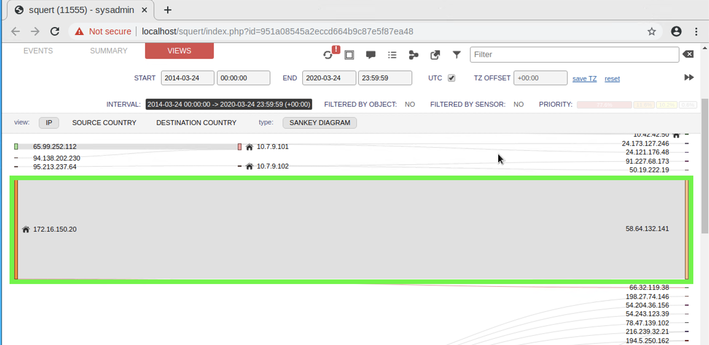
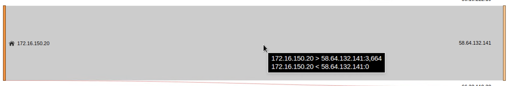
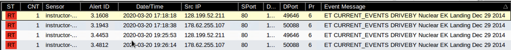
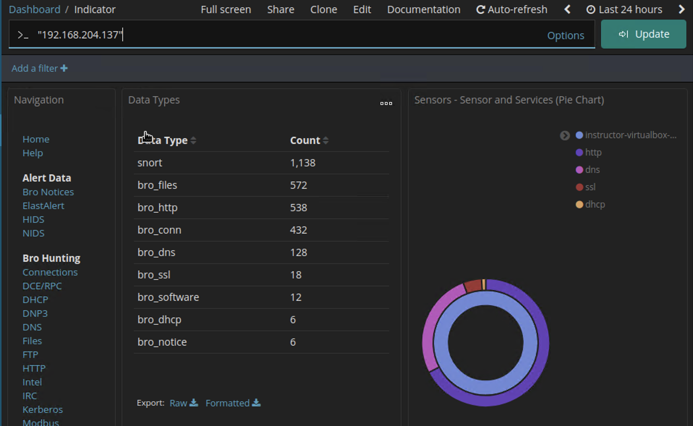
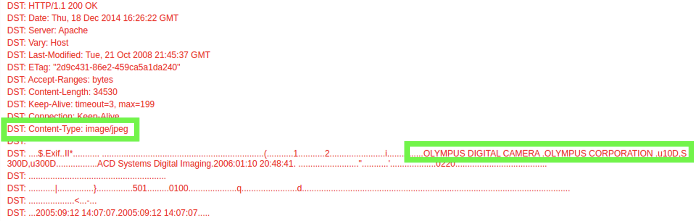
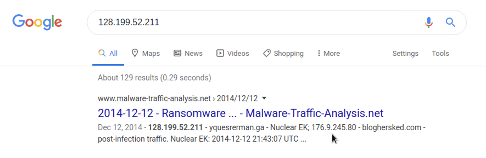
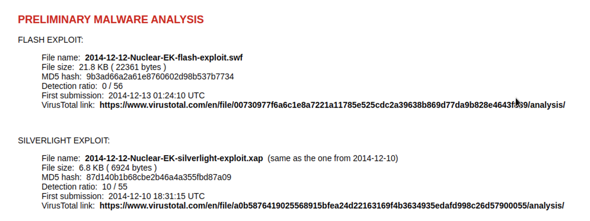
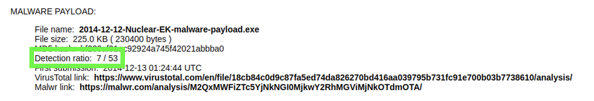
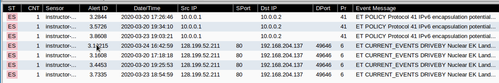

## Solution Guide: Investigation, Analysis, and Escalation

 The goal of this activity was to reinforce concepts related to the investigation, analysis, and escalation process of enterprise security monitoring.

---
**Investigation and Analysis**

1. From the **Summary** tab, what is the top source IP?

    - `172.16.150.20`

2. From the same screen, what is the top destination IP?

    - `58.64.132.141`

  

3. From the **Views** tab, answer the following questions: 

   - What is the source/destination IP pair?
   
     - Source: `172.16.50.20` 
     - Destination: `58.64.132.141`

  

   - From source to destination, what is the count?

     - 3,664
     
     **Note**: Your results may vary.
   
   - From destination to source, what is the count?  

     - 0

  

**Investigation and Escalation**

Select the following alert: 

- Source IP address: `128.199.52.211`
- Destination IP address: `192.168.204.137`
- Event message: `ET CURRENT_EVENTS DRIVEBY Nuclear EK Landing Dec 29 2014` 

Pivot to Kibana using **DstIP**. Make sure you are at the **Indicator** dashboard.

Answer the following questions:

1. How many connections are shown by the `bro_conn` filter?

    - 432
   
    **Note:** Your results may vary.

2. Delete the `bro_conn` filter. Are there any non-standard HTTP destination ports identified? If so, what are they?

    - Yes, `8080` and `22780`.

3. What is the most common MIME type?

    - Image/png

In the **HTTP - Sites** section, look for the site www.nandy.cz and apply a filter. Scroll to the bottom and click on the link under the **_id** column to pull up the PCAP. Answer the following questions:

4. What type of file was requested from the server?

    - Image/jpeg 

5. What brand and model of camera was used to take the image that was downloaded?

    - Olympus 10D

  

Pivot back to Sguil. 

Using the same alert (make sure it's highlighted; if not, click it) right-click the **Dst IP** and pivot to Google Lookup using the source IP `128.199.52.211`. 

Click the first link identified as `2014-12-12 - Ransomware ... - Malware-Traffic-Analysis.net`, and answer the following questions:

6. In the web article, scroll down to the Preliminary Malware Analysis section. What are the two applications affected by this malware?

    - Flash and Silverlight

7. In that same section, what is the malware payload detection ratio?

    - 7 out of 53

8. What type of malware does the article identify this as?

    - Ransomware

Now that you have gathered all the information needed to fully determine the scope of this particular incident, you’re ready to engage your incident response team.

#### Bonus Questions

9. Using Sguil, escalate the alert status and add the following note: "Further Analysis required. Possible breach in progress." 

10. Switch to the **Escalated Events** tab, right-click on the **Alert ID** of the recently escalated event, and select **Event History**. Take a screenshot of the results showing your comment. 

    

---
© 2020 Trilogy Education Services, a 2U, Inc. brand. All Rights Reserved.