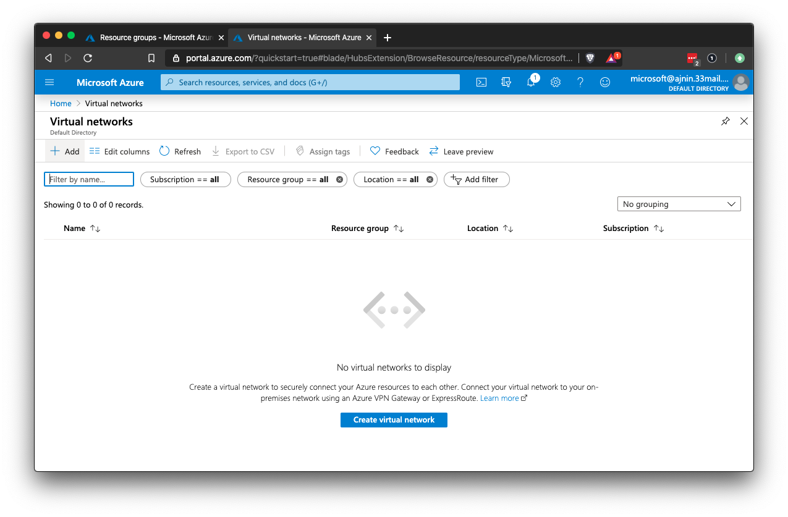

## Activity File: Virtual Networking

In this activity, you will be playing the role of an Azure cloud security engineer for XCorp.

- XCorp's Red Team has opened a ticket asking for a cloud server to be set up with a vulnerable web application. The Red Team will use this server to train new team members. It has been approved by the director of security.

- At this time, there are no cloud resources dedicated to the Red Team, so you will need to create everything from the ground up, starting with the network that the server will use.

- You are tasked with creating a resource group and a virtual network for the Red Team.

- **Note:** Not all regions will have available well-priced VMs, due to current global issues. and that currently, **West US** does work, but that this might change in the future. While creating your resource group **please select West US as the region.**

### Instructions

1. Make sure that you are using your personal Azure account. 
    - Navigate to portal.azure.com. If you are not signed in with your personal account, do so now. 

2. Azure requires you to create a resource group before you can set up anything else. 

    - Create a resource group that will contain everything the Red Team needs in the cloud.
    
		- Note: Choose a region that you can easily remember. Every resource you create going forward must be created in the exact same region.		

3. Before you can deploy servers and services, you must have a network where they can be accessed. 

    - To create a new VNet, search the Azure portal for "virtual network" and launch the Virtual networks page.

4. Use the **+ Add** button to create a new network. Use your networking knowledge to fill in the correct fields.

    - Note: Choose a region that you can easily remember. Every resource you create going forward must be created in the exact same region.

5. For your network, set the following criteria and configurations: 

    - A descriptive name, so this VNet can't be confused with other cloud networks on the account.

    - Subscription type.  
    
    - The resource group you created in step two.
    
    - The same location you chose for your resource group. 
    
    - Use the default network and subnet definitions in the IP Addresses section.

    - Use the default settings for Security.

      - In order to avoid recurring charges, do **not** enable DDoS Protection Standard.

    - No tags are needed.
---
© 2020 Trilogy Education Services, a 2U, Inc. brand. All Rights Reserved.
