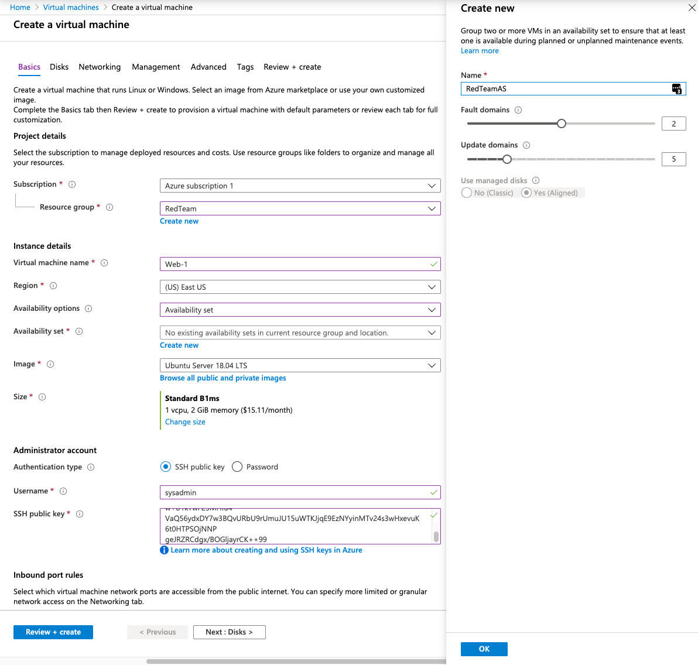

## Activity File:  Virtual Computing

- In our previous activities, we set up a secure VNet inside a resource group for the Red Team.

- In this activity, you will launch 3 new virtual machines to be used throughout the cloud portion of the course.

- To keep your connections to these machines secure, you want to only connect using SSH keys.

- You are tasked with setting up 3 new Ubuntu VMs inside the Red Team resource group to be used throughout the cloud section of the course.
	- A Jump-Box and 2 web servers.

### Instructions

#### VM 1 - The Jump-Box
Create a new VM. Configure it with the following properties:
- The **Name** should be "Jump-Box-Provisioner."

- It must be created in the Red Team resource group.

- It must be located in the **same region** as your resource and security groups.
	- Note that availability of VMs in Azure could cause you to change the region where your VMs are created.

- Choose an administrative username that you can remember easily. We recommend `azdmin`. 
  - You should use the same admin name for all 3 machines.
  - Make sure to take a note of this username, as you will need it to login later.

- You will need to create a new SSH key for remote connections. Note that you are using an SSH key _instead_ of setting a password.
	- **Note:** Windows users should use [GitBash](https://gitforwindows.org/) to create ssh keys and ssh connections.
	- Use `ssh-keygen` to generate SSH keys and `ssh` to open SSH connections.

- Choose the VM Size option that has the following properties:
  - **Offering** is **Standard - B1s**
  - 1 CPU
  - 1 GB RAM

In the **Networking** settings: 

- Make sure your new VM is assigned to your security group.

- Make sure this Jump-Box machine has a _static_ public IP address. 

#### VMs 2 and 3 - The Web VM's

Create 2 more new VMs with the following properties:
- Each VM should be named "Web-1" and "Web-2"

- Each VM must be created in the Red Team resource group.

- Each VM must be located in the **same region** as your resource and security groups.
	- Note that availability of VMs in Azure could cause you to change the region where your VMs are created.

- Choose an administrative username that you can remember easily. We recommend `azdmin`. 
  - You should use the same admin name for all 3 machines.
  - Make sure to take a note of this username, as you will need it to login later.

- You will need to use an SSH key for remote connections. Note that you are using an SSH key _instead_ of setting a password.
	- For these machines, use the `ssh` key that you created for the first machine.
  - Run `cat ~/.ssh/id_rsa.pub` to get the public key you need.
  - Note that this key will need to be changed later, so for now, we are just setting it up with a key to get it created.

- Choose the VM option that has:
  - Whose offering is **Standard - B1ms**
  - 1 CPU
  - 2 RAM
  - **Note:**: These web machines should have 2 GB of RAM and the Jump-Box only needs 1 GB. All 3 machines should only have 1 vCPU because the free Azure account only allows 4 vCPU's in total per region.

It is **crucial** to make sure both of these VM's are in the same availability Set. Follow the steps below:
  - Under Availability Options, select 'Availability Set'.
  - Click on 'Create New' under the Availability set.
  - Give it an appropriate name, e.g.: "Web-Set". Make sure **both VMs** are in the availability set.
  - Save your changes.

Under Networking:
- Make sure these new VMs are assigned to your security group.

- Make sure these machines _do not_ have public IP addresses. Set the Public IP to 'None' for both.

Note that these machines will not be accessible at this time because our security group is blocking all traffic. We will configure access to these machines in a later activity.

---
© 2020 Trilogy Education Services, a 2U, Inc. brand. All Rights Reserved.
