## 12.1 Student Guide: Introduction To Cloud Computing

### Class Overview

Today's class is the beginning of the Cloud Security and Virtualization unit. It will introduce cloud computing service models, cloud networking, firewalls, and virtual computing.

Over the next four classes, you will build a basic cloud network using VMs and containers.

### Class Objectives

By the end of class, you should be able to:

- Distinguish between cloud services and identify an appropriate service depending on an organization's needs.

- Set up a virtual private cloud network.

- Protect their cloud network with a firewall.

- Deploy a virtual computer to their cloud network.

### Slideshow and Time Tracker

The slides for today can be viewed on Google Drive here: [12.1 Slides](https://docs.google.com/presentation/d/1GJxzpn9nFRZHZgDMOxXn6Id3U1_nsK6S9YI4VObZWZw/edit#slide=id.g4789b2c72f_0_6)

### Class References

- [Microsoft Azure](https://azure.microsoft.com/en-us/)
- [Docker](https://www.docker.com/)
- [Ansible](https://www.ansible.com/)

- [Microsoft Azure phone app](https://apps.apple.com/us/app/microsoft-azure/id1219013620)
    - It is recommended to use the Azure web portal while completing class activities.
    - This phone app will _not_ be covered in any class or activities, however, you may want to explore using it outside of class.

---

### 01.  Introduction To Cloud Computing

Today's lesson will cover the following:

- Overview of cloud service models and the variety of cloud services available to organizations.

- Setting up a virtual cloud network that will run all of their systems during this unit.

- Securing a cloud network with a firewall and creating firewall rules.

- Virtual computing, creating web VMs in the cloud instance, and a jump box.

#### The Rise of the Cloud

Before the cloud, organizations set up their networks on devices that they owned and controlled. These setups are called **on-premises networks** because they live on machines owned and operated on the company's physical property.

Currently, the cloud and cloud services (vs. on-premises setups) dominate the computing industry. Many organizations are looking to move operations to a cloud provider, but are worried about the security of the cloud.

This concern is justified. Since both on-premises and cloud deployments are, essentially, just networks, many fundamental security concerns apply in both contexts. However, some concerns apply to the cloud and not to on-premises setups. These include:

- **Complex architecture**: Systems must be built to both ensure basic security, and allow infrastructure personnel to securely monitor, reconfigure, and redeploy machines as needed. This is typically easier to do securely with on-premises machines, since these are not exposed to public networks unless they need to be. But cloud deployments are remote, and therefore we must take extra steps to ensure they are only exposed to the relevant parties.

- **Extensive management**: The cloud offers much more flexibility than organizations are used to, giving them freedom to create many more machines. This flexibility is a good thing, but it also makes operations management more complex. Machines can appear and disappear seemingly at random, so properly tracking everything requires additional skills and techniques.

- **Different threats**: The cloud is exposed to public networks. Cloud providers handle certain aspects of security for an organization, which means security professionals have new and different things they must pay attention to. Malicious actors will execute escalation and lateral movement tactics differently on the cloud than on-premises.

- **Ensuring availability**: High availability of machines is a large part of security on the cloud. Ensuring availability and redundancy on the cloud is done differently than with on-premises environments.

Protecting cloud deployments is not harder than protecting on-premises networks. However, it is distinctly different. Therefore, being able to protect cloud deployments is a valuable skill for a cybersecurity professional.

List some job roles in which these skills are used:

- **Cloud Security Analyst** or **Cloud Penetration Tester**: These roles need to understand cloud architecture in order to test the security settings for a given environment.

- **Cloud Architect**: This role builds out a cloud environment for an organization. They are expected to understand how to build-in security from the beginning.

- **DevSecOps**: These roles are responsible for maintaining production and testing environments for an organization's developer and QA testing teams. They are expected to build and maintain secure systems at every step of the development process.

Today's activities will take you through the basics of setting up a cloud environment protected by a firewall, and hosting a few virtual machines.

### 02. Cloud Service Models

**Important:** For all demos, you should be using your own personal Azure account. Please make sure that you are logged in at portal.azure.com.

You can think of the cloud in the same way they would think about an on-site data center or network. The cloud has all of the same equipment: servers, virtual machines, routers, firewalls, load balancers, etc. The difference is that, in the cloud, most of these items are virtualized, meaning they are software instead of hardware.

This allows a cloud administrator to create entire networks of computers, servers, and other equipment, all virtualized by software. An entire setup may only physically exist on a few powerful virtual servers.

The fact that cloud networks are virtualized and defined by software gives them numerous security benefits:

- **Ground-up security**: From a security perspective, the cloud presents an opportunity to build a secure system from the beginning, as opposed to trying to implement new security measures on old systems.

- **Easy configuration**: Instead of having to learn the many different tools that will be included on a network, an administrator can use the cloud service provider's website portal or command line to create all their needed items.

- **Quick turnaround**: Compromised and insecure machines can be discarded and replaced quickly, at no additional cost to the organization.

- **Personalized networks from cloud providers:** Software and configuration-as-code allows cloud providers to deploy the specific network that engineers need for their circumstances. Security specialists can define the secure network they need, and the cloud provider can create and test the deployments, making the networks more dependable.

- **High availability and fault tolerance**: Without their own physical data centers, engineers can focus on deploying their machines in multiple places, and the provider can maintain the data center. This way, cloud networks are more robust against power outages, DoS attacks and other threats, as long as they are configured correctly.

- **Easy implementation**: Security controls can be implemented more easily, because they require only modifications to software-defined networking patterns. No complicated rearrangements of physical wiring are necessary.

- **Affordability**: Organizations can use powerful machines that they would not be able to afford if they had to purchase and maintain them themselves. For example, GPU processing units, which are very expensive to buy and very expensive to lose to an attacker.

#### Cloud Services

Deploying cloud services securely is different from developing secure on-premises networks. We'll need to understand which services cloud providers make available, what each service does, and when to use each one.

All cloud services add the phrase "as a service" to the name of the service. For example: platform as a service (PaaS) and software as a service (SaaS). You will see the "aaS" acronym on certification exams as well as in job requirements.

**IaaS (Infrastructure as a Service)**: A service provider offers pay-as-you-go access to storage, networking, servers and other computing resources in the cloud.
- Security benefits include high availability, guarantees that base machines are up-to-date at the time of deployment, and provider-enforced security controls, such as basic access management.

- Organizations can focus on implementing functionality and security that is relevant only to their business concerns, and not worry about the basics of secure deployments.

- AWS, Azure, and Google Cloud all offer IaaS.

**PaaS (Platform as a Service)**: A service provider offers access to a cloud-based environment in which users can build and deliver applications. The provider supplies the underlying infrastructure.

- Organizations can leverage powerful applications that are guaranteed to be secure and available, without having to properly implement security themselves.

- Azure Classroom Labs, on top of which this course's lab environments are deployed, is one example. It guarantees availability and provides access only to the ports necessary to connect to the labs.

**SaaS (Software as a Service)**: A service provider delivers software and applications through the internet. Users subscribe to the software and access it through the web or vendor APIs.
- The software runs in environments that are guaranteed by the provider to be secure. Engineers do not need to worry about secure deployment.

- Cloud software such as the Microsoft 365 Cloud Office Suite and Apple's Cloud iWork are examples of SaaS.

**DaaS/DBaaS (Data as a Service/Database as a Service)**: A service that provides a company's data product to the user on demand, regardless of geographic or organizational distance between provider and consumer.

- The main security advantages are high-availability and fault tolerance. DaaS ensures data is always available, even if there is a power outage at a single data center, and ensures that data is still deployed from a center as close to those consuming it, in order to reduce latency.

- An example of a DaaS is a marketing company that keep databases of consumers categorized for many different industries.

**CaaS (Communications as a Service)**: A service that provides an outsourced communications solution. Such communications can include Voice over IP (VoIP or Internet telephony), instant messaging (IM), and collaboration and video conference applications.

- CaaS guarantees security by ensuring that communications are not vulnerable to eavesdropping, and provides comprehensive monitoring/record-keeping for auditing purposes.

- Zoom, FaceTime, Skype, and GoToMeeting are all examples of CaaS.

**XaaS (Anything as a Service)**: Cloud services providing all any combination of the offerings mentioned so far.

These services are presented differently by different providers. As well, some providers offer simplified versions of these services to make them easier to implement.

Some pros and cons of using a pre-configured service as opposed to building a custom solution:

- A pre-configured service is faster to set up.
- A pre-configured service requires less training and research for a system administrator.
- A custom solution gives the organization complete control over the solution.
- A custom solution may be less expensive, but requires more internal training.

Note that cloud providers all have the same abilities, but may look different. Additionally, different providers offer different levels of pre-configured services. Which provider an organization chooses will depend on their specific needs.

- We use Azure in this class, but this unit is meant to be provider-agnostic. In other words, you should be able to apply the same skills to other providers.

### 03. Virtual Networking

This week will focus on the IaaS (Infrastructure as a Service) offering from Microsoft's Azure.

- IaaS is the most fundamental cloud service. All other services are software-based and assume that the infrastructure is already set up.

- Focusing on IaaS will allow us to get some hands-on experience configuring a cloud networking environment, as well as configuring the servers inside the network.

#### Creating an Environment

We will begin creating a cloud infrastructure environment that you will use for the remainder of the unit, as well as for other units, such as Web Vulnerabilities and Projects.

Finding resources on a virtualized network requires more than just locating the physical machine on which they're deployed. Keeping resources organized on the cloud is often more challenging than in an on-premises environment.

In Azure, **resource groups** allow engineers to sort related resources into different groups, each of which can be easily located by name.

- A resource group is a logical grouping of all resources used for a particular setup or project. The resource group will contain the network, firewalls, virtual computers, and other resources that are needed for setup.

- Different organizations use different naming conventions for resource groups and their contents. In class, we'll simply name resource groups based on the project or activity they correspond to. When working in a professional setting, they should take note of how their employers name resource groups.

The first step to creating an environment in Azure is to create a resource group. Once we have a resource group, we can start adding items to it, the first of which will be a virtual network.

The Azure Portal is intuitive and easy to use. The easiest way to find what you need is to use the search bar.

- Open your Azure portal and search for "resource group" to demonstrate.

    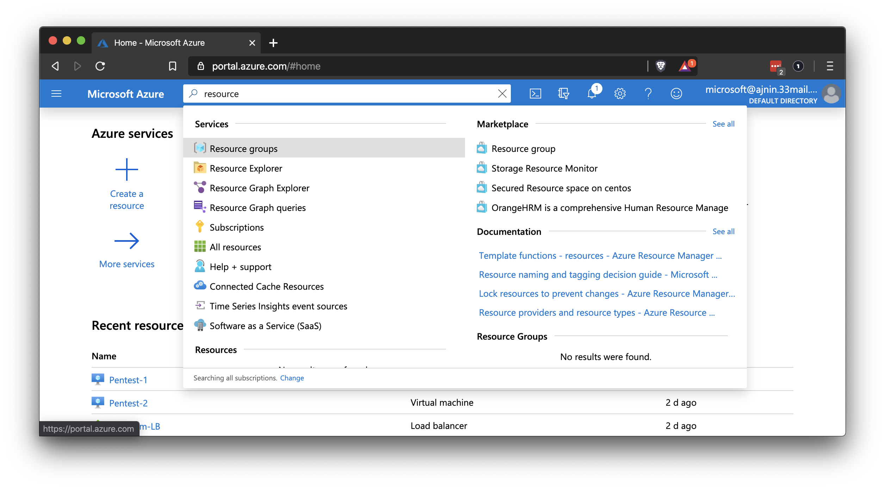

- Select **Resource groups** in the search results and note the **+ Create** button at the top.
  - Not all regions will have available well-priced VMs and students may need to change the region as they add resources.
  - Use the default region that will show automatically for your location. In our examples we are using US West.
- Every resource that you create will have this button at the top.

    


Now that we have a resource group, we can add a virtual network.

A **virtual network** is just what it sounds like: a collection of virtual machines that can communicate with each other.

- Unlike physical networks, which need physical wiring to achieve connections and discovery, virtual networks are much more flexible. The VMs on a virtual network can live in completely different data centers, but perform as if they are wired, as well as provide improved availability.

- Virtual networks can be quickly and easily reconfigured by clicking a few buttons in the portal. This is much faster and safer than rewiring a physical network to improve segmentation. It also results in less human error.

In order for virtual networks to behave identically to physical ones, cloud providers use software to emulate everything a physical machine uses to interact with a network, including:

- **vNICs** (Virtual Network Interface Cards): Similar to physical machines, VMs have software versions of "normal" NICs. Just like physical machines, VMs can have multiple vNICs.

- **IP addresses**: VMs have IP addresses, just like physical computers. IP addresses are considered their own type of resource in Azure, AWS, and other cloud environments.

- **Subnets**: Like IP addresses, subnets are considered separate resources in the cloud, meaning they can be created independently of other resources. After creating a virtual network, we can create a new virtual subnet and add it to the existing network. We can also create a new public IP address resource and associate it with an existing virtual machine.

Creating a virtual network creates all of these resources at the same time. While we will not be doing this in class, it is crucial to understand that this can be done, as it is common practice when managing and reconfiguring real-world deployments.

We'll need to rely on the IP addressing structures that they learned during the unit on networking.

- Private networks will use one of three IP schemes:
    - `192.168.x.x`
    - `172.16.x.x`
    - `10.x.x.x`

- We can also use CIDR notation when defining a network space:
    - `192.168.1.0/24`

When creating a network in Azure, we will define a large network as well as a subnet inside that network. For example:

- `10.0.0.0/16` for the large network.
- `10.10.1.0/24` for the first subnet.

These default values will be automatically populated and we do not need to change them.

We'll only need to define the boundaries of the network and we can use the default values. Azure does the rest. We will not need to configure a router or DHCP, as these are configured automatically.

- Cloud providers configure this functionality automatically and _securely_, making it difficult to attack routers and DHCP servers directly.

- Azure also automatically provides logging capabilities, so we can easily check the history of the DHCP lease.

Final vNet Settings should be similar to:

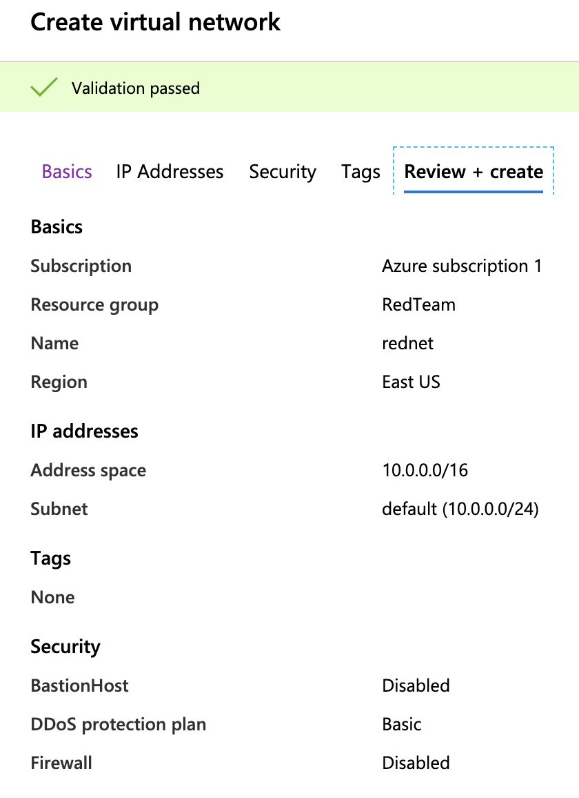

### 04. Virtual Networking Activity


**Important:** For this and all activities, make sure you are using your personal Azure account. You should be logged in at portal.azure.com (instead of labs.azure.com).

- [Activity File: Virtual Networking](Activities/04_Virtual_Networking/Unsolved/README.md)

### 05. Virtual Networking Activity

- [Solution Guide: Virtual Networking](Activities/04_Virtual_Networking/Solved/README.md)

### 06. Security Groups

Our goal is to have a virtual machine running behind a firewall on their virtual network in the cloud by the end of the day.

Now that we have a virtual network set up, we want to protect it with a firewall.

- As a review: Firewalls block or allow network traffic depending on what rules are set.

- We can set rules on single or multiple ports, coming from and going to a single IP or multiple IPs.

On the Azure platform, our basic firewall is called a **network security group (NSG)**. We will use a network security group to block and allow traffic to our virtual network and between machines on that network.

As mentioned earlier, many resources can be created independently of any particular virtual network and then attached to a VNet after creation.

- Network security groups are a good example of this concept. In this demonstration and the following activity, we will create an NSG that blocks all traffic to and from the network. We will then attach it to the VNet to secure it.

- This model, while seemingly complex, has the advantage of allowing security engineers to create NSGs for different traffic profiles, which they can then replicate and apply to any VNet.

- For example, one might create an NSG called Desktop Connections, which clears RDP and VNC traffic to and from the VNet. Engineers can then use this NSG as a template, clone it, and apply it to any new or existing VNet that requires this type of access.

#### Network Security Group Demonstration

Begin by completing the following:

- Open your Azure portal and search for "Network security group."

- Use the **+ Create** button to add a network security group.

- Name the group something memorable.

- Once the group is created, click **Go to resource**.

- Click **Inbound rules** on the left side.

Let's look at the default rules and their purpose:

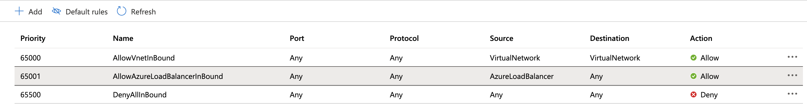

- The first rule allows all traffic to flow inside the vNet with destination and source both set to 'Internal Network'.
	- This means that all machines deployed using this Security Group will be able to communicate with each other.
- The second rule allows all traffic coming from a load balancer.
	- This means that _if_ there were a load balancer assigned to this security group, it could send traffic to all the resources on the internal network.
- The final rule blocks all other traffic.
	- This means that all traffic from the internet is automatically blocked to any resource you protect with this Security Group.

When a machine is deployed to your vNet using this security group, you will have to create a rule that allows access to that resource.

Explain that, as an example, you will create a rule that allows RDP on port `3389`.


Create a rule using the following settings:

- Source: This is the source computer. It can be a single IP, a range of addresses, an application security group, or a service tag.

    - An application security group is a kind of web application firewall that we won't be using.
    - A service tag will filter for a specific location or source of traffic.
    - For this rule,  we will set the source to your external IP address.
			- Visit [http://ip4.me/](http://ip4.me/) to obtain your external IPv4 address.
		- Choose 'Ip Addresses' from the dropdown and paste in your external IPv4 address.

- Source Port Ranges: Source ports are generated randomly, so it's best to leave the wild card (*) here to signify all source ports.

- Destination: We can choose between Any, IP address(s), VirtualNetwork, or an application security group. We'll choose **VirtualNetwork**.
	- Note that _if_ you wanted to send traffic to a specific machine, you would enter its _internal_ IP address here.

- Service: We can choose the protocol RDP

- Destination Port Ranges: RDP uses port `3389`, so this will automatically be selected.

- Protocol: We can choose TCP, UDP, ICMP. In the image above, **TCP** was automatically chosen when we selected RDP.

- Action: Firewall rules are either denying traffic or allowing traffic. Here, we are going to choose **Allow**.

- Priority: Firewall rules are implemented in sequence. A priority number allows rules to be read and sorted based on their priority number, from lowest to highest. We can see that the default rules start with a priority of 100, so anything we set under 100 will be read first. In the example above, we've used 500.

- Name/Description: You can name a rule whatever you like, but it is a best practice to name it what it is and describe what it does. Here, we will name it "Allow-RDP" and add the description: "Allow RDP from external IP over port 3389."

  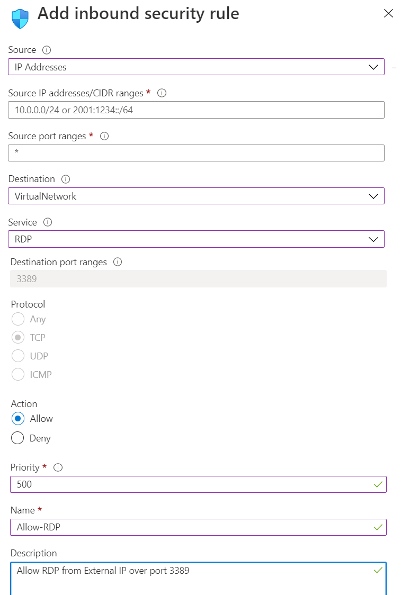

**Note:** The external IP is not shown in the screen shot.

Save your new security group rule.

### 08. Security Groups Activity  (0:20)

- [Activity File: Security Groups](Activities/09_Security_Groups/Unsolved/README.md)


### 09. Instructor Review: Virtual Private Cloud Activity (0:15)


- [Solution Guide: Security Groups](Activities/09_Security_Groups/Solved/README.md)

### 10. Instructor Do: Virtual Computing (0:20)

In the last section of this class, we will deploy 3 computers onto our network.

- Virtual computing is very common in today's internet infrastructure. In fact, many of the servers that you interact with on a daily basis are actually virtual servers.

- Virtual computers have all the same components that physical computers have, but, as expected, they are defined by software.

When you set up a virtual machine, you'll often need to decide how powerful you need the machine to be and choose each of the main hardware components.

These components include:

- **RAM (Random Access Memory)** is the amount of memory dedicated to running computer operations. The computer uses RAM to temporarily store data that it needs to access quickly.
    - When an application runs, it runs on RAM. The computer puts all of the needed bits of the application into RAM and accesses them to complete the operation of the application.

    - The more RAM is on a computer, the more applications a computer can run simultaneously.

    - When the computer is restarted, the RAM is cleared and the process of loading applications to RAM is restarted.

    - RAM is measured in increments of 8 bytes. Today's common values are 8, 16, and 32 GB on personal computers, and much more (128+ GB) on servers.

- **Storage (HDD/SSD)** is the part of the computer that stores data permanently. This is data that you do not lose when the computer is turned off.

    - HDD (hard disk drive) is a magnetic disk that spins inside a casing. The disk is read with a small magnet attached to an arm, similar to the way a record player reads a record.

    - SSD (solid state drive) is a more technologically advanced form of storage. Because HDDs have moving parts, they eventually wear out and stop working. An SSD has no moving parts and is based on the same technology that RAM uses.

        - SSDs are faster and more reliable than HDDs but also more expensive. For now, both options still exist, and which you choose will depend on the needs of the computer and your budget. SSDs are great for data that needs to be accessed quickly and HDDs are great when you have very large amounts of data that do not need to be accessed often or quickly.

    - For virtual servers, long term storage is essentially a database that the server or OS needs to read and write to.

        - For example: Information for user logins is stored in one database on either an HDD or an SSD, and the operating system is stored on a different HDD or SSD, depending on how the machine is set up.

        - Long-term storage is measured in gigabytes and terabytes.

- **Disks** attached to a VM fall into two general categories:

    - OS disks contain the operating system, kernel, and everything required for the VM to function.

    - Data disks contain data that the VM doesn't need in order to run, but which users need in order to do their jobs. This might include:
        - Virtual machine images, in the case of Azure classroom labs.
        - Text data, if you're using a cloud VM to do "normal work."
        - Forensic disk images, if you're using a cloud VM for investigative duties.
        - Audio, images, and video data, if you're using the machine to perform heavy-duty graphical processing, such as speech or facial recognition.

- Cloud providers allow you to choose different kinds of disks, depending on your needs:
    - As mentioned above, you can use a simple HDD if all you need is persistent storage of basic information, such as text, spreadsheets, or forensic disk images.

    - Or you can choose a premium SSD if you need to be able to quickly run memory-intensive applications, such as FTK or Autopsy.

- The cloud provides users a ton of flexibility and choice, but some options are far more expensive than others. What you choose should depend on your specific needs.

    - It is affordable to use the cloud to experiment with high-performing hardware for short periods of time.

    - Threat intelligence professionals, for instance, often use powerful GPU-driven machines for machine learning and computationally intensive data analysis. This is because it's much cheaper to use these machines for short periods of time on the cloud than to purchase and maintain them.

    - However, premium storage and top-of-the-line machines are just as expensive for cloud providers to own and maintain as they would be for an individual or organization. Using them without first establishing cost controls can quickly result in massive expenses.

- **CPU (Central Processing Unit)** is like the brain of the computer. It's the part that actually computes all the ones and zeros. The CPU takes code and data out of the long term storage, loads it into RAM, and performs the computations specified by an application.

    - When you are waiting for a computer to complete a task, such as installing software or copying data from one location to another, you are waiting for the CPU to complete the necessary computations.

    - The speed of a CPU is measured in hertz, which is the measurement of how many bits can be processed from a zero to a one per second. Today's CPUs are measured in gigahertz.

A virtual computer has a software version of these components. When we create a virtual computer, we define the "hardware," such as the amount of RAM, the storage space, and the CPU. Once it is defined, we install an operating system and use the VM as if it were a normal computer.

The physical servers located inside data centers have enormous amounts of RAM, storage space, and CPU power, so they can run many virtual computers at the same time. One physical server can easily run more than ten virtual machines, depending on the resources assigned to each VM. Virtual machines can even run other virtual machines.

Before working with devices on the cloud, we must _always_ set budget limits and cost-control policies. Otherwise, we can accidentally exceed our employer's budgets.

- Azure provides cost-control tools as a free service, which you are encouraged to study before managing live cloud deployments. We will not be using such expensive tools in class as it fall outside the scope of the course. However, they offer crucial functionality for managing live deployments on the job.

In the next activity, we will create a new VM and add it to our network.

Before we start, we'll cover a few key components of the VM creation process.

- Navigate to your Azure portal, search for "Virtual" and select **Virtual machines**.

- Click **+ Add** to create a new VM.

    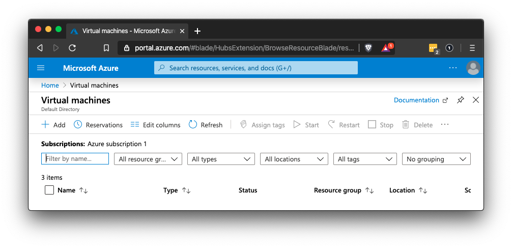

- The tabs across the top of the VM creation page. Today we'll focus on the **Basics**, **Disks**, **Networking** and **Review + Create** tabs. Don't worry about the **Management**, **Advanced**, and **Tags** tabs.

    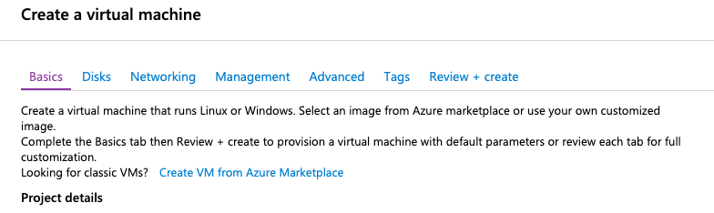

**Important:** Give your VMs descriptive names. It will help stay organized.

- Name this VM "Jump-Box-Provisioner."


#### Regions and VM Availability

By default Azure should populate a VM and Region.

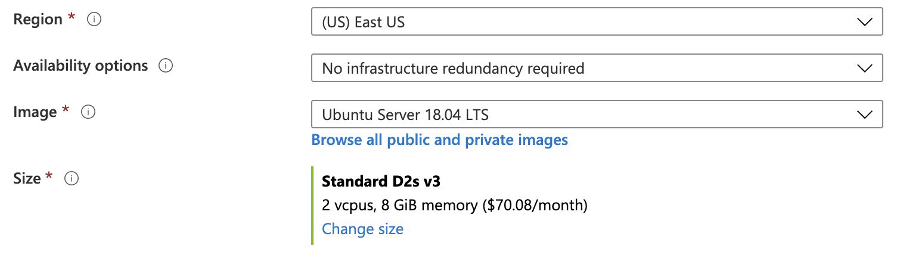

Under 'Availability Options' we won't need redundancy for the Jump-Box. This is because the jump box does not need to scale to handle a large number of connections: Only one administrator will use it at a time.

The web servers, by contrast, must be designed to handle a large number of requests. This requires configuring them with an **Availability Set**, and assigning each web server to that availability set. and select it for the web machines.

An Availability Set is a fault-tolerant group of VMs. An Availability Set consists of at least two VMs. Each must be located in the same region, but each of the two VMs is hosted in a _different_ data center. Different data centers are called **Availability Zones**.

This ensures that, if one of the VMs in the availability set goes down, the other is (nearly) guaranteed to remain up: Even if an entire data center goes down, the redundant machine in the other Availability Zone will remain running.

In summary, an **Availability Set** is a group of VMs, where each VM is in a different **Availability Zone**. If one of the Availability Zones goes down, the VM in the other picks up the workload.

**Note:** Azure limits free tier users to only 4 vCPUs per Region. Notice that the default machine will normally have 2 vCPUs and 8 GiB of memory. For this jump box, the machine size should be changed to a smaller machine to conserve resources.

The Jump-Box machine only needs 1 vCpu and 1 GiB of memory.

**NOTE:** _IF_ there is no machine selected by default, there may not be any machines available in that region. Azure VM availability updates dynamically so changing your region may give you the machine that you need.

Click on 'Change size'

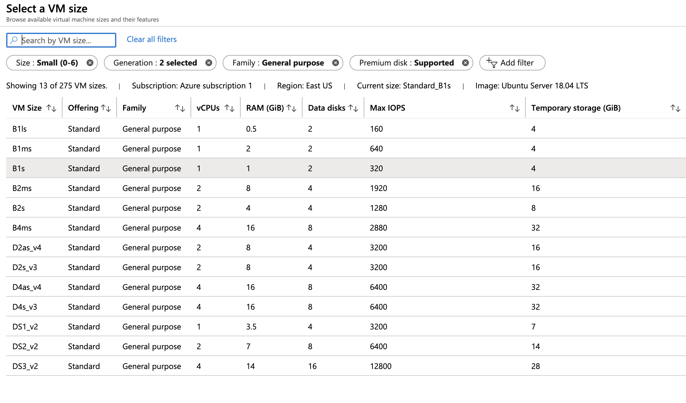

Choose a machine that has 1vCPU and one GiB of Memory (B1s).

**NOTE:** If all of the machines are greyed out and you cannot select one, Azure doesn't have any available machines in the selected region. The region must be changed on the previous screen.

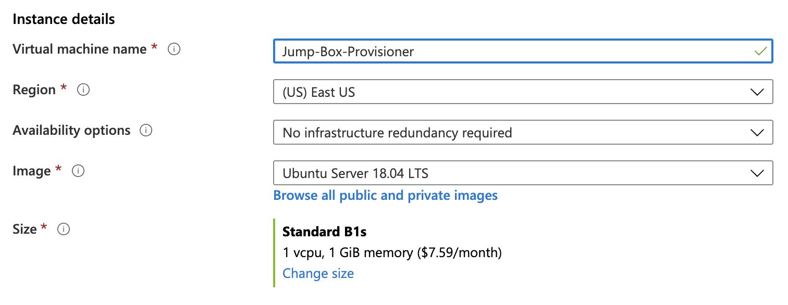

#### SSH setup
Accessing a server with SSH using a password is inherently weak: many programs can brute force an SSH password. Instead, we want to practice setting up secure systems from the beginning, so we will use an SSH key pair to access our new machine.

- Azure has a section on the Basics page where we can insert a public key and create an administrator name for our SSH access.

- First, we have to create a key.

We'll do this on the command line using the `ssh-keygen` command.

**IMPORTANT:** Windows users should be using [GitBash](https://gitforwindows.org/) to use these commands and create ssh connections.

- Open a terminal and run `ssh-keygen`.

- You will be prompted to save the SSH key into the default directory `~/.ssh/id_rsa`. DO NOT CHANGE THIS LOCATION. Press the Enter key.

- You will be prompted to enter a password for our new SSH key.
	- DO NOT ENTER A PASSWORD. Press the enter key twice to enter a blank password

- You should not change the name or location of this key and should not enter a password. You only need to use the default values and hit enter to accept them. If you set a password or change the location, it can cause issues later on in the week when you setup automation.

- Your output should be similar to the below:

    ```bash
    $ ssh-keygen
    Generating public/private rsa key pair.
    Enter file in which to save the key (/Users/cyber/.ssh/id_rsa): <hit enter>
    Enter passphrase (empty for no passphrase): <hit enter>
    Enter same passphrase again: <hit enter>
    Your identification has been saved in id_rsa.
    Your public key has been saved in id_rsa.pub.
    The key fingerprint is:
    SHA256:r3aBFU50/5iQbbzhqXY+fOIfivRFdMFt37AvLJifC/0 cyber@2Us-MacBook-Pro.local
    The randomart image is:
    +---[RSA 2048]----+
    |         .. . ...|
    |          o. =..+|
    |         o .o *=+|
    |          o  +oB+|
    |        So o .*o.|
    |        ..+...+ .|
    |          o+++.+ |
    |        ..oo=+* o|
    |       ... ..=E=.|
    +----[SHA256]-----+
    ```

All SSH keys are stored in the user home folder under a hidden `.ssh` directory. Inside this directory we can see our private key named `id_rsa`, which should never be shared. We can also see a public key named `id_rsa.pub`, which we can place on servers that we want to access using this key.

- Run `cat ~/.ssh/id_rsa.pub` to show our `id_rsa.pub` key:

    ```bash
    $ cat ~/.ssh/id_rsa.pub

    ssh-rsa AAAAB3NzaC1yc2EAAAADAQABAAABAQDGG6dBJ6ibhgM09U+kn/5NE7cGc4CNHWXein0f+MciKElDalf76nVgFvJQEIImMhAGrtRRJDAd6itlPyBpurSyNOByU6LX7Gl6DfGQKzQns6+n9BheiVLLY9dtodp8oAXdVEGles5EslflPrTrjijVZa9lxGe34DtrjijExWM6hBb0KvwlkU4worPblINx+ghDv+3pdrkUXMsQAht/fLdtP/EBwgSXKYCu/
    ```

- Copy the SSH key string and paste it into the Administrator Account section on the Basics page for the VM in Azure.
	- For `SSH public key source` select `Use existing public key` from the drop down.
    - You will use the same SSH key for every machine you create today. Later we will change the key on a few machines.

- The username can be any name, but it must be something the students will not forget. The SSH public key must be copied from the machine.

- This is all we need to do to create an administrator account on the machine that will have SSH access.

    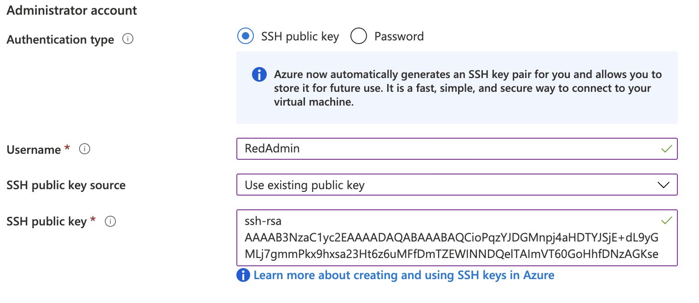

Pause and ask if there are any questions here before moving on.


### 11. Virtual Computing Activity

- [Activity File: Virtual Computing](Activities/12_Virtual_Computing/Unsolved/README.md)

### 12. Virtual Computing Activity

- [Solution Guide: Virtual Networking](Activities/12_Virtual_Computing/Unsolved/README.md)


#### Summary

You should now have a VNet that holds their jump box and 2 Web Machines protected by a firewall.

The the public IP of the Jump Box may change when you stop and restart it. You can obtain the IP address from the VM details page.

If the IP resets, they will see a message like this:

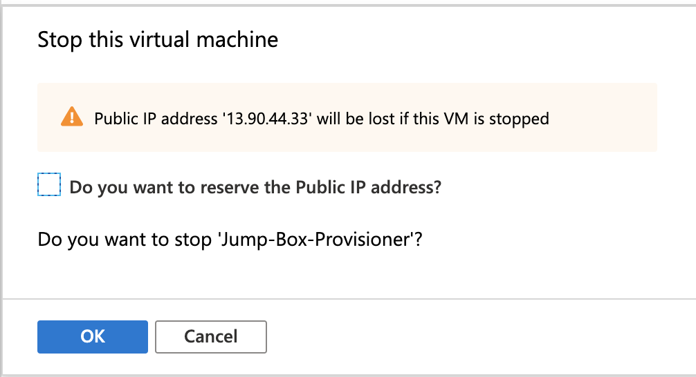

Even though we have added an SSH key to the VMs, we currently cannot connect to them. Emphasize that this is intentional: the NSG that students implemented earlier prevents all traffic from reaching the machines.

Therefore, the SSH key has no effect until the NSG is updated to allow inbound SSH connections.

This approach is an important best practice:

- We created the network and blocked all traffic before placing any VM's inside of it.

    - This ensures that it is truly impossible for an attacker to gain access during the configuration process.

- Then, we added an SSH key through secure methods, ensuring that only the user with the correct private key (you) will be able to connect to the machine.
    - Still, this private key is essentially useless until the NSG is updated to allow SSH traffic.

    - This further protects the machines on the network by ensuring they can't be accessed, by the private key owner or any attacker who intercepted it, until the cloud administrator explicitly allows such access.

- In the next class, we'll update the NSG, following the principle of least privilege, to allow only inbound SSH traffic.
    - We will configure the NSG so it only allows one IP address to open connections. This will ensure that if an attacker steals the key remotely, they will only be able to connect to the VM if they *also* successfully compromise your development machine.

During the next class, we will continue to build out our cloud infrastructure to allow SSH access to our VNet via the jump box, provision containers, and more.

Please remember to ALWAYS stop all the VMs in your Azure account before ending class. 

-------

© 2020 Trilogy Education Services, a 2U, Inc. brand. All Rights Reserved.
