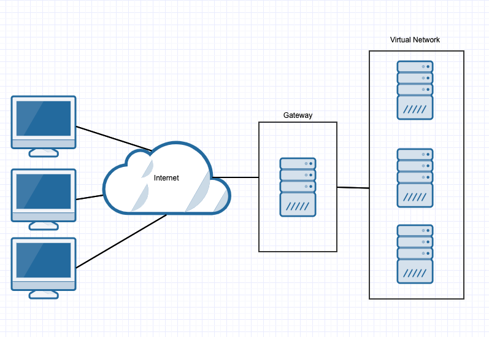
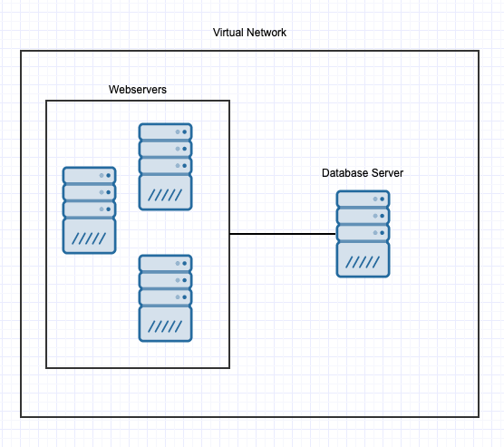
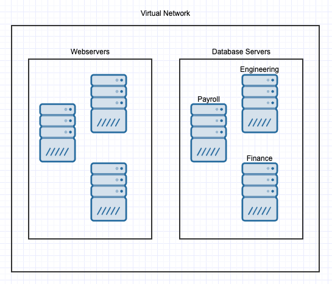

## Solution Guide: Cloud Architecture

In this activity, you considered network architectures from a combined administration, security, and budgetary point of view.

---
### Gateways

Example 1: This setup uses one gateway to access the network.

Example 2: This setup uses two gateways to access the network.

What are the pros and cons of each example and which do you prefer?

Pros
- Having two gateways provides redundancy. If one gateway fails, the second gateway can still provide access. 

- Two gateways ensure better load balancing. You'll study this in greater depth later this week, but having two machines that can handle incoming requests allows the network to handle more traffic than it would be possible with only one.

Cons
- Two gateways requires double the maintenance and setup time, as well as double the cost. Now two servers need to be maintained instead of one.

- Two gateways means two potential targets. In addition to additional maintenance, there is now another machine to secure.

Summary
- Critical cloud networks will benefit from having redundant gateways. It all depends on how critical the network is, weighed against the extra cost and setup time.

- Provisioners and automated deployments can mitigate the security concerns listed above. Look out for discussions about provisioners and related technologies that address these.

---
### Databases

Example 1: This setup uses a single database for an organization.

Example 2: This setup splits up databases for each department into separate servers.

What are the pros and cons of each example and which do you prefer?

Pros
- Multiple databases (known as sharding) can provide redundancy, and increase availability and obfuscation. As the size of databases grow, a single server can be slowed down with too many requests. 

- In addition, if one database is compromised, the attacker doesn't have access to _all_ of the organization's data. Sharded architectures have better _containment_ capacity than single data stores.

Cons
- More databases require paying for more servers and more maintenance/setup time, so there are cost concerns.

- If a vulnerability is found that affects all the databases, more systems will need patching. Also, having more systems increases an organization's overall attack surface and, if configured incorrectly, can increase the number of vulnerabilities. 

Summary
- This decision will generally depend on the size of the organization. Smaller organizations may not be able to justify the cost of the maintenance and additional systems required to support sharding.

- Multiple databases always increase the organization's attack surface, which is the consequence of adding machines. However, provisioners and automated deployment make it easier to patch multiple systems.

---
### Logs

Example 1: This setup has logs from each web server sent to a SIEM server, which saves logs to its database located on a separate server. 

Example 2: This setup sends logs directly to a log server. 

What are the pros and cons of each example and which do you prefer?

Pros
- Using a SIEM server is typically preferable because a SIEM can preprocess before persisting the log data. This enables the system to do real-time analysis and collect data at the same time, rather than requiring a security professional to collect raw logs from a single log database, then parse and investigate them.

- In addition, SIEM servers enable additional intrusion detection capabilities beyond what logs alone would include, considerably increasing the network's ability to secure itself.

Cons
- While SIEM servers simplify log aggregation, they are more complex and time consuming to set up, and they require additional servers and costs.

- The same pros and cons that apply to the database architecture above apply here, since SIEM servers must be backed by databases.

Summary
- Typically, large organizations both send logs to a SIEM system and keep a backup of raw logs on redundant log servers. Because log data is continuously generated, this can get expensive quickly and not all companies can justify the cost.

- However, organizations that can do both often benefit from doing so, as the persistence of logs allows them to use advanced tactics, such as analysis of historical log data for threat intelligence and enabling more detailed forensic investigation.

---
© 2020 Trilogy Education Services, a 2U, Inc. brand. All Rights Reserved.
