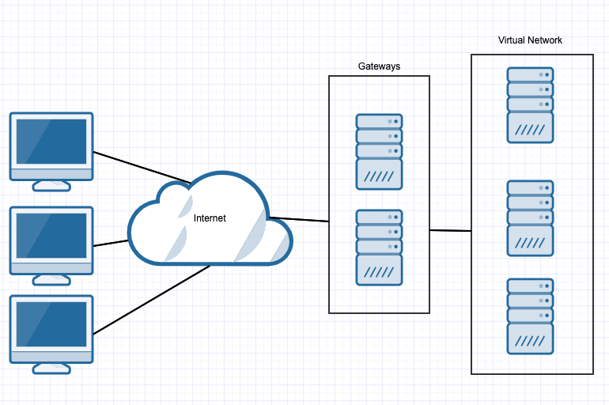

## Activity File: Cloud Architecture

In this activity, you are a cloud architect in charge of creating a new cloud network.

- It is helpful to diagram your network before you start building, so you have a blueprint of what you’re trying to build. Building a strong, secure network requires careful planning and consideration of what servers will provide what function.

- You will be presented with several network options and must choose the best option for each scenario. 

### Instructions 

For each category below, list pros and cons for each category. Then, choose which one you prefer, and provide a one- or two-sentence summary explaining why.

Your pros, cons, and justifications should consider:
- Fault tolerance: If a machine goes down unexpectedly, which setup is more robust against the failure?

- Cost: Is either architecture clearly more expensive?

- Complexity: Is either architecture considerably harder to set up or maintain?

- Containment capacity: If a breach _does_ occur, which architecture better ensures attackers can’t move around the network at will?

Not all of these factors will be relevant to all architectures, but you should keep them all in mind as you consider each one. 

#### Gateways

Example 1: This setup uses one gateway to access the network.

Example 2: This setup uses two gateways to access the network.

What are the pros and cons of each example and which do you prefer?

---
#### Databases

Example 1: This setup uses a single database for an organization.

Example 2: This setup splits up databases for each department into separate servers.

What are the pros and cons of each example and which do you prefer?

---
#### Logs

Example 1: This setup has logs from each web server sent to a SIEM server, which saves logs to its database located on a separate server. 

Example 2: This setup sends logs directly to a log server. 

What are the pros and cons of each example and which do you prefer?

---
© 2020 Trilogy Education Services, a 2U, Inc. brand. All Rights Reserved.
