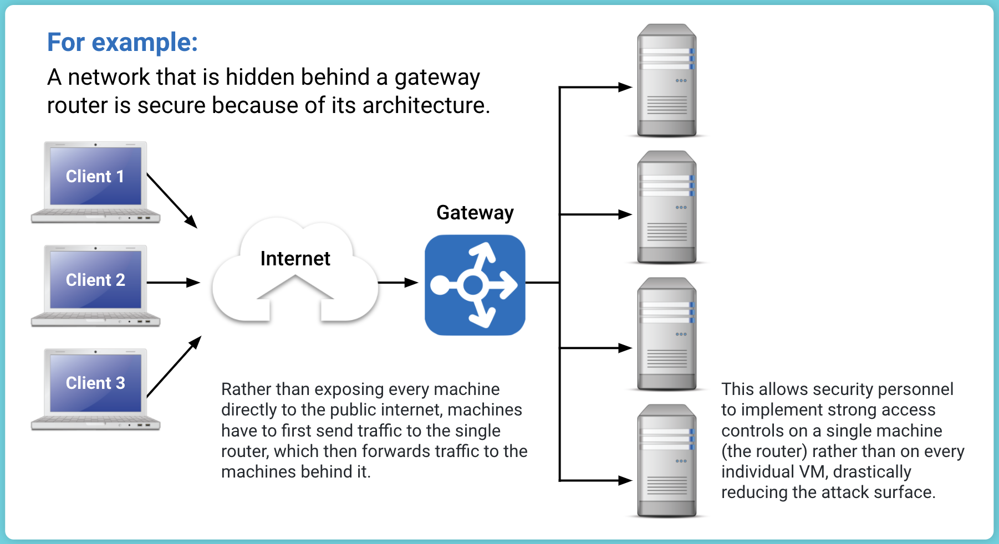
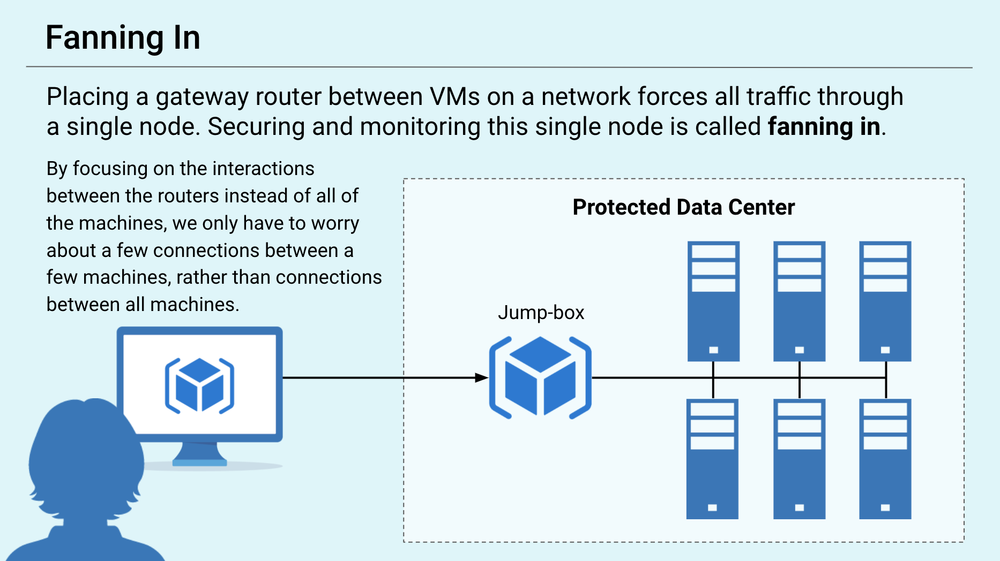
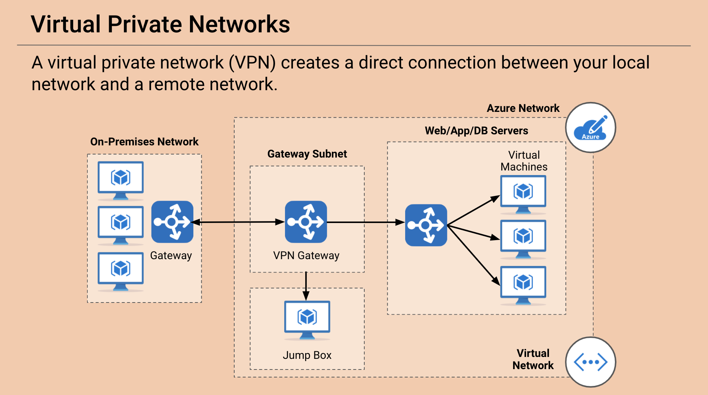
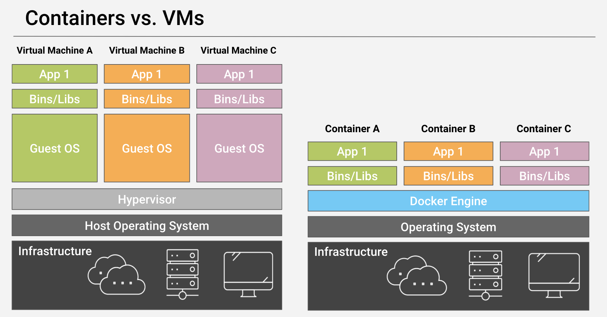
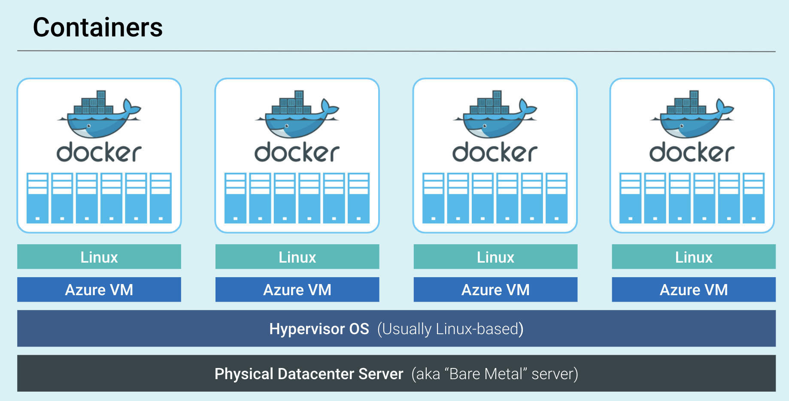
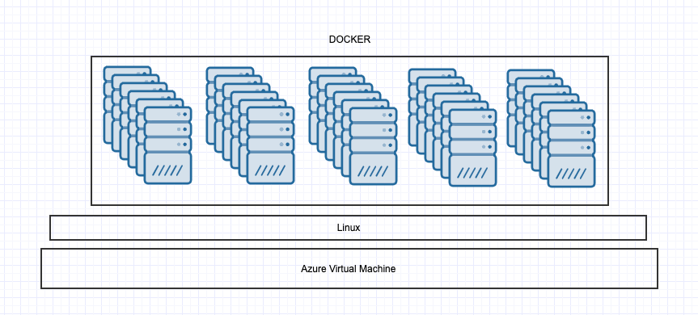
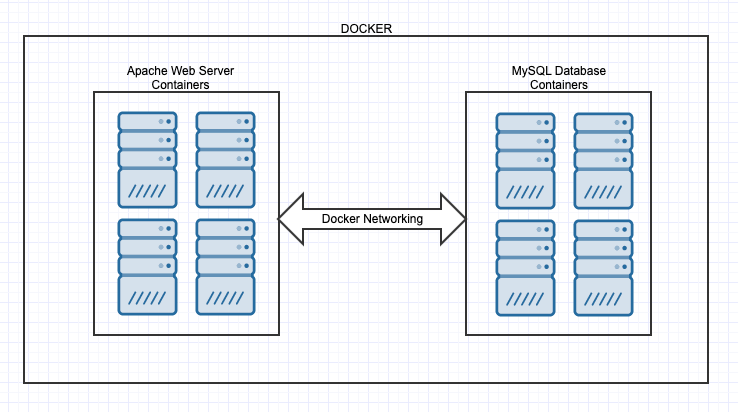
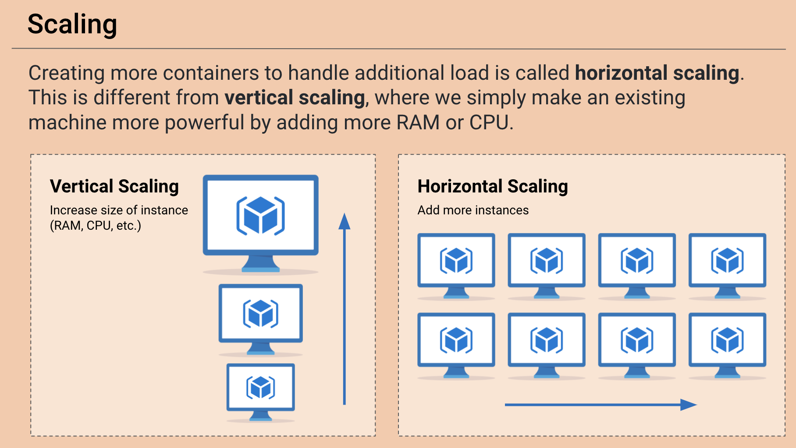
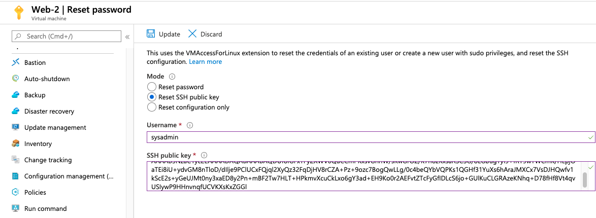

## 12.2 Student Guide: Cloud Systems Management

### Class Overview

Today's class will introduce  containers, provisioners, and a working concept of "infrastructure as code."

### Class Objectives

By the end of class, you should be able to:

- Access their entire VNet from their jump box.

- Install and run containers using Docker.

- Set up Ansible connections to VMs inside their VNet.

### Slideshow

The slides for today can be viewed on Google Drive here: [12.2 Slides](https://docs.google.com/presentation/d/1uznln5UPOnElTH1cXfnKPgLidqfYgxV2q30a0TdPCqA/edit#slide=id.g4789b2c72f_0_6).


---

### 01. Introduction to Cloud Systems Management

In the previous class, we covered the following:

- The different cloud services and the *aaS acronyms.
- The unique challenges of securing cloud deployments and building security from the ground up.
- We set up a virtual network protected by a firewall with 3 virtual machines on that network.
- At this time, the VMs are still inaccessible because our firewall is blocking all traffic.

In this lesson, we'll cover the following:

- SSH connections and security group rules.
- Containers, what they are, and their role in IT infrastructure.
- Provisioners and their role in the larger concept of infrastructure as code.
- Using Ansible to create infrastructure.
- An introduction to network architecture and secure network design.

The tools being discussed today (containers, infrastructure as code, and provisioners) are considered "modern" technologies, even in the fast-paced world of tech.

- They are new technologies that provide powerful solutions to some of the most difficult problems in infrastructure management.

- Not all organizations leverage them fully. However, nearly all organizations are aware of their value, and many are updating their processes and tool kits to make better use of them.

- Potential employers will consider knowledge of containers, infrastructure as code, and automated provisioning valuable for both cloud-specific and "standard" systems/network administration roles.

**Containers** can be thought of as lightweight VMs. They're smaller than VMs, being megabytes rather than gigabytes, and require fewer CPU resources.
    - Because they are smaller, they can be downloaded and distributed more easily. Since they're cheap, more of them can be run. They're also easier and faster to destroy and redeploy as needed.

**Provisioners** are tools that automatically configure VMs or containers for you. Instead of manually logging into a machine and issuing commands like `apt get` or editing configuration files yourself, you can use a provisioner to do this automatically.
    - The primary benefits of provisioners are that they a.) drastically reduce the potential for human error and b.) make it easy to configure potentially thousands of identical machines all at once.

**Infrastructure as code (IaC)** is the idea that the configurations for all of the VMs, containers, and networks in your deployment should be defined in text files, which you can use with provisioners to automatically recreate machines and networks whenever necessary.
    - The primary benefit to IaC is that everyone can see exactly how the network is configured by reading text files. These can easily be version controlled in a tool like Git, or Apple Time Machine and Microsoft OneDrive.

**Continuous Integration/Continuous Deployment (CI/CD)** is the concept of automatically updating machines on your network whenever your IaC files change. In other words, whenever you change a machine's configuration file, CI ensures that a new version of that machine is built immediately. CD ensures that this new version is automatically deployed to your live environment.
    - The primary advantage to CI/CD is that it allows you to manage your entire network by simply updating IaC text files.

These concepts will make more sense as we work through them hands-on in class:

- Containers expedite and simplify the deployment of custom machines to a network.

- Provisioners eliminate human error in the configuration process.

- IaC allows engineers to describe all of their network and VM configurations in simple text files.

- CI/CD allows organizations to automatically get the most recent networks and VMs to their customers after engineers have reviewed and approved their new configurations.  
    - In practice, CI/CD is the "glue" that binds all of the other tools together, allowing for fully automated configuration and infrastructure management. However, it is also the most complex, and different organizations vary wildly in how they manage their CI/CD systems. As such, we'll discuss the tools that go into a normal CI/CD pipeline; discuss how CI/CD systems use these tools; and leave the details of deploying them for you to learn on-the-job.

Some job roles in which these skills are used:

- **Cloud security analysts** and **cloud penetration testers** need to understand cloud architecture in order to test the security settings for a given environnement.

- **Cloud architects** build out a cloud environment for an organization and are expected to understand how to build in security from the ground up.

- **DevSecOps** are responsible for maintaining production and testing environments for an organization's developer and QA testing teams. They are expected to build and maintain secure systems at every step of the development process.


### 02. Foundations of Network Architecture

Last class, we did the following to our network:
- Created a virtual network.
- Blocked all traffic to this network using a firewall.
- Deployed 3 virtual machines to this network.

### Configuration vs. Architecture

Our virtual machines are not accessible because our security group firewall is blocking all traffic to them. This is to ensure there is no way anyone can gain access to these VMs until we want them to.

- This is an example of "secure configuration" as opposed to "secure architecture." These terms aren't typically understood as opposites in the industry, but for the purposes of learning, we will define them as follows:




- **Secure configuration** ensures that an individual VM or network is protected from intrusion using well-considered rules, such as access control policies and firewall rules. A securely configured VM or network is secure because it follows the right rules.

- **Secure architecture** ensures that a poorly configured or malfunctioning individual machine can only cause a limited amount of damage. A secure network is secure because it is "structurally sound."
    - In other words, secure architecture deters and contains the effects of a breach, ensuring that even insecure machines are difficult to compromise, and that damage to a single machine doesn't take down the entire network.

Some examples to distinguish between secure configurations and secure architecture:

- The Linux VMs deployed in our last class are secure by configuration. They are impossible to access because the security group on the VNet was set up securely, and because the VM's have been configured with SSH key access only, which is the most secure way to configure remote access.

- A network that is hidden behind a gateway router is secure by architecture. Rather than exposing every machine directly to the public internet, machines have to first send traffic to the single router, which then forwards traffic to the machines behind it. This allows security personnel to implement strong access controls on a single machine (the router) rather than on every individual VM.
    - This drastically reduces an organization's attack surface from several machines to just one, while also making it easy to securely configure the machine that is exposed.

While secure configuration and secure architecture promote security in different ways, they must work together.

- Secure configuration is setting secure "rules" for individual machines and networks. Secure architecture is connecting these individual machines and networks in safe ways.

- While secure architecture can effectively mitigate the consequences of a breach, the machines deployed with that architecture must be securely configured in order for the architecture to fully deliver its security guarantees.

The VMs you set up in the previous class are an example of secure configuration. It ensures that the individual machines are both configured and connected to in a secure manner.

#### Network Redundancy

As you should know by now, organizations and businesses need to use best security practices that fit their budgetary restrictions and operational needs.

One important security practice is **fault tolerance and redundancy**.

- A fault tolerant system can keep running even if one or more components within the system fail.

- These systems continue to run because of **redundancy**, the practice of creating duplications of critical components or systems.

- If one system or component is lost or compromised, a redundant system or component can step in and keep the system going.

- In terms of security, this directly affects the reliability and availability of a system.

The top priority of redundant systems is persistent data redundancy, also known as data backups.

-  Losing access to a critical database or server can cause an organization losses in revenue, production, and operations.

- For example, if an authentication server goes down, employees won't be able to authenticate or access systems necessary for doing work.

When making decisions about network architecture, we should always consider the amount of redundancy needed versus the amount of budget available. Not every organization will have the budget to create redundant systems for everything.

- Do you think Amazon.com is running only on one web server?

- If it was, and that server went down, Amazon would likely lose millions of dollars in revenue during the downtime.

- However, it would not make sense for a smaller web company to invest in the infrastructure needed to support a site like Amazon.com. The company would likely go out of business due to unsustainable operational costs.

So where does the cloud come in?

- Using cloud services, and especially IaaS, allows a company to add resources as needed, scale infrastructure as the business grows, and only pay for what they need.


### 03.  Cloud Architecture Activity


- [Activity File: Cloud Architecture](Activities/03_Cloud_Architecture/Unsolved/README.md)


### 04. Review Cloud Architecture Activity

- [Solution Guide: Cloud Architecture](Activities/03_Cloud_Architecture/Solved/README.md)

### 05. Instructor Do: Jump Box Administration (0:10)

Now, you will apply secure architecture methods to their jump box configuration:

First, we will look at the **fan-in** pattern:




Placing a gateway router between VMs on a network forces all traffic through a single node. Securing and monitoring this single node is called **fanning in**, and is much easier than securing and monitoring each individual VM behind the gateway.

- Focusing traffic through a single node makes it easier to implement routing logic and design networks. By focusing on the interactions between the routers instead of all of the machines, we only have to worry about a few connections between a few machines, rather than connections between all machines.

- The name "fan-in" comes from the way this pattern looks on a diagram: focusing traffic on a single machine looks like a fan.

As shown in the previous diagram, a jump box is essentially identical to a gateway router.

- The jump box is exposed to the public internet. In the classroom, we will be able to connect to the jump box's SSH port (`22`).

- The jump box sits in front of other machines that are _not_ exposed to the public internet.

- It controls access to the other machines by allowing connections from specific IP addresses and forwarding to those machines.


For now, this secure architecture will be enough. But, setups like this can and should be further hardened by:

- Limiting the number of machines that our jump box can access.

- Locking the root account and limiting the `sudo` access of the administrator account on the jump box.

- Implementing log monitoring on the jump box.

- Implementing two-factor authentication for SSH login to the jump box.

- Implementing a host firewall (UFW or IPtables) on the jump box.

- Limiting jump box network access with a virtual private network.

####  Virtual Private Networks

We can configure a **virtual private network (VPN)** to securely connect to a cloud network.

A VPN creates a direct connection between your local network and a remote network.

- A VPN can encrypt all network traffic between your current network or device and your remote network.

- Once you are connected to the VPN, you have full access to all resources on the remote network, as if you were locally connected.

- Many companies use VPNs to allow remote workers access to computers and servers that are otherwise only accessible from the local network.




### 06. Jump Box Administration Activity


- [Activity File: Jump Box Administration](Activities/06_Jumpbox_Admin/Unsolved/README.md)


### 07. Review Jump Box Administration


- [Solution Guide: Jump Box Administration](Activities/06_Jumpbox_Admin/Solved/README.md)


### 08. Containers

So far, we set up a jump box that we will use to access our network and configure a machine for the Red Team.

Configuration can require downloading and installing different applications to work together:

- For example, when configuring a LAMP web server, you will need to: install Linux, a web server like Apache, a database like MYSQL, and a back-end codebase like PHP.

- In order for each of these items to work together, they need to be properly configured. This can be a time consuming process.

We can use VMs to configure a single LAMP server by setting up a VM as a LAMP server, capturing an image of this VM, and duplicating this image whenever a new LAMP server is needed. Mention that the term image here refers to a copy of a VM.  

- However, this method is "heavy":  VMs are large and take a long time to download and deploy.

- Additionally, if you clone an entire VM, most of the VM will be "wasted space," since only a few files on the entire disk are actually relevant to running the LAMP server. The rest are just operating system files.

    - For example, it would be inefficient to deploy 20 VMs that are each 3 GB, if each VM is identical with the exception of the data in their databases.

    - It would be much more efficient if each web server shared common resources, like the OS kernel and core libraries, and was only individually responsible for maintaining what was different between them, such as the data in their databases.

Containers are essentially lightweight VMs. These act like VMs but are smaller and use fewer resources by sharing the resources they have in common with other containers.

#### Running Containers

Like VMs, containers are simulated machines that run on a single host.

- However, two separate VMs running on the same host are completely independent of each other.
    - Virtual Machine A has no knowledge of Virtual Machine B. Even if Virtual Machine A and B were created from identical images.

- In contrast, containers can share certain files. Container A, Container B, and Container C can run on a single host and use the same kernel.
    - They share these files and therefore only have to contain the files relevant to their applications, such as the LAMP server.








Some benefits of containers:

- **Lightweight**: Containers are much more lightweight than virtual machines. This is because they don't need to virtualize all the hardware of the computer and don't need to run their own OS.

- **Share resources**: Containers intelligently share OS resources while remaining isolated, allowing each one to focus exclusively on its own state.

- **Specialized**: Containers only run the software components that they need to complete their task. Containers only do one thing.
    - In the example of our LAMP server, we can have a LAMP container image that already has all the LAMP components installed. The image is downloaded like an app.

    - When a LAMP server is needed, a container is created from the image that was downloaded, and the LAMP server is up and running.

- **Easily duplicated**: A copy or image of a container can be easily downloaded and shared from computer to computer. When you need that particular container, the image is used to create a duplicate container.

- **Prevalent and redundant**: Containers are widely used in today's web architecture.
    - Using our LAMP server example again, we might have a single virtual machine server that is running 100 LAMP containers that are all configured in exactly the same way. As website traffic grows, the traffic can be evenly distributed among the 100 containers, and more containers can automatically be created.

    - If one container is attacked or has a problem, it can be killed and regenerated as needed without the website going down.

VMs and containers are used together. Usually, an administrator will provision a powerful VM and then run many containers on it.




Using containers instead of VMs to run a LAMP server immediately results in massive cost and operational savings by eliminating a large amount of file and CPU overhead.

- However, each container still has to maintain its own data, making each one *stateful*. You can't safely destroy a container and replace it with a new one if it contains data that no other container has.

- This seems to work against one of the main benefits of using containers: their ability to be easily created and destroyed.

Therefore, we want to make containers as *stateless* as possible. This can be done by moving data to its own central location and extracting server and application data as much as possible.

- This can be remedied by further splitting the LAMP container into a set of multiple containers:

    - One responsible for the database (MySQL)
    - One responsible for the web server (Linux/Apache)

In this setup, the containers responsible for the Linux/Apache server would be identical. They would have the exact same application data. Differences would now only exist in the containers that contain the database.




- If we have a sudden increase in the number of users accessing our site, we can accommodate it by creating even more application/server containers, and linking them to the database container(s).

- While we can increase the number of database containers, we can also create more application containers to handle a larger number of user requests and throttle requests to the database from these instances.

- Making a machine as stateless as possible allows us to create and destroy as many application containers as we want, knowing that the application's data will continue to exist in the database containers.

The process of creating more containers to handle additional load is called **horizontal scaling**. This is different from **vertical scaling**, where we simply make an existing machine more powerful by adding more RAM or CPU.



On the cloud, horizontal scaling is preferable to vertical scaling because it offers much greater flexibility. This is because:

- Using containers, we can scale each part of the web application individually.

- Horizontal scaling makes the system more resilient. Instead of having a single point of failure, (one web server) we have multiple web server containers running, each taking different requests. If one of them fails, we can redirect requests to the other containers. If a container is compromised, we can tear it down and re-build it from scratch, while the other containers continue to function.

- Vertical scaling has a limit. We can only add so much RAM and CPU to one computer before we run out of resources.

- In real-world practice, both vertical and horizontal scaling are used.

#### Docker

**Docker** is the most common program used to manage containers:
- Docker is open source and free software.

- It has a container hub that anyone can use to store containers or download containers created by other people.

- Docker containers make it extremely fast and easy to install complex server configurations.

- Docker makes it relatively easy to create a custom container.

In the next exercise, you will configure your jump box to be able to run Docker containers.

Another advantage of containers being lightweight: they can be used to distribute software, versus having to install software directly on a host machine.

For example, let's say we want to install a tool like Git on our VM. Compare the following scenarios:
- Install Git directly on your host machine.
- Download a container that has Git inside of it and use Git from the container.

While downloading a container with Git seems like indirection, as we are adding another step, it also has the advantage of eliminating platform and version issues.

If your machine can run Docker and you use a Docker container to run Git, it has the following advantages:

- You can use the same container on any machine where you use Git, and it will work identically.    
    - While you can't guarantee that software installed directly will behave identically across different machines, you can guarantee that the same container will. (This is usually not an issue with Git in particular, but is a source of bugs with other software.)

- You can more easily install multiple versions of a tool, and use them at the same time for different projects.
    - Rather than managing several versions of a single software on your machine, you can have one container for each version you need. This is useful if you are working on several different projects at once, each needing a different version of the same software. (This is actually an extremely common use case among developers, operations, and cloud engineering specialists.)

Since we are working towards a fully reproducible automated configuration process, we will use Docker to install Ansible, a provisioning tool. This will ensure our provisioning scripts run identically everywhere. This will further ensure our automated configurations will do exactly the same thing every time they run, eliminating as much variability between configurations as possible.

#### Docker Demo

Installing and using Docker only requires a few commands.

First, double check the public IP of your Jump Box as it may have changed since relaunch.

Open your terminal and SSH into your jump box.

- Run `ssh admin@jump-box-ip`

To install applications on a Linux machine, we use the `apt` command.

Since we don't know when these images were last updated, we will first update them by running `apt-get update`.

- Run `apt-get update`

To install Docker, we need to specify `docker.io`.

- Type `sudo apt install docker.io`

Double check that the docker service is running.

- Run `sudo systemctl status docker`
  - If the Docker service is not running, start it with `sudo systemctl start docker`. 

- After Docker is installed, you can use Docker commands to download a container image.

Switch to a browser and go to [hub.docker.com](https://hub.docker.com).

- This is the Docker Hub, where you can make a free account and find many images.

    - Having an account is not necessary. To install an image, you only need to know the name of the image.

- Image names always follow the same format: `[image_maker]/[image_name]`.

- To download an image, use the `docker pull` command with `sudo` and the image name.

**NOTE:** All Docker commands should be run with `sudo`.

Run `sudo docker pull cyberxsecurity/ubuntu:bionic`

- `sudo`: Runs Docker with the root account.
- `docker pull`: The Docker command to download containers.
- `cyberxsecurity/ubuntu:bionic`: The specific container to download from the Docker Hub.

Clear your prompt.

Once you have the image downloaded, you only need one `docker run` command to launch a container and connect to its command line.

Run `sudo docker run -ti bionic/ubuntu bash` to start the container.


- `sudo docker run`: The command to create and run a new container.
- `-ti` stands for `terminal` and `interactive` and sets up the container to allow us to run a terminal and interact with the container.
- `bionic/ubuntu`: The container image that has already been downloaded.
- `bash`: The command we are running inside the container. This will give us a shell to control the container.

### 09. Containers Activity


- [Activity File: Containers](Activities/09_Containers/Unsolved/README.md)

### 10. Review Containers Activity


- [Solution Guide: Containers](Activities/09_Containers/Solved/README.md)

### 11.  Infrastructure as Code and Provisioners

Now that we have our jump box running an Ansible Docker container, we will go over provisioners and configure this jump box to connect to other servers so it can configure them.

Whenever we make configuration changes to a server, it is important to keep track of exactly what changes are made.


Infrastructure as code (IaC) is the concept of defining all of your equipment and network with code. When using virtual machines and containers, almost every server, database, workstation and other component in your infrastructure can be individually defined with code.

- When a particular piece of the infrastructure is needed, we can run the code that defines that thing and it will be up and running within a few minutes.

- IaC allows us to clearly build in security protocols from the ground up. If a server is found to be vulnerable, it's easy to change the code that created the server and build in a fix.

IaC is also important for keeping track of the changes we make.
- When we create code that contains the configuration of a server, that code can be version controlled and easily audited.

- Rather than having to back up the server and its settings, servers can send logs to a central database. This way, we only need to back up small text files containing the code that defines the servers.

- Code configuration changes can be deployed or reversed as needed. If an update causes a problem, we can use version control to reverse the code to its previous state, and redeploy.

- In order to see what changes are made to a server, we just need to look at what changes the code makes. Often this code is written in a very easy-to-read language, so we only need minimal documentation to understand any given configuration.

While IaC makes it easier to manage individual components of a VM, it raises a question about scaling:

- Ask the class to imagine the following scenario: What if they are personally in charge of managing 1,000 servers and 10,000 containers? Logging in individually to each of them in order to make changes becomes an impossible task.

A provisioner is a software application used in IaC setups for making automated configuration changes to computers.

- Provisioners focus on bringing a server to a certain state of operation.

- Once the desired state of a server is documented with code, that code can be run on one server, 100 servers or 10,000 servers within a few minutes. Provisioners can do everything from install software to change configuration text files, and more.

- The changes that a provisioner makes are created using text files, usually written in YAML or JSON.

- Common provisioners include Ansible, Puppet, and Chef.

#### Container and Provisioner Demo: Docker and Ansible

During our last activity, we downloaded a Docker container that runs Ansible. It has everything we need to run Ansible and configure other servers. During the next few activities, we will be using the Ansible container on our jump box to connect to another VM and make configuration changes.

In the following walkthrough, we will explore Docker more in-depth and use our Ansible container to connect to a new VM. This means we need to create an SSH key pair on the Ansible container and reset the SSH keys on our Web-VM's to use the SSH `id_rsa.pub` file from our Ansible container.

- Run `ssh admin@jump-box-ip`

Once you are connected, there are a few Docker commands we will need in order to get the container up and running.

- If we began the with the same command we used to create our container, we would end up creating another new container.

- We want to make sure we are only running one container and that it is the same container every time we use Ansible.

**IMPORTANT NOTE** The difference between `docker run` and `docker start` is very important! `docker run` will create a _new_ container from the container image and that new container will have default settings. None of your previous Ansible changes will be there. Because of this, `docker run` should only be used on the first time the Ansible container is created/started. `docker start` should be used _every_ time thereafter, or problems with the activities will arise because of missing files on the Ansible container.
Begin by connecting to your jump box via SSH.

List all the containers created on the system:

- Run `docker container list -a`

- Your output should resemble the following:

    ```bash
    root@Red-Team-Web-VM-1:/home/RedAdmin# docker container list -a
    CONTAINER ID        IMAGE                           COMMAND                  CREATED             STATUS                         PORTS               NAMES
    Exited (0) 2 minutes ago                           hardcore_brown
    a0d78be636f7        cyberxsecurity/ansible:latest   "bash"                   3 days ago  
    ```

- In this example, the container name is `hardcore_brown`, but your container will have a different name.

- This name will be automatically created. These names are generated by randomly pairing a strong adjective with the last name of a notable computer programmer.

- Your unique container name will be used when referring to a container with Docker commands.


Type `sudo docker start hardcore_brown`

- `sudo docker`: Uses `sudo` to run Docker with root.
- `start`: Initiates the container that follows.
- `container_name`: The unique name for your container.

Run the command and note that nothing seems to have happened.

```bash
$ sudo docker start container_name
$ hardcore_brown
```

List all running containers:

- Run `sudo docker ps`

- You should see your container in the list.

    ```bash
    $ sudo docker ps
    CONTAINER ID        IMAGE               COMMAND             CREATED             STATUS              PORTS               NAMES
    21a0f55d4e30        775349758637        "bash"              6 weeks ago         Up 3 seconds                            hardcore_brown
    ```

Activate a shell on your container:

- Run `sudo docker attach container_name`

- Your prompt has changed and you are now connected to your Ansible Docker container.

    ```bash
    $ sudo docker attach hardcore_brown
    root@23b86e1d62ad:~#
    ```

During the activity you will need to create an SSH key from inside the Ansible container and use that SSH key to create a new VM. Since you have completed these steps during the previous activity, we will skim this subject here.

Run `ssh-keygen` to create an ssh key inside the ansible container.
	- Hit enter 3 times to accept all default key settings (located in /root/.ssh/id_rsa.pub and no password)

Reset the password for one of your Web-VM's inside the azure portal and copy over your new ssh key.



After we have a VM running with the SSH key installed, we want to configure Ansible to connect to that VM.

First, we need to verify that our ssh connection is working and accept the key.

Run `ssh <username>@<webVM-IP>` to connect to the Web-VM and accept the key.

```bash
root@6160a9be360e:/etc/ansible# ssh sysadmin@10.0.0.5
The authenticity of host '10.0.0.5 (10.0.0.5)' can't be established.
ECDSA key fingerprint is SHA256:/jlvMP2ZRQu3fdXXPc65t8Z8fjuDMIMxhXCsaihHcJU.
Are you sure you want to continue connecting (yes/no)? yes
Warning: Permanently added '10.0.0.5' (ECDSA) to the list of known hosts.
Welcome to Ubuntu 18.04.4 LTS (GNU/Linux 5.3.0-1020-azure x86_64)
```

Run `exit` to close the ssh connection and return to your ansible container.


- Run `ansible`. Ansible should now be installed and running.

    ```bash
    root@9bd16493749f:~# ansible
    usage: ansible [-h] [--version] [-v] [-b] [--become-method BECOME_METHOD]
                [--become-user BECOME_USER] [-K] [-i INVENTORY] [--list-hosts]
                [-l SUBSET] [-P POLL_INTERVAL] [-B SECONDS] [-o] [-t TREE] [-k]
                [--private-key PRIVATE_KEY_FILE] [-u REMOTE_USER]
                [-c CONNECTION] [-T TIMEOUT]
                [--ssh-common-args SSH_COMMON_ARGS]
                [--sftp-extra-args SFTP_EXTRA_ARGS]
                [--scp-extra-args SCP_EXTRA_ARGS]
                [--ssh-extra-args SSH_EXTRA_ARGS] [-C] [--syntax-check] [-D]
                [-e EXTRA_VARS] [--vault-id VAULT_IDS]
                [--ask-vault-pass | --vault-password-file VAULT_PASSWORD_FILES]
                [-f FORKS] [-M MODULE_PATH] [--playbook-dir BASEDIR]
                [-a MODULE_ARGS] [-m MODULE_NAME]
                pattern
    ansible: error: too few arguments
    ```

We must make two changes to the configuration files to let Ansible make connections:

- Ansible needs to know which administrative username it should use when making SSH connections. This will be the admin username you used when you created your Web-VM's.

- Ansible needs to know the IP address of the VM you want it to connect to.

Each of these settings is located in a different file, but _all_ Ansible configurations live in `/etc/ansible`.

- Run `cd /etc/ansible` and then `ls` to show all the files:

    ```bash
    root@9bd16493749f:~# cd /etc/ansible/
    root@9bd16493749f:/etc/ansible# ls
    ansible.cfg  hosts  roles
    root@9bd16493749f:/etc/ansible#
    ```

-  `ansible.cfg`: The file with the setting for the admin name that should be used.

- `hosts`: The file with all of the IP addresses that should be used.

Use Nano to open the `ansible.cfg` file:

- This setting  is called the `remote_user`. We will need to make sure that this user matches the admin username we use when we create the new VM.

Scroll down or search for the `remote_user` option.

- We need to uncomment the `remote_user` line and replace `root` with the admin username you used when creating the Web-VM's.

- The file should look like this:

    ```bash
    # What flags to pass to sudo
    # WARNING: leaving out the defaults might create unexpected behaviors
    #sudo_flags = -H -S -n

    # SSH timeout
    #timeout = 10

    # default user to use for playbooks if user is not specified
    # (/usr/bin/ansible will use current user as default)
    remote_user = YOUR_USER_NAME

    # logging is off by default unless this path is defined
    # if so defined, consider logrotate
    #log_path = /var/log/ansible.log

    # default module name for /usr/bin/ansible
    #module_name = command
    ```

Exit the file.

Run `nano hosts` to open the `hosts` file with Nano.

- This file must contain the IP address for any machines that Ansible connects to.

- Machines can be grouped together under headers using brackets:
    - `[webservers]` or `[databases]` or `[workstations]`headers can all hold different groups of IP addresses, which Ansible can run configurations on individually or together.

For now, we will only have one web server, so we can add our IP to the provided web server header.

- Uncomment the `[webservers]` header line.

- Add a random IP address under the `[webservers]` header as an example.

- The file should resemble the following:

    ```bash
    # This is the default ansible 'hosts' file.
    #
    # It should live in /etc/ansible/hosts
    #
    #   - Comments begin with the '#' character
    #   - Blank lines are ignored
    #   - Groups of hosts are delimited by [header] elements
    #   - You can enter hostnames or ip addresses
    #   - A hostname/ip can be a member of multiple groups
    # Ex 1: Ungrouped hosts, specify before any group headers.

    ## green.example.com
    ## blue.example.com
    ## 192.168.100.1
    ## 192.168.100.10

    # Ex 2: A collection of hosts belonging to the 'webservers' group

    [webservers]
    ## alpha.example.org
    ## beta.example.org
    ## 192.168.1.100
    ## 192.168.1.110
    10.0.0.4
    ```

The way Ansible works is, it creates a python script and then runs that script on the target machine using *that machine's installation of Python*. Typically, Ansible may have issues determining which python to use on the target machine, but we will solve this by forcing ansible to use python 3 on each machine we configure.

    Add the line: `ansible_python_interpreter=/usr/bin/python3` besides each IP address.

    ```bash
        [webservers]
        ## alpha.example.org
        ## beta.example.org
        ## 192.168.1.100
        ## 192.168.1.110
        10.0.0.4 ansible_python_interpreter=/usr/bin/python3
    ```

    Without this line, Ansible will still connect, but you will see this Warning:

    ```bash
    [DEPRECATION WARNING]: Distribution Ubuntu 18.04 on host 10.0.0.5 should use
    /usr/bin/python3, but is using /usr/bin/python for backward compatibility with
    prior Ansible releases. A future Ansible release will default to using the
    discovered platform python for this host. See https://docs.ansible.com/ansible/
    2.9/reference_appendices/interpreter_discovery.html for more information. This
    feature will be removed in version 2.12. Deprecation warnings can be disabled
    by setting deprecation_warnings=False in ansible.cfg.
    ```

Exit the file and then exit the VM. These two settings are all that's needed to create connections from Ansible to a virtual machine.


Ansible has a `ping` command that will verify these connections.

- Run `ansible webservers -m ping`

- We are specifying the `[webservers]` group that we just created.

- We _could_ target any group in the `hosts` file or we can target _all_ the machines in any group by using `ansible all -m ping`.

    - `ansible`: Used to run one-off Ansible commands.
    - `-m`: Specifies the Ansible module to run.
    - `ping`: Module that checks the connection with each of the machines given.
    - `all` or `webservers`: The group of machines you want to run the `ping` module on.
        - `all` will run it on all the hosts listed in the `hosts` file.
        - In this case, there is only one host, so either group will work.

- Output of a successful `ping` command should resemble:

    ```bash
    root@1f08425a2967:~# ansible all -m ping
    10.0.0.6 | SUCCESS => {
				"changed": false,
				"ping": "pong"
		}
    ```

### 13. Provisioners Activity


- [Activity File: Provisioners](Activities/13_Provisioners/Unsolved/README.md)

### 14. Review Provisioners Activity

- [Solution Guide: Provisioners](Activities/13_Provisioners/Solved/README.md)

-------

### Copyright

Trilogy Education Services © 2020. All Rights Reserved.
