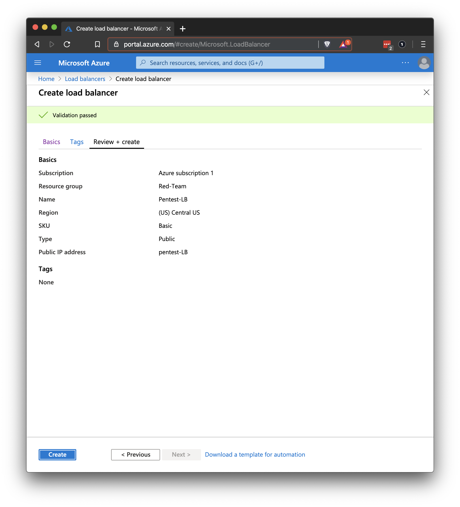

## Solution Guide: Load Balancing

To complete this activity, you had to install a load balancer in front of the VM to distribute the traffic among more than one VM.

---

1. Create a new load balancer and assign it a static IP address.

    - Start from the homepage and search for "load balancer."

- Click **+ Create** to create a new load balancer.
    - It should have a static public IP address. 
    - Click **Create** to create the load balancer.

2. Add a health probe to regularly check all the VMs and make sure they are able to receive traffic.

3. Create a backend pool and add your VM to it.

---
© 2020 Trilogy Education Services, a 2U, Inc. brand. All Rights Reserved.
