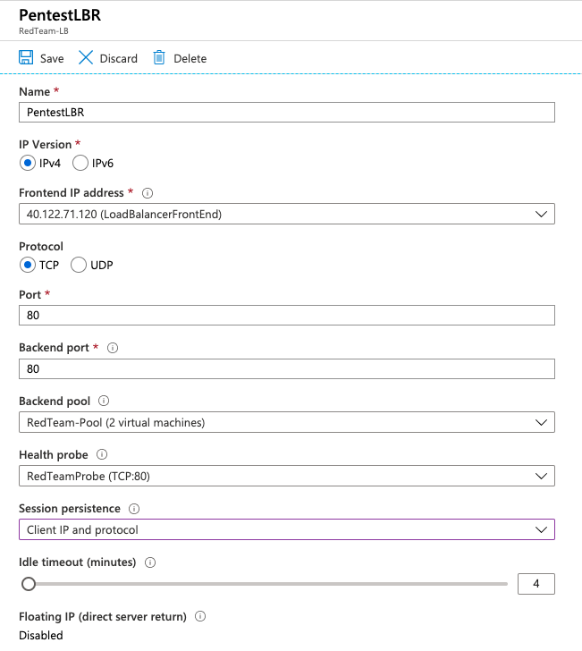
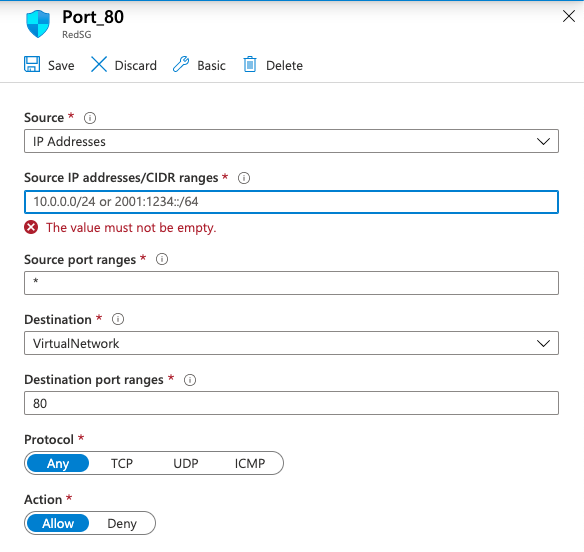
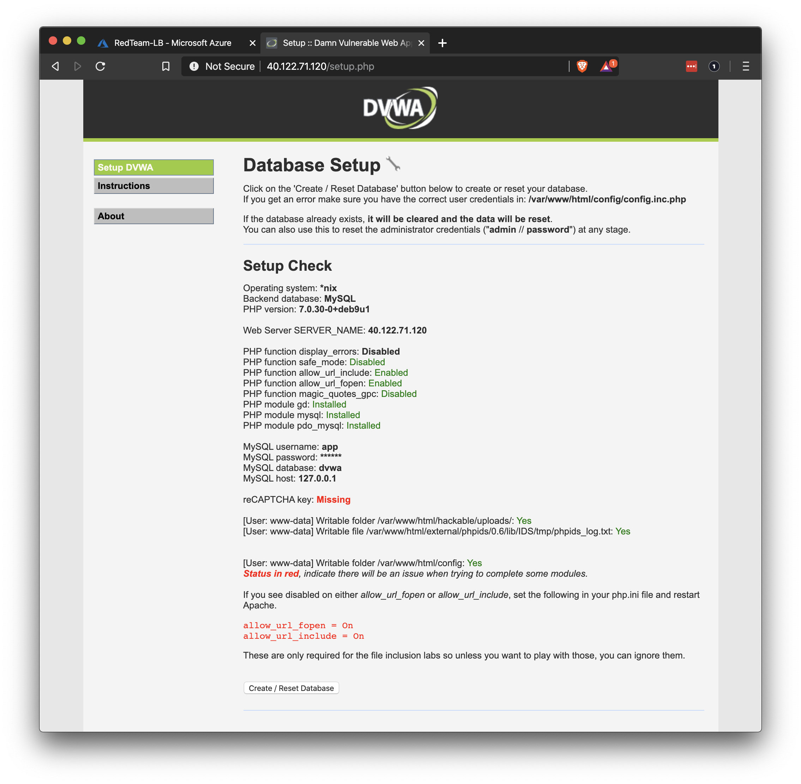

## Solution Guide: Security Configuration

 To complete this activity, you had to configure the load balancer and security group to work together to expose port `80` of the VM to the internet.

---

1. Create a load balancing rule to forward port `80` from the load balancer to your Red Team VNet.

    - Name: Give the rule an appropriate name that you will recognize later.

    - IP Version: This should stay on **IPv4**.

    - Frontend IP address: There should only be one option here.

    - Protocol: Protocol is **TCP** for standard website traffic.

    - Port: Port is `80`.

    - Backend port: Backend port is also `80`.

    - Backend pool and Health probe: Select your backend pool and your health probe.

    - Session persistence: This should be changed to **Client IP and protocol**. 
        - Remember, these servers will be used by the Red Team to practice attacking machines. If the session changes to another server in the middle of their attack, it could stop them from successfully completing their training.

    - Idle timeout: This can remain the default (**4 minutes**).

    - Floating IP: This can remain the default (**Disabled**).

    

2. Create a new security group rule to allow port `80` traffic from the internet to your internal VNet.

    - Source: Change this your external IPv4 address. 

    - Source port ranges: We want to allow **Any** source port, because they are chosen at random by the source computer.

    - Destination: We want the traffic to reach our **VirtualNetwork**.

    - Destination port ranges: We only want to allow port `80`.

    - Protocol: Set the standard web protocol of **TCP** or **Any**.

    - Action: Set to **Allow** traffic.

    - Name: Choose an appropriate name that you can recognize later.

3. Remove the security group rule that blocks _all_ traffic on your vnet to allow traffic from your load balancer through. 

    - Remember that when we created this rule we were blocking traffic from the allow rules that were already in place. One of those rules allows traffic from load balancers. 
    
    - Removing your default deny all rule will allow traffic through.

4. Verify that you can reach the DVWA app from your browser over the internet.

    - Open a web browser and enter the front-end IP address for your load balancer with `/setup.php` added to the IP address.
    
        - For example: `http://40.122.71.120/setup.php`

**Note:** With the stated configuration, you will not be able to access these machines from another location unless the security Group rule is changed.

---
© 2020 Trilogy Education Services, a 2U, Inc. brand. All Rights Reserved.

