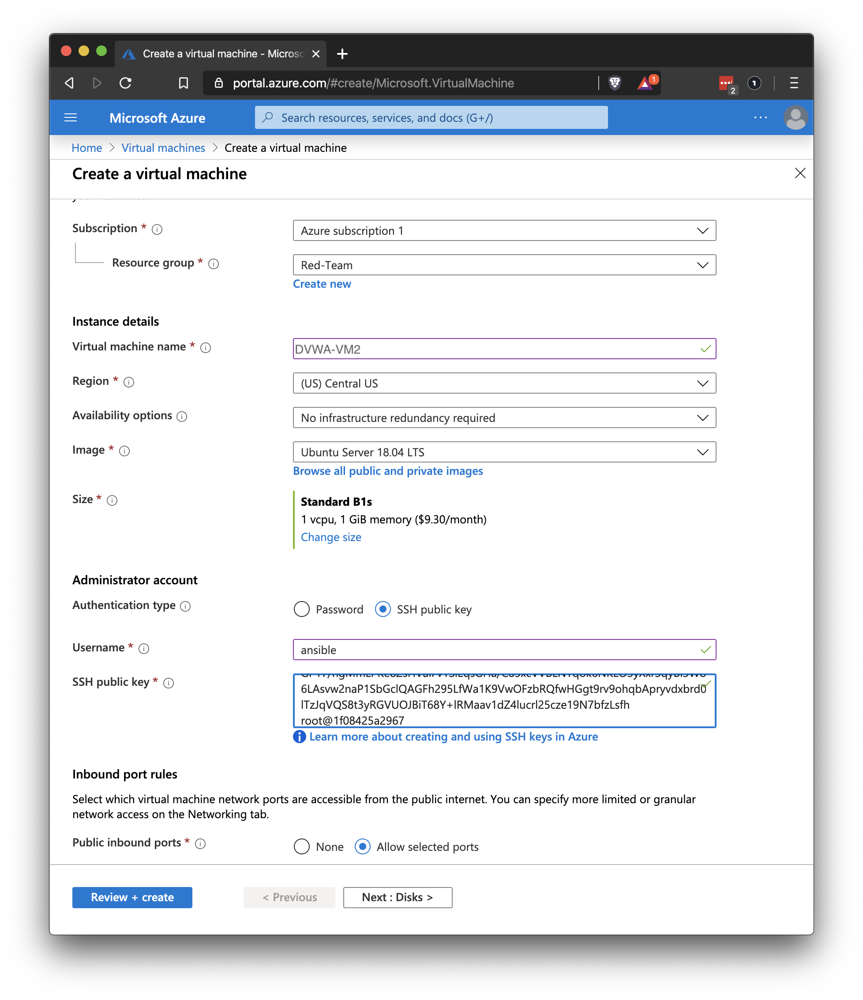
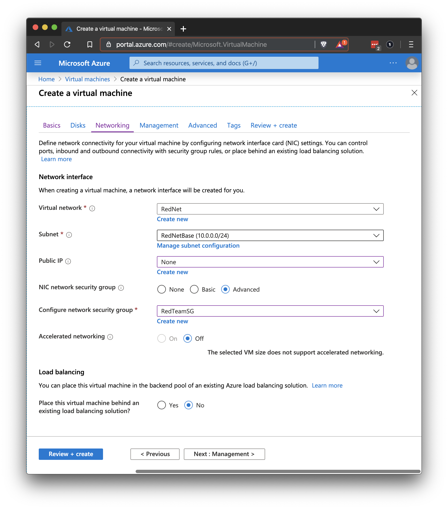

## Solution Guide: Redundancy

To complete this activity, you had to create a copy of your VM using your Ansible playbook for the configuration, and then place the VM in the backend pool for the load balancer.

1. Launch a new VM in the Azure portal.

    - Name this VM: `Web-3`

    - Be sure to use the same admin name and SSH key from your Ansible container that you used for the current DVWA machine.

    - You may need to start your Ansible container on your jump box to get the key.

        - Run `sudo docker container list -a` to see a list of all the containers (you should only have one), and note the unique name of your container.

        - Run the following commands to start your container and get the key:

        ```bash
        $ sudo docker start your_container_name
        your_container_name
        $ sudo docker attach your_container_name
        $ cat .ssh/id_rsa.pub 
        ssh-rsa AAAAB3NzaC1yc2EAAAADAQABAAABAQDdFS0nrcNG91P3HV60pPCDE0YCKNeS5Kr8edGxCeXUT1SP09Eyxxpi6LPZbL0Nkn8JNtdaxN9qyWG4Xpuh+rzCl9QnnGsdge76muzwl6awVUvRn0IAjM/e3RCKt0e1xSRiGaUY1ch41NY1Dih/MjxPunC2BykSGP17/hgMmLPKe8ZsHVaiFv1SiEqsGHa/
        ```

        - Copy the key into your configuration.

    

    - For your **Availability set**, set **RedTeamAS**.

    - Do not give your new VM an external IP address.
    
    - Do not assign a load balancer.



2. Once your machine is set up, connect to the Ansible container on your jump box and test the Ansible connection using SSH.

    ```bash
    $ ssh ansible@10.0.0.7
    The authenticity of host '10.0.0.7 (10.0.0.7)' can't be established.
    ECDSA key fingerprint is SHA256:Jes0kNsSifAVf/TEcfPxhP4/p2fmS7WGk2O8xo8vC64.
    Are you sure you want to continue connecting (yes/no)? yes

    Warning: Permanently added '10.0.0.7' (ECDSA) to the list of known hosts.

    Welcome to Ubuntu 18.04.3 LTS (GNU/Linux 5.0.0-1027-azure x86_64)
    ```

    - Run `exit` to return to your Ansible container.


3. Add the internal IP address of the new VM to your Ansible configuration.

    - Get the internal IP from the VM details page in Azure:

    

    - On your Ansible container, run `nano /etc/ansible/hosts`.

    - Add the new IP address under the IP of the other VM.
    ```bash
    # Ex 2: A collection of hosts belonging to the 'webservers' group

    [webservers]
    ## alpha.example.org
    ## beta.example.org
    ## 192.168.1.100
    ## 192.168.1.110
    10.0.0.6 ansible_python_interpreter=/usr/bin/python3
    10.0.0.7 ansible_python_interpreter=/usr/bin/python3
		10.0.0.8 ansible_python_interpreter=/usr/bin/python3
    # If you have multiple hosts following a pattern you can specify
    # them like this:
    ```
    - Save and exit the hosts file.

4. Test your Ansible configuration with the Ansible `ping` command.

    - Run `ansible all -m ping` (Ignore `[DEPRECATION WARNING]`.)

    ```bash
    root@1f08425a2967:~# ansible all -m ping

    10.0.0.6 | SUCCESS => {
        "ansible_facts": {
            "discovered_interpreter_python": "/usr/bin/python"
        }, 
        "changed": false, 
        "ping": "pong"
    }

    10.0.0.7 | SUCCESS => {
        "ansible_facts": {
            "discovered_interpreter_python": "/usr/bin/python"
        }, 
        "changed": false, 
        "ping": "pong"
    }
    ```

5. Run your Ansible playbook to configure your new machine.

    **Hint**: If you run your playbook, it will run on both machines. Ansible will recognize your original VM and check its settings. It should only make changes to the new VM.

    - Run `ansible-playbook your-playbook.yml`

    ```bash
    root@1f08425a2967:~# ansible-playbook /etc/ansible/pentest.yml 

    PLAY [Config Web VM with Docker] ****************************************************

    TASK [Gathering Facts] **************************************************************
    ok: [10.0.0.7]
    ok: [10.0.0.6]

    TASK [docker.io] ********************************************************************
    ok: [10.0.0.6]
    [WARNING]: Updating cache and auto-installing missing dependency: python-apt

    changed: [10.0.0.7]

    TASK [Install pip] ******************************************************************
    ok: [10.0.0.6]
    changed: [10.0.0.7]

    TASK [Install Docker python module] *************************************************
    ok: [10.0.0.6]
    changed: [10.0.0.7]

    TASK [download and launch a docker web container] ***********************************
    changed: [10.0.0.6]
    changed: [10.0.0.7] 

    PLAY RECAP **************************************************************************
    10.0.0.6                   : ok=5    changed=1    unreachable=0    failed=0    skipped=0    rescued=0    ignored=0   
    10.0.0.7                   : ok=5    changed=4    unreachable=0    failed=0    skipped=0    rescued=0    ignored=0   
    ```

6. When the Ansible playbook is finished running, SSH to your new VM and test the DVWA app using `curl`.

    - Run `ssh ansible@10.0.0.7`

    - Run `curl localhost/setup.php`

    - Your output should look like the following:

    ```bash
    root@1f08425a2967:~# ssh ansible@10.0.0.7
    Welcome to Ubuntu 18.04.3 LTS (GNU/Linux 5.0.0-1027-azure x86_64)

    * Documentation:  https://help.ubuntu.com
    * Management:     https://landscape.canonical.com
    * Support:        https://ubuntu.com/advantage

    System information as of Fri Jan 10 21:01:52 UTC 2020

    System load:  0.24              Processes:              122
    Usage of /:   9.9% of 28.90GB   Users logged in:        0
    Memory usage: 57%               IP address for eth0:    10.0.0.7
    Swap usage:   0%                IP address for docker0: 172.17.0.1


    19 packages can be updated.
    16 updates are security updates.


    Last login: Fri Jan 10 20:57:26 2020 from 10.0.0.4
    ansible@Pentest-2:~$ curl localhost/setup.php

    <!DOCTYPE html PUBLIC "-//W3C//DTD XHTML 1.0 Strict//EN" "http://www.w3.org/TR/xhtml1/DTD/xhtml1-strict.dtd">

    <html xmlns="http://www.w3.org/1999/xhtml">

        <head>
            <meta http-equiv="Content-Type" content="text/html; charset=UTF-8" />

            <title>Setup :: Damn Vulnerable Web Application (DVWA) v1.10 *Development*</title>

            <link rel="stylesheet" type="text/css" href="dvwa/css/main.css" />

            <link rel="icon" type="\image/ico" href="favicon.ico" />

            <script type="text/javascript" src="dvwa/js/dvwaPage.js"></script>

        </head>
    #Truncated
    ```

---
© 2020 Trilogy Education Services, a 2U, Inc. brand. All Rights Reserved.

