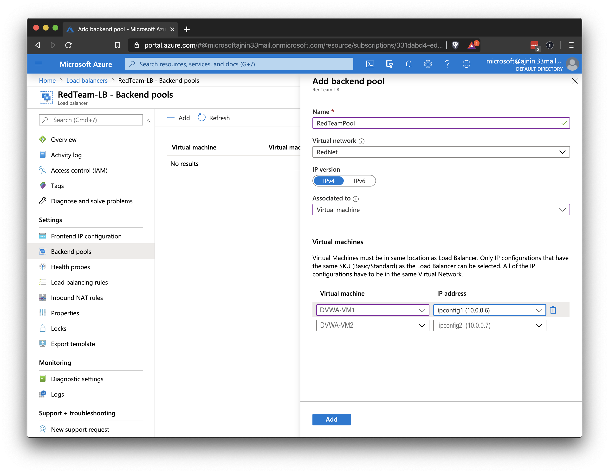
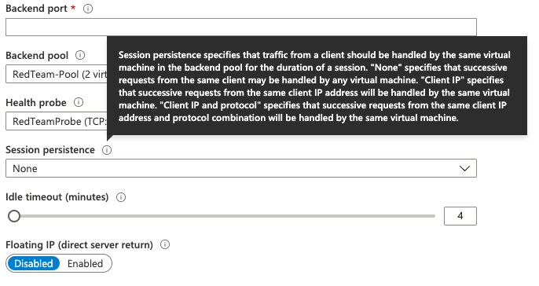

## 12. 3 Student Guide: Load Balancing

### Class Overview

Today's class will introduce the concepts of load balancing in the cloud.

### Class Objectives

By the end of class, you should be able to:

- Write Ansible playbooks to configure VMs.

- Create a load balancer on the Azure platform.

- Create firewall and load balancer rules to allow traffic to the correct virtual machines.

### Instructor Notes

Make sure that you are using your personal Azure account for the lab demonstrations and activities.


### Slideshow

The slides for today can be viewed on Google Drive here: [12.3 Slides](https://docs.google.com/presentation/d/1pgBTw3ZW4yIpSVEnHNvYlwmb7kuvp2ytJmSzU-HxYyA/edit).


---

### 01. Welcome and Overview (0:05)

This lesson will go as follows:

- Implementing provisioners.

- Creating a load balancer to distribute web traffic across different servers.

- Configuring new firewall rules to allow HTTP traffic into a VNet.

- Building in redundancy to the system by adding a 3rd VM to the load balancer. (optional)

Some career context for the topics we'll cover today:

- **Cloud security analysts** and **cloud penetration testers** need to understand cloud architecture in order to test the security settings for a given environment.

- **Cloud architects** build out cloud environments for an organization and are expected to understand how to build in security from the ground up.

- **DevSecOps** are responsible for maintaining production and testing environments for an organization's developer and QA testing teams. They are expected to build and maintain secure systems at every step of the development process.

### 02. Ansible Playbooks (0:15)

Our cloud design so far includes a jump box that is running an Ansible container. The Ansible container has full access to our VNet and can make a connection with our new VM.

The next step is to write some code that will be our "infrastructure as code" for the vulnerable web servers.

- Once we have our server defined with code, we will be able to quickly remove and relaunch the server if it is compromised.  

Ansible reads YAML code. YAML recursively stands for _YAML ain't markup language_ and is designed to be very readable and easy to write.

#### YAML Walkthrough

Connect to your jump box and then to your Ansible container:

- Run `ssh admin@jump.box.IP`

- Run `sudo docker start container_name` to start your container.
  - Run `sudo docker container list -a` if you need to see your container's name.

  - Run `sudo docker ps` to view running containers.

- Run `docker attach container_name` to get a shell on your Ansible container.

- Run `cd /etc/ansible` and `ls` to see the files there.

We will now create a YAML file for Ansible to read.

- The YAML file extension is .yml.

- A YAML file is denoted with three hyphens on the first line of the file.

Ansible documentation calls these files "playbooks" because they are used to run a set of "plays" or "actions" on a server, much like an American football team would run a series of plays during a game.

- Run `nano my-playbook.yml` to create your YAML file.


- Write the following:

```YAML
---
  - name: My first playbook
    hosts: webservers
    become: true
    tasks:
```
  **Note:** There are two spaces between the beginning of the line and the hyphen (`-`). Each indentation is another two spaces.


- `---`: The first three hyphens denote that this is a YAML file.
- `- name`: Precedes the name of the playbook.
- `hosts`: Precedes the group of servers in the hosts file that we will run actions on.
- `become: true`: This line means that all actions will be run as root on the server we are configuring. We must run items with root so we can install software and make system changes.
- `tasks`: This is where we specify what actions we want to take. Everything listed under `tasks` will run one at a time.


Once we have these first five lines written, we can start defining what tasks we want to take.

 Ansible has extensive documentation on how to accomplish almost anything. Each action that we'd want to take has an Ansible "module" with many options.

- Ansible documentation can be found at [docs.ansible.com](https://docs.ansible.com/). Googling will often find the page faster.

Open Google and type "Ansible apt module."

- You should easily find this page: [docs.ansible.com/ansible/latest/modules/apt_module.html](https://docs.ansible.com/ansible/latest/modules/apt_module.html).

- This page is the Ansible documentation for the `apt` module. This module lets us install applications on a Linux server just as we would with the `apt` command.

- Once on the page, scroll to the **Parameters** section. These are all the different options we can use with the `apt` module.

- Scroll further down to the **Examples** section to see very specific examples of how to install applications using this module. We can copy and paste these examples and make a few modifications.

Copy the first example for installing Apache and paste it into your playbook.

```YAML
---
  - name: My first playbook
    hosts: webservers
    become: true
    tasks:

    - name: Install apache httpd  (state=present is optional)
      apt:
        name: apache2
        state: present
```


- Each task will start with a hyphen (`-`), placed at the same indentation as `tasks`.
- `- name`: Precedes the name of the task. We can give the task any name, but since we will see this name in Ansible's output when we run the playbook, it should be a name we will recognize.
- `apt`: The name of the module we are using. It is at the same indentation level as the `name` specification.
- `name`: The next `name` precedes the name of the package we want to install. Here, it is `apache2`. This field is indented two spaces from the start of `apt`.
- `state`: Precedes the state of the package we want to install, which is either `present` or `absent`.
  - If set to `present`, Ansible checks to see if the package is there. If it is there, Ansible does nothing. If it is not there, Ansible runs the command `sudo apt install apache2` to install Apache2.
  - If set to `absent`, Ansible checks for the package and runs `sudo apt remove apache2` if Apache2 is there.

We now have a completed playbook.

- We can run this playbook on our server and it will install Apache2.

Save and close your playbook file.

To run an Ansible playbook we only need the command `ansible-playbook` and the name of the playbook.

- Run `ansible-playbook my-playbook.yml`:


  ```bash
  root@1f08425a2967:~# ansible-playbook my-playbook.yml

  PLAY [My first playbook] ***************************************************************

  TASK [Gathering Facts] *************************************************************************
  ok: [10.0.0.6]

  TASK [Install apache httpd  (state=present is optional)] *******************************************************************************

  changed: [10.0.0.6]

  PLAY RECAP *************************************************************************************
  10.0.0.6                   : ok=1    changed=1    unreachable=0    failed=0    skipped=0    rescued=0    ignored=0   
  ```

We get a detailed output of each task that Ansible has completed. It tells us the name of our playbook and the name of the tasks that we created.

There are Ansible modules for almost anything we can think of. For example:
- Create files and folders.
- Start, stop, and download Docker containers.
- Change system settings.
- Download code from Github.
- Create compressed archives of files.


During the next activity, you will need to use the following modules:
- `apt`, found at [docs.ansible.com/ansible/latest/modules/apt_module.html](https://docs.ansible.com/ansible/latest/modules/apt_module.html).
- `pip`, found at [docs.ansible.com/ansible/latest/modules/pip_module.html](https://docs.ansible.com/ansible/latest/modules/pip_module.html).
- `docker-container`, found at [docs.ansible.com/ansible/latest/modules/docker_container_module.html](https://docs.ansible.com/ansible/latest/modules/docker_container_module.html).


### 03. Ansible Playbooks Activity

- [Activity File: Ansible Playbooks](Activities/03_Ansible_Playbooks/Unsolved/README.md)
- [Ansible Playbook Example](Activities/03_Ansible_Playbooks/Unsolved/playbook_example.yml)

### 04. Review Ansible Playbooks Activity

- [Solution Guide: Ansible Playbook](Activities/03_Ansible_Playbooks/Unsolved/README.md)


### 05.  Load Balancing

At this point, we have created a virtual network, deployed a jump box running an Ansible Docker container, and used that container to configure another VM running a DVWA container.

- If the Red Team attacks this DVWA container with enough traffic, they may be able to trigger a Denial of Service (DoS) on the machine.

- DoS attacks are a common problem with websites.

One way to mitigate DoS attacks is to have multiple servers running the same website, with a **load balancer** in front of them.

You should be familiar with load balancers from previous units:

- A load balancer provides a website an external IP address that is accessed by the internet.

- The load balancer receives any traffic that comes into the website and distributes it across multiple servers.

- As the website receives more traffic, more servers can be added to the group ("pool") of servers that the load balancer has access to. This helps distribute traffic evenly among the servers and mitigates DoS attacks.

A load balancer typically also has a **health probe** function. This function checks regularly to make sure all of the machines behind the load balancer are functioning before sending traffic to them. Machines with issues are reported, and the load balancers stop sending traffic to those machines.

This system can still be overwhelmed with traffic and taken down, but it is much more resilient than if a single server was running the website.

The DVWA VM you set up is intentionally not accessible from the internet at this time. The next step is to set up a load balancer with an external IP and point it to the VM.

- Open your Azure portal and search for "load balancer."

- We can add the load balancer with the same **+ Create** button that exists on other pages in the Azure portal.

- Select the relevant Resource Group.

- Provide a name for the load balancer. 

- For Type, select Public.

- For SKU, select Basic.

- Select 'Create New' for the Public IP address setting.

- Give the public IP a name
	- Note that this name is used to create a URL that maps to the IP address of the load balancer. Because of that, it _must_ be a unique name across all of Azure.
	- Look for the green check mark to determine if the name will work.

- For the IP Assignment, choose 'Static'


- For "Add a public IPv6 address", select 'NO'.

- Click on Review + create and confirm.


- Click **Review + create** and confirm.

  


- Add a Health Probe:
  

- Both VMs should be added to the **backend pool**:

  

### 06. Load Balancing Activity

- [Activity File: Load Balancing](Activities/06_Load_Balancing/Unsolved/README.md)

### 07. Review Load Balancing Activity

- [Solution Guide: Load Balancing](Activities/06_Load_Balancing/Solved/README.md)


### 08. Instructor Do: Firewall Configuration (0:10)

Now that we have a load balancer running, we want to make sure it is configured properly to allow traffic to the VM backend pool.

- The security group will need to be configured to allow web traffic into the VNet from the load balancer.

- You already know how to create a security group rule, so you won't go over that again.

By the end of the next activity, you should finally be able to reach the DVWA website from the internet.

- Open your Azure portal. We will demonstrate how to create a load balancing rule.

- Open your load balancer details page and click on **Load balancing rules** on the left side.

  **Note:** If you get an error saying a backend pool must exist first, wait a minute and try again.

You will see the same **+ Add** button that you have used for all other resources.

- Click the **+ Add** button.

- Load balances work by forwarding traffic from specific ports to the backend pool of machines on specific ports. This rule will specify which ports can receive traffic.

You should choose the backend pool and health probe that you created in the previous activity.

If you are unsure if you need a specific option, you can hover your mouse over the small **`i` in a circle** next to the title of the option to learn more about that option.

- Hover your mouse over the **i** next to **Session persistence** to show the text that pops up.

   

Every time you create a rule, you should evaluate each option to determine if you need it.

### 09. Security Configuration Activity

- [Activity File: Security Configuration](Activities/09_Security_Configuration/Unsolved/README.md)

### 10. Review: Security Configuration Activity

- [Solution Guide: Security Configuration](Activities/09_Security_Configuration/Solved/README.md)

-------

© 2020 Trilogy Education Services, a 2U, Inc. brand. All Rights Reserved.
