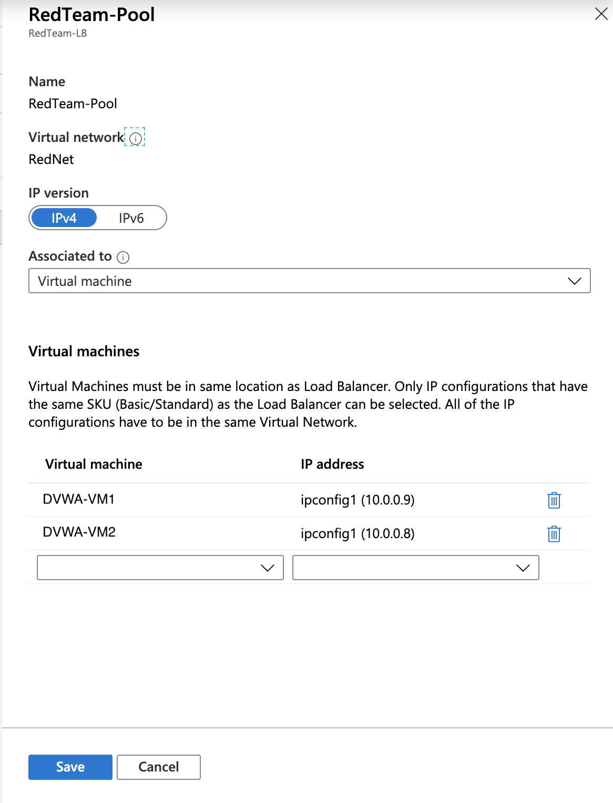
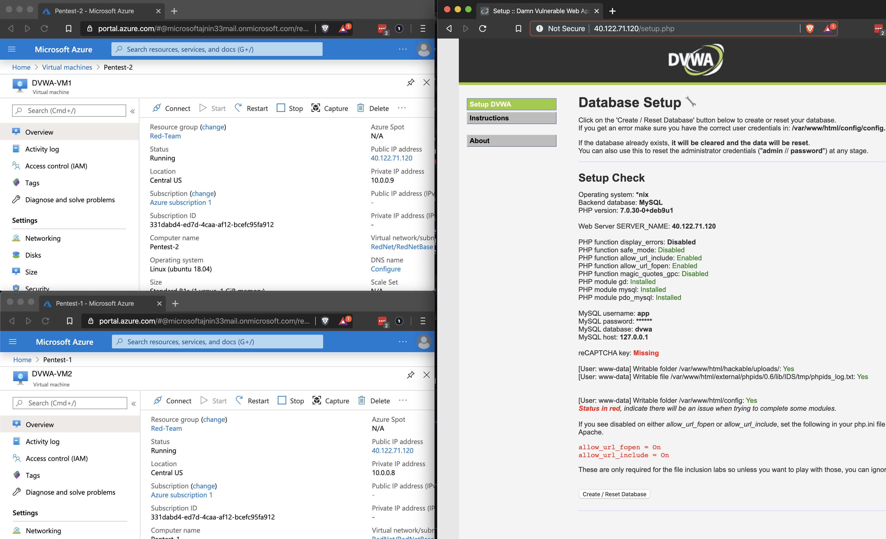
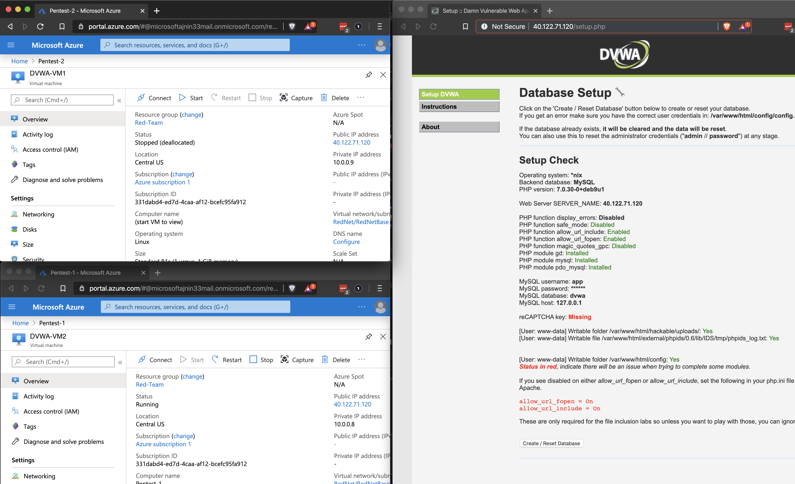
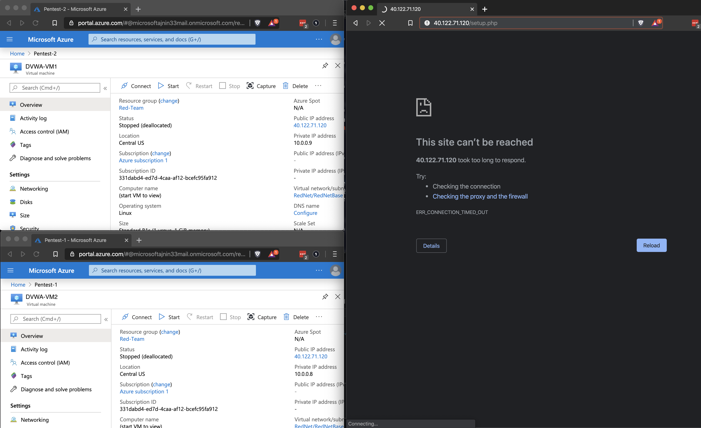
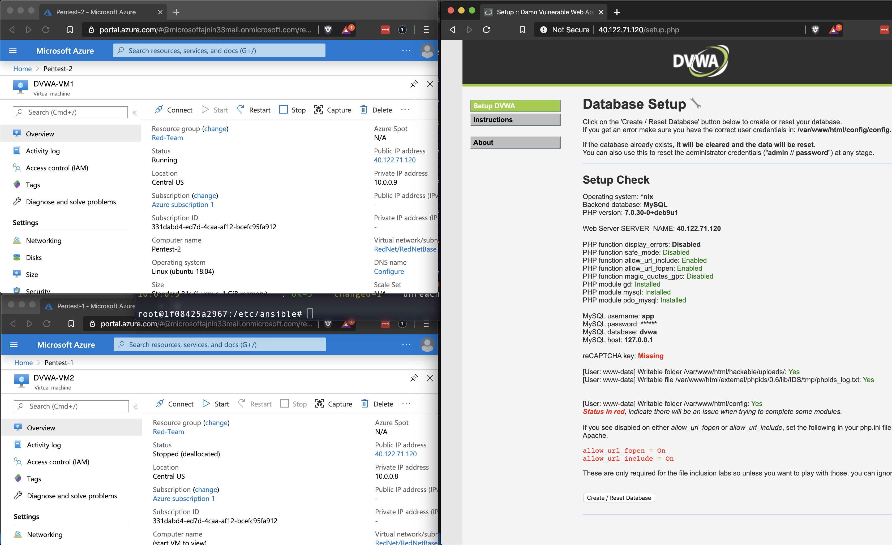
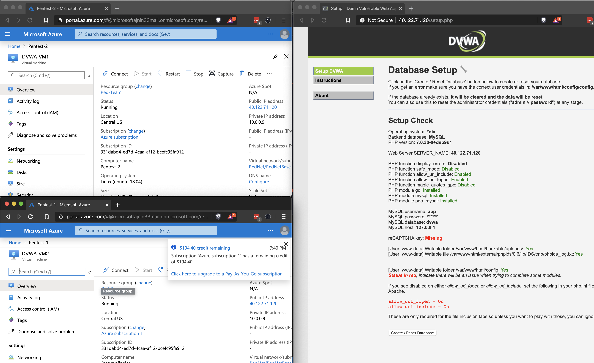

## Solution Guide: Redundancy Testing

To complete this activity, you had to add your latest VM to the backend pool for your load balancer and testing whether the website continues working if one of your VMs has a problem.

---

1. Add your new VM to the backend pool for your load balancer.

2. Verify that the DVWA site is up and running and can be accessed from the web.

    - Position three windows on your screen so you can see the website and the details page of both VMs in your backend pool.

3. Turn off one of your VMs from the Azure portal. Confirm if you can still access the DVWA website.

    - You should still be able to access the site when one of the VMs is off.

4. Turn off the other VM. Verify that the DVWA site stops working.

    - With both VMs stopped, the site should go down.

5. Boot up the VM that you first shut down, so it is running by itself. Confirm if you can access the DVWA site.

    - You should be able to access the site. This should verify that both VMs are running the site.

6. Boot up the second VM.

Congratulations! You have configured a highly available web server on a secure virtual network using Azure's cloud platform.

---
© 2020 Trilogy Education Services, a 2U, Inc. brand. All Rights Reserved.
