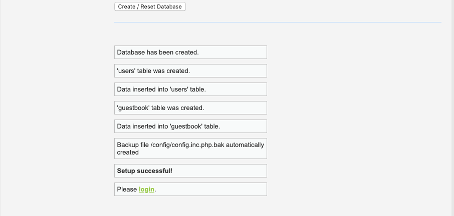

### Alternate Hostname Testing Activity Solutions

### Walkthrough

Start by gathering the hostname of each of the DVWA containers that your WebVM's are running. 

- SSH from your jump-box to a Web VM
- Connect to the DVWA container

**Solution:** Remember that you have to restart your exact same Ansible container using `sudo docker start [container-name]` and not create a new Ansible container.

Run: `sudo docker container list -a` to get the name of your container.
```bash
$ sudo docker container list -a
CONTAINER ID        IMAGE                          COMMAND             CREATED             STATUS                       PORTS               NAMES
eba1c84c981f        cyberxsecurity/ansible         "bash"              4 minutes ago       Exited (0) 4 minutes ago                         adoring_swirles
```

Run `sudo docker start [container-name]`

```bash
$ sudo docker attach romantic_noyce
romantic_noyce
```

Run `sudo docker attach [container-name]`

```bash
$ sudo docker attach romantic_noyce
root@6160a9be360e:~# 
```

Notice that the `hostname` is embedded in the command prompt: `6160a9be360e`

Run `hostname` to verify:

```bash
root@6160a9be360e:~# hostname
6160a9be360e
```

Make a list of info for this VM:

- Azure Name: `Web-1`
- Internal IP: `10.0.0.5`
- Hostname: `6831a670b43e`

After you have the info for each VM, navigate to the DVWA site and set it up to test.

Setup DVWA:

**Solutions:**
- Navigate to: `http:[load-balancer-ip]/setup.php`
- Scroll to the bottom of the page and click on `Create/Reset Database`.


- Click on `login` and use the credentials `admin:password`.




- Click on `Command Injection` on the left side of the page.

Exploit DVWA to determine what host you are connected to:

**Solutions:**

- Run a command that gives you the hostname of the container you are currently connected to.

Enter: `|| hostname` into the text field.


Confirm that it matches one of your Web-Vm's.
- In this example it matches the VM above: `Web-1`

- Go to Azure and stop that VM.


- Run the same command again to get the hostname of the container you are now connected to.


- Make a note of what container you now connected to. 

In this example, the traffic has switched to `Web-2`.

Congratulations on successfully exploiting this vulnerability and confirming that the Load Balancer is indeed doing it's job.
