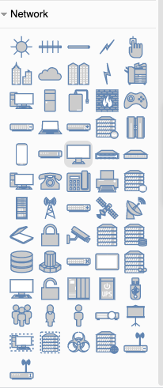

## Solution Guide: Cloud Security Homework
Congratulations! You have finished the cloud security portion of the course.

Your homework assignment will be 2 parts:

### Part 1
**Solutions:**

Answer the following questions in your own words:

1. What are 3 common job roles that combine security and cloud skills?

- **Cloud security analysts** or **cloud penetration testers** need to understand cloud architecture in order to test the security settings for a given environnement.

- **Cloud architects** build out a cloud environment for an organization and are expected to understand how to build in security from the ground up. 

- **DevSecOps** are responsible for maintaining production and testing environments for an organization's developer and QA testing teams. They are expected to build and maintain secure systems at every step of the development process

2. What are the 3 biggest cloud provider platforms?
- **Microsoft Azure**
- **Amazon Web Services**
- **Google Cloud**

3. What are the 6 most common cloud services (and their acronyms)?
- **IaaS (Infrastructure as a Service)**
- **PaaS (Platform as a Service)**
- **SaaS (Software as a Service)**
- **DaaS/DBaaS (Data as a Service/Database as a Service)**
- **CaaS (Communications as a Service)**
- **XaaS (Anything as a Service)**

4. What is the difference between a virtual network and a physical network?

- A virtual network is defined with software instead of physically wired together. In theory, a virtual network works the same way a physical network does. All of the same networking practices apply (subletting and VLANs, etc). However, unlike physical networks, virtual networks are much more flexible. The VMs on a virtual network can live in completely different data centers, but perform as if they are wired together, as well as provide improved availability.

5. What is the point of setting your first firewall rule to block _all_ traffic?

- This is the 'Principle of Least Privilege' in practice. Firewalls should always start with blocking _everything_ and then rules can be created only to allow what is necessary for your operation.

6. What is the difference between physical computing components (CPU, RAM, HDD/SSD) and virtual computing components?

- Virtual computer components are defined by software and usually make up only a logical portion of the actual physical components of the physical server where they are utilized. For instance, A physical server in a data center might have 40 CPUs, 320GB of RAM, and 168TB of storage on one machine. Those physical resources can then be divided up into 20 Virtual machines, each having 2 vCPUs, 16GiB of memory, and 8TB of storage.

7. What is the purpose of using an encrypted ssh key to connect to a machine?

- Secure Shell (SSH) connections secure your command line session with another computer so commands cannot be intercepted or modified. Creating an authentication key for SSH takes security a step further because we are not using a password. In order to achieve an SSH connection with this configuration requires holding a private key making a forced entry more difficult to achieve. 

8. What is the difference between a container and a virtual machine?

- Containers can be thought of as a 'Lightweight' VM. Instead of virtualizing _all_ of the physical components of a computer like a VM does, containers share those resources with the host Virtual Machine and each other. This allows containers to only contain the files they need to run a particular process. The goal of a container is to do only _one thing_ like run `Apache2` or run `MySQL` but not both. VMs and containers are used together. Usually, an administrator will provision a powerful Virtual Machine and then run many containers on it.

9. What is meant by Infrastructure as Code?

- Infrastructure as code (IaC) is the concept of defining all of your equipment and network with code. When using virtual machines and containers, almost every server, database, workstation and other component in your infrastructure can be individually defined with code. From a security standpoint, when a particular piece of the infrastructure is needed, we can run the code that defines that thing and it will be up and running within a few minutes. If it is compromised, we can destroy it and deploy a new version in minutes. IaC allows us to clearly build in security protocols from the ground up. If a server is found to be vulnerable, it's easy to change the code that created the server and build in a fix.

10. What is a provisioner? Provide 3 examples of common provisioning software.
- A provisioner is a software application used in IaC setups for making automated configuration changes to computers. Provisioners focus on bringing a server to a certain state of operation. Once the desired state of a server is documented with code, that code can be run on one server, 100 servers or 10,000 servers within a few minutes. Provisioners can do everything from install software to change configuration text files, and more. The changes that a provisioner makes are created using text files, usually written in YAML or JSON.

- 3 common provisioners are Ansible, Puppet, and Chef.

11. What is Continuous Integration/Continuous Deployment?

- **Continuous Integration/Continuous Deployment (CI/CD)** is the concept of automatically updating machines on your network whenever your IaC files change. In other words, whenever you change a machine's configuration file, CI ensures that a new version of that machine is built immediately. CD ensures that this new version is automatically deployed to your live environment. The primary advantage to CI/CD is that it allows you to manage your entire network by simply updating IaC text files.

12. What is a VPN and when should us use one?

- A Virtual Private Network (VPN) can encrypt all network traffic between your current network or device and a remote network. Once you are connected to the VPN, you have full access to all resources on the remote network, as if you were locally connected. Many companies use VPNs to allow remote workers access to computers and servers that are otherwise only accessible from the local network. Paid VPN's can also be used by private individuals to secure their connection on a public network. Paid VPN's act as an encrypted proxy that encrypt all of your connections and send them through the VPN's network before reaching the internet.

13. What is the purpose of a load balancer?

- A load balancer provides a website an external IP address that is accessed by the internet. The load balancer receives any traffic that comes into the website and distributes it across multiple servers. As the website receives more traffic, more servers can be added to the group ("pool") of servers that the load balancer has access to. This helps distribute traffic evenly among the servers and mitigates DoS attacks.

14. What is a resource group in Azure?

- A resource group is a logical grouping of all resources used for a particular setup or project. The resource group will contain the network, firewalls, virtual computers, and other resources that are needed for setup.

15. What is Region in Azure?

- A region is a set of datacenters that exist in close proximity to one another to avoid network latency. Each Region is named by it's general geographical location, 'US-East', 'US-West' etc. and cloud resources are automatically shared and accessible within a region even if they may be deployed across multiple physical locations in that region. Azure has 53 regions located around the world, each containing multiple connected data centers.

### Part 2
### Solution

Use a free account at [draw.io](https://app.diagrams.net/) to diagram the entire cloud network you have created.

    - Your diagram should show the following:
        - Azure resource group
        - Virtual network with IP address range
        - Subnet range
        - Flow of specific traffic (e.g., HTTP, SSH)
        - Security group blocking traffic
        - Load balancer
        - All five VMs that you have launched
        - Where Docker and Ansible are deployed
        - Availability Zones

**Solution:**

Navigate to [draw.io](https://app.diagrams.net/) and choose a location to save your work.

Choose a Network Diagram Template to modify.

Verify that you have all of the Networking icons in the bottom of the left panel.

Your finished diagram should look similar to the following:

---
© 2020 Trilogy Education Services, a 2U, Inc. brand. All Rights Reserved.
