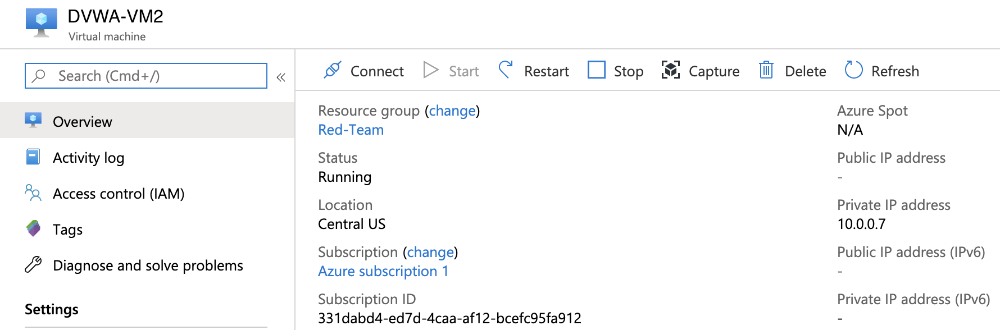

## 12.4 Lesson Plan: Testing Redundant Systems

### Class Overview

In today's class, we'll complete the unit by implementing redundant systems.

Please note that this student guide also includes additional optional activities. If you did not cover this class, feel free to complete these on your own.

### Class Objectives

By the end of today's class, students should be able to:

- Verify redundancy by turning off one or more virtual machines used in the infrastructure.

### Slideshow

The slides for today can be viewed on Google Drive here: [12.4 Slides](https://docs.google.com/presentation/d/13esreUTjFfrvhbLnvP7x-z-GuNMqYuc5KdlnbEfX8wU/edit).

### 01. Welcome and Overview

Let's look at what you have accomplished so far:

- Created a virtual network.
- Protected the network with a firewall and completed several firewall rules.
- Deployed a jump box to the network.
- Deployed two identical VMs to the network.
- Used Docker containers to run a website and Ansible.
- Used Ansible to configure their VMs with code (infrastructure as code).
- Configured a load balancer to distribute traffic among the VMs.

### 02. Redundancy Testing

In this section, you will test a redundant system.

- Begin by opening your Azure portal and navigating to virtual machines.

- Click on a virtual machine to see its details. Point out the **Stop** button.

    

- With your current setup, you can simulate one of the VMs going offline by stopping it.

In the next activity, you will stop one VM and check whether or not you still have access to the site.

### 03. Student Do: Redundancy Testing

- [Activity File: Redundancy Testing](Activities/03_Redundancy_Testing/Unsolved/README.md)

### 04. Instructor Review: Redundancy Testing Activity

- [Solution Guide: Redundancy Testing](Activities/03_Redundancy_Testing/Solved/README.md)

### 05. Break

### 06. Alternate Hostname Activity Demonstration (**OPTIONAL**)

**NOTE**: Please note this is an optional activity which you may not have covered in class. Feel free to complete this on your own!

- DVWA has a vulnerability that will allow us to see the 'hostname' of the machine. For Docker, the hostname will be the docker container identifier.

- Using this vulnerability, we can see what machine we are connected to, and when one machine goes offline, we should be able to see the hostname change.

- In this upcoming walkthrough, we will set up DVWA, using this exploit.

- Navigate to your DVWA setup with `http://[load-balancer-ip]/setup.php

- Scroll to the bottom of the page and click on `Create/Reset Database`

- You should see the following information:

- Click on `Login` to get the login screen.

- Login with the credentials: `admin:password`

- Once logged in, click on `Command Injection`.

- Command injection is a vulnerability where we have an opportunity to send command line commands directly to the server and have their output be displayed on the screen.

  - We will go over Command Injection again later in the course, but here we will have a quick introduction.

- Note the box that says 'Ping an IP address'; this function is essentially taking your input and running it with the `ping` command on the command line, and then returning the output.

- Enter: `8.8.8.8` in the box. This is a well known google DNS server.

- Remember that our security group is blocking traffic, so we should get an error here:

- Using the ping function is not what we want to do. Instead, we will want to chain our commands together.

  -  _If_ we use one of our command chaining techniques, we should be able to get a _second_ command to run _after_ the ping command runs.

Remember the following concepts we covered during the Linux weeks:

- `;` runs a command after the first command, regardless if the first command is successful.
- `&&` runs a command _only_ if the first command is successful.
- `||` runs a command _only_ if the first command fails.

We can use any of these to _inject_ a second command to run, after the ping command runs.

Enter: 8.8.8.8 ; whoami

Syntax breakdown:
- `8.8.8.8` goes to the ping command to complete `ping 8.8.8.8` in the background.
- `;` says, run another command.
- `whoami` is the second _injected_ command.

We can see our second command output: `www-data` at the bottom.

We can use the `||` command to clean up the output.

- Enter `|| whoami`

Syntax breakdown:
- `||` says, if the first command fails, run the next command. Point out that we are not giving the `ping` command _any_ ip address to ping, so it _will_ fail. This way,we will only see the second command's output.
- `whoami` is our second _injected_ command.

In the next activity, you will use this exploit to see the hostname of the machine you are connected to. This will further illustrate what happens when one host goes down because they can clearly see what host they are connected to.

### 07. Student Do: Alternate Hostname Testing Activity

- [Activity File: Hostname Exploit Testing](Activities/08_Hostname_Vuln/Unsolved/README.md)

### 08. Instructor Review: Alternate Hostname Testing Activity Walkthrough

- [Solution Guide: Hostname Exploit Testing Solutions](Activities/08_Hostname_Vuln/Solved/README.md)
