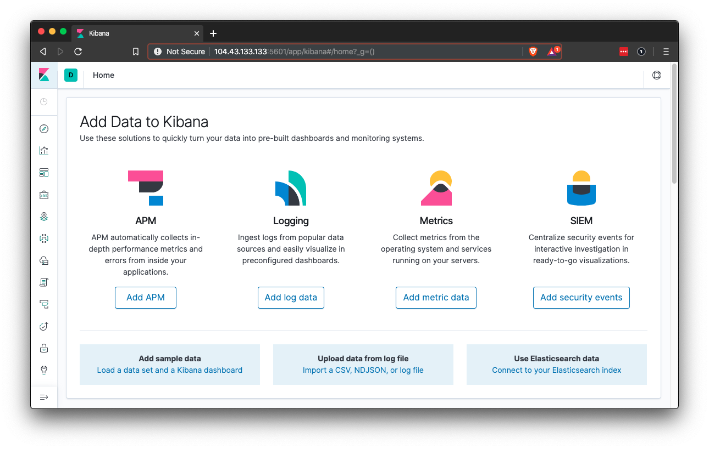

## Day 1 Activity File: ELK Installation

Today, you will configure an ELK server within your virtual network. Specifically, you will:

1. **Create a new vNet** in a new region, within your resource group.

2. **Create a Peer Network Connection** between your two vNets.

3. **Create a new VM.** Deploy a new VM into the new vNet with it's own Security Group. This VM will host the ELK server.

4. **Download and configure a container.** Download and configure the `elk-docker` container onto this new VM.

5. **Launch and expose the container.** Launch the `elk-docker` container to start the ELK server.

6. **Implement identity and access management.** Configure your new Security group so you can connect to ELK via HTTP, and view it through the browser.

#### Resources

- [`elk-docker` Container Documentation](https://elk-docker.readthedocs.io/)
- [Elastic.co: The Elastic Stack](https://www.elastic.co/elastic-stack)
- [Ansible Documentation](https://docs.ansible.com/ansible/latest/modules/modules_by_category.html)
- [`elk-docker` Image Documentation](https://elk-docker.readthedocs.io/#elasticsearch-logstash-kibana-elk-docker-image-documentation)
- [Virtual Memory Documentation](https://www.elastic.co/guide/en/elasticsearch/reference/5.0/vm-max-map-count.html#vm-max-map-count)
- ELK Server URL: http://[your.IP]:5601
- [Docker Commands Cheatsheet](https://phoenixnap.com/kb/list-of-docker-commands-cheat-sheet)

#### Azure Documentation:

- Azure's page on peer networks [HERE](https://docs.microsoft.com/en-us/azure/virtual-network/virtual-network-peering-overview)
- Peer networking in Azure How-To: [Global vNet Peering](https://azure.microsoft.com/en-ca/blog/global-vnet-peering-now-generally-available/)
- If Microsoft Support is needed: [How to open a support ticket](https://docs.microsoft.com/en-us/azure/azure-portal/supportability/how-to-create-azure-support-request)

#### Template configuration files:

It is recommended that you use these templates, but you can build your own if you'd like an additional challenge.

- [hosts.yml](Resources/hosts.yml)
- [install-elk.yml](Resources/install-elk.yml)

To ensure that these configuration templates do not change when copying them to your Ansible Container, use `curl` to get them onto your container. Using standard copy and paste is known to corrupt/change characters inside the configuration file and can cause them not to work.

---

### Getting Started

Before you begin, it is recommended that you create a high-level diagram of your intended new setup. You can use a tool like **draw.io**, or a pen and paper.

- Write down each of the machine's functions (jump box, Ansible, ELK server).
- As you complete the steps below, document the IP address associated with each machine.

**Note:** You can build off of this diagram for the Day 3 network diagram activity.  

We also recommend that you organize your folders in your Ansible machine as you see below:

```
etc # should already exist.
----> ansible # should already exist.
---------> ansible.cfg # should already exist.
---------> hosts # should already exist.
---------> roles # this is a new directory that will contain your ansible playbooks.
--------------> files # this is a new directory that will contain the configuration files we pass to you.
```
---

### Instructions

#### Part 1: Creating a New vNet

Make sure that you are logged into your personal Azure account, where your cloud security unit VMs are located.

1. Create a new vNet located in the same resource group you have been using.

	- Make sure this vNet is located in a _new_ region and not the same region as your other VM's.

	- Leave the rest of the settings at default.
		- Notice that the IP Addressing has automatically created a new network space of `10.1.0.0/16` which is exactly what you want.

2. Create a peer connection between your vNets. This will allow traffic to pass between your vNets and regions. This peer connection will make both a connection from your first vNet to your Second vNet _and_ a reverse connection from your second vNet back to your first vNet. This will allow traffic to pass in both directions.

	- Navigate to 'Virtual Network' in the Azure Portal.

	- Select your new vNet to view it's details.

	- Under 'Settings' on the left side, select 'Peerings'.

	- Click the `+ Add` button to create a new Peering.

	- Make sure your new Peering has the following settings:

		- A unique name of the connection from your new vNet to your old vNet.
			- Elk-to-Red would make sense

		- Choose your original RedTeam vNet in the dropdown labeled 'Virtual Network'. This is the network you are connecting to your new vNet and you should only have one option.

		- Name the resulting connection from your RedTeam Vnet to your Elk vNet.
			- Red-to-Elk would make sense

	- Leave all other settings at their defaults.

#### Part 2: Creating a New VM

3. Create a new Ubuntu VM in your virtual network with the following configurations:

    - **RAM**: 4 GB+
		
		- **Important:** The VM for the ELK server **_MUST_** have at least 4GiB of memory for the ELK container to run properly. Azure has VM options that have `3.5 GiB` of memory, but _DO NOT USE THEM._ They will not properly run the ELK container because they do not have enough memory.
		- A few specific machines that will work are:
			- Standard D2s v3 (2 vcpus, 8GiB memory)
			- Standard B2s (2vcpus, 4GiB memory
		- If a VM that has 4GiB of memory is not available, the ELK VM will need to be deployed in a different region that has a VM with 4GiB available OR you will need to open a support ticket with Microsoft (they often resolve issues very fast). See instructions for opening a ticket [HERE](https://docs.microsoft.com/en-us/azure/azure-portal/supportability/how-to-create-azure-support-request)

    - **IP Address**: The VM must have a public IP address.

    - **Networking**: The VM must be added to the new region in which you created your new vNet. You want to make sure you select your new vNEt and allow a new _basic_ Security Group to be created for this VM.

    - **Access**: The VM must use the same SSH keys as your WebVM's. This should be the ssh keys that were created on the _Ansible container_ that's running on your jump box.

		- Open a terminal on your computer and SSH into the jump box.

		- From the jump box login shell, run the required Docker commands to start and attach to your Ansible container.

		- Use `cat` to retrieve your _public_ ssh key (~/.ssh/id_rsa.pub)

		- As a reminder, your SSH key should not have a password on it because the password may cause Ansible errors. You can remove a password from your SSH key with: `ssh-keygen -p -f ~/.ssh/id_rsa`.

4. After creating the new VM in Azure, verify that it works as expected by connecting via SSH from the _Ansible container_  on your jump box VM.

	- From the Ansible container shell, SSH into the new VM using it's internal IP.

	- Note that the new VM should be on a new subnet e.g `10.1.0.0/24` instead of `10.0.0.0/24`
		- Your subnet may vary, but if you used the default network settings your networks and subnets should fall into the default pattern of `10.0.0.0`, `10.1.0.0`, `10.2.0.0` etc.

If the connection succeeds, you are ready to move on to the next step. If not, verify that you used the correct SSH key (from inside the Ansible container). If the problem persists, you will need to troubleshoot further.

#### Some troubleshooting theory:

Running into issues or errors? Try the following troubleshooting techniques: 

- Change one thing and retest. If you change several things before you re-test, you will not know if any one of those things has helped the situation or made it worse.

- As per the split-half search, remove _half_ of your variables that could be going wrong and re-test. If the issue is resolved, you know that your problem resides in the variables that you removed. If the problem is still present you know your problem resides in the variables that you did not remove.
	
	- Now take the set of variables where you know the problem resides. Remove half of them again and retest. Repeat this process until you find the problem.

- In this context, using the split-half search could mean:

	- Verifying that the VM is running in Azure. This removes your Jump Box from the equation and you can determine if their is a problem with the VM itself.

	- Use nmap or ping from your Jump-Box to the new VM to determine if you can make a connection. This removes `SSH` and the Ansible container from the equation. If you can't make a connection from your jump-box at all, you know the issue is _not_ with SSH or the Ansible container.

	- Remove your `Deny All` Security Group rule to allow _all_ traffic. This removes the Security Group from the equation. If you still cannot make a connection, you know the issue is _not_ with the Security Group.

	- Verify that you are attached to the Ansible container by running `whoami` or examining the command prompt:
		- Jump-box command prompt: `sysadmin@Jump-Box-Provisioner`
		- Ansible container command prompt: `root@6160a9be360e`

Still having trouble? Ask a classmate, instructor or TA for help!


#### Part 3: Downloading and Configuring the Container


|:warning: **Checkpoint** :warning:|
|:--|
|Before continuing, make sure you have completed the following critical tasks.|
| :heavy_check_mark: A new vNet has been created in your resource group in a new region. |
| :heavy_check_mark: The new vNet is located in a region other than the region you have used for all your other resources. |
| :heavy_check_mark: A peer connection has been created between vNets, allowing traffic to pass between them. |
| :heavy_check_mark: A new VM has been created with a minimum of 4GB of memory. (8GB is preferred.) |
| :heavy_check_mark: The new VM is configured to use the same SSH key that your Web VMs use from the Ansible container. |
| :heavy_check_mark: Ansible is able to connect to the new VM. |


5. Using Ansible, configure the newly created VM.

	- From your Ansible container, add the new VM to Ansible's `hosts` file.

	- Create a playbook that installs Docker and configures the container.

	- Run the playbook to launch the container.

6. You just created a new VM that you will use to run your ELK stack. In order to use Ansible to configure this machine, you must add it to the list of machines Ansible can discover and connect to.
	
	- Don't forget to specify python3 with `ansible_python_interpreter=/usr/bin/python3`

	- This list is Ansible's **inventory** and is stored in the `hosts` text file:

		```
		# /etc/ansible/hosts
		[webservers]
		10.0.0.4 ansible_python_interpreter=/usr/bin/python3
		10.0.0.5 ansible_python_interpreter=/usr/bin/python3
		10.0.0.6 ansible_python_interpreter=/usr/bin/python3

		[elk]
		10.1.0.4 ansible_python_interpreter=/usr/bin/python3
		```

	- `[webservers]` and `[elk]` are **groups**. When you run playbooks with Ansible, you specify which group to run them on. This allows you to run certain playbooks on some machines, but not on others.

7. You should already be in your Ansible VM. Add an `[elk]` group to your Ansible VM's `hosts` file by following the steps below on the command line:

	- Edit the inventory file `nano /etc/ansible/hosts`.

	- Add a group called `[elk]` and specify the IP address of the VM you just created in Azure.

	- **Note:** If you get stuck, consult the starter `hosts` file:
	
		- [Starter Host File](Resources/hosts.yml)


8. Once you've created the `[elk]` group, you'll create a playbook to configure it.

	- Today, you'll write a play to configure the ELK server. This play should only run on the VM in the `[elk]` group. Recall that you can use the `hosts` option in Ansible to specify which machines to run a set of tasks against.

		```yaml
		- hosts: elk
		- become: True
		- tasks:
			- name: Install Packages
			# Etc...
		```

	- Here, the `hosts` option specifies that these `tasks` should only be run on the machines in the `elk` group.

	- To create this playbook, continue using your terminal to complete the following steps:

		- Verify you are in your Ansible container.

		- Create a new playbook: `touch /etc/ansible/install-elk.yml`.

		- Ensure that the header of the playbook looks like the YAML snippet above. Specifically, it must specify `elk` as the target hosts.

	- Write `tasks` that do the following:

		- Set the `vm.max_map_count` to `262144`

		- This configures the target VM (the machine being configured) to use more memory. The ELK container will not run without this setting.

		    - You will want to use Ansible's `sysctl` module and configure it so that this setting is automatically run if your VM has been restarted.
			- The most common reason that the `ELK` container does not run, is caused by this setting being incorrect.
			- [Ansible sysctl](https://docs.ansible.com/ansible/latest/modules/sysctl_module.html)

		-  Installs the following `apt` packages:

		    - `docker.io`: The Docker engine, used for running containers.
			- `python3-pip`: Package used to install Python software.

		- Installs the following `pip` packages:

  		   - `docker`: Python client for Docker. Required by Ansbile to control the state of Docker containers.

		- Downloads the Docker container called `sebp/elk:761`. `sebp` is the organization that made the container. `elk` is the container and `761` is the version.

		- Configures the container to start with the following port mappings:
			- `5601:5601`
			- `9200:9200`
			- `5044:5044`

   			- **Hint:** Use the Ansible module `docker-container` along with published port mappings. [More info at Ansible.com](https://docs.ansible.com/ansible/latest/modules/docker_container_module.html#examples).

		- Starts the container.

		- Enables the `docker` service on boot, so that if you restart your ELK VM, the docker service start up automatically.

			- **Hint:** Use the Ansible module `systemd` to make sure the `docker` service is running. [More info at Ansible.com](https://docs.ansible.com/ansible/latest/collections/ansible/builtin/systemd_module.html).

	- Refer to the documentation on Ansible's [docker_container](https://docs.ansible.com/ansible/latest/modules/docker_container_module.html) and [docker_image](https://docs.ansible.com/ansible/latest/modules/docker_image_module.html) modules for guidance.

#### Part 4: Launching and Exposing the Container

Check your playbook for typos and other errors, then run it.

09. After the playbook completes, you should still be in the Ansible container. From there, use the command line to SSH into the ELK server and ensure that the `sebp/elk:761` container is running by running: `docker ps`.

	- You should see a single row whose second column is `sebp/elk`. Take a screenshot before proceeding to the next step. `761` should show under `Tag`

	- **Note**: If you're stuck, refer to the starter `elk-playbook.yaml` file provided: [Starter `elk-playbook` File](Resources/install-elk.yml).

##### Troubleshooting

Is your container failing to start? Try troubleshooting the following:

- Common issues include:
	- The ELK container quits or doesn't launch
	- The Ansible script fails

Using the split-half search to complete the following: 

- In this context, removing half of your variables could mean:

	- Logging into the Elk server and implementing the steps from your Ansible script manually using the equivalent Bash commands.
		- This removes your Ansible script from the equation and you can determine if the problem is with your Ansible Script, OR the problem is on the ELK Server.
		- You can manually launch the ELK container with: `sudo docker start elk` OR `sudo docker run -p 5601:5601 -p 9200:9200 -p 5044:5044 -it --name elk sebp/elk:761`

	- Split-half could mean downloading and running a different container on the ELK server or trying different settings in your Ansible script.

		- This removes the ELK container from the equation and you can determine if the issue may be with Docker or it may be with the ELK container.
		- Docker has a simple container to verify that docker is running correctly. Just use the command: `docker run hello-world`
		- If you try different settings in your Ansible script, remember to change one thing at a time. If it doesn't help, you may not need it and can change it back.

	- Split-half might mean removing half of the commands of your Ansible script (or just comment them out) OR, remove the specific command that is failing.
		
		- This removes half of the commands you are trying to run and you can see which part of the script is failing.
		- You can also remove all the other commands that are working, and only run the command that is failing to save time.

The most common reason for the container failing to launch is a limit on map counts. Follow [these instructions from Elastic.co](https://www.elastic.co/guide/en/elasticsearch/reference/5.0/vm-max-map-count.html#vm-max-map-count) to verify you meet the requirement.

- Review the [official ELK stack documentation](https://elk-docker.readthedocs.io/#prerequisites).

- Ask for help!

#### Part 5: Identity and Access Management

|:warning: **Checkpoint** :warning:|
|:--|
|Before continuing, make sure you have completed the following critical tasks.|
| :heavy_check_mark: An Ansible playbook has been created that installs and configures an ELK container. |
| :heavy_check_mark: The Ansible playbook can be run on the new VM. |
| :heavy_check_mark: The new VM is running the ELK container. |

10. The final step is to restrict access to the ELK VM using Azure's network security groups (NSGs). You need to add your public IP address to a whitelist, just as you did when clearing access to your jump box.

  **Note:** Make sure you are on your Azure account for this step.

  - Recall that the ELK stack's web server runs on port `5601`. Open your virtual network's existing NSG and create an incoming rule for your security group that allows TCP traffic over port `5601` from your public IP address.

	- **Note:** If you finish this step in a classroom, you will need to repeat this step at home to connect to Kibana from your personal network.

  - Verify that you can access your server by navigating to http://[your.ELK-VM.External.IP]:5601/app/kibana. Use the public IP address of your new VM.

  - You should see this webpage:

     

If this is what you see, congratulations! Take a screenshot of your dashboard before proceeding.


#### Troubleshooting

Running into issues or errors? Use the split-half search!

- In this context, split-half could mean logging into the ELK VM and running `curl localhost:5601/app/kibana` from the command line.

	- This removes your browser and the security group from your equation and you can see if this command returns any HTML. If it does, you know that the ELK VM is working! The problem is likely with your connection through the browser. No HTML means that there is a problem with the ELK container.

- If it's not the container, think about the variables that could affect your connection to a website from your browser:
	- Your home Network Firewall
	- Your Azure Security group
	- The browser itself

Other troubleshooting issues:
- Try another browser. This removes the entire browser from the picture in case of any cache issues, plugin conflicts or other issues.
- If it's not the browser, try allowing _all_ traffic in your Azure Security group. This removes the security group from the equation.
- If it's not the security group, could it be your home's firewall or your IP address has changed? You can remove this variable by switching to your phone's hotspot, or trying from a friend's network.
	- If you switch networks, remember to update your security group rules to allow traffic from your new IP address.


#### Example Troubleshooting Scenario:


Suppose the following: 

- Ansbile Script has completed without errors.
- SSH from the Ansible Jump box to the ELK VM works.
- `sudo docker ps` shows that the ELK container is running with the correct ports.
- `curl http://localhost:5601/app/kibana` _does_ return HTML.
- Navigating to `http://<ELK.VM.External.IP>:5601/app/kibana` from a browser does not load a webpage.

Using the split-haf search:

- Ansible ran just fine and the ELK container is running a webpage so these variables can be removed.
	- The variables that are left are:
		- The Local network and firewall
		- The Firefox Browser
		- The Azure Security Group

- We have 3 variables left. We can't split them in half but rather will try one at a time, starting with the Local Network.

	- Other webpages are loading without an issue, so the local network is not likely the problem.

- We have 2 variables left.

	- After trying the Google Chrome browser it also does not load the page. This suggests that the issue is _not_ with the browser.

- At this point we know the issue is most likely with the Security Group.

	- Check if `ping` is working from the command line of the local computer to the ELK VM. This removes the browser again and removes the `HTTP` protocol from the equation.
	
	- `ping` is not working.

	- Use `nmap -p 80 <elk.vm.external.ip>` to check if port 80 is allowing traffic.
	
	- nmap returns that port 80 is `filtered`.

- Now we know that the Security Group is blocking not only `ICMP` but also `HTTP` protocols. The security group appears to be the problem.

	- Check the Security Group settings and create a new rule that allows any port and any protocol from the internet to the Virtual Network.

		- Note that this setting is _highly_ insecure and should only be done for testing. This removes your public IP setting from the SG rule and checks if any computer can access the VM.

	- Check if `ping` is working from the command line once more.
	
	   - `ping` is now working.

	- Attempt to Navigate to `http://<ELK.VM.External.IP>:5601/app/kibana` once more.
	
	   - The website is now loading.

- We have identified that the problem is somewhere in the Security Group rules! How can we determine what rule is the problem? Split-Half again!

	- At this point you may know exactly what rule is the problem, or you might have a few rules that could be the issue.

	- Start with one rule at a time and modify them until you find the setting that is causing the problem.

	- You can even split-half all of the settings that make up each rule.

	- Continue with this process until you have a working setup.

If the Ansible playbook isn't running, try connecting to the ELK container manually using SSH and run the appropriate commands to expand the `vm.max_map_count` and start the docker container.

Still having trouble?

Ask for help! Work with your classmates, instructor and TA's to find a solution.

---

### Day 1 Milestone

In today's class, you:
- Deployed a new VM on your virtual network.
- Created an Ansible play to install and configure an ELK instance.
- Restricted access to the new server.

Completing these steps required you to leverage your systems administration, virtualization, cloud, and automation skills. This is an impressive set of tools to have in your toolkit!

---

© 2020 Trilogy Education Services, a 2U, Inc. brand. All Rights Reserved.  
