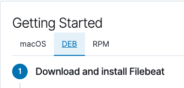

## Day 2 Activity File: Filebeat and Metricbeat Installation

Now that we have our ELK monitoring server up installed and configured, we're going to add two other tools called **Filebeat** and **Metricbeat**.

Taking raw log files and trying to make sense of all the data is often difficult and time consuming. We can use Filebeat to collect, parse, and visualize ELK logs in a single command. This will help us better track our organizational goals.

By the end of class today, you should complete the following steps:

1. **Install Filebeat on the Web VM's**. Verify your ELK server container is up and running, and install Filebeat on your WebVM's.

2. **Create the Filebeat configuration file**. Create and edit the Filebeat configuration file for your DVWA VMs.

3. **Create the Filebeat installation play**. Create another Ansible playbook that accomplishes the tasks required to install Filebeat.

4. **Verify the installation and playbook**. Confirm that your installation and playbook worked by verifying that the ELK stack is receiving logs.

5. **Complete the same steps with Metricbeat**. 
---

### Resources

Below are links to the Filebeat and Docker documentation. It is strongly suggested that you read through these before starting the activity:

- [Filebeat Container Documentation](https://www.elastic.co/beats/filebeat)
- [Metricbeat Container Documentation](https://www.elastic.co/beats/metricbeat)
- [Docker Commands Cheat Sheet](https://phoenixnap.com/kb/list-of-docker-commands-cheat-sheet)

You can also use the following resources if you get stuck:

- [Docker and Ansible Cloud Week Cheat Sheet](../12-Cloud-Security/CheatSheet.md)
- [Ansible Roles](https://docs.ansible.com/ansible/latest/user_guide/playbooks_reuse_roles.html)

---

#### Getting Started

Today, you will continue building up your ELK server. Specifically, if you have completed the installation step, you will proceed to install **Filebeat**.

- Recall that Filebeat helps generate and organize log files to send to Logstash and Elasticsearch. Specifically, it logs information about the file system, including which files have changed and when.

- Filebeat is often used to collect log files from very specific files, such as logs generated by Apache, Microsoft Azure tools, the Nginx web server, or MySQL databases. Today you will be using it to monitor the Apache server and MySQL database logs generated by DVWA.

- Since Filebeat is built to collect data about specific files on remote machines, it must be installed on the VMs you want to monitor. You will install Filebeat on the DVWA container you created during the cloud security week. This will provide you with a rich source of logs after you complete your deployment.

---

### Instructions

#### Part 1: Installing Filebeat on the DVWA Container

1. First, make sure that the ELK server container is up and running:

    - Navigate to http://[your.VM.IP]:5601/app/kibana. Use the public IP address of the ELK server that you created.

    - Click 'Explore on my Own'

    - If you do not see the Kibana server landing page, open a terminal on your computer and SSH into the ELK server.
      - Run `docker container list -a` to verify that the container is on.
      - If it isn't, run `sudo docker start elk`.

2. Use the ELK server's GUI to begin installing Filebeat on your DVWA VM.

    - Navigate to your ELK server's IP address:
      - Click **Add Log Data**.
      - Choose **System Logs**.
      - Click on the **DEB** tab under **Getting Started**.

    - Here you will find the most up-to-date Filebeat installation instructions for Linux.

      

    - Note that you do not need to do anything on this page. Since Filebeat is open source, it is updated frequently. Therefore, specific details around installation can change. This site will always have the most up-to-date instructions.


#### Part 2: Creating the Filebeat Configuration File

3. Next, we will create a Filebeat configuration file, after which we will create the Ansible playbook file.

    - At that point, we will translate the instructions in the DEB tab into a new Ansible play, which you will use to automatically install Filebeat on your DVWA machines.

      - Translating installation instructions to reusable playbooks is a common task for modern infrastructure teams. Being able to explain the value of this task and the plays you've created will be valuable in job interviews.

      - Creating this play will allow you to easily install Filebeat on any machine you want to monitor later, whether for class, work, or a personal project.

    - Open a terminal and SSH into your jump box:
      
      - Start the Ansible container.
      
      - Use the correct Docker command to attach to your Ansible container.

    - As mentioned earlier, the Filebeat installation instructions require you to create a Filebeat configuration file.
      
      - You will need to edit this file so that it has the correct settings to work with your ELK server.

  - You can use the provided template for the Filebeat configuration file:

     - [Filebeat Configuration File Template](Activities/Stu_Day_2/Unsolved/Resources/filebeat-config.yml).
 
       - Note that when text is copy and pasted from the web into your terminal, formatting differences are likely to occur that will corrupt this configuration file.

  - Using `curl` is a better way to avoid errors and we have the file hosted for public download [HERE](https://gist.githubusercontent.com/slape/5cc350109583af6cbe577bbcc0710c93/raw/eca603b72586fbe148c11f9c87bf96a63cb25760/Filebeat)

     - Run: `curl https://gist.githubusercontent.com/slape/5cc350109583af6cbe577bbcc0710c93/raw/eca603b72586fbe148c11f9c87bf96a63cb25760/Filebeat > /etc/ansible/filebeat-config.yml`

    ```bash
     root@6160a9be360e:/etc/ansible# curl https://gist.githubusercontent.com/slape/5cc350109583af6cbe577bbcc0710c93/raw/eca603b72586fbe148c11f9c87bf96a63cb25760/Filebeat > filebeat-config.yml
       % Total    % Received % Xferd  Average Speed   Time    Time     Time  Current
                                     Dload  Upload   Total   Spent    Left  Speed
     100 73112  100 73112    0     0   964k      0 --:--:-- --:--:-- --:--:--  964k
    ```

4. Once you have this file on your Ansible container, edit it as specified:

    - The username is `elastic` and the password is `changeme`.

    - Scroll to line #1106 and replace the IP address with the IP address of your ELK machine.

      ```bash
      output.elasticsearch:
      hosts: ["10.1.0.4:9200"]
      username: "elastic"
      password: "changeme"
      ```

    - Scroll to line #1806 and replace the IP address with the IP address of your ELK machine.

      ```   
      setup.kibana:
      host: "10.1.0.4:5601"
      ```

    - Note that the default credentials are `elastic:changeme` and should not be changed at this step.


    - Save this file in  `/etc/ansible/files/filebeat-config.yml`.

#### Part 3: Creating the Filebeat Installation Play

5. Next, create a new playbook that installs Filebeat and then copies the Filebeat configuration file you just made to the correct location.

    - On the Ansible VM, create a playbook file, `filebeat-playbook.yml`.
      - Locate this file in your `/etc/ansible/roles/` directory.  

    - Open your playbook and implement the following tasks:
      
      - Download the `.deb` file from [artifacts.elastic.co](https://artifacts.elastic.co/downloads/beats/filebeat/filebeat-7.4.0-amd64.deb).

      - Install the `.deb` file using the `dpkg` command shown below:
        - `dpkg -i filebeat-7.4.0-amd64.deb`
      
      - Copy the Filebeat configuration file from your Ansible container to your WebVM's where you just installed Filebeat. Make sure it is copied to: `/etc/filebeat/filebeat.yml`

        - Use Ansible's `copy` module to copy the entire configuration file to the correct place.
      
      - Run the following commands:
        - `filebeat modules enable system`
        - `filebeat setup`
        - `service filebeat start`

      - Enable the `filebeat` service on boot.

        - **Hint:** Use the Ansible module `systemd` to make sure the `filebeat` service is running. [More info at Ansible.com](https://docs.ansible.com/ansible/latest/collections/ansible/builtin/systemd_module.html).

   - You may find the following hints and links helpful:
      
      - This play should only run on the web machines that are running the DVWA containers.

      - Refer to the [Ansible playbook documentation](https://docs.ansible.com/ansible/latest/user_guide/playbooks_intro.html#playbooks-intro) if needed.

      - Use the Ansible `copy` module to move `filebeat-config.yml` onto the Web VMs.

      - You can use the `command` module to run `curl`, `dpkg`, and Filebeat commands.

      - Use `curl -O` or `curl -o` to download the `dpkg` file.

**Note:** You can use the following template for configuring the Filebeat playbook: [Filebeat Playbook Template](Resources/filebeat-playbook.yml). You can also build your own if you'd like an additional challenge.

After you create and save this file, run it to install Filebeat on the DVWA machines.

#### Part 4: Verifying Installation and Playbook

6. After the playbook completes, follow the steps below to confirm that the ELK stack is receiving logs from your DVWA machines:

   - Navigate back to the Filebeat installation page on the ELK server GUI.
   - On the same page, scroll to **Step 5: Module Status** and click **Check Data**.
   - Scroll to the bottom of the page and click **Verify Incoming Data**.

If your installation was successful, take a screenshot of what you see before proceeding.

---

#### Part 5: Creating a Play to Install Metricbeat

Note that you've done all of this through automation with Ansible. Now you can recreate exactly the same setup in minutes.

Next, create a play to install Metricbeat. After this, you'll have programmed plays to automatically install 25% of the most common Beats.

Note that there are fewer instructions and setup files provided here. However, the process is similar to the one used for the Filebeat installation.

- Navigate to your ELK server's IP.

    - Click **Add Metric Data**.
    - Click **Docker Metrics**.
    - Click the **DEB** tab under **Getting Started** for the correct Linux instructions.

  

- Return to your Ansible VM. Update your playbook with tasks that perform the following:

    - Download the [Metricbeat `.deb` file](https://artifacts.elastic.co/downloads/beats/metricbeat/metricbeat-7.4.0-amd64.deb).

    - Use `dpkg` to install the `.deb` file.
    - Update and copy the provided [Metricbeat config file](https://gist.githubusercontent.com/slape/58541585cc1886d2e26cd8be557ce04c/raw/0ce2c7e744c54513616966affb5e9d96f5e12f73/metricbeat).
    - Run the `metricbeat modules enable docker` command.
    - Run the `metricbeat setup` command.
    - Run the `metricbeat -e` command.
    - Enable the Metricbeat service on boot.

- Verify that your play works as expected:

   - On the Metricbeat Installation Page in the ELK server GUI, scroll to **Step 5: Module Status** and click **Check Data**.

If your installation was successful, take a screenshot of what you see before proceeding.


### Day 2 Milestone

If your ELK server is receiving logs, congratulations! You've successfully deployed a live, functional ELK stack and now have plays that can:

- Install and launch Docker containers on a host machine.
- Configure and deploy an ELK server.
- Install Filebeat and Metricbeat on any Debian-flavored Linux server.

|:warning: **Checkpoint** :warning:|
|:--| 
| :heavy_check_mark: Please use the checklist to verify that following critical tasks were completed. |
| :heavy_check_mark: Created an Ansible Playbook that installs and configures Filebeat. |
| :heavy_check_mark: The Ansible playbook is able to be run on any of your Web VMs. |
| :heavy_check_mark: Filebeat is installed and running on each of your Web VMs. |
| :heavy_check_mark: The ELK server is receiving logs from each of your Web VMs. |
| :heavy_check_mark: Completed the above steps again with Metricbeat |


### Troubleshooting and Common ELK Container Issues:

**Common Issue:** When the ELK VM is restarted, the container doesn't restart automatically, ELK doesn't run and logs are not transferred.

Check the following:

- Make sure you have the 'restart_policy' set correctly in the Ansible playbook:

    ```bash
     restart_policy: always
    ```
- Make sure you have the `vm_map_max` setting in the Ansible playbook:

    ```bash
        # Use command module
      - name: Increase virtual memory
        command: sysctl -w vm.max_map_count=262144

        # Use shell module
      - name: Increase virtual memory on restart
        shell: echo "vm.max_map_count=262144" >> /etc/sysctl.conf
    ```


---

© 2020 Trilogy Education Services, a 2U, Inc. brand. All Rights Reserved.  
