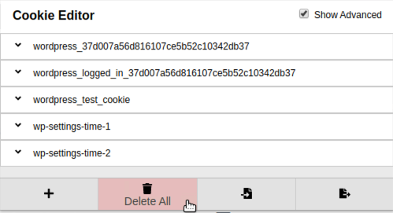

## Activity File: Swapping Sessions

In this activity, you will continue in your role as a web application security engineer.

- After the previous web server was compromised, your company decided to use a WordPress site as a platform for their new e-commerce site.

- You are tasked with using the Chrome browser extension Cookie-Editor with your company's WordPress site to examine the process an attacker might take to hijack a session.

**Notes:** 

- You must complete this activity on your Vagrant machine. 
- In order to complete the activity, you will revisit Docker. We've introduced a new Docker command and have provided additional information on how to use it. You'll continue to use Docker during the rest of the week. 

### Instructions

To demonstrate how session swapping in WordPress works, this activity has two parts: the setup and the session swapping exploit. 

#### Part One: The Setup

Before you get started with this activity, you'll need to make sure you have Docker-Compose and a few other activity files installed. If your instructor has not walked you through running the setup script, please do the following:

- Create and start the Docker WordPress container by running `docker-compose up -d` within your new `~/Documents/docker_files/` directory. This will run the container set in the background and let you use the terminal again.

- **Note:** We'll learn more about `docker-compose` in upcoming classes, but for now, we'll use it to get our WordPress website up and running. 

To install WordPress and create a sysadmin account, complete the following:

1. With `docker-compose up -d` running, open the Chrome browser in the Vagrant machine and navigate to `localhost:8080`. Fill in the following:

    - Site Title: You can choose any title.
    - Username: `sysadmin`
    - Password: `cybersecurity`
    - Confirm Weak Password: Click on the check box. 
    - Your Email: Use a fake email address.
    - Search Engine Visibility: You can leave this blank as this will not be on the web.

#### Part Two: The Exploit

2. Create a new user.
    - While signed in as sysadmin, on the left-hand column, hover over **Users** and click **Add New**.

     - Create a new hacker user using the following parameters:
        - Username: `hacker`
        - Password: `p4ssw0rd*`
        - Confirm Weak Password: Click on the check box. 
        - Your Email: Use a fake email address. 

        - Role: Editor. 

    - **Note:** Penetration testers will often start with a regular website user in order to understand how the site's cookies are constructed and what pages they can exploit.

3. Inspect the cookie.

   - While you won't be attempting to crack this cookie, you should understand the URL-decoded version of the cookie that shows its individual parts. In web application penetration testing engagements, you'll often first test to see how a website implements session and cookie security.

      - Open the Cookie-Editor extension and look at the value of the first localhost WordPress cookie. Copy this value into meyerweb.com/eric/tools/dencoder and click **Decode**. How many sections is this cookie made of?

      - Penetration testers often need to know how long a site's cookies will last so they can time their attack properly.

      - Examine the expiry date of the cookies. How many months do the longest cookies last?

4. Save a cookie.

    - While still logged in as the first sysadmin user, click on the cookie icon in the toolbar and click the **Export** arrow on the bottom-right. Make sure it says "Cookies exported to clipboard."

5. Swap sessions.

    - Back in the regular window, while still logged in as your sysadmin user, click the Cookie-Editor and click on the trash can to delete cookies from the Cookie-Editor. 

      - Because we're deleting the cookies from the Cookie-Editor and not the browser, the cookies are still valid. 

 

6. Refresh the page and you will be taken back to the WordPress login page. Sign in as your hacker user and import the sysadmin's cookies using Cookie-Editor. Refresh the page. 

You just swapped your sessions between users without having to log out of them.

7. Make sure to run `docker-compose down` while in the directory where you have the `docker-compose` file. This will de-instantiate your Docker Compose instance. 

---
© 2020 Trilogy Education Services, a 2U, Inc. brand. All Rights Reserved.  
