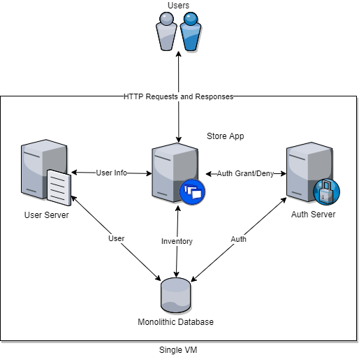
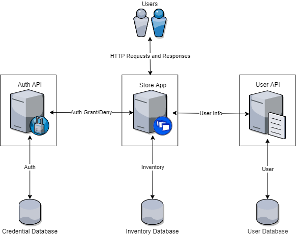
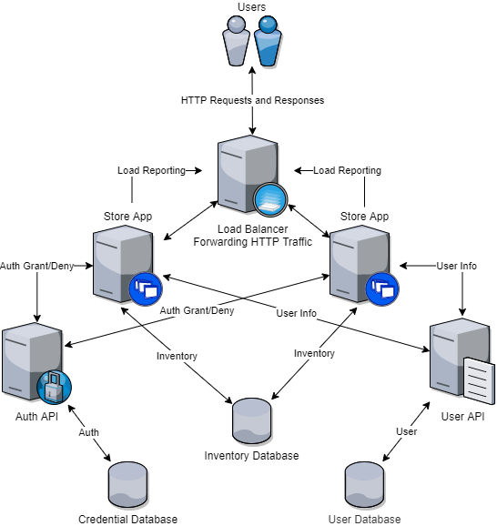

## Solution Guide: Monolith to Microservices

In this activity you developed a microservices version of an existing web store app in order to prepare for redundancy and scaling.

---

First, let's take a look at the original existing monolith for the web store app:

All of these servers exist in one VM.

Your microservices diagram should be similar to this:

The microservices include:

- A store app
- A user API
- An authentication API

You also split the monolithic database into three separate databases:

- A user database that handles all user information from the store app, such as preferences and sessions.

- A credential database that is used to store credential information that the authentication API will check user logins against.

- An inventory database that gets updated whenever a user buys something from the store.

The microservices connect to their corresponding databases in the following ways:

- The store app exchanges inventory info with the inventory database.

- The user API exchanges user info with the user database.

- The authentication API exchanges authentication info with the credential database.

Lastly, the APIs will interact with the store app in the following ways:

- The user API forwards user info to the store app.

- The authentication API forwards authentication grants or denials to the store app.

**Bonus**

If you completed the bonus, you should have a diagram similar to the following:

In this diagram, we now have the additional microservices:

- Two replica store apps for redundancy and scale.

- A load balancer that has rules for balancing user sessions between the two replica store apps.

Explaining new connections:

- The connections between the APIs and store app replicas remain the same, but now there are twice as many connections.

- You may have load reporting connections between the store apps and load balancer. These let the load balancer know which store app has less load for handling requests and responses.

- Lastly, the load balancer should have connections going to each store app that show it forwarding requests and responses.

  
---
© 2020 Trilogy Education Services, a 2U, Inc. brand. All Rights Reserved.
