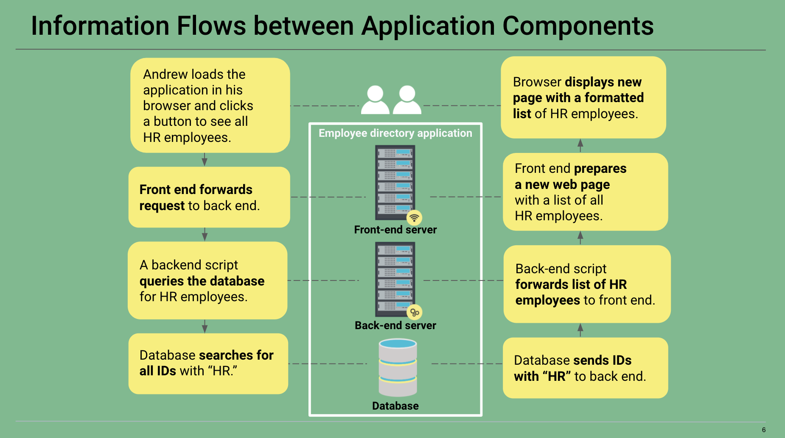
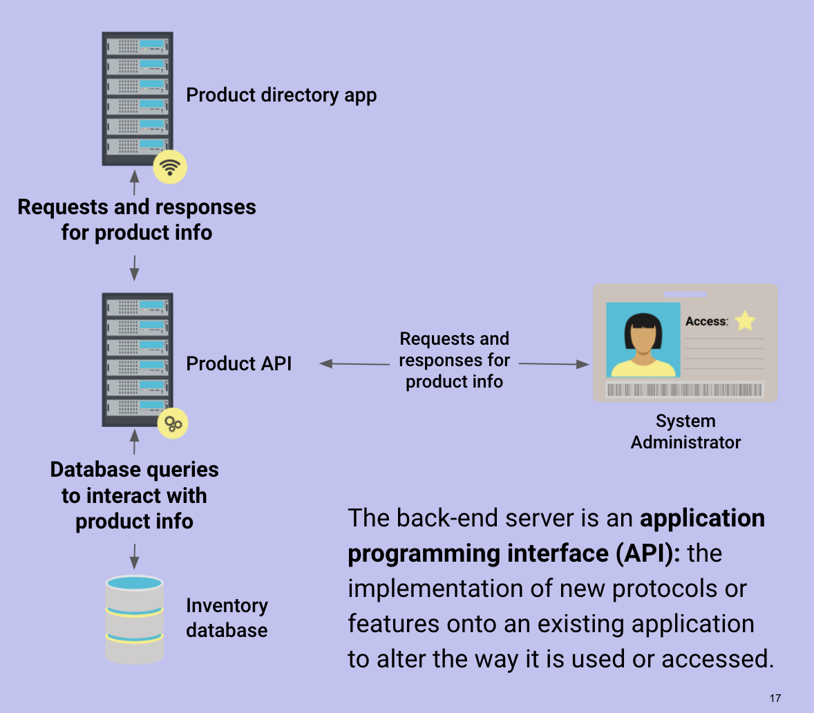
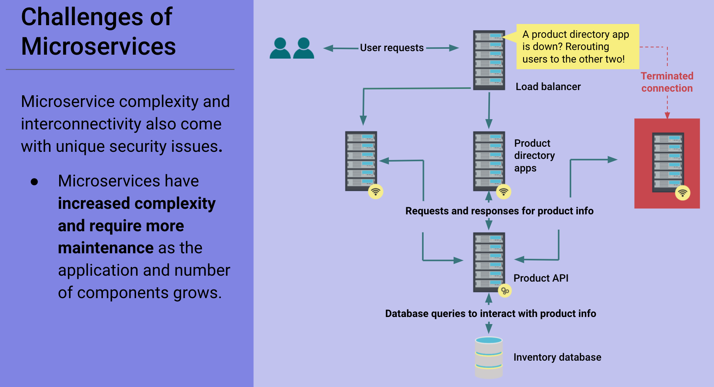
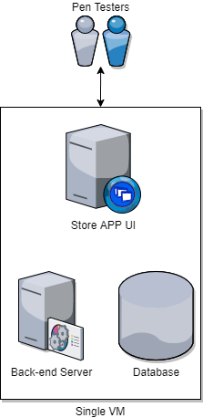
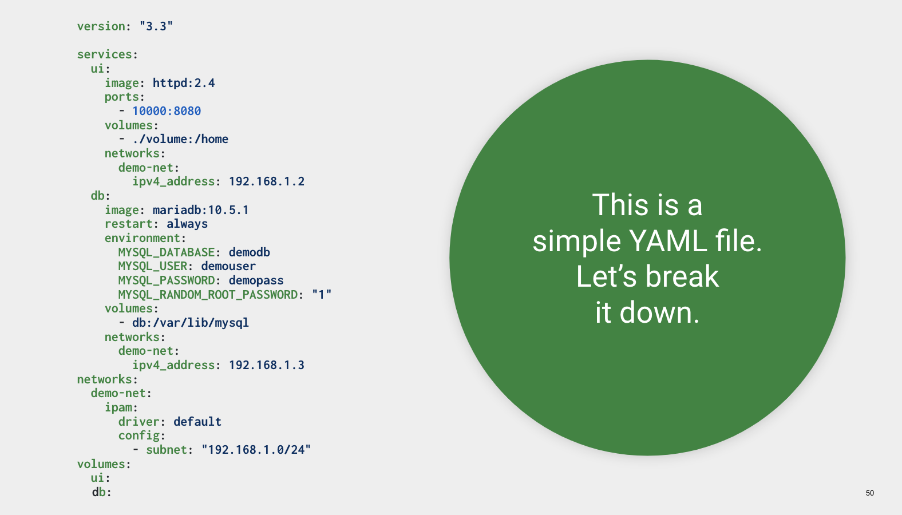
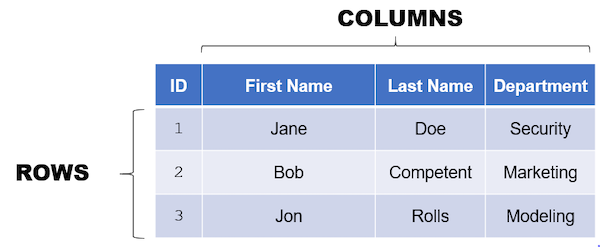

## 14.2 Student Guide: Microservices and Web Application Architecture

### Class Overview

In the last class, we looked at how the HTTP request and response communication framework work to relay information between a web server and client. We also looked at how web servers and clients use cookies to establish sessions.

Today's class will look at the web applications infrastructure  that makes the web client-server model possible. Specifically, we will cover: 

- Why the original paradigm of monolith web application architecture evolved to the microservices model.

- The different components of web applications.

- Specific examples of web application components, or "stacks."

- The deployment of web application architecture.

- The database component of web applications and how to interact with data.

### Class Objectives

By the end of class, you will be able to:

- Understand how microservices and architecture work to deliver more robust, reliable, and repeatable infrastructure as code.
- Define the different services within a LEMP stack.
- Deploy a Docker Compose container set and test the deployment's functionality.
- Describe how relational databases store and retrieve data.
- Create SQL queries to view, enter, and delete data.

### Notes

For the second half of the day, you will use Docker and Docker Compose to manage the activity's web application. 

- `docker-compose up` and `docker-compose down` instantiate container environments specific to the directory they're run in. 

- :warning: **Heads Up**: Do not forget to run `docker-compose down` whenever you are done working in a directory where you ran `docker-compose up`.

#### Docker and Docker-Compose Resources

The following are useful Docker and Docker-Compose commands and resources.

- [Getting started with Docker](https://docs.docker.com/get-started/)

- [Overview of Docker-Compose](https://docs.docker.com/compose/)

- [Remove a container volume](https://docs.docker.com/engine/reference/commandline/volume_rm/)

- [Removing Docker-Compose volumes](https://docs.docker.com/compose/reference/rm/)

To find running Docker Compose container names and statuses:

- Navigate to where a `docker-compose.yml` file exists. For example:

  - `cd ~/Cybersecurity-Lesson-Plans/14-Web_Dev/deploying_testing_activity` 

- Then, run `docker-compose ps` to check the statuses:

  - `docker-compose ps` will return the containers associated with the compose file.

- Alternatively, use `docker container ls` to find all running containers on the system.

### Lab Environment   

You will use your local Vagrant virtual machine for today's activities. 

  - Student access:
    - Username:`sysadmin`
    - Password: `cybersecurity`

#### Directories and Files

To prepare for this class, confirm that the following files are present on your Vagrant machine:

- `/home/instructor/Cybersecurity-Lesson-Plans/14-Web_Dev/deploying_testing_demo/docker-compose.yml`

- `/home/sysadmin/Cybersecurity-Lesson-Plans/14-Web_Dev/deploying_testing_activity/docker-compose.yml`

- `/home/sysadmin/Cybersecurity-Lesson-Plans/14-Web_Dev/deploying_databases/docker-compose.yml`

If the above files are missing it means your Vagrant machine is outdated, and you need to update it.


### Slideshow 

The slides for today can be viewed on Google Drive here: [14.2 Slides](https://docs.google.com/presentation/d/1Z45CTyc8UCxnTJ4PTRZt4sGoLVUtcj_eITLIbKM6n9k/edit#slide=id.g7257d4d408_0_0).

---

### 01. Reviewing Application Structure

On Day 1 of this unit, we investigated and analyzed the HTTP request and response process as well as sessions and cookies. These concepts are important for understanding web application communication and identity paradigms. 

In today's class we'll take a deeper look at the infrastructure behind web applications. Specifically, we'll look at:

- How modern web architecture has evolved to what is known as microservices.

- What components make up microservices and their specific software "stacks."

- How web application components can be deployed using containers.

- How databases work to understand how web applications store and transmit data. 

In the next unit, Web Vulnerabilities, we'll use this foundational knowledge of web application architecture and databases to examine how web attacks like SQL injections can lead to information breaches.

#### Microservices Overview

To understand why microservices exist, we need to cover the following:

- How an application and its components are organized.
- How information flows between components of an application.
- How the application's architecture has changed from monoliths to microservices.
- How to deconstruct a monolith into microservices.

#### Components of a Typical Web App

We will look at how an application is constructed in order to understand the paradigm shift in modern web architecture.

Consider this scenario: 
- A developer, Andrew, uses a browser to manage a public-facing application (the Employee Directory App), where he retrieves and updates different kinds of employee lists from his company. The Employee Directory App is set up so that Andrew can add, remove, and view employees.

This application needs the following components in order to function:

-  A **front-end** server, responsible for displaying webpages and styling them in a readable format. This server is also responsible for receiving and responding to HTTP requests.

- A **back-end** server, for executing business logic and writing or reading corresponding data to and from a database. The back-end server knows how to interact with the database depending on the specific request received.

  - For example, if Andrew requests to add a new employee, the back-end server knows to create a new number (e.g., 109) for the employee, and then save that information in the database. 
  
    After this, the data is sent to the front end and formatted to display: "New employee, Bob, created with employee ID, 109" in a new webpage.

- A **database**, used to store information about employees, such as their employee IDs and names. Critical and sensitive information is found in databases. We'll discuss this more in the second half of the class.

#### Information Flows Between Application Components

Now that we know the main components of a web application, we want to know what happens behind the scenes when a user interacts with a web application, or more specifically, makes an HTTP request to the server.

Let's see how information flows between application components when Andrew requests a list of all HR employees.

  


  1. Andrew loads the application in his browser and clicks a button to see all HR employees.

  2. Front end forwards the HTTP request to the back end.
  
  3. A back-end script queries the database for HR employees.
  
  4. Database searches for all IDs containing "HR."
  
  5. Database sends IDs with "HR" to back end.
  
  6. Back-end script forwards list of HR employees to front end.
  
  7. Front end prepares a new webpage listing all of the HR employees.
  
  8. The browser displays a new page to Andrew, with a formatted list of HR employees.

Each component of the web application serves one primary function, whether it's serving website data over HTTP or querying the database.

### 02. Monolith to Microservices

Understanding what components *do* in an application is key to understanding why microservices are so important in the modern architectural paradigm. 

First, we need to understand the original architecture type, known as **the monolith**, and its issues.

A monolith is any machine that hosts all of the components required to serve a website or application. In other words, a monolith is a machine that has the front-end server, the back-end server, and database all on one machine.

For example, if Amazon used a monolithic server comprised of a front-end server, the back-end server, and database, it would contain:

- A front-end HTML server: A GUI for customers to use when shopping.

- A back-end application server: A back-end server showing inventory and stock. This server interacts directly with the database.

- A MySQL database: A database of customers, their information, and purchases.

Let's review what the monolith in our example looked like. 


The components of this machine are highly dependent on each other. If one component malfunctions, the application will stop working. This presents a few problems:

- If the company needs to update any of the components—the front end, back end, or database—the entire server and all of its components must be taken down. This creates long periods of downtime.

- If one component is compromised by a hacker, environmental issue, or human error, the entire machine is potentially compromised.

Today's business standards expect companies to ensure availability by maintaining almost 100% uptime. Because of this, Amazon decides that the monolith architecture comes with too much risk, and instead creates a more **modular** setup: a whole consisting of smaller and separate parts.

- Amazon needs to separate their components into different machines, so that system administrators and developers can deploy changes without taking entire applications down for extended periods of time.

- Separating an application's components into their own machines allows the sysadmin to update the front end, reboot it, and only have to verify the front-end components are working. They don't have to worry about the back-end components and database. If any components were compromised by a hacker, the potential damage would be restricted to only that one component.

This new approach of separating application components into their own machines is called **microservices**.

#### Microservices

So far, we've covered the typical components of an application and how the monolithic design causes maintenance and security issues. Now we want to separate our components into different machines to implement microservice architecture.

In the following scenario, Amazon's sysadmins have separated and isolated the front-end, back-end, and database components into their own machines.

- Each of the smaller blocks represent a single, independent machine. Within each machine is a component that executes one primary function or **service**.

  

We actually implemented microservices earlier in the course. Think back to the unit on cloud security, and some of the activities from the previous day. So far, we've created the following microservices:

- A jump box to connect to a private Ansible server.
- An Ansible server to configure DVWA servers.
- DVWA servers to provide the DVWA service.
- A Docker image to provide WordPress.

Together, these perform the same services as the monolithic server, but without the potential vulnerabilities.

#### Benefits of Microservices

The ultimate goal of microservices is flexibility through modularity, which has the following benefits:

- **Scalability and resiliency**: Replication of identical components allows you to serve more clients and provides identical backup components if one fails.

- **Rapid response**: Since microservice components are inherently smaller than monoliths, they can be replaced and updated quickly.
  - For example, an entire VM might require 150 GB of total disk space. An individual component could have a maximum capacity of 100 or 200 MB. 

- **Isolated improvement**: Since microservices should be reduced to serving one primary function, they can be developed to optimize their functionality.
  - For example: Developers working on an API for storing employee data are developing a way to create new employee accounts more quickly. They'll be able to work directly on this API, without the need of a front end to view it. 
  
- **Isolated security:** One compromised component does not equal a compromised application.

#### Creating an API

In previous cloud security and web development classes, we used Ansible with SSH to communicate between our servers. This is a relatively simple process, but not every system uses Ansible to communicate.

- Most systems use **application programming interfaces (APIs)**.

Consider the following scenario:

- When an Amazon customer wants to retrieve a list of the newest and most popular books, they don't go to the back-end MySQL server to check the inventory. They use the front-end microservice. The microservice then communicates with the back-end server containing that data, and brings it up.

- Customers do not have access to the back-end server. The back end does not accept HTTP requests, meaning users can't communicate with it.

- However, Amazon system administrators do need to access and query the back end in order to update product information. Since they need to directly communicate with the back end, they must modify it to accept requests.

- Amazon software developers will program the back end to receive, from sources other than the front-end server, HTTP requests to add, remove, and view product information.

In this example, the back-end server is an example of an application programming interface (API).

- An API is the implementation of new protocols or features onto an existing software application to alter the way that application is used or accessed.

- In the previous example, the software developers modified the back end to receive HTTP requests from sources other than the front end.

 We can call this back end the Product API.

  

The back-end server can now process HTTP requests and responses for product info. However, the front-end server will still send requests and responses for customers requesting product info over the open web as usual.

#### Finalizing New Components and Functions

We have turned our monolith into various microservices. Now we will rename the front-end server and database to match their specialized services.  

- The front-end server provides the service of displaying the application to users through a browser, so we'll now call it the Product Directory API. 

- The database stores product info, so we'll call it the Amazon Database.

We separated a monolith into microservices by doing the following:

1. Separated each component of the monolith by function, moving it into its own machine.
2. Added communication between each microservice.
3. Turned the back-end server into an API to interact with more than just the front end.
4. Renamed the rest of the component services to match their main functions.

Microservice complexity and interconnectivity also come with unique security issues, which we'll cover in more depth later.

#### Challenges of Microservice Scaling

A primary challenge of microservices is the increased complexity and required maintenance as the application and number of components grow.

- For example, suppose there are multiple directory apps for redundancy and one of the app services needs to be taken down for maintenance.

- The following is an example of microservices maintenance:

  

- To maintain the third app service, you have to ensure that no new clients are connecting to it, upgrade it, then re-establish its communications within the entire microservice deployment.

- This process is more complex than running a command to download and install all updates and then rebooting a monolithic server. However, it is faster. With the proper setup, it causes no service interruptions.

The solution is to set up a load balancer.

#### Diagramming Microservices

In the following activity, you will review a diagram of a monolithic application and transition it into a microservice setup.

- As an example, here is the same application set up as a monolith and as a set of microservices:


  

  

If any component of the monolith was compromised, the entire application would be compromised. Therefore, it is separated into the following components:

- A store app UI to serve as the front-end service.
- A user API to serve as the back-end service.
- A user database.

To make these changes on a diagram, we would:

1. Separate each component of the monolith by its function and make it its own machine.

2. Add communication between each part of the microservice.

3. Add the back-end server to an API to interact with more than just the front end.

4. Rename the rest of the component services based on the main function they provide.

### 03. Activity: Monolith to Microservices

- [Activity File: Monolith to Microservices](./Activities/03_Monolith_to_Microservices/Unsolved/README.md)
- [Draw.io Diagram Template](./Activities/03_Monolith_to_Microservices/Unsolved/activity_one_unsolved.drawio)

### 04. Activity Review: Monolith to Microservices
- [Solution Guide: Monolith to Microservices](./Activities/03_Monolith_to_Microservices/Solved/README.md)

### 05. Web Application Architecture

In the last activity we separated a monolith into microservices in order to understand modern web architecture. 

One of the first steps to creating microservices is separating the components into their own individual machines so that each one can run a "service."

A service, such as the front-end server from our earlier examples, is really just an operating system, running a minimum amount of software that has been configured to serve one main purpose, such as handle HTTP requests and responses.

This means that each individual machine requires:

- An operating system to run on, in order to run the service's software and store its configurations.

- The software itself, which runs a specific set of instructions for that individual component of the web application.

  - For example, a database service may run Linux as its operating system, and then have Microsoft's SQL Server installed on it.

Now we can explore what open-source and commercial software we need to set up to create our web application components.

#### What is a Stack

Any combination of a base operating system, front-end software, back-end software, and a database is called a web **stack**. 

Which stack you run will depend on the needs of your organization. For example, let's look at the well-known LAMP stack. This stack consists of: 

- Linux, as the base operating system.
- Apache, to handle the frontend HTTP requests/responses.
- MySQL, for storing data.
- PHP, for back-end transformation of front-end requests and responses to database queries. (We'll look at database queries in our last activity.)

The LAMP stack is considered the foundational web stack, with a long history of use in architecting web applications. For example, the following sites either still use or originally used the LAMP stack:

- WordPress
- Facebook
- Tumblr
- Wikipedia
- Slack

:books: Visit the following link if you are interested in learning more about the history of the LAMP stack:

- [Tedium: I Love LAMP](https://tedium.co/2019/10/01/lamp-stack-php-mysql-apache-history/)

These days, there are many more web stacks that use different software. Note that the stack is simply a description of the software running in the web application. 

- You can technically have a monolith or microservices web application using the same software stack. 

- The difference is that monoliths have one operating system with all of the software on it, and microservices have many smaller operating systems, each with the minimum amount of software needed for its own service.

But what stack do we want to use for our own web application?

#### Introduction to Common Web Architecture

Let's start by comparing the different operating systems available for our services.

- The [Alpine Linux](https://alpinelinux.org/about/) is one example. It is a super lightweight Linux distribution with the minimum requirements to run containers.

- Other container-friendly operating systems include most other Linux distributions, such as Ubuntu, and more recent versions of Windows Server. The following are base operating systems used for web applications:

  - Alpine Linux

  - Common Linux distros such as Ubuntu, Red Hat, and SUSE

  - Windows Server 2016 and higher

We also have the front-end server that handles the HTTP requests and responses. This is usually some form of HTTP server running on a lightweight containerized operating system.

The front-end server is the part of a web application that renders the visual components of a web application. HTML, CSS, and JavaScript are the primary front-end web design languages. 

- The following are specific examples of front-end servers:

  - Apache 

  - nginx

  - IIS

Data for the application is housed in the database server. Remember that there could potentially be multiple databases, some for storing sessions and cookies, and some for storing business logic like a company's employee directory. 

- The following are specific examples of databases:

  - MySQL

    - Note that you may also see MariaDB, which we will use in our activity. 
    
    - MariaDB is a community version of MySQL, created after Oracle acquired MySQL. MariaDB tries to be as close to MySQL as possible, but has an open source license.

  - PostgreSQL

  - Microsoft SQL Server

  - CouchDB

  - MongoDB

Lastly, you usually need a back-end server that transmits data between the front end and the database. These servers run fully-featured scripting and programming languages.

- The following are specific examples of backend servers and languages:

  - PHP

  - Perl

  - Python

  - nodeJS

#### The WIMP Stack

There is also a Microsoft-based variation called the WIMP stack that uses the following:

- Windows operating system

- Microsoft's IIS web server in place of Apache/nginx

- Database, such as Microsoft SQL Server

- Back-end language, such as PowerShell

We won't be using WIMP, but it is important to be aware of Microsoft-based web stacks.

- :books: Review the following Wikipedia article for a brief overview of the WIMP stack:

  -  [Wikipedia: WIMP (software_bundle)](https://en.wikipedia.org/wiki/WIMP_(software_bundle))


The web software stack that we'll be using for today's demos and activities consists of Linux, nginx (pronounced "engine-x"), MariaDB, and PHP. 

This is known as the **LEMP stack**.

#### The LEMP Stack

What goes into the LEMP stack?

- Linux: The standard underlying operating system used for web applications. However, we will be using it with containers.

- nginx: We'll be using nginx for our front-end HTTP server instead of Apache, mainly for its speed. While Apache is considered to have more features and is more compatible with back-end languages, such as Java, nginx is well-known for its performance.

- MariaDB: Unofficially the "other" MySQL, it is a standard relational database that will handle our data storage.

- PHP: Our pages will be generated with data pulled by PHP scripts. We will not need to manage or work with any PHP directly today, but know that it is acting as our back-end language.

This set of Linux, nginx, MariaDB, and PHP is a variation of the LAMP stack we talked about earlier. 

We just covered all of the software that we want to use for our web application. But what about the other side of web application architecture: the _hardware_?

- We need a hardware environment suitable for web application microservices that is both lightweight and easy to deploy. 

- For that, we can use virtualization, and for the purpose of microservices, we need the most lightweight virtual environment possible.

#### Microservices Infrastructure with Containers

Microservices require lightweight environments because:

- Our microservices need to be rapidly deployable.
- We need to be able to scale our microservices to meet growing demand.
- Developers and maintainers need to be able to replicate their own copies of these microservices locally.
- Having full-sized virtual machines for each service would require more resources and be more costly.

:question: Can anyone think of a technology we've covered in class that can create isolated virtual environments?

- Lightweight virtualization environments exist in the form of **containers**.

  - In the Cloud Security unit, we covered containers and Docker extensively. We also used Ansible to set up lightweight containers in our activities.

  - Containers run as isolated, virtual operating systems that dynamically allocate resources depending on the container's needs. These are unlike regular virtual machines, where all of the hardware is virtualized.

  - Docker is the most popular container platform. For the rest of this lesson, we will be using Docker's implementations of containers.

Using containers is the the primary way microservices are developed and will be the method we use to "miniaturize" the components of our web stack.

#### How a Container Becomes a Microservice

**Containerization** is the process of packaging all of the requirements to set up a microservice as a container.

Containerizing a microservice does the following:

- Declares a base operating system for the microservice to run on.
- Stages the microservice's source code to the container.
- Sets a command that launches the microservice and all other needed software when the container is deployed.

The containerization process is declared in a simple text file called a Dockerfile.

- Dockerfiles contain all of the configuration needed for a container in one file, similar to how an Ansible configuration file contains everything it needs to configure a host when you run the command `ansible-playbook your-playbook.yml`.

In the case of the Amazon Product microservices that we saw before, we would create a separate Dockerfile for each of the microservice components.

- Review the following sample of a Dockerfile:

 ```Dockerfile
 ###############################
 # Product Directory Application
 ###############################
 # Required Base OS
 FROM ubuntu:14.04
 ...[truncated]
 ```

- In this Dockerfile, Docker will install an Ubuntu 18.04 image to serve as a base operating system for the microservice.

- Other declarations in the Dockerfile set up the software and configuration required for the microservice. 

  - This will vary depending on the service.

A unique Dockerfile will be created for each microservice:

  

You don't need to know how to construct or maintain a Dockerfile. But you should understand that these Dockerfiles can be repeatedly used to create and configure the same microservice set, similar to what Ansible playbooks do for Ansible.

### 06. Deploying and Testing a Container Set

While we know that we can set up a single container by using a Dockerfile, deploying containers one at a time can become tedious and unwieldy, especially if businesses require hundreds or thousands of microservices.

Therefore, we need to know how to deploy containers for large-scale environments. Specifically, we need to know how to:

- Deploy multiple _types_ of containers at the same time (for example, front-end and database services).

- Set up a network for our containers so that they can communicate with each other.

- Preconfigure our containers, such as declaring the credentials for our web application's database.

These requirements are achieved with a tool called Docker Compose.

Docker Compose is a tool that can deploy and configure multiple containers at once. This means we don't have to micromanage multiple individual container instances.

#### Docker Compose Demo

In the upcoming demo, we will use Docker Compose to quickly deploy a web application comprised of multiple microservices.

We will then check our deployment in the browser to ensure that web clients can connect to it. Then we'll enter an interactive bash session into the database's container to ensure that it is up and running.

This will demonstrate how quickly containerized microservices can be deployed to a functional state.

For this web application deployment demo, we'll complete the following steps:

- Examine our YAML file for its current configurations.
- Launch our services with `docker-compose up`.
- Use our browser to verify that our front-end user interface (UI) services are deployed properly.
- Enter a MySQL session to confirm proper deployment of our database service.

But first, we'll need to see how Docker Compose allows us to to create repeatable, multi-container deployments through its YAML-formatted configuration file.

#### The Docker Compose YAML File

:question: Do you remember using YAML to deploy Ansible playbooks during the Cloud Security unit?

- Docker Compose uses YAML to define the containers for a deployment, their networking configuration, and where you will copy files from your host machine into the container.

- Docker Compose also uses the same YAML file type to declare container configurations. These files are often saved as `docker-compose.yml`.

#### Launching the Demo Deployment

1. We will look at how this YAML file configures the user interface UI (`ui`) and database (`db`): 
  
      

      ```YAML
      version: "3.3"

      services:
        ui:
          container_name: demo-ui
          image: httpd:2.4
          ports:
            - 10000:8080
          volumes:
            - ./volume:/home
          networks:
            demo-net:
              ipv4_address: 192.168.1.2
        db:
          container_name: demo-db
          image: mariadb:10.5.1
          restart: always
          environment:
            MYSQL_DATABASE: demodb
            MYSQL_USER: demouser
            MYSQL_PASSWORD: demopass
            MYSQL_RANDOM_ROOT_PASSWORD: "1"
          volumes:
            - db:/var/lib/mysql
          networks:
            demo-net:
              ipv4_address: 192.168.1.3
      networks:
        demo-net:
          ipam:
            driver: default
            config:
              - subnet: "192.168.1.0/24"
      volumes:
        ui:
        db:
      ```

   - This is a simple YAML file. 

2. The YAML file installs the following services:

    - The user interface, or front end, and the database.

      ```YAML
      services:
        ui:
        db:
      ```

   - In this YAML file, the `ui` and `db` are our services. Each of these services are container configurations. Let's take a look at the first one:

      ```YAML
        ui:
          container_name: demo-ui
          image: httpd:2.4
          ports:
            - 10000:8080
          volumes:
            - ./volume:/home
          networks:
            demo-net:
              ipv4_address: 192.168.1.2
      ```

      - `container_name`: Specifies the name of the container. If not specified, Docker will automatically name the container using the current directory and services name. This definition allows us to have explicable container names for when we use commands such as `docker exec`.

      - `image`: Points to where Docker Compose will grab the container image from on Docker Hub. This will be Apache's `httpd` container. This is equivalent to `FROM ubuntu:14.04` from the Dockerfile we looked at earlier.

        - :books: Visit the following link and scroll to the section that explains that PHP can be installed on the `httpd` server to turn it into both an Apache and PHP server.
          - [Docker Hub: httpd](https://hub.docker.com/_/httpd)
      
      - `ports - 10000:8080`: The container's HTTP port is remapped from its default `80` port to `8080`, which is then forwarded, or made available, to the host's `10000` port. 
        - Allowing a container port to be accessible by a host port is called **port binding**.
      - `volumes: - ./volume:/home`: The local destination where the Apache server will save our configuration files.
      -  `networks: demo-net`: The network that this service will connect to. 
      - `ipv4_address: 192.168.1.2`: The static IP address that we are assigning to this container, which we'll be able to load up into our browser.
   
3. Now that we have an idea of how Docker Compose YAML files are constructed, let's see how `docker-compose` actually stands it all up.

   - Navigate to `/home/instructor/Cybersecurity-Lesson-Plans/14-Web_Dev/deploying_testing_demo`.

4. The following command will find a `docker-compose.yml` file in the current directory and spin up the containers configured within it.

   - Run `docker-compose up`. When the containers are ready you should see the following output:

      ```bash
      demo-ui | 192.168.1.1 - - [29/Sep/2020:15:38:49 +0000] "GET / HTTP/1.1" 200 45
      demo-ui | 192.168.1.1 - - [29/Sep/2020:15:38:49 +0000] "GET /favicon.ico HTTP/1.1" 404 196
      ```

   - Docker Compose's execution is now taking over the terminal.

   - `docker-compose up` will look for a `docker-compose.yml` file in the current directory and deploy it.

5. Let's verify everything worked by checking the webpage. 

   - Open Firefox and navigate to `192.168.1.2`, which is the IP address we assigned to our recently created container.

     - When you navigate to it, you should be greeted with a webpage that says **It works!** Refresh the page.

   - Return to the terminal that is running `docker-compose` to show that there are indeed HTTP GET requests received by our `ui` service.

6. Let's move on to the database service definition in the YAML file. 

    - It is not essential that you understand and can create services on your own, but you should understand what the different declarations mean.

      ```YAML
        db:
          container_name: demo-db
          image: mariadb:10.5.1
          environment:
            MYSQL_DATABASE: demodb
            MYSQL_USER: demouser
            MYSQL_PASSWORD: demopass
            MYSQL_RANDOM_ROOT_PASSWORD: "1"
          volumes:
            - db:/var/lib/mysql
          networks:
            demo-net:
              ipv4_address: 192.168.1.3
      ```

      - `demo-db`: The name of our container.
      - `image: mariadb:10.5.1`: The container image and version we'll be using (MariaDB database version 10.5.1).
      - `environment`: Contains the setup of the MySQL server.
      - `MYSQL_DATABASE: demodb`: The name of the database.
      - `MYSQL_USER: demouser`: The default user for the MySQL database.
      - `MYSQL_PASSWORD: demopass`: The password for the user.
      - `MYSQL_RANDOM_ROOT_PASSWORD: "1"`: Gives the root user a random password, for security purposes.
      - `volumes: - db:/var/lib/mysql`: The location where we are saving our configuration files.
      - `networks`: Using the same network (`demo-net`), assigns this database a static IP address.

    - The top-level `networks` is an application-wide configurations that can be accessed by each service.

7. Now, we'll check the `db` service deployment.

    - In a new terminal, navigate back to the `/home/instructor/Cybersecurity-Lesson-Plans/14-Web_Dev/deploying_testing_demo/` directory.
    - First, we need to get the name of our database container.
    
      - Run `docker container ls`
    
      - This command will let us see the names of our containers. Note the `demo-db` container result.
    
    - Run `docker exec -it demo-db bash`
    
      - This command lets us enter an interactive bash session in our containers. We have seen this command before.
    
      -  Notice the prompt now includes `root`, which signifies our new shell session.

8. Open a new terminal and display the contents of the `docker-compose` file: 

    - `cat /home/instructor/Cybersecurity-Lesson-Plans/14-Web_Dev/deploying_testing_demo/docker-compose.yml`

   - We can find declared database credentials in the YAML file under the `environment` sub-heading.

    ```YAML
      db:
        container_name: demo-db
        image: mariadb:10.5.1
        restart: always
        environment:
          MYSQL_DATABASE: demodb
          MYSQL_USER: demouser
          MYSQL_PASSWORD: demopass
          MYSQL_RANDOM_ROOT_PASSWORD: "1"
        volumes:
          - db:/var/lib/mysql
        networks:
          demo-net:
            ipv4_address: 192.168.1.3
    ```

9. Navigate back to the container bash session and type `mysql -u demouser -pdemopass` to enter the database.

   - This command will let us use the username `demouser` found in our YAML file.

   - The `-p` parameter denotes a password, and we will use the `demopass` password declared in our YAML file.

   - If the prompt changes to `MariaDB`, this confirms we're now in a successfully deployed MariaDB database.

     - Notice the prompt shows up as `MariaDB [(none)]>`. The `(none)` means that we have no actual database within MariaDB selected.

10. If you want to bring the container set down, you can press Ctrl+C in the terminal where we ran `docker-compose up`.


### 07. Activity: Deploying and Testing a Container Set
- [Activity File: Deploying and Testing a Container Set](Activities/07_Docker_Compose/Unsolved/README.md)
- [Docker Compose File](Activities/07_Docker_Compose/Unsolved/docker-compose.yml)

### 08. Break

### 09. Activity Review: Deploying and Testing a Container Set
- [Solution Guide: Deploying and Testing a Container Set](Activities/09_Docker_Compose/Solved/README.md)

### 10. Intro to Databases

:warning: **Heads Up**: This demo, activity, and review contain important concepts that will be built upon in the upcoming Web Vulnerability unit. 

Let's recap everything we've learned so far today:

- How to separate a monolith into microservices.
- How to describe web application architecture.
- Defining specific web application architectures.
- How to deploy and test that a container set is running and functional.

Now that we have easily deployable microservice-based web applications, we're going to cover one of the most critical components of a web application: the database.

Databases are so critical to web application architecture because they contain the persistent data that flows through the web application. The data in the database can include, but isn't limited to:

- The usernames, telephone numbers, and email addresses of customers.

- The session and cookie IDs of site visitors.

And even more critically, a database can have personally identifiable information (PII), such as the full names, dates of birth, credit card numbers, and social security numbers of customers.

For these reasons, it is absolutely crucial that security professionals have a strong understanding of how databases work in web applications.

It is also worth noting that our understanding of databases will be the foundation of our exploration of web vulnerabilities in the next unit. 


#### Databases Overview

- Databases are used to store large amounts of data.

- Databases are also typically kept separate from the other components of a web application.

  - This is for reasons related to both security (compromise of one machine does not imply compromise of the other) and scale (many servers can use the same database). 

As we saw in our last demo and activity, this was the case in our `docker-compose.yml` file.  We had multiple defined services, and the database was its own container `demo-db` in the demo, and `db` in the activity.

#### Database Types

There are many kinds of databases, but the most important for our purposes are SQL and NoSQL databases.

- We won't discuss NoSQL databases in class, but the techniques covered today only work for SQL databases.

SQL databases organize data like a spreadsheet.

- Each row is an item in the database and each column is a piece of data in the row.

- A whole "spreadsheet" of rows and columns is called a **table**.

- A collection of tables is called a database.

  

Once you've created a table, there are four main ways to interact with the data it contains.

- **Create**, or add new entries to a database. When a user makes a new account in a web app, they are creating a new database entry with their user info.

- **Read**, or view entries in a database. When a web application verifies your login credentials, it is reading the saved credentials it has in the database.

- **Update**, or modify existing data in a database. Whenever you need to reset your password in a web application, the password entry (more specifically, the hashed password) is updated with the new password.

- **Delete**, or destroy data in the database. If you have the option to delete your account from a web application (for example, on a GDPR web app), your account info will be deleted from the database.

Together, these are as known as **CRUD operations**. These operations are also known as **queries**. 

- We'll use the term query to describe any sort of input that interacts with data.

We'll discuss the SQL syntax for these operations to set the stage for studying **SQL injections**. 

- SQL injections are a type of web application attack intended to manipulate queries so that an attacker can use a database in ways the developers did not originally intend.

#### Databases Demo

Now that we understand the high-level concepts of database operations, let's see how we can create and enter queries into a web application's database in order to carry out basic database administration tasks. 

We'll be doing the following database administration tasks in this demo:

- Deploy a web application.
- Navigate to the web application's page to see what data can be viewed by a web client.
- Start a bash session in the database's container and log into the database.
- Use a SQL query to retrieve the contents of the database's primary table.
- Modify that SQL query to find specific data.
- Add new data to the database.
- Delete data from the database.

1. First, we'll navigate to our application's container set directory and stand it up. 

   - Run the following in a terminal:

      - `cd /home/instructor/Cybersecurity-Lesson-Plans/14-Web_Dev/deploying_databases`


   -  In this directory is a script called `reset_databases.sh` that will set up the database for this demo. Also, the script will reset the database back to its original state if, at any point, the wrong SQL query is used.

     - Run the script with `./reset_databases.sh`

     - Then bring up the app with `docker-compose up`.


2. We should be able to see our deployed web app now:

   - Open Firefox and navigate to `127.0.0.1:10005` to show the GoodCorp Employee Directory page.

   - Scroll down the page and explain that the employee entries here are being read from a database.

3. Open a new terminal window and enter an interactive bash session in the container:

    - `docker exec -it activitydb bash` and the prompt should change to `root@<containerID>`.

    - We should be familiar with how to enter an interactive bash session in a Docker container. 

4. We're going to enter a MySQL session like earlier, but this time, we're also going to add the `-D` argument to specify a database to use.

   - Run `mysql -u admin -p123456 -D goodcorpdb` 
   
   - The prompt will change to `MariaDB [goodcorpdb]`.

   - You should never use such an obvious username and password combination.

5. **`SELECT` Queries**: In this database we have a table called `employees` that has the list of employees we saw on the webpage earlier. In order to find all of the entries in this table, we can use what is known as the `SELECT` statement to create a query that will return all of the entries from the `employees` table. 

    - While in the MySQL session, run `SELECT * FROM employees;` 

     :warning: **Heads Up**: Always remember to end your queries with a semicolon `;` or your database will expect more SQL.

   - Run `SELECT * FROM employees;` to show all of the employees we saw earlier:

      ```SQL
      MariaDB [goodcorpdb]> SELECT * FROM employees;
      +----+-----------+-----------+-------------------------+--------------------------+---------------------+
      | id | firstname | lastname  | email                   | department               | date_added          |
      +----+-----------+-----------+-------------------------+--------------------------+---------------------+
      |  1 | Bob       | Brew      | bbrew@goodcorp.net      | Sales and Marketing      | 2020-09-16 11:00:44 |
      |  2 | Andrew    | Americano | aamericano@goodcorp.net | Research and Development | 2020-09-16 11:00:44 |
      |  3 | Caroline  | Cortado   | ccortado@goodcorp.net   | Human Resources          | 2020-09-16 11:00:44 |
      |  4 | Deborah   | Doppio    | ddoppio@goodcorp.net    | Operations               | 2020-09-16 11:00:44 |
      |  5 | Emma      | Espresso  | eespresso@goodcorp.net  | Research and Development | 2020-09-16 11:00:44 |
      +----+-----------+-----------+-------------------------+--------------------------+---------------------+
      5 rows in set (0.000 sec)   
      ```

   - We can see that we have five employees in this table and that they are organized by their employee **ID**, **first name**, **last name**, **department**, and the **date** and **time** that they were added to the database.

6. **`WHERE` Clause**: Sometimes we want to narrow down results when searching through a database, which we can do by using the `WHERE` clause.  We can append the `WHERE` clause to queries to narrow down and modify what it's doing. `WHERE` acts as a conditional statement that will return database results when it is met.

   - In this example, we'll use `WHERE` to find all employees that are in the Operations department. To do so, we're going to specify that when we use `SELECT * FROM employees`, we only want the rows where the `department` is equal to `'Operations'`:

   - Run `SELECT * FROM employees WHERE department='Operations';` 

      ```SQL
      MariaDB [goodcorpdb]> SELECT * FROM employees WHERE department='Operations'
          -> ;
      +----+-----------+----------+----------------------+------------+---------------------+
      | id | firstname | lastname | email                | department | date_added          |
      +----+-----------+----------+----------------------+------------+---------------------+
      |  4 | Deborah   | Doppio   | ddoppio@goodcorp.net | Operations | 2020-09-16 11:00:44 |
      +----+-----------+----------+----------------------+------------+---------------------+
      1 row in set (0.001 sec)
      ```

   - Using `WHERE` to modify a SQL query is necessary when dealing with databases with huge amounts of data.

7. **`INSERT INTO` Queries**: If we want to add a new employee to our database, we can use the `INSERT INTO` query. 

   - This query is used to add new data to a database and takes the format of:

    ```SQL
    INSERT INTO table_name (column1, column2, column3, ...)
    VALUES (value1, value2, value3, ...);
    ```

    - Construct a query using this format. Enter the following:

      ```SQL
      INSERT INTO employees (firstname, lastname, email, department)  
      VALUES ('Luke', 'Latte', 'llatte@goodcorp.net', 'Logistics');
      ```

        - We are not entering column values for `Id` or `date_added` because they be automatically incremented when we enter a new row.

        - Run the query to show the `Query OK, 1 row affected (0.001 sec)` output, confirming a successful `INSERT` query.

    - Now we'll check the entire table again with `SELECT * FROM employees;` to see our new employee, Luke, at the bottom of the table:

        ```SQL
        MariaDB [goodcorpdb]> SELECT * FROM employees;
        +----+-----------+-----------+-------------------------+--------------------------+---------------------+
        | id | firstname | lastname  | email                   | department               | date_added          |
        +----+-----------+-----------+-------------------------+--------------------------+---------------------+
        |  1 | Bob       | Brew      | bbrew@goodcorp.net      | Sales and Marketing      | 2020-09-16 11:00:44 |
        |  2 | Andrew    | Americano | aamericano@goodcorp.net | Research and Development | 2020-09-16 11:00:44 |
        |  3 | Caroline  | Cortado   | ccortado@goodcorp.net   | Human Resources          | 2020-09-16 11:00:44 |
        |  4 | Deborah   | Doppio    | ddoppio@goodcorp.net    | Operations               | 2020-09-16 11:00:44 |
        |  5 | Emma      | Espresso  | eespresso@goodcorp.net  | Research and Development | 2020-09-16 11:00:44 |
        |  6 | Luke      | Latte     | llatte@goodcorp.net     | Logistics                | 2020-09-16 11:29:00 |
        +----+-----------+-----------+-------------------------+--------------------------+---------------------+
        6 rows in set (0.000 sec)
        ```

    - Return to Firefox and refresh the page to see see how it shows up on the employee directory page.

      - Go back to Firefox and refresh the page to see the new employee listed at bottom.

8. **`DELETE` Queries**: In order to delete the entry we just created, we can use a `DELETE` query. We'll want to use this together with the `WHERE` clause to specify deleting only a single entry. 
      - Run `DELETE FROM employees WHERE email='llatte@goodcorp.net';` and note the `Query OK` output.

   - :warning: **Heads Up**: You never want to enter a query like `DELETE FROM employees;` as it will delete the entire `employees`  table! 
      - If attackers gain access to a database, they may use `DELETE` to maliciously to wipe out thousands or even millions of records, resulting in significant impact to a business's operations.

    - Let's return to using `SELECT` to verify that our deleted user is no longer listed in the database.

     - `SELECT * FROM employees;` to show that we're back down to five employees:

        ```SQL
        MariaDB [goodcorpdb]> SELECT * FROM employees;
        +----+-----------+-----------+-------------------------+--------------------------+---------------------+
        | id | firstname | lastname  | email                   | department               | date_added          |
        +----+-----------+-----------+-------------------------+--------------------------+---------------------+
        |  1 | Bob       | Brew      | bbrew@goodcorp.net      | Sales and Marketing      | 2020-09-16 11:00:44 |
        |  2 | Andrew    | Americano | aamericano@goodcorp.net | Research and Development | 2020-09-16 11:00:44 |
        |  3 | Caroline  | Cortado   | ccortado@goodcorp.net   | Human Resources          | 2020-09-16 11:00:44 |
        |  4 | Deborah   | Doppio    | ddoppio@goodcorp.net    | Operations               | 2020-09-16 11:00:44 |
        |  5 | Emma      | Espresso  | eespresso@goodcorp.net  | Research and Development | 2020-09-16 11:00:44 |
        +----+-----------+-----------+-------------------------+--------------------------+---------------------+
        5 rows in set (0.000 sec)
        ```

    - For visual confirmation via the employee directory, reload the webpage to see that the entry is now gone.

### 11. Activity: Databases Management

- [Activity File: Database Management](Activities/11_Database_Management/Unsolved/README.md)

### 12. Activity Review: Databases Management Activity

- [Solution Guide: Database Management](Activities/11_Database_Management/Solved/README.md)

#### 13. Segue in SQL Injections

Before ending our lesson on databases, we're going to look at some quieries that may seem pointless or improperly created, but are actually fundamental to how SQL injections work.

- `SELECT * FROM employees WHERE 1=1;`

:question: Does anyone know what will happen when this query is run?

-  When we run this query, the `1=1` part of the statement will evaluate to true since the number one always equals one, therefore, running the `SELECT * FROM employees` statement.

- Run the query to demonstrate retrieving the entire `employees` table again.

This seems like a pointless condition for the `WHERE` clause because we can simply use `SELECT * FROM employees`. However, creating a statement that results in being true is one way that SQL injections work.

:question: During the previous activity, did anyone forget to add the semicolon to the end of a query?

- Type `SELECT * FROM employees` (without a semicolon) and press Enter a few times. 

  - It does not do anything. The database is still waiting for more SQL.

    ```SQL
    MariaDB [goodcorpdb]> SELECT * FROM employees 
        -> 
        -> 
        -> 
        -> 
    ```

This expectation of explicit `;` endings can be leveraged in SQL injections. 

- We'll go into much more depth on exploiting databases in the next unit, which will be much more focused on the offensive side of security, and builds directly on this unit's lessons.

:books: For more information on offensive security definitions of ethical hacking and penetration testing, review the following resources:

  - [Synopsys: Ethical Hacking](https://www.synopsys.com/glossary/what-is-ethical-hacking.html)
  - [Rapid7: Penetration Testing](https://www.rapid7.com/fundamentals/penetration-testing/)


---

© 2020 Trilogy Education Services, a 2U, Inc. brand. All Rights Reserved.  
