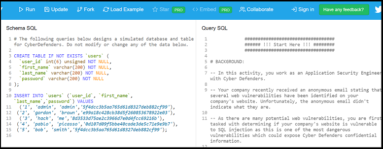
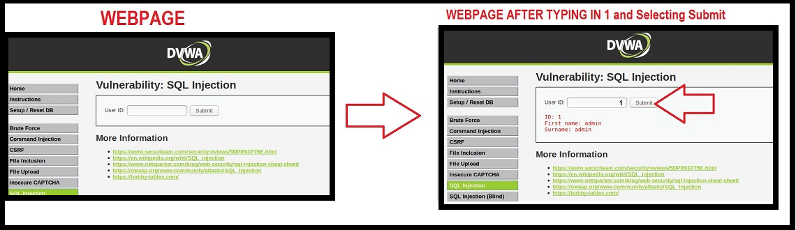

## Activity File: SQL Refresher and Unintended SQL Queries
 
In this activity, you will work as an application security engineer for the bioengineering company Replicants.

- Replicants recently received an anonymous email stating that several web vulnerabilities have been identified on the company website. Unfortunately, the anonymous email didn't indicate what they are.

- You are first tasked with determining whether the Replicants website is vulnerable to SQL injection. This is one of the most dangerous vulnerabilities and could expose confidential information. 

- You will test a page on the Replicants website that connects to their database, where an employee can confirm their first and last name by looking up their user id.

- Before testing for SQL injection directly on the webpage, you will need to design several SQL queries to test directly against the database, which is represented by a website called DB Fiddle. 

- The queries you design will be used in the next activity to create payloads to test for SQL injection vulnerabilities on the website.

### Setup

Begin by accessing DB Fiddle using the following link: [DB Fiddle: SQL Injection Practice](https://www.db-fiddle.com/f/htqLpVQnyTKRt7XRf7mHkL/31).

  - For the purposes of this lesson, the webpage will represent a mock version of the Replicants database where you can create and test several SQL queries.

  - On the left side of this page is the **Schema SQL** panel, which builds the mock database for Replicants. Do not modify any of the data within this section.

  - On the right side of the page is the **Query SQL** panel, which contains the steps to complete the activity, as well as where the queries are modified:
  
    
  
  - For additional context, the following image illustrates how the Replicants webpage pulls data from the database:
   
    

  - Note that you will access and interact with this webpage directly in the next activity.

### Instructions 

1. Locate the **Start Here** text on the top right of the DB Fiddle webpage.

2. Follow the directions on DB Fiddle to create five SQL queries. Note that the fourth and fifth steps are bonuses.
   
   - For reference, here is another [copy of the steps](activity_steps.txt).

3. Create and run each SQL query as directed.

Don't forget to keep these SQL queries. You will be using them in your next activity!

---

© 2021 Trilogy Education Services, a 2U, Inc. brand. All Rights Reserved.