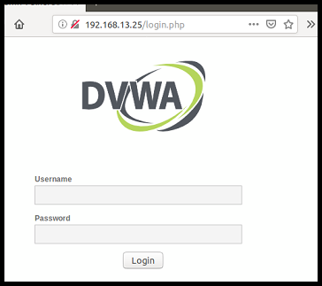
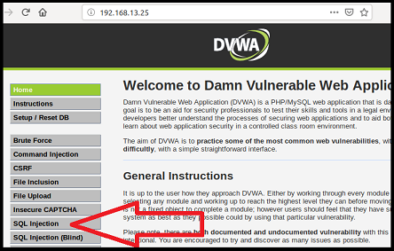
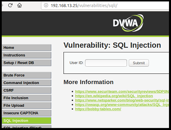

## Activity File: Testing SQL Injection on Web Applications

- In this activity, you will continue your role as an application security engineer with Replicants.

- You will use the SQL queries that you created in the previous activity (to modify the original request from your web application) to create payloads to test against your website.

- This will determine whether the anonymous email is correct and whether your website is vulnerable to SQL injection.

- Additionally, you are tasked with proposing mitigation strategies based on your findings.

## Setup

To launch the environment with several vulnerable web applications, complete the following:

   - Use the command line to Vagrant with the following command: `vagrant up`
   
   - Then, open terminal inside Vagrant and run the following on the command line: `cd ./Documents/web-vulns && docker-compose up`.

   - While the output might look like the task is still running, this script has launched several vulnerable web applications that we will use throughout the week.

   - Leave this page open and continue to the next step. 

To access the Replicants website, open a web browser within Vagrant and access the following webpage: <http://192.168.13.25/setup.php>.

  - On the bottom of this page, click **Create / Reset Database**.
 
   - This will configure the database for the application.
  
   - The message "Setup Successful" at the bottom of the page will indicate that it is complete. 

To log in to the Replicants website, access the following webpage: <http://192.168.13.25/login.php>.

  - This will take you to the webpage shown in the following image:

    

   - **Note**: While this webpage is labeled DVWA (Damn Vulnerable Web Application), for the purposes of this lesson, it represents the Replicants website.

  - Log in with the following credentials:
    
    - Username: `admin`
    
    - Password: `password`

  - This will take you to the page shown in the following image:

    

  - Select the SQL Injection tab indicated by the red arrow.

  - This will take you to the webpage to complete the activity, as shown in the following image:

    

### Instructions  

The SQL Injection page represents a page on the Replicants website. It is designed to return the user's first and last name when they enter their user id. When the user clicks on the submit button, the web application will execute SQL queries against a database similar to the DB Fiddle page we used previously.

Open the DB Fiddle page to reference the five SQL queries you designed and complete the following steps to test for SQL injection vulnerabilities. Then answer the mitigation strategy questions.

1. Test the intended use of the web application. 

    - In the first query, we used the number `1` as a payload that gets passed into the SQL query: 

      - `select first_name, last_name from users where user_id = '1'`

    - Test the payload on the web application by entering "1" in the User ID field and clicking Submit.

    - As the intended purpose of the web application, this action should return the first and last name associated with User ID = 1. 

    - Compare the results on the web application to your results on DB Fiddle; they should match up exactly.

2. Use an always true payload to test the unintended use of the web application. 

   - In the second query, note that the payload is everything BETWEEN the single quotes.

     - **Note**: Do NOT include the first or last single quote when you copy over your payload!

   - Copy this payload from DB Fiddle, enter it into the web application, and click Submit.
   
   - Compare the results on the web application to your results on DB Fiddle; they should match up exactly.
 
   - The success of this payload is your first indicator that this web application is vulnerable to SQL injection. 
 
3. Use another always true payload to test the unintended use of the web application.

    - Submit the payload from the third query into the web application. 

    - The payload is everything BETWEEN the single quotes. Do not include the first and last single quote in your payload. 
    
    - Compare the results on the web application to your results on DB Fiddle; they should match.

   - This is another indicator that this web application is vulnerable to SQL injection, as you were able to cause unintended results by modifying the user input.

4. **Bonus**: Use a payload to pull data from hidden fields. 

    - Submit the payload from the fourth query into the web application. Compare the results with the results on DB Fiddle. 

    - The payload is everything BETWEEN the single quotes. Do not include the first and last single quote in your payload. 
    
    - This is an indicator that your web application has a MAJOR SQL injection vulnerability, in which a malicious user can access confidential information from other fields.

5. **Bonus**: Use a single payload to pull the first name, last name, and password from the table.

    - The payload is everything BETWEEN the single quotes. Do not include the first and last single quote in your payload. 
      
    - Submit the payload from the fifth query  into the web application. Compare the results with the results on DB Fiddle. 

6. Answer the following mitigation strategy questions: 

    - After testing and confirming that this web application is vulnerable to SQL injection, provide a summary for your manager of the potential impacts if a malicious actor attempts SQL injection on this web application.

    - Based on the malicious payloads you created, recommend a mitigation strategy to the team that built this web application, to prevent a malicious user from inputting malicious payloads. 

      - **Note**: This recommendation does not need to be overly technical.

---

© 2021 Trilogy Education Services, a 2U, Inc. brand. All Rights Reserved.
