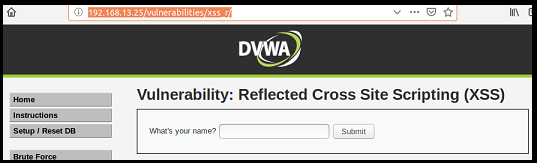
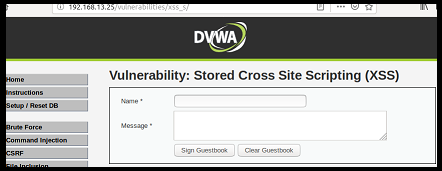

## Activity File: Testing XSS on Web Applications

- In this activity, you will continue your role as an application security engineer at Replicants.

- You've just tested the company's main production website and discovered that SQL injection vulnerabilities exist.

- Alarmed by these findings, your manager has asked you to test two other webpages on the Replicants website for the following cross-site scripting vulnerabilities:

  - Reflected cross-site scripting

  - Stored cross-site scripting

- Your manager has asked you to propose a mitigation strategy based on your findings.

## Part 1: Testing Reflected Cross-Site Scripting

### Setup

On the webite from the previous activity, <http://192.168.13.25>, select the **XSS (Reflected)** option on the left side of the page.

  - You can access the webpage directly with this link: <http://192.168.13.25/vulnerabilities/xss_r/>.
  
  - The page should look like the following image:

    

-  If you have any issues accessing this webpage, repeat the [activity setup steps from the previous activity](../../06_SQL_Injection/Unsolved/README.md).

### Instructions

The XSS (Reflected) page represents a page within the Replicants website. It is designed to display a friendly greeting to the user. The user enters their name and selects Submit. The webpage returns a greeting to the user: "Hi, name." 

Complete the following steps to test for reflected cross-site scripting vulnerabilities:

1. Test the intended use of the web application.

    - Input a name and press Enter. 

    - The page should return, "Hi, name."

2. View the source code of the page.

    - Right-click the webpage and select **View Page Source**.

    - CTRL+F (Command + F for Mac) and search for the name you entered.

    - The following line of HTML code should be highlighted: `<pre>Hello name</pre>`.
  
3.  Modifying the HTML code with a bold statement.

    - Return to the XSS (Reflected) webpage and enter a name in bold. You will need to use HTML bold tags. 

      - Refer to the following resource for assistance: [W3Schools: HTML Text Formatting](https://www.w3schools.com/html/html_formatting.asp).

    - Submit the name and view the results. 

4. Return to the source code. 

    - Right-click the webpage and select **View Page Source**.

    - CTRL+F and search for the name you entered. 

    - The following line of HTML code should be highlighted: `<pre>Hello <b>name</b></pre>`.

    - Note that the bold tags you added confirmed that the webpage's HTML can be modified by user input. This suggests that the webpage might be vulnerable to scripts added into the HTML.

    - Let's return to the webpage and test this.
  
5. Create an unintended pop-up. 

    - Return to the XSS (Reflected) page.

    - Add a payload  with an alert script that creates an a pop-up that reads, "Hi, name!"   
  
    - Press Enter. A pop-up should display. 

    - This confirms that the webpage is vulnerable to reflected cross-site scripting. 
    
    - View the source code and note how this changed after your script was added.
  
    - Let's try something a little more malicious and determine whether we can display your session cookies.
  
6. Add a payload that displays sessions cookies. 

    - Return to the XSS (Reflected) webpage. 

    - In the same input field, create a payload for an alert script that creates a pop-up that displays your session cookies.

    - **Hint**: You might need to search Google for an "XSS cookie display" payload.
  
    - Press Enter. A pop-up with your session cookies should be displayed.

    - View the source code and note how this changed after your script was added.
  
 Now let's test for stored cross-site scripting.
  
## Part 2: Testing Stored Cross-Site Scripting

### Setup

On the webpage <http://192.168.13.25>, select the **XSS (Stored)** option from the panel on the left side of the page. Alternatively, you can access the webpage directly using this link: <http://192.168.13.25/vulnerabilities/xss_s/>.
  
-  The page should look like the following image:

   

-  If you have any issues accessing this webpage, repeat the [activity setup steps from the previous activity](../../06_SQL_Injection/Unsolved/README.md).

### Instructions 

The **XSS (Stored)** page that you have accessed represents another page within the Replicants website. This webpage is a guestbook where users can post a message to be viewed by any other user who visits the page.

- The user enters their name and message. After they click Submit, the webpage will display the data.

- Subsequent messages will be added to the guestbook.

- There is also an option to clear all the messages by selecting **Clear Guestbook**.

Complete the following steps to test for stored cross-site scripting vulnerabilities on this page:

1. Test the intended use of the web application.

   - Type a name and a message. Press Enter.
   
   - Note that the page, as intended, displays that message. For example: 

      - Name: Robert
   
      - Message: Replicants is Great 

   - Let's view the source code to see how this is displayed.   
         
2. View the source code of the page.

    -  Right-click the webpage and select **View Page Source**.

    - CTRL+F and search for the name you entered. 

    - The following line of HTML code should be highlighted: `
Name: Robert Message: Replicants is Great 
`.
    
    - Note that what you just entered as the name and message is added into the HTML source code.
  
    - Let's now test whether we can input a cross-site scripting payload.
  
3. Create a XSS payload that creates a pop-up. 

    - Return to the XSS (Stored) webpage.

    - In the name field, enter a name. 

    - In the message field, create an unintended payload for an alert script that creates a pop-up that reads, "You have been hacked!"

      - **Hint**: This is the same script used in the Reflected XSS activity.
  
    - Press Enter. The pop-up should display. 
  
    - View the source code and note how this changed after the script was added.

    - Let's try something a little more malicious and try to display session cookies from this page.
  
4. Create a XSS payload that displays session cookies from this page. 

   - Return to the XSS (Reflected) webpage.

   - In the name field, enter your name.

   - In the message field, create an unintended payload for an alert script that creates a pop-up that displays your session cookies.

   - Press Enter. A pop-up with your session cookies should be displayed.

   - View the source code and note how this changed after your script was added.
  
## Part 3: Mitigation Strategy

Answer the following questions as if you were speaking to your manager: 

1. How might a malicious user take advantage of the vulnerabilities that you just uncovered? What are the potential impacts?

2. How might you mitigate against the reflected and stored vulnerabilities that you just exploited?

## Bonus: Circumventing XSS Mitigation Strategies

In the previous section, you provided a recommendation to mitigate against the XSS vulnerabilities that you exploited.

- In this Bonus activity, a developer has applied a mitigation strategy to protect against XSS. It might (or might not) be similar to your recommendation.

- As an application security analyst, you are tasked with launching an exploit to bypass this mitigation.
  
### Setup 

- On the webpage <http://192.168.13.25>, elevate the security level of the application: 
    
    - Select **DVWA Security** on the tab on the left.

    - Change the Security Level to Medium and click Submit.

- Return to the **XSS (Reflected)** tab from the options on the left side of the page, or access the webpage directly using this link: <http://192.168.13.25/vulnerabilities/xss_s/>.

### Instructions 

1. Test your last exploit.

   - Note that this is the same page where you completed the XSS reflected attack, except that on the Medium security level, a mitigation has been applied.
   
   - Let's test this using the alert payload that you previously used:
      
      - ``
  
   - Select Submit.
  
   - Note that a pop-up does not appear. The XSS vulnerability has been mitigated. Additionally, note that the following was returned:
   
        - `Hello alert("Hi Robert")`
  
   Let's determine whether we can find a way to bypass the mitigation that was applied.
  
2. Bypass the mitigation. 

   - Now that we have determined that the payload we previously used will not work on the Medium security level, we need to find a way to bypass the mitigation that was applied.

    - You are tasked with finding a payload that can create the pop-up and bypass this new mitigation.

    - **Hint**: View the data that was displayed and compare it to the payload that was entered.
      
      - This will help determine the current mitigation that is being used.
      
      - Feel free to attempt a variety of payloads to determine a way to bypass the mitigation.

___

© 2021 Trilogy Education Services, a 2U, Inc. brand. All Rights Reserved. 
