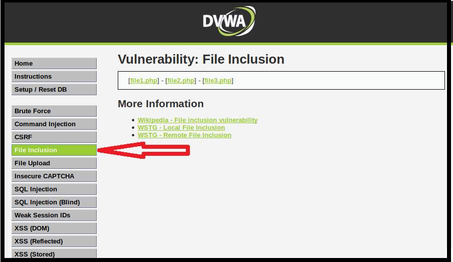

## Activity File: Directory Traversal 

In this activity, you will continue your role as an Application Security Engineer with Replicants.

- In this activity, you will continue your role as an application security engineer at Replicants.

- So far, you've tested the company's main production website and confirmed that there are SQL injection and cross-site scripting vulnerabilities.

- Your manager is now concerned that other vulnerabilities might exist in the pages of your web application that work with the back-end components.

- More specifically, your manager would like you to first test for **directory traversal** vulnerabilities and propose a mitigation strategy.

### Setup 

- Access Vagrant and open a browser.

- Return to the webpage from the previous activity: <http://192.168.13.25>.

  - Select the **File Inclusion** option from the options on the left side of the page.

    - Note that even though you will be on the **File Inclusion** page, you will first conduct a directory traversal attack.

    - Alternatively, access the webpage directly at <http://192.168.13.25/vulnerabilities/fi/?page=include.php>.
  
  -  The page should look like the following image:

      

  - **Note**: If you have any issues accessing this webpage, you might need to repeat the Activity Setup steps from the previous activity: [GitHub: SQL Injection](../../1/Activities/06_SQL_Injection/Unsolved/README.md).

### Instructions 

The webpage you have accessed represents a page within the Replicants website. This webpage is designed for a user to access the following three files that exist on the Replicants web server:
   
   - `File1.php`
   
   - `File2.php`
   
   - `File3.php`

The user selects a link to one of these three files, and the contents of that specific file appear on the webpage.

Complete the following steps to test for directory traversal vulnerabilities.

1. Test the intended use of the web application.

    - View the contents of `File1.php`.
      
      - Select the link to `File1.php`, and note the following:
      
          - The URL changes to <http://192.168.13.25/vulnerabilities/fi/?page=file1.ph>.
          
          - Note that the parameter references the file that was selected: `?page=file1.php`.
        
          - The content on the webpage was displayed:
      
              `Hello admin
              Your IP address is: 192.168.13.1`
          
      - Select the other links (`File2.php` and `File3.php`) and note their URL and webpage changes.
      
      - Note that the intended purpose of this application is to provide a user access to those three files only. 

2. On Vagrant, open the terminal. 

      - Connect to the container of the Replicants webpage:

        - `docker exec -it dvwa bash`
      
      - Once you have connected to the container, run the following command to access the directory where `file1.php`, `file2.php`, and `file3.php` are located:

        - `cd /var/www/html/vulnerabilities/fi`

      - View the files in this directory using the `ls` command.

        - Note that you should see the files `file1.php`, `file2.php`, and `file3.php`.

      - View the contents at the top of `file2.php`:
        
        -  `head file2.php`
      
        - Note how this file contains HTML that matches what you saw on the Replicants website when you clicked on `file2.php`:
          
          - `<em>I needed a password eight characters long so I picked Snow White and the Seven Dwarves.</em>\" ~ Nick Helm  `

        - Take note of the other `file<#>.php` file located in this directory. 

3. Test the unintended consequences of this application.
 
    - We saw another `file<#>.php` file in that directory. That file does not have a link to access on Replicant's webpage. Try to access it by modifying the parameter of the URL.

4. Traverse through other paths. 

    - In Part 3, you modified the parameter of the URL to view a hidden file. Try to access the `passwd` file by modifying the parameter of the URL again.

    - **Hint**: Use the dot-slash technique.
    
    - **Hint**: To determine how many dot-slashes to use, run `pwd` from the command line and count the directories to return to `/var`.

    - By using this method, you have completed a **directory traversal attack**. 
  
5. **Bonus**: Previously, you were modified the URL to view the file `passwd`. Try to access other files (such as the hosts, group, or networks) using the same techniques.

    - If you can access the files, research online and document what data those files contain.

6. Answer the following mitigation strategy questions: 

    - Describe to your management how a malicious user could take advantage of the vulnerabilities that you just exploited. Be sure to include the potential impact.

    - Describe how you would mitigate the vulnerabilities you just exploited.

___

© 2021 Trilogy Education Services, a 2U, Inc. brand. All Rights Reserved. 
