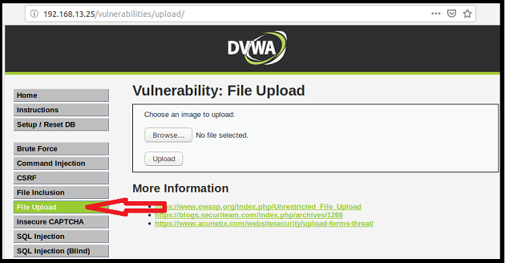

## Activity File: Local File Inclusion 

- In this activity, you will continue your role as an application security engineer with Replicants.

- You've just tested the company's main production website and confirmed that there is a back-end component vulnerability (**directory traversal**).

- Your manager is now concerned that there might be other back-end component vulnerabilities.

- More specifically, your manager would like you to test for **local file inclusion** vulnerabilities.

- Your manager has asked you to propose a mitigation strategy based on your findings.

## Setup

- Access Vagrant and open a browser.

- Return to the same webpage from the previous activity: <http://192.168.13.25>.

  - Select the **File Upload** option from the menu on the left side of the page
    
    - Note that even though you will be on the **File Upload** page, you will first conduct a file inclusion activity.

  - Alternatively, you can access the webpage directly by using this link: <http://192.168.13.25/vulnerabilities/upload/>.
  
-  The page will look like the following image:

    

- **Note**: If you have any issues accessing this webpage, you might need to repeat the Activity Setup steps from this previous activity: [GitHub: SQL Injection](https://github.com/coding-boot-camp/cybersecurity-v2/blob/15.1_V2_Update/1-Lesson-Plans/15-Web-Vulnerabilities-and-Hardening/1/Activities/06_SQL_Injection/Unsolved/README.md).

### Instructions 

The webpage you have accessed represents a page within the Replicants website. This webpage is designed for a user to upload an image to the Replicants web server. Once the image has been uploaded, the user can access a directory to view their uploaded image. Complete the following steps to test for local file inclusion vulnerabilities.

1. Test the intended use of the web application.

    **Uploading the Image**

    We will first see how to upload and view an image from the file upload webpage.

      - First select Browse to find the image that you want to upload.

      - By default, this should take you to the desktop of your Vagrant filesystem.

        - If it takes you to a different location, select Desktop.

    - There will be a file on your desktop called `image.jpg`.
    
      - Select that image.

    - Back on the file upload page, you should see the `image.jpg` file name that you selected.

      - To upload the file, select Upload.

    - You should then receive a success message that states:

      `../../hackable/uploads/image.jpg succesfully uploaded!`
  
    **Viewing the image**  

    - Note that the previous success message indicates where the file has been uploaded: 

      - `../../hackable/uploads/image.jpg`

    - Access the image by replacing the `#` at the end of the URL with the complete location indicated above.

      - `192.168.13.25/vulnerabilities/upload/../../hackable/uploads/image.jpg `

      - Note that your browser will automatically update the URL to the direct location of the image:

        - `http://192.168.13.25/hackable/uploads/image.jpg`

    - You should see the image of a squirrel.

      - Note that this is how the application is intended to work, by providing a user an option to upload and view an image!

          - There will be a file on your desktop called `image.jpg`.

          - Select that image.

        - Back on the file upload page, you should see the `image.jpg` file name that you selected.

          - To upload the file, select Upload.

        - You should then receive a success message that states the following:

          `../../hackable/uploads/image.jpg succesfully uploaded!`
        
      - Note that this is how the application is intended to work, by providing the user with an option to upload and view an image!

2. Test an unintended function of the application by loading a malicious PHP script.

    - Note that you just tested how the application is designed to load and view an image.

    - Let's now view a malicious PHP script that we can upload, instead of an image.

    - The malicious PHP script, called `script.php`, has been placed on your desktop.

      - To view this script, find it on your desktop and double-click on it to open:
      
                  <?php
                  $command = $_GET['cmd'];
                  echo system($command);
                  ?>

      - While understanding the exact syntax is not important for now, just note that the contents in the script are designed to run a PHP script to execute a user command.

    - Return to the file upload webpage and follow the same steps again, but this time select and upload the file `script.php`.

      - Note that this script will be uploaded to the same location as the image you previously uploaded.

3. Run command-line commands with your PHP script.

    - Let's now see if we can run command-line commands against the Replicants web server!

      - Change the URL to access the script that you just uploaded.
      
    - Modify the URL again to run the several Linux commands:

      - **Hint**: Review your class slides to see how to modify the URL to run command-line commands.

      - Run the following Linux commands and take note of the results:

        1. `ls`

        2. `whoami`
        
        3. `pwd`
        
        4. `ps`

    - **Note**: While this is a safe place to experiment with commands, DO NOT run commands that might delete or alter files that your system needs, such as `rm`, `mv`, or `rdmir`.

4. **Bonus**: Run commands to explore files with your PHP script.

    - Let's now see if we can run malicious commands to explore files within the Replicants web server.

      - By modifying the URL, access the script that you just uploaded.
      
    - Modify the URL to view the `/etc/passwd` file.

      - **Hint**: You will need to encode your payload, as the URL will not accept all characters, such as spaces.

      - Use the following webpage to help design your payload: [MeyerWeb: URL Encoder/Decoder](https://meyerweb.com/eric/tools/dencoder/).

5. Answer the following mitigation strategy questions:

    - Describe to your management how a malicious user can take advantage of the vulnerabilities that you just exploited. Be sure to include the potential impact.

    - Describe in plain language how you might mitigate the vulnerabilities that you just exploited.

---

© 2021 Trilogy Education Services, a 2U, Inc. brand. All Rights Reserved. 
