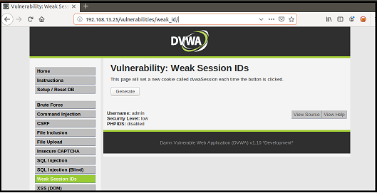
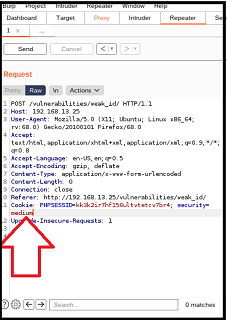

## Activity File: Analyzing Session Management Vulnerabilities with Burp Repeater 

- In this activity, you will continue your role as an application security engineer with Replicants.

- You've just configured Burp Suite to capture traffic from your web application.

- Now you are tasked with using Burp Suite to analyze session IDs that are generated from your application.

- You will determine whether the session IDs are not randomly generated and thus at risk for session hijacking.

- Additionally, you are tasked with proposing mitigation strategies based on your findings.

### Setup

- Access Vagrant and open a browser.

  - **Important**: Don't forget to make sure that your Foxy Proxy is disabled.

- Return to the same webpage from the previous day's activity: <http://192.168.13.25>.

  - Select the **Weak Session IDs** option from the menu on the left side of the page.

  - Alternatively, access the webpage directly by accessing this page: <http://192.168.13.25/vulnerabilities/weak_id/>.

    - **Note**: If you have any issues accessing this webpage, you might need to repeat the Activity Setup steps from the previous activity: [GitHub: SQL Injection Activity](https://github.com/coding-boot-camp/cybersecurity-v2/blob/15.1_V2_Update/1-Lesson-Plans/15-Web-Vulnerabilities-and-Hardening/1/Activities/06_SQL_Injection/Unsolved/README.md).

  - The page will look like the following image:

    

### Instructions 

The webpage you have accessed represents a page within the Replicants website. While this webpage is technically part of the Replicants website, it is designed to simulate the session ID created each time a different user logs into the application.

- **Important**: Make sure your security level on this webpage is shown as Low!

  - If it is not, select **DVWA SECURITY** from the menu on the left side of the page.

  - Then change your security level back to Low and click Submit.

- Complete the following steps to test for session management vulnerabilities.

  - Note that Steps 1 through 4 will be similar to the demonstration conducted by your instructor.

1. Enable the Burp proxy.

    - First, return to Burp. Under Proxy > Intercept, confirm that **Intercept is on**.

      - If you need a recap of these steps, refer to the first activity you completed: [GitHub: Configuring Burp](https://github.com/coding-boot-camp/cybersecurity-v2/blob/15.3_V2_Update/1-Lesson-Plans/15-Web-Vulnerabilities-and-Hardening/3/Activities/03_Burp_Suite_Setup/Unsolved/README.md).

        - Drop any existing captures by continuing to click Drop until the whole capture page is empty.

    - Return to your browser and enable the Burp option on Foxy Proxy.  

2. View the HTTP request with Burp Intecept.

   - The page states, "This page will set a new cookie called `dvwaSession` each time the button is clicked."

    - Let's now capture the HTTP request that is generated when we click the button.

      - Click the Generate button. 
    
      - Note that the loading bar on the browser tab should be spinning:
    
    -  Return to Burp Suite Intercept to view this HTTP request.
    
    -  Note that you should have an HTTP POST request similar to the following:

              POST /vulnerabilities/weak_id/ HTTP/1.1
              Host: 192.168.13.25
              User-Agent: Mozilla/5.0 (X11; Ubuntu; Linux x86_64; rv:68.0) Gecko/20100101 Firefox/68.0
              Accept: text/html,application/xhtml+xml,application/xml;q=0.9,*/*;q=0.8
              Accept-Language: en-US,en;q=0.5
              Accept-Encoding: gzip, deflate
              Content-Type: application/x-www-form-urlencoded
              Content-Length: 0
              Connection: close
              Referer: http://192.168.13.25/vulnerabilities/weak_id/
              Cookie: PHPSESSID=kk3k2ir7hf156ultvtetcv7br4; security=low
              Upgrade-Insecure-Requests: 1

3. Move the HTTP request to Burp Repeater.
        
    - Right-click on the Intercept page and select **Send to Repeater** (or press CTRL+R):

    - Note that now the Repeater icon color on your tool bar has changed from black to orange.

      - This indicates that the HTTP request has been sent to Repeater.
    
    - Click on the Repeater icon from your tool bar to view this HTTP request.
    
    - This should display the same HTTP POST request that you saw under Intercept.

4. Use Burp Repeater to view the HTTP response.

   - From the Repeater page, select Send to send the HTTP request.
   
      - After you select Send, the HTTP Response panel should appear on the right side of the Repeater page.

      - This data is the complete HTTP response sent back from the web server.

    - If you return to your browser, you will notice the loading bar in the browser tab is still spinning.
      
      - This means that even though the HTTP request was sent to the web server, and the web server returned the response to Burp, the response has not yet been returned to the browser.
    
    - Look at the line of the HTTP response that contains the session ID returned from the web server:
    
      - `Set-Cookie: dvwaSession=1`
    
    - Note that the first session ID is `1`.
    
    - Press the Send button again, then note how the session ID has changed:
    
      - `Set-Cookie: dvwaSession=2`
    
    - Press the Send button again several more times, and note that the session IDs increment by one digit each time.
    
    - Note that this illustrates the intended purpose of the application, to generate a different session ID every time a user selects Generate from the web application. 
    
      - Additionally, note that this is WEAK security, as an attacker could use the knowledge of how the session ID gets generated to hijack a user's session.

5. Determine the Medium-level session IDs.

    - Replicants has added more security to their web application and would like you to test whether the pattern by which the session IDs are being generated could be determined by an attacker. 

    - To test this added security, manually change the security level from Low to Medium from Burp Repeater:

      - Change `security=low` to `security=medium`:
      
        
      
    - Now press the Send button again and note how the session ID has changed in the HTTP response, to a 10-digit number:

      - Here is a sample (your number will be different): `Set-Cookie: dvwaSession=1612452171`.
    
    - Now press the Send button again and note how the session ID has changed in the HTTP response, to a different 10-digit number:
    
      - Here is a sample (your number will be different): `Set-Cookie: dvwaSession=1612452402`.
    
    - Continue to press Send to observe how the session IDs change each time. 
    
    - As a security analyst, you are tasked with determining whether the formula or method for generating each session ID can be predicted.     
    
      - **Hint**: While the Low level uses a mathematical formula (+1), to generate each session ID, the Medium level uses a different method.
    
      - **Hint**: Examine other fields in the HTTP response for clues.
    
    - Document the method used to generate these session IDs. 

6. Answer the following mitigation strategy questions:

    - Describe to your management how a malicious user could take advantage of the vulnerabilities you just exploited. Be sure to include the potential impact.

    - Describe in plain language to your manager how you would mitigate the vulnerabilities that you just exploited.

7. **Bonus**: Determine the High-level session IDs.

    - Replicants has added much stronger security to their web application and would like you to test whether the pattern by which the session IDs are being generated could be determined by an attacker. 
    
    - From Burp Repeater, manually change the security level from Medium to High:
    
      - Change `security=medium` to `security=high`.
    
    - Now press the Send button again and observe how the session ID has changed in the HTTP response, to 32 characters:
    
      - Here is a sample: `Set-Cookie: dvwaSession=c4ca4238a0b923820dcc509a6f75849b`.
    
    - Now press the Send button again and observe how the session ID has changed in the HTTP response to a different 32 characters:
    
      - Here is a sample: `Set-Cookie: dvwaSession=c81e728d9d4c2f636f067f89cc14862c`.    
    
    - Continue to press Send to observe how the session IDs change each time.   
    
    - As a security analyst, you are tasked with determining whether the formula or method for generating each session ID can be predicted.     
    
      - **Hint**: Note the length of the session ID.
    
    - Document the method used to generate these session IDs.

___

© 2021 Trilogy Education Services, a 2U, Inc. brand. All Rights Reserved. 
