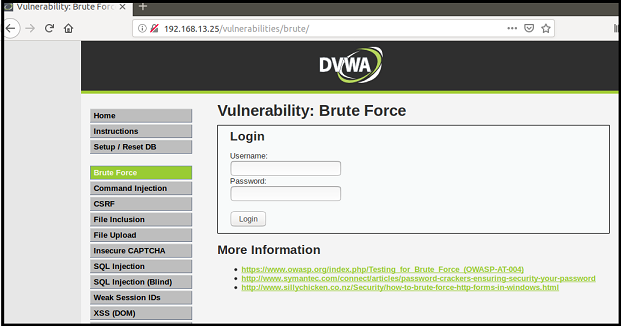
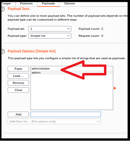
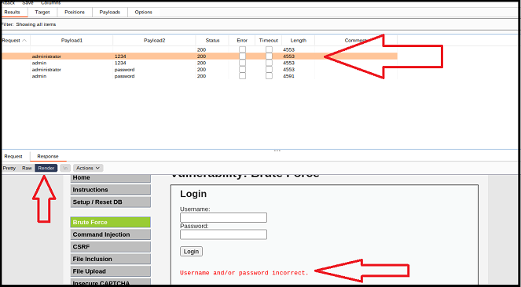

# Activity File: Analyzing Brute Force Vulnerabilities Using the Burp Intruder 

- In this activity, you will continue your role as an application security engineer with Replicants.

- You've just used Burp Suite and discovered session management vulnerabilities.

- Your manager is now concerned that the Replicants web application might have additional authentication vulnerabilities, and the anonymous tipster could exploit them.

- More specifically, your manager is very concerned that the administrators of the application might have chosen weak passwords for the administration login. 

- If an attacker brute force their way into the admin section of the application, they can potentially cause significant harm to Replicants' business.

- Your manager would like you to use Burp Suite to determine whether any of these administrators are vulnerable to a brute force attack.

- Additionally, you are tasked with proposing mitigation strategies based on your findings.

### Setup

- Access Vagrant and open a browser.

  - **Important**: Don't forget to make sure that your Foxy Proxy is disabled.

- Return to the same webpage from the previous day's activity: <http://192.168.13.25>.

  - Select the **Brute Force** option from the menu on the left side of the page.

  - Alternatively, access the webpage directly using this link: <http://192.168.13.25/vulnerabilities/brute/>.
  
-  The page should look like the following image:

    

  - **NOTE**: If you have any issues accessing this webpage, you might need to repeat the Activity Setup steps here: [GitHub: SQL Injection Activity](https://github.com/coding-boot-camp/cybersecurity-v2/blob/15.1_V2_Update/1-Lesson-Plans/15-Web-Vulnerabilities-and-Hardening/1/Activities/06_SQL_Injection/Unsolved/README.md).

### Instructions 

The webpage you have accessed represents a login page to the administrative section within the Replicants website. Complete the following steps to test for brute force vulnerabilities. Note that Steps 1 through 6 will be similar to the demonstration conducted by your instructor.

1. Enable the Burp proxy.

    - First, return to Burp Suite. Under Proxy > Intercept, confirm that **Intercept is on**.

      - If you need a recap of these steps, refer to the first activity: [GitHub: Configuring Burp](https://github.com/coding-boot-camp/cybersecurity-v2/blob/15.3_V2_Update/1-Lesson-Plans/15-Web-Vulnerabilities-and-Hardening/3/Activities/03_Burp_Suite_Setup/Unsolved/README.md).

        - Drop any existing captures by continuing to click Drop until the whole capture page is empty.
        
    - Return to your browser and enable the Burp option on Foxy Proxy.  

2. View the HTTP request with Burp Intecept.

    - Now you will test the intended purpose of the application by entering a username and password that will purposely fail.

      - In the username field, enter "test-user".
   
      - In the password field, enter "test-passwd".
    
    - Note that the purpose of inputting these values is to identify how they are added into the HTTP request.
    
      - Press Login.
    
    - Return to Burp Intercept to see the HTTP Request.
    
    - Note that the top line of the HTTP request contains the username and password that were entered:
    
      -  `GET /vulnerabilities/brute/?username=test-user&password=test-passwd&Login=Login HTTP/1.1`
  
3. Move the HTTP request to Burp Intruder.

    - Right-click on the Intercept page and select **Send to Intruder** (or press CTRL+I).

      - Note that after you select Send to Intruder, the Intruder icon color on your tool bar changes from black to orange.
      
      - This confirms that the HTTP request has been sent to Intruder!
    
    - Click on the Intruder icon from your tool bar to view this HTTP request.
    
      - This will take you to a page with four tabs on the tool bar:
    
        - Target
    
        - Positions
    
        - Payloads
    
        - Options

    - By default, the first page you will see is the **Target** tab, where the IP and port of the web server will be added automatically.   
    
    - Select the Postions tab on the tool bar.    
    
      - This page should display the same HTTP POST request that you saw under Intercept.

4. Configure the Burp Intruder positions.

    - This page is where you indicate the payloads  that you will change with each HTTP request.

    - Because you will be testing two payloads, the username and password, select the Cluster Bomb attack type.
    
    - Note that the HTTP request includes several **section sign** characters (`§`).
    
      - Burp uses these section sign characters to indicate the start and end of each payload that you might want to modify.
    
    - Burp has already guessed all four payloads that you might want to use. 
    
      - But you actually only want to use two, the username and password.
    
    - Clear out all of the section sign characters by clicking on **Clear §** on the right side of the page.
    
    - Create the first new payload by highlighting the value `test-user` and then clicking on **Add §**.

        - Be sure to not include the `=` or `&` signs in your data point.
    
    - Create the second new payload by highlighting the value `test-passwd` and then clicking on **Add §**.
    
    - Your Postions page should now look similar to the following:

              GET /vulnerabilities/brute/?username=§test-user§&password=§test-passwd§&Login=Login HTTP/1.1
              Host: 192.168.13.25
              User-Agent: Mozilla/5.0 (X11; Ubuntu; Linux x86_64; rv:68.0) Gecko/20100101 Firefox/68.0
              Accept: text/html,application/xhtml+xml,application/xml;q=0.9,*/*;q=0.8
              Accept-Language: en-US,en;q=0.5
              Accept-Encoding: gzip, deflate
              Connection: close
              Referer: http://192.168.13.25/vulnerabilities/brute/
              Cookie: PHPSESSID=mfubh6vmo9l19vioie07c1aaj7; security=low
              Upgrade-Insecure-Requests: 1
              
    - Note the following about the two payloads:
      
      - `§test-user§` is considered the Payload Set 1, as it comes first (starting from the top left).
      
      - `§test-passwd§` is considered the Payload Set 2, as it comes second (again, starting from the top left).
   
5. Configure the Burp Intruder payloads.

    - Now that you have indicated which payloads to use in your HTTP request, you can choose what will be placed inside them.

    - Select the Payloads tab.
    
    - Under **Payload set**, select 1 from the drop-down.
    
      - Remember that this indicates what will be placed in `§test-user§`.
    
    - Under **Payload set**, select **simple list**.
    
      - This indicates a list of usernames that we can use to test the brute force attack.
    
    - For the first test, let's try two usernames:
    
      - `administrator`
    
      - `admin`
    
    - Enter each one in the field to the right of the Add button.
    
      - Then click Add to add them to the box.  
    
    - The box should now contain both usernames, as shown in the following image:
      
      
      
    - Now repeat these same steps with the **Payload set** field set to 2, for the password.
    
    - Under **Payload set**, select 2 from the drop-down.
    
      - Remember that this indicates what will be placed in the `§test-passwd§` payload.
    
    - Under **Payload type**, select **simple list**.
    
      - This indicates a list of passwords that we can use to test the brute force attack.
    
    - For the first test, let's try two passwords:
    
      - `1234`
    
      - `password`
    
    - Enter each one in the field to the right of the Add button.
    
      - Then click Add to add them to the box.  

    - Note that, after you complete these steps, the payload count is displayed at the top of the page as 4.
    
      - This is because we add two possible usernames and two possible passwords.
      
6. Launch the brute force attack and analyze the results.

    - To launch the brute force attack, select **Start attack** at the top of your page.

      - If you receive a notice that you are on the community version of Burp, just click OK to bypass.

    - A new page will display the results of the four payload combinations that were run.
      
      - Note that each of them should have a HTTP response code of 200 (listed under Status), as well as the length of the HTTP response.
      
      - This doesn't mean that all four were successful logins. It means that you didn't get an HTTP error from the web server.

    - One way to view the responses is to render each HTML response to see what the webpage returned.
    
    - To view the results of the first payload combination, highlight the first combination:
    
      - Payload1: administrator

      - Payload2: 123456
    
    - On the bottom panel, change the view from Request to Response to view the HTTP response.
    
    - Directly below that option, change the value from Pretty to Render, to render the HTML on the page within Burp.
    
      - Scroll down on the image until you see the following message: "Username and/or password incorrect."
        
      

    - This indicates that the username/password combination of "administrator" and "1234 did not result in a successful login.

    Repeat these steps with the other payload combinations until you find the successful username/password combination.
    
      - Additionally, note whether there were any differences in the length of the HTTP response, to indicate a success vs. a failure.

7. Launch the brute force attack against other users.

    - Now that you know how to launch a brute force attack and determine whether an administrator's account can be accessed, you are concerned that other administrators' accounts might be vulnerable to a brute force attack.

    - Repeat the preceding steps to determine whether the other administrator accounts are vulnerable.

    - Here is a list of employee usernames (all lowercase) that have admin accounts: 

      - Gordon has the username of "gordonb".

      - Mr. Hack has the username of "1337".
      
      - Pablo has the username of "pablo".
      
      - Bob has the username of "smithy".

    - For the passwords, try to determine a payload list of passwords to hack into their accounts.
      
      - Here are a couple of hints to help you figure out their passwords:
      
        - Gordon likes Marvel characters.
      
        - Mr. Hack is a huge fan of Stephen King movies.
      
        - Pablo is always traveling to different Carribean islands.
        
        - Bob is always listening to Van Halen songs.
          
8. Answer the following mitigation strategy questions:

    - Describe to your management how a malicious user could take advantage of the vulnerabilities that you just exploited. Be sure to include the potential impact.

    - Describe in plain language how you would mitigate the vulnerabilities that you just exploited.

___

© 2021 Trilogy Education Services, a 2U, Inc. brand. All Rights Reserved. 
