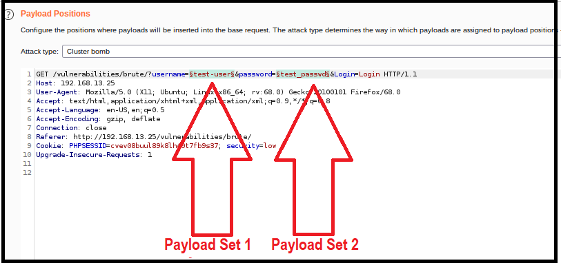

# 15.3 Student Guide: Web Application Tool Time
 
### Overview

Today's class is the final part of our introduction to web vulnerabilities. You will learn how to use tools to determine and automate the discovery of vulnerabilities that exist within a web application. The lesson will introduce web proxies and Burp Suite. You will use Burp Suite to exploit broken authentication vulnerabilities by conducting attacks such as session hijacking and brute force attacks. Additionally, you will learn mitigation methods used to protect against these exploits.

### Class Objectives

- Identify ways in which web application security tools can assist with testing security vulnerabilities.

- Configure Burp Suite and Foxy Proxy to capture and analyze an HTTP request.

- Identify session management vulnerabilities using the Burp Suite Repeater function.

- Conduct a brute force attack against a web application login page with the Burp Intruder function.

### Slideshow

-  [15.3 Slides](https://docs.google.com/presentation/d/1GwhlodG_oNQrSCRrZGmsstLEDbyugtRwY0v8CP2DrkY/edit#slide=id.gc4acecc769_0_7).

---

### 01. Introduction to Attacking Web Applications with Security Tools 

Recap of the concepts covered in the last class:

- **Back-end component vulnerabilities** are vulnerabilities that exist within the back-end components of web application servers.

  - Back-end components apply the business logic, or how the application works. They can include the following:

    - Server content management and access control

    - Back-end languages like PHP and Java

- **Directory traversal** is a web app back-end component vulnerability in which an attacker accesses files and directories from a web application outside a user's authorized permissions. 

  - In a directory traversal attack, attackers can modify the user input, using a **dot-slash method**, to access unintended files in other directories.

- **Local file inclusion**, or **LFI**, is another web app back-end component vulnerability, in which an attacker tricks the application into running unintended back-end code or scripts that are LOCAL to the application's file system.

  - An example of a back-end coding language that can be used is **PHP**.

  - LFI is typically conducted by an attacker uploading a malicious script into the web app's LOCAL file system, using the file upload functionality.

    - After successfully completing the upload, the attacker can arbitrarily execute command-line code with that script. 

    - Remotely executing command-line code is defined as **remote code execution**.

- **Remote file inclusion**, or **RFI**, is a back-end component web app vulnerability in which an attacker tricks the application into running unintended back-end code or scripts&mdash;similar to LFI, except that the scripts are REMOTE to the application's file system.

  - RFI is typically conducted by an attacker modifying the URL to reference a REMOTE malicious script.

    - After successfully referencing the script, the attacker can arbitrarily execute command-line code with that script. 

    - Because the attacker can remotely execute command-line code, this is also considered **remote code execution**.

- Directory traversal, LFI, and RFI all fall under the OWASP risk **broken access control**.

  - Per [OWASP](https://owasp.org/www-project-top-ten/2017/Top_10), broken access control is explained as follows: 

     - "Restrictions on what authenticated users are allowed to do are often not properly enforced. Attackers can exploit these flaws to access unauthorized functionality and/or data, such as access other users’ accounts, view sensitive files, modify other users’ data, change access rights, etc."
 
**Web Application Security Tools** 
 
In the last two classes, we have covered several different vulnerabilities (SQL injection, XSS, directory traversal, LFI, and RFI), as well as methods to exploit them.

  - Note that we exploited each of these vulnerabilities by directly interacting with the web application. For example:

    - For **SQL injection**, we interacted with the web application by inserting a malicious SQL script payload into an input field.

    - For **LFI**, we interacted directly with the web application by uploading a malicious PHP script.
  
While we successfully exploited these web app vulnerabilities with direct interaction with the web application, sometimes security professionals run into certain challenges during their testing.

For example:

- The following image shows a recap of the SQL injection attack that was demonstrated on the first day of this unit:

   

    - This image represents where we used the always true payload (`jsmith OR '1' = '1`) to conduct a SQL injection attack and displayed all the contents from a database table.
  
Note that while we successfully conducted this SQL injection attack on the first attempt, most security professionals have to try many different payloads before determining which payload works.

  - For example, a security professional might have to try lots of different types of payloads, such as the following:

    - `jsmith" or true--`

    - `jsmith OR "1" = "1`
    
    - `jsmith -- OR '1' = '1`
    
    - `jsmith') or true--`
    
 The challenge is that it is very time-consuming and inefficient for the security professional to manually enter one payload at a time and examine each individual result.

 - Fortunately, there are web application security tools that can help you solve challenges like this.
 
**Web application security tools** can assist security professionals by automating testing processes.

- Web application security tools can also assist with capturing, displaying, and modifying web application requests and responses.

- Certain web application security tools have built-in features that are designed to test for certain web app vulnerabilities.  

In today's lesson we will be introducing and demonstrating a popular web application security tool that offers all three of the preceding features: **Burp Suite**.

- Additionally, we will be demonstrating how Burp Suite can be used to exploit vulnerabilities that fall under the OWASP risk **broken authentication**.
  
  - **Broken authentication risks** are risks that permit an attacker to either view or bypass the authentication methods that are used by a web application.
      
**Class Overview** 
  
Today's class will cover how to use Burp to exploit two broken authentication vulnerabilities. The class will proceed as follows:

 - We will begin with introducing **Burp Suite** and **Foxy Proxy** and how to configure them to capture and analyze HTTP requests and responses.

 - Then we will learn how to use the **Burp Repeater** feature to determine session hijacking vulnerabilities.

 - Lastly, we will show how to use the **Burp Intruder** feature to conduct an automated brute force attack.
  
| :warning: **IMPORTANT HEADS UP**: :warning: |
|:-:|
| The techniques we will learn throughout this unit can be used to cause serious damage to an organization's systems. This is ILLEGAL when done without permission. All of the labs we provide are safe locations to test the methods and tools taught during the week. 
NEVER apply any of these methods to any web applications you do not own or do not have clear, written permission to be interacting with. |

Make sure to cover the daily objectives and answer any questions before proceeding on to the first topic of the day. 
    
### 02.  Introduction to Web Proxies and Burp Suite (0:15)

In last week's class, we illustrated how the browser, using a web application, interacts with the back-end web server by using HTTP requests and responses.

- For example, let's say that a user wants to view a picture of a car by clicking on a link on a website.

  - A user's browser (the client) requests an image of a car to be displayed with an HTTP request.

  - The web server (the server) responds with that car image by sending an HTTP response.
  
  - The browser receives the HTTP response and renders the image of the car to the user.

- The following image illustrates the HTTP request-response cycle:
    
   
    
Behind the scenes in this process, HTML requests and responses are constantly exchanged between the browser and the web server.

  - Note that security professionals often need to examine and modify these raw HTML requests and responses to test for security vulnerabilities.
 
**Web Proxy** 

Security professionals can capture and view these requests and responses by using a **web proxy**. Introduce web proxies by covering the following:

  - A **web proxy** is an intermediary between the client and the server.

  - In its simplest terms, internet traffic flows through the proxy on the way to its intended destination.

  - Web proxies can be used for the following scenarios:

    - By organizations, to monitor and block harmful web traffic, as some web proxies can be configured to block specific websites.

    - By individuals, to provide themselves anonymity when using the internet, as some web proxies can change the source IP address.
  
  - The following image show how the client's request for the car image and the server returning the car image flows through the proxy:
   
     
   
- Some web proxy tools can also **intercept** and hold the requests or responses before passing them along to their destination.

  - Security professionals use this intercept functionality to analyze or modify the raw HTTP requests and responses.

  - The security tool that we will be using in the class, which has this intercept functionality, is called **Burp Suite**.
    
### Burp Suite 
   
**Burp Suite** is a web application security tool that lies between your browser and your target application.

  - Burp Suite intercepts raw HTTP traffic from the browser or the server.

    - This means that it functions as a web proxy.

  - Burp offers many additional features and capabilities to allow a security professional to analyze, modify, and automate the HTTP traffic before passing it along to its final destination.

  - We can only cover a few of its many features in class.

    - If you want to learn about all of Burp's features, refer to the following resource: [PortSwigger: Burp Suite tools](https://portswigger.net/burp/documentation/desktop/tools).

  - In this lesson, we will be using the free version of Burp Suite, called the **Burp Suite Community Edition**.

    - There are paid versions, **Burp Suite Pro** and **Burp Enterprises**, that offer many additional features that we will not use in this class.

**Burp Demonstration**

In the next demonstration, we will complete the following steps to configure Burp to capture and inspect a simple HTTP request.

  1. Start and access Burp Suite.

  2. Navigate Burp Suite.
  
  3. Configure the proxy on Burp Suite.
  
  4. Configure Foxy Proxy on your browser.
  
  5. Enable Foxy Proxy to send traffic to Burp Suite.
  
  6. View the captured traffic on Burp Suite.
  
#### Part 1: Launch and Access Burp Suite

1. We will begin by launching and accessing Burp Suite. 

    - Open a terminal within Vagrant and run the command `sudo burpsuite`, then press Enter.
    
    - This will open the **Burp Suite** application:
  
      
  
2. On the first page of Burp Suite, select **Temporary project** from the list of options. Select Next on the bottom right of the page.
  
     

   - :warning: If you encounter any pop-ups about updating Burp Suite, DO NOT update. Cancel the pop-up.
  
3. On the second page, select **Use Burp defaults** from the list of options. Select Start Burp on the bottom right of the page.

   - Do not select any other options on this page:
  
     
  
   - The Burp Suite Dashboard will appear once you have successfully accessed Burp Suite. 

   - The following image illustrates the page that should be displayed:
  
     
  
#### Part 2: Navigate Burp Suite
  
4. Now we will navigate the Burp interface to access Burp features. 

   - We are currently on the Burp Suite Dashboard. 
   
    - :books: Note that features on the Burp Suite Dashboard are outside the scope of the class, but if students want to learn about them, you can send them the following link: [PortSwigger: Burp Suite Dashboard](https://portswigger.net/burp/documentation/desktop/dashboard).

    
  
   - We will use the following three features, which you will find to the right of the Dashboard tab:

      - Proxy
   
      - Intruder
   
      - Repeater
   
   - These features contain their own tabs as well. For example, Proxy contains the following sub-options:

      - Intercept

      - HTTP history
      
      - WebSockets history
      
      - Options
    
       

   - In the demonstrations and activities, you will be accessing several sub-options.
 
#### Part 3: Configure the Proxy on Burp Suite
 
5. We will now navigate the various features within Burp. Let's begin by configuring the proxy to capture a HTTP request.

    - Select the Proxy tab from the tool bar at the top of the Burp window.

    - When you open the Proxy feature, you will be taken to the default sub-option Intercept.

    - On this page, confirm that Intercept is on. You should see a gray button that reads **Intercept is on**:
 
       
 
    - Note that when Intercept is on, the traffic will be captured and held.

    - When Intercept is off, the traffic will flow right through to its destination.

   - If the button says **Intercept is off**, click the button to turn it back on.

6. Under Proxy, select the Options tab.

    - Under Proxy Listeners, confirm that you have the interface `127.0.0.1:8080` set up, with the Running option checked.
     
     - The following image illustrates how the listener should be set up.
     
     - Note that this is the default proxy setup in Burp.
   
      
     
   - This means that Burp will listen for traffic directed to the following:
     
     - IP: `127.0.0.1` (your localhost)
     
     - Port: `8080`
         
 #### Part 4: Set Up the Proxy on Firefox
  
7. Now that the proxy is configured to listen for web traffic, we need to configure the browser to send the traffic to this IP and port. 

   - Begin by opening the Firefox browser. You can open Firefox from the Vagrant menu or type "firefox" in your terminal.

   - Next we need to add a free add-on browser feature called **Foxy Proxy**.

   - In your browser, search for "Foxy Proxy":

       

   - It should be the first result listed in a Google search. Select that option, which should take you to a page like the one shown in the following image:
    
       
    
   - Select **Add to Firefox**.
      
      - If a pop-up appears on the top of your screen, select **Add** to proceed.
     
   - Once you have added it, you will see the Foxy Proxy icon in the top-right corner of your browser:
    
      
    
8. Let's configure Foxy Proxy to send the web traffic to Burp Suite.

   - Click on and open the Foxy Proxy add-on.

   - Within the Foxy Proxy window that opens, select Options.
  
      
  
   - This will take you to a page where you can create the various proxy options to send your traffic to.

   - Select Add on the top left, to go to the Add Proxy page.
  
      
  
   - Under Title, enter "Burp". 

    - On the right, update the following fields to match what we configured in Burp:

      - Proxy Type: `HTTP`

      - Proxy IP address or DNS name: `127.0.0.1`
      
      - Port: `8080`
    
    - Leave the rest of the fields blank.
   
   - Select Save on the bottom right to save your proxy:

     

   - After selecting Save, you should now see your new Burp proxy option listed on the Options page:
  
     

    - Burp is not yet enabled.

#### Part 5: Capture Proxy Traffic from Your Browser

9. Now that we have configured the proxy settings on Burp and Foxy Proxy, let's capture the first HTTP traffic request!

   - Open a new tab on your browser. The webpage will look something like the following image:
   
     
  
   - Click the Foxy Proxy icon and select the proxy that you just configured: Burp/Burp Suite.

     - A check mark will appear to the left of that option once you have selected it. This green icon indicates that all future traffic will be forwarded to Burp Suite!
  
       
       
10. Let's send the first HTTP request to Burp. 
     
   - From the webpage, enter the URL "www.example.com" and press Enter.
   
   - Notice how, after you enter the URL, the screen turns blank and the page appears to be spinning.

     - The bottom of the webpage states, **Waiting for www.example.com...**
   
     - This indicates that the HTTP request has been sent to Burp and the browser is awaiting a response:
   
       
      
      - Burp has intercepted and hung on to the HTTP request! 
   
#### Part 6: View the Captured Traffic from Burp Suite
     
11. Return to Burp Suite and find the intercepted traffic.

    - Select Proxy on the primary tool bar.
    
    - Within Proxy, select Intercept.
    
    - Your captured HTTP request will appear:
    
       
    
    - Look at the `Host` line of your HTTP request.
    
     - **Important**: It is very likely that your Firefox browser sends requests looking for WiFi networks to log into. You will notice this if the HTTP traffic you see shows the host as `detectportal.firefox.com`.

     - To prevent Burp from capturing these requests, right-click on the HTTP traffic and select **Don't intercept requests** > **To this host**.

       - This will prevent Burp from capturing future requests. 
       
        
       
   - You may have many of these captured `detectportal` requests. To remove them you can do one of the following:

      - Continue to select **Drop** from the Intercept page until the host of your HTTP traffic is `www.example.com`.
        
         
   
      - Alternatively, toggle the **Intercept is on** button to **Intercept is off**, then back to **Intercept is on** again. This will clear all the captured requests.

     - Note that with this method, you will need to return to the browser and re-enter "example.com" in the URL to create a new capture.
     
   - You have successfully captured the HTTP traffic request when the HTTP traffic shows the following:
    
         GET / HTTP/1.1
         Host: www.example.com
         User-Agent: Mozilla/5.0 (X11; Ubuntu; Linux x86_64; rv:68.0) Gecko/20100101 Firefox/68.0
         Accept: text/html,application/xhtml+xml,application/xml;q=0.9,*/*;q=0.8
         Accept-Language: en-US,en;q=0.5
         Accept-Encoding: gzip, deflate
         Connection: close
         Upgrade-Insecure-Requests: 1
         
   - Note that this is the raw HTTP GET request that your browser sent to request example.com.

   - Additionally, note that what has happened is that Burp has captured and held this HTTP request before it is forwarded to the host, www.example.com.

     - This is why the loading bar on the browser tab is still spinning.
    
12. Now we will let go of the hold and forward this HTTP request to the host.
    
   - Select the **forward** option to forward the HTTP request to www.example.com.
   
   - Return to the browser and note that we can now see that the response was returned, as the correct webpage has been displayed:
  
      
   
13. Finally, it is good practice to disable your Burp Suite Foxy Proxy setting when you are done capturing traffic.
  
    - To disable the setting, click on the Foxy Proxy icon again and select **Turn Off**.

#### Demonstration Summary

The walkthrough we just completed illustrated the steps that a security professional would take to capture and view raw HTTP traffic using Foxy Proxy and Burp Suite.

### 03.  Configuring Burp Suite Activity

- [Activity File: Burp Suite Setup](Activities/03_Burp_Suite_Setup/Unsolved/README.md)

### 04. Session Management Vulnerabilities 

Recap: 

  - Security professionals use **web application security tools** to assist with analyzing and automating web application security tests.

  - Burp Suite is a popular web application security tool that has a functionality called a **web proxy**.

    - A web proxy is an intermediary through which traffic flows between the client and the server.

    - A web proxy can intercept web traffic, so that security professionals can analyze or modify it.

  - In addition to the web proxy intercept functionality, Burp Suite offers many custom features designed for testing security vulnerabilities.

In this next section, we will learn how to use a Burp Suite feature called **Repeater** to test for session management vulnerabilities.

Before we start using Burp Suite, we will revisit how applications use cookies to manage a user's session.

**Cookies and Session Management**

Remember that last week we covered the following:

 - HTTP resources are inherently stateless, meaning that whenever your browser requests a webpage, there is no way for that webpage to distinguish you from anyone else.

 - Websites need a way to deliver content that is specific to each user. To do so, they establish sessions, using cookies.

   - **Sessions** are unique server-side sets of user data used to specify the webpages being accessed and the content displayed on them, for the specific user accessing them.

   - **Cookies** are small pieces of text data that, when sent by an HTTP server's response header, are saved by the user's HTTP client.

 - After a user authenticates into a secure website, the web server issues the user a unique session cookie, so that the information displayed is specific just to that user.

   - For example, if a user logs in with their correct username and password to an online banking website, they will receive their own unique session cookie, providing them with all their private account information (accounts, balances, transactions) when they navigate within the online banking application.

     - When the user logs out, or after a period of inactivity, the session cookie should expire.

The intended purpose of session cookies is to maintain a state between webpages when a user accesses a web application. 
  
#### Session Hijacking
 
After a user authenticates into a web application, the data that is displayed is specific and private to the user accessing the application.

 Note that if a malicious user can obtain another user's unique session cookie, the malicious user could **hijack** the victim's private session.

   - This unintended attack method is defined as **session hijacking**.

     - Note that in last week's lesson, we conducted a **session hijacking attack** when we used the Chrome browser extension Cookie-Editor to swap sessions.

   - Session hijacking attacks exploit session management vulnerability.

   - It falls under the OWASP Top 10 risk of **broken authentication** because if an attacker has access to a user's session, they can bypass the application's authentication measures.
 
 Session hijacking can be conducted by several methods:

   - **Sniffing traffic**: If a malicious user can sniff encrypted traffic, then they can potentially capture the session cookie and take over a victim's session.

   - **Client-side attacks**: A malicious user can deploy a cross-site scripting attack to steal a user's session cookie.

   - **Predictable sessions**: A malicious user can predict what a unique session cookie might be.
      
**Session Hijacking with Predictable Sessions Scenario** 
      
The following scenario explains how an attacker could use the **predictable sessions** method of session hijacking.

  - Henry, a malicious user, is using a stock-trading website to buy and sell stocks and mutual funds.

    - Henry logs in with his own credentials on Monday, February 9th, 2021, to the stock-trading site, then views his session cookie in his browser settings: `020921MON-1454`.

    - He logs out and immediately logs back in again with his own credentials, then checks his session cookie again: `020921MON-1455`.
  
    - Henry logs in the following day, Tuesday, February 10th, 2021, and his session cookie is now `021021TUE-3834`. 
   
- Henry can look at these session cookies that are generated and determine that the algorithm used by the stock trading site likely comprises the following:

    - The six-digit numerical date 

    - The three-letter day of the week 

    - A four-digit number that increments
    
     
   
- By figuring out the algorithm, Henry can try and guess another user's session cookie, then hijack another user's session.

    - For example, on Wednesday, Henry can manually update his session cookie using the Chrome Cookie-Editor, until he manages to hijack another user's session:

      - Henry might first try `021121WED-1111`. 

        - If that doesn't work, he might next try `021121WED-1112`.

          - If that doesn't work, he might next try `021121WED-1113`.

            - If that doesn't work, he might next try `021121WED-1114`.

              - If that doesn't work, he can keep trying.
            
    - Note that with this method, the victim that Henry is attacking is usually random, as the attacker likely does not know who is accessing the application at what time. 
  
- Eventually, after many tries, Henry tries a session cookie of `021121WED-1187`, and then he ends up inside the stock-trading account of another user, Julie Jones.

  - Henry can now view Julie's private stock information and even potentially sell her stocks without her permission.
    
**Scenario Summary**
   
- In this scenario, the **session management vulnerability** was that the session cookie was predictable, as Henry was able to predict the session cookie of another user, Julie Jones.

- Henry exploited the vulnerability by conducting a **session hijacking attack**, using the predicted session cookie of `021121WED-1187` to hijack Julie Jones's private session.
    
- Lastly, note that in this scenario, Henry had to log out and log back in again to determine the pattern of the session cookies.
  
  - Note that this manual process can be time-consuming and inefficient.
  

### 05. Analyzing Session Management Vulnerabilities with Burp Repeater 

We just covered the following:

  - How session cookies are intended to maintain a private session within a web application.

  - That an unintended session management vulnerability exists if an attacker can obtain or determine the session cookie, as the attacker could hijack the user's private session.

  - There are several methods that an attacker can use to obtain or determine the session cookie: **sniffing traffic**, **client-side attacks**, and **predictable sessions**.

  - With the **predictable sessions** method, if an attacker can determine the algorithm being used to create session cookies, they can use the algorithm to predict future session cookies and hijack another user's private session. 

Note that in the scenario, we illustrated how Henry used an inefficient method of logging out and back in each time to view his session cookies and determine the algorithm.
  
- Burp Suite has a feature called the **Repeater** that can simplify this process.

    - We will now demonstrate how we can determine an algorithm used for generating session cookies, by using the Burp Repeater feature.

#### Burp Repeater Demonstration Setup

In this demonstration, we will continue to work on the Replicants web application. 
  
Specifically, we will conduct this demonstration by completing the following four steps:

  - Access the session cookie generator and enable proxy settings.

  - Generate and view the session cookie.

  - Move the HTTP request to Burp Repeater.

  - Use Burp Repeater to view the HTTP response.

#### Part 1: Access the Session Cookie Generator and Enable Proxy Settings

1. To access the Replicants website within Vagrant, access the following page: <http://192.168.13.25>.
    
    - We will select the **Weak Session IDs** option from the menu on the left side of the page.
    
    - Alternatively, access the webpage directly by accessing this page: <http://192.168.13.25/vulnerabilities/weak_id/>.

     - **Note**: If you have any issues accessing this webpage, you might need to repeat the Activity Setup steps from the `06_SQL_Injection` activity from 15.1. 

     - The page will look like the following image:

      
  
    - Note that while this webpage is technically part of the Replicants website, it is designed to simulate the session ID that is created each time a different user logs into the application.
    
    - View how it works by clicking the Generate button.
 
      
 
   - While it looks like nothing happened, an HTTP request for a new session cookie is made behind the scenes.

   - The page states, "This page will set a new cookie called `dvwaSession` each time the button is clicked."
   
   - We will be viewing this new `dvwaSession` cookie shortly. 
   
2. Next, to enable the Burp proxy, repeat the same steps we completed in the previous activity:

    - On your browser, enable the Burp selection from Foxy Proxy.

    - From Burp Suite, under Proxy > Intercept, confirm that **Intercept is on**.

    - Now we are ready to capture this new request!

#### Part 2: Generate and View the Session Cookie

3. We will now capture the HTTP request that is generated when we click the button.

   - Click the Generate button again.
   
   - Note that the loading bar on the browser tab should be spinning:
    
     

   - This means that the HTTP request has been intercepted by Burp, and the browser is waiting on the response.
   
4. Now we'll return to Burp Suite to view this intercepted HTTP request.

   - Under Proxy > Intercept, we should see an HTTP POST request that looks similar to the following image:

     

           POST /vulnerabilities/weak_id/ HTTP/1.1
           Host: 192.168.13.25
           User-Agent: Mozilla/5.0 (X11; Ubuntu; Linux x86_64; rv:68.0) Gecko/20100101 Firefox/68.0
           Accept: text/html,application/xhtml+xml,application/xml;q=0.9,*/*;q=0.8
           Accept-Language: en-US,en;q=0.5
           Accept-Encoding: gzip, deflate
           Content-Type: application/x-www-form-urlencoded
           Content-Length: 0
           Connection: close
           Referer: http://192.168.13.25/vulnerabilities/weak_id/
           Cookie: PHPSESSID=kk3k2ir7hf156ultvtetcv7br4; security=low
           Upgrade-Insecure-Requests: 1

    - This is a raw HTTP POST request that gets generated and sent to the web server after we select the Generate option.
    
    - Similar to the previous activity, because Intercept is ON, this request is being held and has not yet reached the destination web server.
  
    - We're now ready to send this to the Burp Repeater feature, to assist with analyzing the responses.

#### Part 3: Move the HTTP Request to Burp Repeater

5. Send this request to the Repeater tool by completing the following steps:

    - Right-click on the Intercept page and select **Send to Repeater** (or press CTRL+R):
  
        
  
    - Note that now the Repeater icon color on your tool bar has changed from black to orange.

    - This indicates that the HTTP request has been sent to Repeater.
    
    - Click on the Repeater icon from your tool bar to view this HTTP request.
    
    - Note that this should display the same HTTP POST request that you saw under Intercept:

       

#### Part 4: Use Burp Repeater to View the HTTP Response

6. On the Repeater page, note the following:
   
   - The Repeater feature is a tool within Burp Suite for manually manipulating and reissuing individual HTTP messages.
  
   - We will use this tool to reissue the HTTP request to generate a cookie and then view the HTTP response of the cookie that was generated.

7. Complete the following steps:
   
   - From the Repeater page, select Send to send the HTTP request.
   
   - After you select Send, the HTTP Response panel should appear on the right side of the Repeater page.

   - Note that this data is the complete HTTP response sent back from the web server.
  
     
  
8. Briefly return to your browser and note that loading bar is still spinning.

    - This means that even though the HTTP request was sent to the web server, and the web server returned the response to Burp, the response has not yet been returned to the browser.
  
      
  
9. Return to Burp and point to the HTTP response:
   
   - Specifically note the line that contains the session ID returned from the web server:

     - `Set-Cookie: dvwaSession=1`

   - This is the first session cookie, `1`. This session cookie will be stored in the browser to maintain a private session:
  
      
  
10. We will now generate another session cookie, but we do not have to return to the webpage, as we can do this within Burp.

    - From the same Burp Intercept page, press the Send button again. Then note how the session ID has changed: `Set-Cookie: dvwaSession=2`.
    
      
    
    - Press the Send button again several more times. Note that the session IDs increment by one digit each time. 

    - The algorithm for generating session cookies for this web application increments the number by one.

    - This illustrates the intended purpose of the application, to generate a different session ID every time a user selects Generate from the web application. 
    
    - Additionally, note that this is WEAK security, as an attacker could use the knowledge of how the session ID gets generated to hijack a user's session.

This demonstration shows how with the Burp Repeater tool, an attacker could capture, generate, and analyze HTTP requests and responses without having to constantly use the web application. 

 
#### Real-World Challenges

Note that while the purpose of the lesson was to illustrate how to determine session management vulnerabilities with the Burp Repeater feature, in the real world we need to be aware of several issues not covered in this class.

- **Generation of Session Cookies**
  
  - While we clicked a button to generate session cookies, real applications do not have a generate button.
  
  - Most web applications generate the session cookie on successful authentication into the web application.
  
  - Security professionals have to determine the HTTP request that generates the session cookie and use that request in Burp Repeater.

- **Use of Burp Repeater**
  
  - While we used Burp Repeater to simply reissue the same HTTP request, Burp Repeater can be used to modify the request one at a time.
  
  - On the HTTP Request panel, an attacker can simply change any data in the request to check how it changes the response.
  
  - Attackers can used this to try attacks against different hosts, resources, and types of HTTP requests. 
    
#### Impact

The reason that **session hijacking** is considered a harmful attack is due to the impact that can be caused:

  - If a malicious actor can successfully launch a **session hijacking** against a web application's users, they can potentially do the following:

    - View a user's confidential data.
  
    - Use features that are not intended to be accessed by unauthorized users within a secure application.
    
### Mitigation Methods

We just learned that a **session hijacking attack** is conducted by finding session management vulnerabilities.

- Methods that can be used to mitigate this attack depend on the attack being conducted. For example:
  
  - To mitigate against **sniffing attacks**, the web developer of the application can use an HTTP header to have a `Secure` cookie attribute. This ensures that the client only sends the session cookie encrypted and cannot be exposed in the web traffic.

  - To mitigate against **client-side attacks**, the web developer of the application can use an HTTP header to have an `HttpOnly` cookie attribute. This ensures that the client does not allow scripts, such as JavaScript, to access the session cookie. This can protect against a cross-site scripting attack trying to steal a cookie.

  - To mitigate against **predictable sessions**, the web developer of the application can prevent the session cookie being generated from being predicted or brute forced, by ensuring the following:

      - The cookie is long enough to make it difficult to brute force.

      - The cookie is random enough to be unpredictable.

      - The cookie doesn't contain any details about the user.

:books: Refer to the following resource, which illustrates the best practices to ensure proper session management: [OWASP: Session Management Cheat Sheet](https://cheatsheetseries.owasp.org/cheatsheets/Session_Management_Cheat_Sheet.html).
     
#### Session Management Vulnerability Summary

 - **The intended purpose of the original function**: Session cookies are INTENDED to maintain a user's session within a web application.

 - **The vulnerability and method of exploit**: With a session management vulnerability such as a predictable session, an attacker could predict a future session cookie and conduct a session hijacking attack.

 - **The unintended consequence of the exploit**: The unintended consequence is that if an attacker determines a victim's session cookie, they can access the victim's private session.

 - **The mitigation of the vulnerability**: Mitigations can vary depending on the session management vulnerability you are protecting against. Mitigations can include using protective HTTP headers and generating session cookies that are difficult to predict.

 - **The potential impact of the exploit**: The impact could include viewing a victim's confidential data inside the application or conducting unauthorized activities inside the application.
 
### 06. Analyzing Session Management Vulnerabilities with Burp Repeater Activity

- [Activity File: Session Management](Activities/06_Session_Management/Unsolved/README.md)

### 07. Analyzing Session Management Vulnerabilities with Burp Repeater Review

- [Solution Guide: Analyzing Session Management Vulnerabilities with Burp Repeater](Activities/06_Session_Management/Solved/README.md)
  

### 08. Conducting Brute Force Attacks with Burp Intruder 

Recap

  - In addition to the web proxy intercept functionality, Burp Suite offers many custom features designed for testing security vulnerabilities.

  - One Burp Suite feature called **Repeater** can be used to manually manipulate and reissue INDIVIDUAL HTTP messages.

  - The Burp Repeater can be used to help determine session management vulnerabilities, such as the predictability of the algorithm used by a web application to generate session cookies.
    
#### Burp Intruder

Note that while the **Burp Repeater** functionality was helpful to determine session management vulnerabilities, Burp Repeater is limited to reissuing individual HTTP messages.
  
There are certain web vulnerabilities in which the following would be beneficial:

  - Issuing multiple HTTP messages.

  - Automating multiple HTTP messages with a single request.
  
Consider the following scenario, in which automating multiple HTTP messages would be beneficial:

   - An attacker is trying to attack a web application form field with a SQL injection attack.

   - The attacker attempts a SQL injection attack with the common `' OR '1' = '1` payload.
   
     - Unfortunately for the attacker, the common `' OR '1' = '1` payload doesn't work.
   
   - The attacker now wants to try many other payloads, such as the following:

     - `' or "`

     - `-- or #`
     
     - `' OR '1`
     
     - `' OR 1 -- -`
     
     - `" OR "" = "`
     
     - `" OR 1 = 1 -- -`
     
     - `' OR '' = '`

   - Rather than trying this list one at a time and checking the results individually, it would be more efficient for the attacker to use a tool to try all of these payloads with a single request. 
  
Fortunately there is a tool within Burp, called **Burp Intruder**, that can automate issuing multiple HTTP messages. Burp Intruder can also provide an understandable summary of the results of the different payloads.
  
#### Brute Force Attacks 

We will demonstrate Burp Intruder by conducting a brute force attack against a web application's login page. 

A **brute force attack** is defined as systematically attempting many passwords, or username/password combinations, with the hope of correctly determining the correct result to obtain access in an unauthorized area.

- Other variations of bruce force attacks can include the following:

   - **Credential stuffing**: Using lists of usernames to conduct brute force attacks that were obtained from breaches of other websites.

   - **Password spraying**: Using a single weak password, such as "123456", against a large list of usernames.

- Bruce force attacks also fall under the OWASP Top 10 risk of broken authentication, as the attacker aims to bypass an application's method to securely authenticate a user. 
  
We will now demonstrate how, with the Burp Intruder feature, we can launch a brute force attack and easily determine which credentials were successful.

  - In this upcoming demonstration, we will be launching a brute force attack against the administrative section of the Replicants web application. 

  - To access the administrative section, a Replicants administrator has to authenticate with their username and password on a login page.

  - The goal is to brute force into the administrative section of the Replicants web application without being provided any usernames or passwords.

#### Burp Intruder Demonstration
  
In this demonstration, we will continue to work in the Replicants web application. 
  
We will conduct this demonstration by completing the following six steps:

  - Access the Replicants administrator login page and enable proxy settings.

  - Generate and view a login request.

  - Move the HTTP request to Burp Intruder.
  
  - Identify the payload positions.
  
  - Update the intruder payloads.
  
  - Launch the brute force attack, and analyze the results.

#### Part 1: Access the Replicants Administrator Login Page and Enable Proxy Settings

1. To access the Replicants website within Vagrant, navigate to the following page: <http://192.168.13.25>.
  
   - We will select the **Brute Force** option from the menu on the left side of the page.
      
   - Alternatively, access the webpage directly here: <http://192.168.13.25/vulnerabilities/brute/>.
    
     - **NOTE**: If you have any issues accessing this webpage, you might need to repeat the Activity Setup steps here: [GitHub: SQL Injection Activity](https://github.com/coding-boot-camp/cybersecurity-v2/blob/15.1_V2_Update/1-Lesson-Plans/15-Web-Vulnerabilities-and-Hardening/1/Activities/06_SQL_Injection/Unsolved/README.md).
  
   - The page should look like the following image:

     
  
2. Recall the intended purpose of this page on the Replicants web application:
  
   - It is designed for an administrator to log in and access the secure administrative section of the Replicants web application.
  
   - An administrative user enters their username and password, then clicks the Login button. 
   
   - Remind the class that to use Burp, we need to enable the Burp proxy again.
     
     - From your browser, enable the Burp option on Foxy Proxy.
     
     - From Burp Suite, under Proxy > Intercept, confirm that **Intercept is on**.

   - Now we're ready to capture this new HTTP login request!

#### Part 2: Generate and View a Login Request
  
3. On this login page, we will test the intended purpose of the application by entering a username and password that will purposely fail.

   - Note that the purpose of this is to observe how the payloads that we enter are used in the HTTP request.

      - In the username field, enter "test-user".
   
      - In the password field, enter "test-passwd".
   
      - Press Login.
             
       
  
   - Note that after you press Login, the loading bar starts spinning, as Burp has captured this HTTP request:
  
      
    
4. We will now return to Burp Intercept to see the HTTP Request.

    - Access the Burp Intercept tab, and note that the top line of the HTTP request contains the username and password that were entered:

      - `GET /vulnerabilities/brute/?username=test-user&password=test-passwd&Login=Login HTTP/1.1` 
      
         
  
   - This shows how the application is intended to work. When a user inputs the username and password on the login page, those payloads get added into an HTTP request parameter to be sent to the web application.
      
#### Part 3: Move the HTTP Request to Burp Intruder

5. We will now right-click on the Intercept page and select **Send to Intruder** (or press CTRL+I).

    

   - Note that after you select Send to Intruder, the Intruder icon color on your tool bar changes from black to orange.
   
   - This confirms that the HTTP request has been sent to Intruder!
     
       

6. We will now click on the Intruder icon from the tool bar to view this HTTP request.

    - Click on the Intruder option from the tool bar. 

7. The Intruder feature includes four sub-pages, which we will review.
   
       
   
   - Introduce the four sub-pages:

     - **Target**: This tab indicates the host (IP address) and port against which the attack will be launched.

     - **Positions**: This tab is used to configure the positions in which the payloads will be inserted.

     - **Payloads**: This tab is used to select the payloads that will be inserted into the positions, with several custom configurations.

     - **Options**: This tab contains custom options and settings to customize the attack.
  
   - By default, the first page you will see is the **Target** tab, where the IP and port of the web server will be added automatically.

     - Note that there is no need to change this unless you are launching your attack against a different host.

   - To view the HTTP request we forwarded, we need to select the Postions tab from the tool bar.
  
   - When you navigate to this page, it will display the same HTTP POST request that you saw under Intercept.
  
#### Part 4: Identify the Payload Positions 

8. This **Positions** page is where you indicate the positions of the payloads that you will change with each HTTP request.

    - Starting from the top of the Positions page, point to the Attack Type drop-down.

      - Note that it provides four attack type options, which determine how the positions will be used with payloads:

        - Sniper
      
        - Battering Ram 
      
        - PitchFork
      
        - Cluster Bomb 
      
      - It is outside the scope of this class to know how all of these attack types work, but we will select the Cluster Bomb attack type.

        - We selected Cluster Bomb because it is the attack type for multiple payload positions, such as a username and password.
      
      - If you want to learn about the other attack types, refer to following resource: [Portswigger: Payload positions](https://portswigger.net/burp/documentation/desktop/tools/intruder/positions).

9. Next note that Burp attempts to figure out all of the payload positions that you would like to use. 

    - It indicates those by doing the following:

      - Highlighting them in green.

      - Using a section sign marker `§` to indicate the start and end position of where you want to inject each payload.

    - Note that Burp predetermined five payload positions:
     
       
  
    - While it can be helpful to use Burp's suggested payload positions, because we are only using the username and password, we will clear the recommended payload positions.

      - Clear the payload positions by clicking **Clear §** on the right side of the page.

      - Now that the payload are positions are clear, we will select the payload positions of username and password.
   
10. To select the first payload position of the username, highlight it by holding down the left button and dragging your cursor over the value of `test-user`.
    
    - Then, to place the markers, select **Add §**.
    
       
    
    - Repeat these same steps for the password: `test-passwd`. 
     
      :warning: **Important**: Be sure to ONLY highlight `test-user` and `test-passwd`, and DO NOT include the `=` or `&`!
  
    - Note that, when completed, the page will look like the following image, indicating that these are the two positions where we want to inject the payloads.
    
       
 
#### Part 5: Update the Intruder Payloads
 
11. Since we just indicated WHERE the payload positions will be, we are now ready to indicate WHAT the payloads are.

    - Select the Payloads tab. This is where we indicate WHAT the payloads are:
      
       
      
    - Find the first drop-down field, **Payload set** at the top of this page.
      
      - This field refers to the position that you want to inject the payloads into, which was previously indicated on the Positions page.
        
        - The number 1 refers to the first field (from the top left) selected on the Positions page.

          - The username
        
        - The number 2 refers to the second field (again, from the top left) selected on the Positions page.

          - The password
        
        - Reference the following image, and from the Positions page, show how the selected payload set indicates where to inject the payload: 
    
        
  
12. Return to the Payloads page, point to the **Payload type** field. We will be using a **simple list**, which is just a text list of payloads.

    - Note that there are many other payload types that will not be covered in this class.
  
    Before covering how to select the payloads, remind the class that the goal for this demonstration is to determine a username/password combination to successfully log in to the administrative section of the Replicants website.
   
    - For this demonstration, though, we will be trying just two common usernames and two passwords to illustrate how this feature works.
      
        - Usernames: "administrator" and "admin"
      
        - Passwords: "123456" and "password"

    - EA real attacker will likely use much larger lists to find a working username/password combination
   
13. We will cover how to select the payloads:

    - Note that because we selected **simple list**, the subsequent panel is configured for us to enter the payloads.

      - Note that the panel will change if we select a different **Payload type** option.

    - This is where we will enter which payloads get injected into the positions.

    - We will start by selecting payload sets for the first position that we selected, the username.

      - Confirm that the **Payload set** field is set to 1, as this is the username location.

    - There are several methods to create the simple list, such as the following:

      - Pasting a list.

      - Loading a list from another document.

      - Adding payloads one at a time to make a list.
    
14. Since we are only going to use two usernames and passwords, we will use the Add button.
   
    - We will enter the first username, "administrator", then select Add.
    
       
   
      - Repeat this same step for the second username, "admin", and select Add again.

      - Note how the two payloads now appear in the payload box:
      
          
    
    - Now to enter the two payloads for the password, we have to change the **Payload set** field to 2.
    
    - Repeat the preceding steps to add the passwords "123456" and "password".
    
    - After adding the passwords, note how the passwords payloads display:

         
  
    - We have just configured four total payload combinations:

        - Two usernames

        - Two passwords
      
    - We are ready to launch the brute force attack.
 
### Part 6: Launch the Brute Force Attack and Analyze the Results

15. To launch the attack, select **Start attack** on the top right of your page.

      

    - You might receive a pop-up that indicates that you are on a limited version of Burp. Select OK to bypass this alert.

    - Note that after you select OK, a new page displays the results of your attack.

       

16. Note the following about the contents of the attack results page:

    - The top of the page contains the 4 payload combinations.

      - Note that each of them should have a HTTP response code of 200 (listed under Status), as well as the length of the HTTP response.

        - Even though they all show 200, this doesn't mean that all four were successful logins. It means that you didn't get an HTTP error from the web server.

    - To accurately determine which was a successful login, we have to inspect the HTTP response on the bottom of this page.

    - To view the HTTP response of the first payload combination, highlight the first combination:

      - Payload1: administrator

      - Payload2: 123456

    - On the bottom panel, change the view from Request to Response to view the HTTP response.

    - While we could search the raw HTML response to check whether the login was successful, we will use a Burp feature to render the HTML.

      - Directly below that Response option, change the value from Pretty to Render, which will render the HTML on the page within Burp.

      - This simulates how your browser would render this HTML response.

       

   - To determine whether this first payload combination worked, scroll down on the image until you see the following message: "Username and/or password incorrect."
     
       

   - This indicates that the username/password combination of "administrator" and "1234" did not result in a successful login.
  
17. Let's see what a successful login looks like:

    - Repeat the preceding steps and select the fourth payload:

      - Payload1: admin

      - Payload2: password

    - Scroll down on the image until you see the webpage display the following message: "Welcome to the password protected area admin".
     
        
 
    - This demonstrates that the username/password combination of "admin" and "password" is a correct combination to access the administrative section of the Replicants website.

18. Lastly, note that if an attacker uses a much larger list of usernames and passwords, it would be time-consuming to render and examine each of the HTTP responses.

    - Burp Intruder has a solution for this challenge:
  
      - Point to the length of the successful username/password combination of "administrator" and "1234", and note that the size of this HTTP response is 4590.
    
      - Now point to the length of the three failed username/password combinations, and illustrate that those are 4552.
     
       
     
    - An attacker could use this understanding of the length of the HTTP response, then sort descending by the length to easily determine which are the working combinations.

         

This demonstration illustrated how an attacker can use the Burp Intruder to test multiple payloads or payload combinations, then examine the results to determine a web application's vulnerabilities.

### Real-World Challenges

Note that while the purpose of the lesson was to illustrate how the Burp Intruder feature can automate sending multiple HTTP requests with different payloads, in the real world we need to be aware of several issues not covered in this class.

- **Uses of Burp Intruder**

  - While we used Burp Intruder to test a small list of two users and two passwords, most brute force tests would include much larger lists.

  - We used the Burp Intruder to conduct a brute force attack, but Burp Intruder can be used to conduct a variety of other web application attacks that test different payloads and payload combinations, such as the following:

    - SQL injection

    - Cross-site scripting

### Impact

- If a malicious actor can successfully launch a bruce force attack against a web application's users and gain access to users' accounts, they can do the following:
    
    - View a user's confidential data.

    - Use features that are not intended to be accessed by unauthorized users within a secure application 
    
### Mitigation Methods

We just learned that a bruce force attack is conducted by systematically attempting many user/password combinations.

  - Note that developers can use several mitigation methods which developers to protect against a brute force attack:

    - Require complex usernames and passwords.

      - For example, require the user to include special characters, upper and lowercase, and numbers in the username and password.
    
    - Lock out accounts after a number of failed attempts.
    
      - For example, after three failed login attempts, the user's account gets locked.
    
    - Use multi-factor authentication (MFA).
    
      - For example, require users to have a password and a secondary form of authentication, like a pin generated by an external token.
  
  - Note that it is beneficial to apply all of these forms of mitigation together.
  
    - If you want to review OWASP's best practices on mitigating brute force attacks, refer to the following resource: [OWASP: Credential Stuffing Prevention Cheat Sheet](https://cheatsheetseries.owasp.org/cheatsheets/Credential_Stuffing_Prevention_Cheat_Sheet.html).

#### Brute Force Attack Summary

 - **The intended purpose of the original function**: Web applications use usernames and password input fields to authenticate a user before they can access a secure part of a web application.

 - **The vulnerability and method of exploit**: Without proper protections on the login page, an attacker can apply a bruce force attack to systematically test many user/password combinations to attempt to gain access to unauthorized accounts.

 - **The unintended consequence of the exploit**: The unintended consequence is that if an attacker can determine a correct username/password combination, they can access an account that they do not have permission to access.
 
 - **The mitigation of the vulnerability**: Mitigations can include requiring complex usernames and passwords, using multi-factored authentication, and enabling a lockout after a certain amount of failed login attempts.
 
 - **The potential impact of the exploit**: The impact could include viewing a victim's confidential data inside the application or conducting unauthorized activities inside the application.
 

### 09. Conducting Brute Force Attacks with Burp Intruder

- [Activity File: Brute Force](Activities/10_Brute_Force/Unsolved/README.md)

### 10. Conducting Brute Force Attacks with Burp Intruder Review

- [Solution Guide: Conducting Brute Force Attacks with Burp Intruder](Activities/10_Brute_Force/Solved/README.md)
  

___

© 2021 Trilogy Education Services, a 2U, Inc. brand. All Rights Reserved. 
