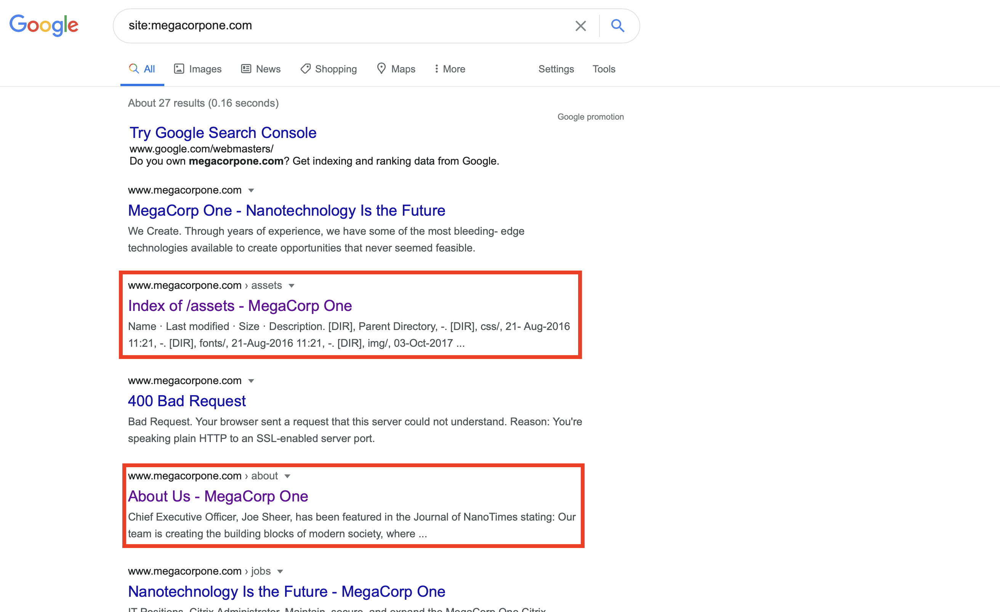
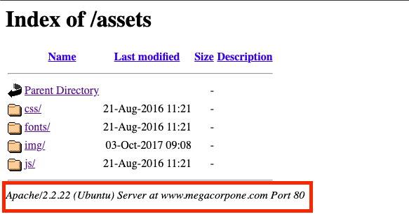
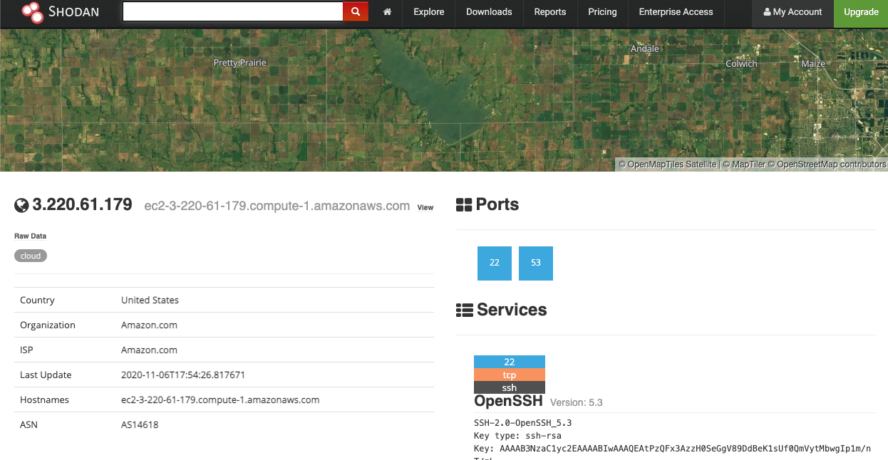
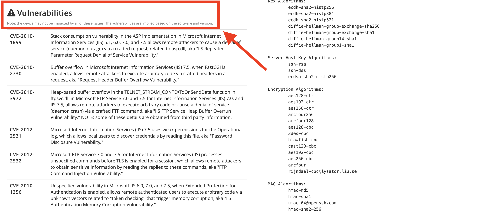
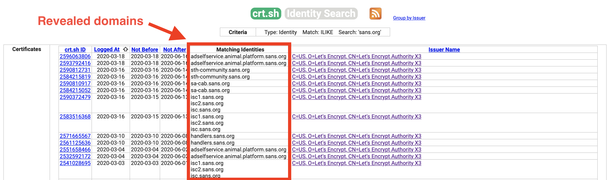

## Solution Guide: OSINT Recon

 The goal of this activity was to learn and understand how OSINT tools can be used against an organization in an attack.

---

1. Searching **site:megacorpone.com**, we can find the following information:

 

  - Index of /assets provides server enumeration information.

    - The server name and version number of the web application can be used to identify existing vulnerabilities that can be exploited.

     - Attackers can use the domain name and port information during their network scans.

   

- www.megacorpone.com/about provides user enumerated information.

   - An attacker can use this information to formulate a social engineering campaign.

   - This can include spear phishing campaigns that establish trust and convey a sense of urgency with the target.

    

2. Using Shodan and the information acquired from Google dorking, find any other useful information that can be used in an attack.
  
   - Use the OSINT website osintframework.com and navigate to **Domain Name** > Whois Records > **DNStable**.

     - Enter megacorpone.com in the search box and press **Enter**.

     - View the results under **DNS Records**.

     - In this example, we'll use the mail.megacorpone.com domain.

     - The DNS lookup returned an IP of `3.220.61.179`. We'll plug that IP into the Shodan website.

    - Below is an image of the Shodan website search results for our target.
    
    - We are presented with details about our target company that include:
    
      - Internet Service Provider (Amazon)
      - Web server and web application information
      - SSH key information
   
     

    - A little further down the page is a list of vulnerabilities from a previous scan.
    
      - With this information, an attacker can exploit a variety of attack vectors, including:
    
        - Social engineering
        - Network scan information
        - Web server and application vulnerabilities based on software version and type 

   

3. Now we need to exploit certificate transparency by looking for exposed domains.

    - Navigate to https://crt.sh and search sans.org in the search box. 
      
      

     The search returns the following: 
  
    - The **Matching Identities** column exposes domain-related information that an attacker can use to perform various types of attacks, such as:
    
      - Domain hijacking
      - DNS flooding
      - Distributed reflection denial of service (DRDoS)
  
4. What are two methods of mitigating the threat posed by certificate transparency?
  
    - Customers can opt out of having their certificates logged.
    
      - This is not the preferred method because it eliminates the benefits of transparency.

      - Additionally, malicious customers would prefer this option so they can obfuscate their crimes.
    
    - If available, have subdomain information redacted from certificate log entries.

---
© 2020 Trilogy Education Services, a 2U, Inc. brand. All Rights Reserved.
