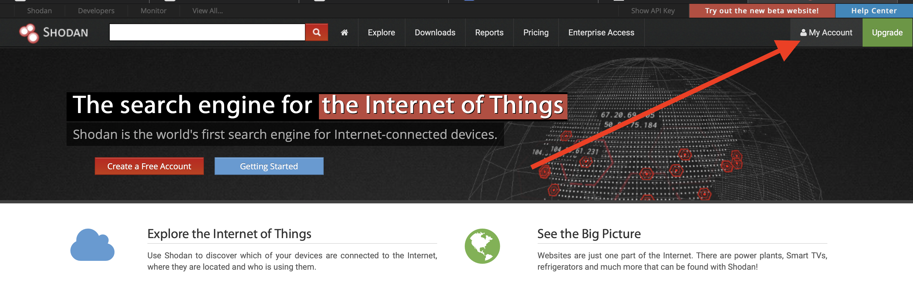
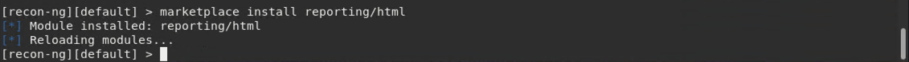
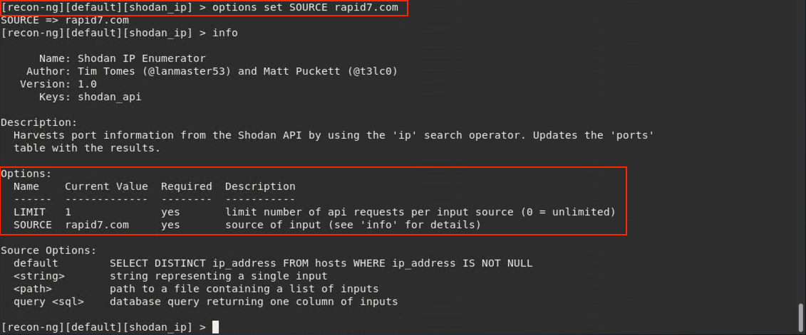
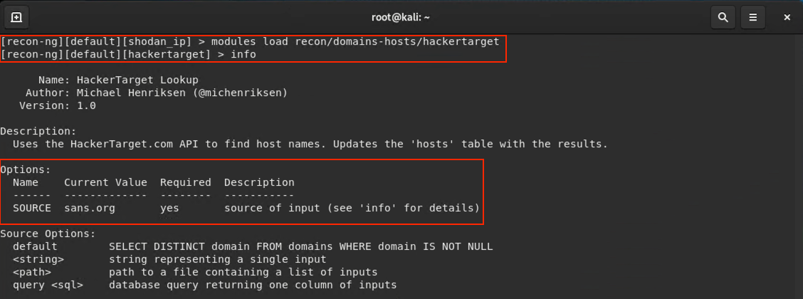
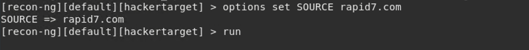
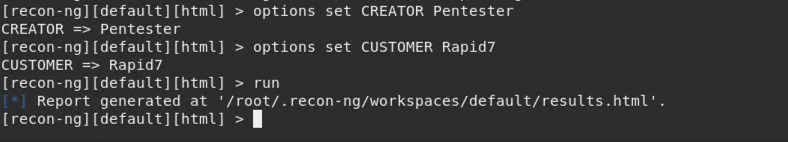
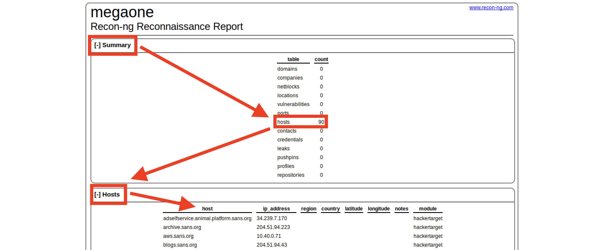

## Solution Guide: Recon-ng

The goal of this activity was to learn how to integrate OSINT technologies by importing the Shodan API into Recon-ng.

---

 
1. In Kali, start Recon-ng by typing `recon-ng`.
 
   
 
2. We need to set an API key for all modules that require it before they can be loaded and used.
 
   - We'll set a Shodan API key inside Recon-ng. This allows Recon-ng to display results from the Shodan API.
 
   - Go to shodan.io and click on **My Account** in the top-right corner. Copy the API key to your clipboard.
 
   
 
3. In Recon-ng, run `modules search` to view all of the currently installed modules.
 

4. Before you begin, install the modules that you will need. 

   - Using the command `marketplace install` install the `reporting/html` module
   - Run `marketplace install reporting/html`
   
   
   

5. Run `modules load recon/hosts-ports/shodan_ip`.
 
   - This will load the `shodan_ip` scanner module.
 
   - Modules need to be loaded prior to use.
 
   - Add the API key by running `keys add shodan_api [key]`, replacing `[key]` with the one you copied to your clipboard in Step 2.
 
   
 
6. Run `keys list` to verify it is imported.
 
7. Run `info` to get more information regarding the Shodan module.
 
   - The `SOURCE` option is required. This can be:
 
     - A list of IP addresses in a text file
     - Individual IPs
     - A domain name
    
   - For this example, we'll use the domain name option.
 
     
 
   - Next, switch to the `hackertarget` module by running `modules load recon/domains-hosts/hackertarget`.
 
   - Set the source to rapid7.com by running `options set SOURCE rapid7.com`.
 
      - The `SOURCE` option specifies which target Recon-ng will scan.
 
      
 
8. Type `run`.
 
   - Recon-ng will query Shodan for a scan against `rapid7.com`.
 
   - The results will automatically display verbosely in the terminal window.
 
    
 
9. Run `modules load reporting/html` to select and load the reporting module.

 
10. Run `info` to see what parameters need to be set.
 
   - The `CREATOR` and `CUSTOMER` parameters need to be set.
 
   - Set the `CREATOR` and `CUSTOMER` parameters via the `options set` command:

      - `options set CREATOR Pentester` 
      - `options set CUSTOMER Rapid7` 
 
   - Type `run` and the results will be saved to `/root/.recon-ng/workspaces/default/results.html`.
 
     
 
 
11. View the report.
 
      - To view the report, open the file manager and run the command `xdg-open /root/.recon-ng/workspaces/default/results.html`.
   
      - Right-click on `results.html` and open in Firefox to view the rendered results.
   
         - In the **Summary** window, we can see that Recon-ng returned a result with 151 hosts.
      
         - Expand the **Hosts** window by clicking on the **+** sign.
   
         
      
      - At the bottom of the results page, we see the `CREATOR` option shown with the date and time.
   
      
   
   
---
© 2020 Trilogy Education Services, a 2U, Inc. brand. All Rights Reserved.
 
