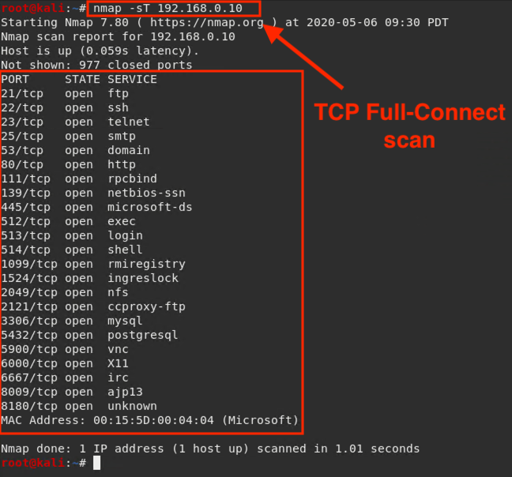

## Solution Guide: Port Scanning with Nmap

In this activity, you used Nmap in an investigative capacity. 

---

1. Perform a basic TCP connect scan against Metasploitable 2.

   - Run the command to perform a TCP connect scan:
    
      - `nmap -sT 192.168.0.10`
      
   
    
    
   - Of the ports listed, which two present the biggest potential vulnerability and why?   
      - Port `5900`, service VNC, is a remote desktop connection that could be exploited to provide remote control to an attack.
      
      - Port `6667`, service IRC, can be used as a C2 channel that receives instructions from a botnet.

2. Run the command that performs a service and version detection scan against the target:
   
      - `nmap -sV 192.168.0.10`
   
   Notice that in addition to the service type, Nmap displays the enumerated version numbers.
      
     
   
   -  What web service and version is running?
   
      - Apache httpd 2.2.8 ((Ubuntu) DAV/2)
      
   - Is this web service version vulnerable and if so what is it?
   
     - Yes, very. One possible vulnerability is CVE-2016-4975 (possible CRLF injection), which allows HTTP response splitting attacks for sites that use `mod_userdir`.
      
 4. Look at port `21`. Google VSFTPD v2.3.4. 
      
      - VSFTPD v2.3.4 is vulnerable to backdoor command execution, which presents a threat to organizations running this particular version of software.
      
   - How is this information useful to an attacker?
   
      - Knowing the web server type and version number allows an attacker to compile a list of potential vulnerabilities to exploit.   
   
3. Experiment with using various scan techniques and interpret the results. 

   - Type `nmap` at the command prompt to get a list of commands that you can play with. 
   
   
____

&copy; 2020 Trilogy Education Services, a 2U Inc Brand.   All Rights Reserved.
