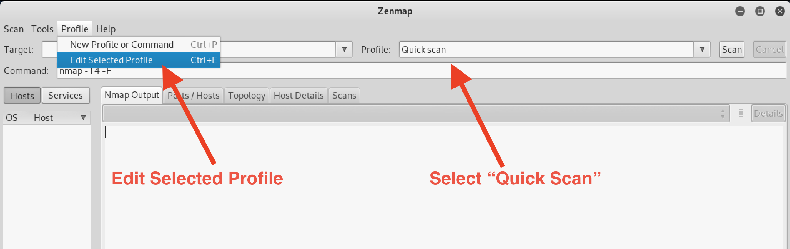
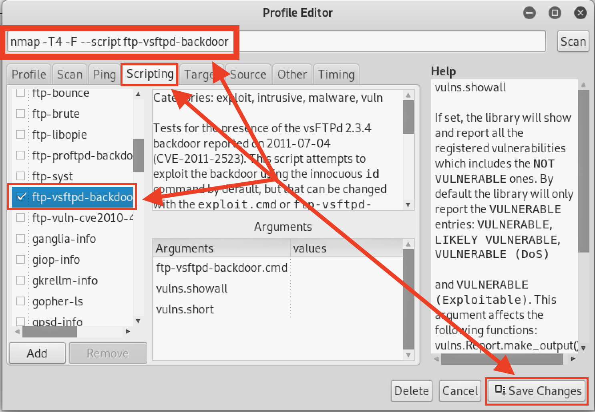
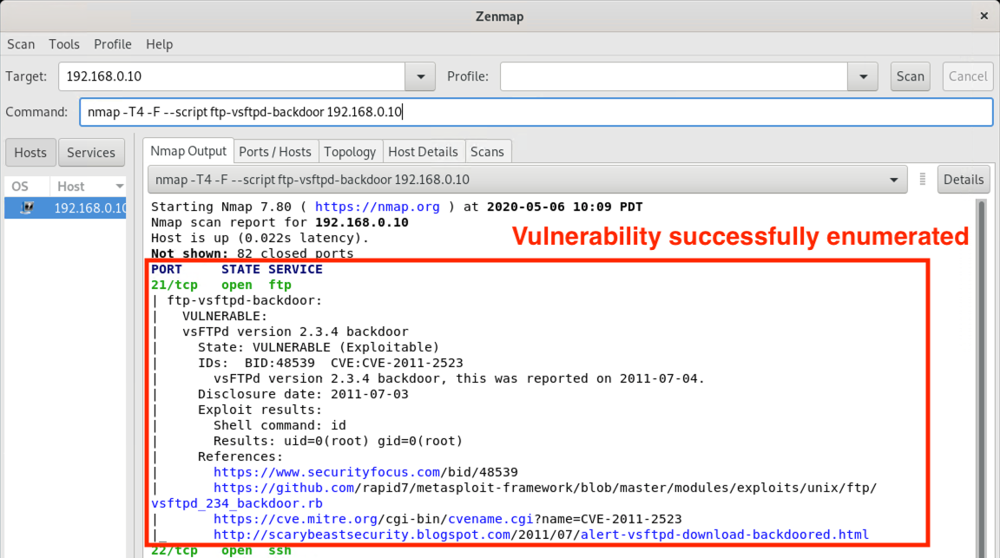

## Solution Guide: NSE Scripting

In this activity, you learned how to use Nmap Scripting Engine (NSE) and its associated tools to perform network scanning.

---
 
1. Begin by launching Zenmap from the command line in Kali Linux. 
  
    - Run `zenmap`
 
    - In the dropdown menu next to **Profile**, choose **Quick scan**.
  
      
  
    - Click the **Profile** tab at the top and select **Edit Selected Profile**.
  
    - Click on the **Scripting** tab and view all the scripts that start with `ftp`.
  
    - Select the `ftp-vsftpd-backdoor` script by placing a check in the box.
  
    - Click **Save Changes** to save the profile settings.    

       
    
   - What is the raw Nmap command that Zenmap will run? Define each component of the command.
 
      - `nmap -T4 -F --script ftp-vsftpd-backdoor 192.168.0.10`
        - `-T4`: Adjusts the speed of the scan. Ranging from 0-5, 4 is a fast and aggressive timing option.
       - `-F`: Indicates a fast scan by only scanning the 100 most common ports.
       - `--script`: Runs a scripted scan.
       - `ftp-vsftpd-backdoor`: Indicates which scripted scan to run.
       - `192.168.0.10`: IP address of host that will be scanned.
 
2. Run the scan against the target host.
 
   - The scan results from the `ftp-vsftpd-backdoor` script should now be displayed within the Nmap output.
 
     
 
   - Analyze the output. What do you notice?
 
     -  Zenmap was able to enumerate the vulnerable service running on port `21` as follows:
       ``` 
      - State: VULNERABLE (Exploitable)
      - IDs:  CVE:CVE-2011-2523  OSVDB:73573
      - vsFTPd version 2.3.4 backdoor, this was reported on 2011-07-04.
      - Disclosure date: 2011-07-03
      ```

____
 
&copy; 2020 Trilogy Education Services, a 2U Inc Brand.   All Rights Reserved.
