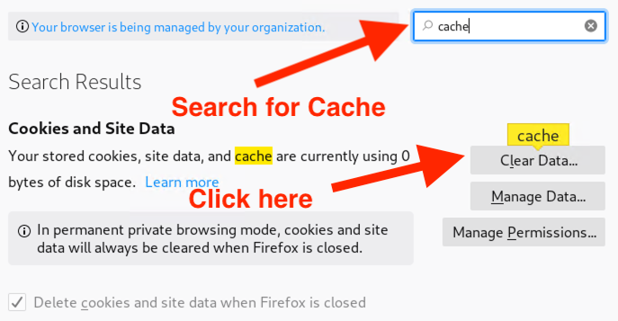

## Activity File: Metasploitable Report
 
You will be playing the role of an SOC analyst. 

- Nessus provides many scan options. In this activity, you will use Nessus to perform a Metasploitable scan.

- You have to present the results of a vulnerability scan to your client. Answer the questions and be ready to provide a summary of remediation tactics for your client. 

- Remember: Communicating issues and how to fix them is one of the most important skills in IT work. 

### Instructions
 
Log onto your Kali VM in Hyper-V and start up Nessus by doing the following:

1. Open your terminal and run `/etc/init.d/nessusd start`. 

2. Open the Firefox browser and navigate to https://kali:8834. 

3. Log into Nessus with the credentials `root:toor`.

4. Navigate to the scans, then the Metasploitable report.

**Note:** If you see the following error: 

This error pops up because APIs have been disabled on our private VMs. To fix this, navigate to the Firefox settings and search for `cache`. Click on **Clear Data** then return to the **My Scans** window in Nessus, and refresh the page.

 

Alternatively, if you are still unable to access the page you can use the downloaded report found here:
- [Metasploitable Report](Resources/Metasploitable_Report.pdf)

5. Download and the Metasploitable report. The report includes three vulnerabilities from a completed Metasploitable scan. Review the report and answer the questions below. 
 
    - Write your answers so they can be understood by a non-technical audience. Be prepared to share with the class. 

#### Samba Badlock Vulnerability

1. What is the primary purpose of Samba? 

2. Based on the scan results, how is our Samba server being exploited? 

3. How can we patch this vulnerability?

4. What are some of the disadvantages of fixing this vulnerability?

#### NFS Exported Share Information Disclosure

1. What is the primary purpose of a network file system (NFS)? 

2. Based on the scan results, how is our NFS being exploited? 

3. Because NFS does not support authentication or encryption, how would you suggest fixing this vulnerability (assuming that our other servers are patched and don't have vulnerabilities)?  

4. If we wanted to fix this, how would it affect our day-to-day business activities, such as how our users share files?

**Unencrypted Telnet Server**

1. What is the purpose of Telnet?

2. What port does Telnet use?

3. What protocol should we use to connect to the server?

----

&copy; 2020 Trilogy Education Services, a 2U Inc Brand.   All Rights Reserved.
